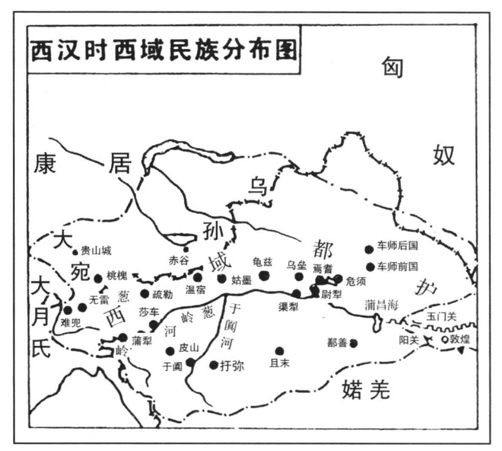
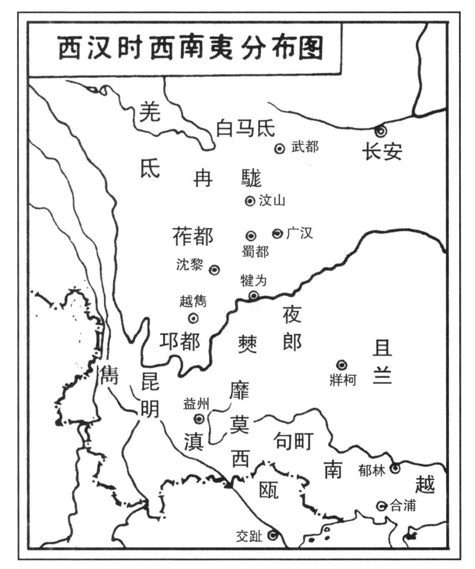

#### 第二节 汉族的形成与国内其他各种族的活动

秦汉之际，在中国黄河的腹地，的确表演了几幕有声有色的历史活剧。但从当时中国史的全面运动看来，这种历史的活剧，只是中原种族的历史的运动。当此之时，中原以外之四周的诸种族也不是停篙住桨，专看中原种族的把戏；而皆各据其自己的历史原理，展开其自己的历史运动。为了要了解西汉时代中国史的发展，我们就必须看看中原以外的中国境内其他诸种族之同一时代的活动。

这里，首先要作一个简单的回顾，即我们应该回想到在秦代，中国这个地理领域内所呈现的一幅历史的全景是怎样的一种轮廓。我们已经说过，在当时一方面，是沉淀于中原的诸种族，已经融化为一个混成的种族，展开其向四周之历史的扩展；另一方面，是四周诸种族，或分化而为许多氏族，或混合而为几个部族，甚至形成一个种族，他们从四周展开其向中原文化区域之历史的压迫。中心的膨胀与外围的收缩，就是秦代历史运动的姿态。

在秦代，中原种族，也曾经用尽平生之力，冲破了东南方面的蛮族包围，伸张其势力于大陆尽头之处；可是其他几方面，还是紧紧地被蛮族所包围。在当时，我们若是站在万里长城的高处，向西北一望，一定可以看到，在广漠的蒙古高原之旷野，到处都是“褐巾而裘”的匈奴人之帐幕。在南山（即昆仑山、阿尔金山、祁连山）北麓、洮河河谷、青海草原、四川西部及康藏高原一带，到处都是“被发野祭”的诸羌之部落。又若海滨之东，则为夷秽之乡；巴蜀以南，皆系蛮濮之地。这些地方，都是“四方之无君者”自由生聚之地。是知当秦之世，四徼之外，六合之内，还有不少的种族，游离于中原种族的历史支配之外。秦代的历史，只是把以前“作为许多历史碎片”的中原诸种族，揉成了一个整个的历史个体，他并没等到以这个个体为中心，而展开其运转四周诸种族的中国史的全面运动。这个当作中国史中心动力的中原种族，就由陈涉振臂一呼，粉碎为无数相互对抗的碎片了。

非常明白，陈涉、吴广的“叛乱”与跟着而来的楚汉之争，是中原种族由一个整个的历史个体，破裂为无数的历史碎片；再由这些无数的历史碎片之相互的对抗与合并，而又结合为两个对立的历史单位。因此，当时中原种族之历史活动的表现，是由向外扩张，转向对内火并；是整体的破裂与分子的游离。这样，作为中国史膨胀的一点热力，便在分子的游离中，发散殆尽了。

虽然如此，秦汉之际，中原种族的大分裂，并不是中原种族之种族的再分裂，而只是一种政治的爆炸。因为当时的每一个历史碎片，都不是血统的集团，而皆系政治的集团。所以秦汉之际的纷乱，并不是种族与种族的对抗，而是同一种族内部的各种社会因素之反拨与倾轧。政治性的反拨与倾轧，与血统的同不同，没有很大的关系。而且它也决不能使已经融混了的血统，再走向纯粹的血统，一言以蔽之，政治的分裂，只是瓦解种族的政权，并不瓦解种族本身。所以一到汉代统一的种族政权成立以后，中原种族又团结为一个整然的“历史个体”了。

可是在西汉初叶，前有所谓“异姓诸王”之乱，继有“刘吕之争”，复有“七国之叛”，中原种族的历史活动，仍然是向着离心的方向发展。因而这个“历史个体”还是不能起着运转四周诸种族的中心作用。这一直到汉武帝时，随着中原种族社会内部的轧轹之消解，与商人地主的政权之确立，中原种族又才凝结坚固，而且在其内部，蓄积着充分的热力，再展开更有力的历史扩张。

所以从秦末直至汉武帝初年（公元前206年到公元前135年），这七十年的历史，从中国境内诸种族之全面的历史活动的方面看，是中原种族走向萎缩的历史；同时，亦即四周诸种族缩小其对中原文化区域之包围的历史。当此之时，呈现于我们面前的一幅中国史画图，一方面是中原种族中的许多英雄，在黄河南北的大原野，前蒙矢石，后堕溪壑，攻城陷邑，斩将刈旗，以争天下之权。另一方面，是中原以外的四周诸种族，把他们锋利的刀剑，指着那些“为百姓请命于皇天”的内战英雄们之后脑（插图十一）。

我们现在暂时离开中原，去看看这一时代四周诸种族的活动。

首先看看北方的匈奴。

匈奴在秦代即已形成一个强大的种族，占领了今日内外蒙古广大的草原；并且南逾阴山（在今内蒙古中部），渡黄河，进入河套。秦代政府，为了抵御匈奴，曾派蒙恬以三十万人北击，逐之于河套之外，然后因山筑城，因河为塞，于要害之地，驻屯庞大的边防军，以阻止匈奴之南进，于是匈奴遂稍稍北徙。

到秦末，蒙恬死，边防军失掉了统帅。同时，中原爆发了农民“叛乱”。秦代政府把防守匈奴的边防军全部撤回，开赴国内战场，镇压内乱。自是北门大开，匈奴的骑兵，又重新回到万里长城的脚下，并且再度侵入河套以内。[41]

降至楚汉之际，刘邦、项羽的目光，都注视着阿房宫中的宝座，眼角余光，也不会射到长城以外。因而匈奴单于冒顿得以乘间展开其征服事业。当此之时，匈奴“东击东胡”，“灭东胡王”；“西击走月氏；南并搂烦、白羊河南王，侵燕、代”。其领土东至辽东，远及朝鲜边境；西有南山北麓，远及塔里木盆地之东北；南并察、绥（原察哈尔、绥远二省，辖今河北省西北部及内蒙古中部）、热河（原热河省，辖今河北东北部、辽宁西南部及内蒙古东南部）、宁夏，远及山西、河北之北部。至于漠北及天山以北、阿尔泰山一带，则系其族类原来分布之地。像这样一个庞大的征服，匈奴之族当然一跃而为北部中国之主人。然而其所以至此者，诚如《史记·匈奴列传》所云：“是时，汉兵与项羽相距，中国罢于兵革，以故冒顿得自强。”

> 插图十一

当时匈奴把它庞大的领土，划分为中部及左部右部。中部由单于直辖，统治山西北部，北至蒙古。左右两部，各派类似总督的官吏一人，曰左右贤王。左王居东方，辖河北以东热河辽东。右王居西方，辖陕西以西甘肃西北，至于塔里木盆地之东北。[42]

单于庭（在今蒙古乌兰巴托市）是匈奴的中央政府，单于则为中央政府的首领。单于为匈奴语“撑犁孤涂单于”之简称，其意即伟大的天子。单于之下，有其直属的臣僚；左右贤王之下，亦有其各级官吏，分别统治其所征服的各氏族。这些各级官吏，都领有几千至万余人以上的骑射部队，以为征收贡纳及镇压反叛之用。据史籍所载，当时匈奴有二十四长，号曰万骑。诸二十四长之下，又各有千长、百长、什长等各级的军官。[43]这样，就构成了匈奴的统治机构。

当时匈奴单于为挛鞮族所世袭，其贵官，则皆由呼衍族、兰族、须卜族所世袭。此四族者，匈奴种族中之贵族氏族也。[44]其骑射部队的士兵，则大概由这几族中的自由民所组成。[45]至于战争的俘虏，则以为奴隶。[46]奴隶有时亦用于杀戮[47]，但大部分皆分配于贵族。匈奴的贵族，很快就变成了庞大的奴隶及畜群之所有者。

匈奴既拥有庞大的土地、奴隶、畜群，而又拥有强劲的骑射部队，遂弯弓跃马，南向中原。当刘邦追逐陈豨、卢绾于燕（今北京）、代（今山西东北部）之时，匈奴冒顿的势力亦已南及燕、代。所以陈豨、卢绾皆曾派遣使节求救于匈奴[48]，以后陈豨的残部，多亡入匈奴，而刘邦的总角之交卢绾则率其所有的军队，全部投降匈奴了。[49]

同样，当刘邦企图解决韩王信之时，韩王信“恐诛，因与匈奴约，共攻汉，反，以马邑降胡，击太原”。[50]高祖亲征，信亡入匈奴，而高祖却被匈奴围困于今日大同附近之白登（今大同市东北），是谓“白登之围”。内战中胜利的英椎，在外战中却失败了。若非陈平献美人的秘计，汉代的太祖高皇帝，其不为匈奴之俘虏者几希。

惠帝三年（公元前192年）冒顿单于写了一封词语亵嫚的情书，给新寡的吕后，其中有云：“两主不乐，无以自虞，愿以所有，易其所无。”[51]假如翻译不错，这对于堂堂大汉的太后，当然是一个很大的侮辱。但是当时汉代朝廷，对于这个侮辱的答复，是送给冒顿单于一位漂亮的公主，是谓“和亲”。

文景之世，冒顿死，其子老上，孙军臣，相继为匈奴单于，仍继续冒顿之南进政策。当时，中国的公主，仍然一个跟着一个送到匈奴的单于庭，但这并不能停止匈奴马蹄的南进。到文帝后元六年（公元前158年）匈奴大举入寇陕北，迫近长安，前锋部队，已驰逐于甘泉宫殿的大门之前。汉代首都附近如细柳（今咸阳市西南）、棘门（今咸阳市东北）、霸上，都已划为战区。像这样的严重威胁，一直继续到武帝的初年。

我们再看看这一时代的西羌。

如前所述，诸羌之族，在秦以前，除周族进入中原以外，其余皆分布于广大之西部的中国。战国末叶，东徙的诸羌，即所谓“西戎”，又融混于秦族，先后同化于中原种族之中。其余分布于甘肃的诸羌之族，后来被秦代政府关在万里长城之外，阻塞了他们继续东进之路。所以在秦代，他们只有转向甘肃的西南与西北两个方向发展。史称当时诸羌“各自为种，任随所之”。其中，如居于甘肃西南者为参狼种，武都羌是也。徙于四川西北者，为白马种，广汉羌是也。徙于川康边境者，为牦牛种，越嶲羌是也。徙于甘肃西北者，为大月氏种，月氏羌是也。留于青海东北者，为研种，湟中羌是也。

到楚汉之际以至汉初，此等诸羌，乘着中原种族之纷乱，遂得以自由繁息，逍遥化外。

当此之时，其分布于四川西北（今日松潘）一带之“白马种”，已分化为几十个氏族，散布于这一带的山谷溪河之间[52]开始了农业畜牧的定居生活。这些氏族，因为与南太平洋系的群蛮杂居，发生了血统和文化的融混，所以“其俗不与中国及羌、胡同”。[53]这一支“羌蛮混种”的羌族，历史家称之曰“氐族”。亦即今日松潘的土人之祖先。

其分布于今日西昌一带之牦牛种，因受南来的蛮族之压迫，似已沿金沙江而西入康藏，故西藏至今尚有与牦牛有关之人种起源的传说。[54]这一支羌族，在西汉时的发展，不知其详。

其分布于甘肃西北的月氏羌，在诸羌中最为发展。楚汉之际，已占领南山北麓一带的土地，自凉州以西，张掖、酒泉西至敦煌，都是月氏羌的势力范围。他们拥有很多的畜群，和十几万人的骑射部队，成为西部中国的一个强大势力。[55]到汉初，匈奴勃兴，于是月氏与匈奴两大种族的势力，相与角逐于甘肃之西北，结果，月氏羌失败。大约在文帝前元八年至后元三年之间（公元前172年到公元前161年），月氏羌遂沿南山北麓西徙于今日新疆伊犁河一带。他们把伊犁一带的希腊人，逐之帕米尔高原以南，而占有其地。可是月氏羌到伊犁以后，又遭受匈奴别种乌孙族之压迫。因而在武帝建元二年至元光六年之间（公元前139年到公元前129年），月氏族又再向西徙，逾过帕米尔高原，至于妫水流域，西击大夏而臣之。[56]大夏原是希腊人在中亚所建立的一个殖民国家，自月氏羌入据大夏以后，希腊的统治者遂被迫南入罽宾（今巴基斯坦北部及克什米尔一带），中间经过濮达、高附诸地（今阿富汗境），迤逦而下，月氏羌又踵而蹑其后，至于罽宾。因此“南君罽宾”之塞王不久又见逐于月氏，而月氏羌遂于妫水流域，建国曰大月氏。[57]历两汉之世，皆甚强大。

月氏羌并未全部西徙，尚有一部分始终停留于南山北麓一带山谷之间，后来与汉族同化。[58]

其分布于青海东北的研种羌则分化为封养、牢姐诸部族，向北移徙，到景帝时，其一部分族类，已布满甘肃西南，封锁了中国的西门。[59]

现在我们再看看当时天山南北一带诸种族的状况。这里就是汉代所谓西域之一部（插图十二）。

先看天山以南。天山以南是四周环以高山的一个大盆地，北有天山，南有昆仑山，西有帕米尔高原，东有南山，只有东北留了一个缺口，通达蒙古高原及甘肃西北。这个缺口就是古代蒙古高原系人种和后来的羌族到达这个盆地的通路。

> 插图十二

这个盆地，据斯坦因考察，东西九百英里，南北三百三十英里。早在秦汉以前之古代，这里的大内海即已干涸。在汉代，这里已经是一望无涯的流沙，惟当时必有很多河流从昆仑山和帕米尔出发，灌注于大沙漠之中，特别是于阗河，北会葱岭河，汇成一条由西而东横贯沙漠的塔里木河。这条河，流到这个盆地的东部，汇为波涛三百里的蒲昌海，而这就是今日已经干涸了的罗布泊。[60]即因有塔里木河的灌溉，所以这里的许多沙漠田，都非常肥美，特别是今日之吐鲁番盆地。因此，这里，在内海涸竭以后，仍然是原始蒙古种的后裔及羌族生存繁衍的天国。

到西汉初，居住于这个盆地的种族，已经分化为许多部落，分布于大沙漠的南北。其在大沙漠之南，自楼兰（今新疆若羌县）沿昆仑山北麓而西，至于莎车，凡十国，是谓“南道诸国”。[61]自莎车以西南，分布于帕米尔高原山谷之间者凡八国，是谓“葱岭诸国”。[62]南道诸国与葱岭（旧对帕米尔高原和昆仑山、喀喇昆仑山西部诸山的总称）诸国其种皆羌氐。其在大沙漠以北，自疏勒（今喀什市）沿天山南麓而东，至于狐胡（今吐鲁番县西北），凡十二国，是谓“北道诸国”。[63]北道诸国，其族类，皆系原始的蒙古种，其徙入这个盆地，早在有史以前的时代。沙漠南北的诸国，其人口，多者八万人，少者千人左右，但皆以种植畜牧为生，有城郭庐舍，故统称之曰“城郭诸国”。葱岭诸国由于耕地面积的限制，其人口最多者如难兜（今克什米尔巴尔提斯坦）不过三万一千人，最少者如依耐（今莎车西南）则仅有六百七十人。除难兜以外，大概都过着随畜转徙的游牧生活。

现在我们再看天山以北，这里一直到西伯利亚的极南边，都是大山大谷，山谷中间，有不少的湖泊，也有小溪河，这是蒙古西北的山岳地带。在阿尔泰山与天山之间，有一块很大的平原，是为准噶尔高原。这里，气候润湿，水草肥美，最适宜于畜牧。所以自古以来，这里就是原始的蒙古人游牧之地。以后古代中亚的牧人，更后希腊的殖民者就挤进了这块高原。汉初大月氏西徙，曾在这里寄顿，又留下一些羌族的苗裔，所以这里的种族，也很复杂。西汉初叶，分布于这一带的种族，也分化为许多部落。[64]其中最大者为乌孙[65]，有人口六十三万，军队十八万，实为这个高原的一个支配势力。

此外，尚有葱岭外四国，曰大宛（今俄罗斯中亚费尔干纳盆地）、捐毒（今新疆乌恰县）、休循（今帕米尔高原北）、桃槐（今帕米尔高原北部），亦列入西域诸国之内。其中大宛最大，有人口三十万，军队六万。

以上就是汉初天山南北一带诸种族分布的大概情形。在当时，我们若是站在天山顶上，南北一望，我们可以看到塔里木盆地中的塔什马干（塔克拉玛干）沙漠之周围，已经布满了许多定住的部落，一座一座的城郭，都挤满了人，一片一片的沙漠田，都种植了谷物。美丽的塔里木河，就像一条碧绿的玉带，贯通这一望无涯的雪白的沙漠，成为这个盆地的人民之生命的圣水。我们又可以看见，在准噶尔高原，有不少的城郭，也有不少的帐幕，有农田，也有畜群。这是一个如何美丽而平静的世界呵！谁知霹雳一声，匈奴的蛮骑，从蒙古高原飞腾而来，冲进了准噶尔高原，并从天山东麓的缺口，驰入塔里木盆地的东北。于是征服了这一带的种族，收为殖民地。[66]自是以后，我们到处都可以看见匈奴的“僮仆都尉”[67]向这一带的种族掠夺粮食畜群乃至人民。历史的浪涛，打进这平静的天国了。

现在再看看这一时代的东夷。

自秦代向东扩展，至于鸭绿江岸，今日辽宁南部沿渤海一带的诸夷之族，一部分同化于中原种族，另一部分则向更远的东北移徙。秦末，中原大乱，燕、齐、赵人，避乱而徙往辽东者数万口。汉初，“燕王卢绾反，入匈奴。（燕人卫）满亡命，聚党千余人，魋结蛮夷服而东走出塞，渡浿水，居秦故空地上下障。”[68]所以辽宁南部，东至鸭绿江仍然是中原种族的势力。

当此之时，东夷之族，也分化为许多部族或种族。其分布于今日沈阳以北者曰夫余，分布于鸭绿江北岸者曰高句丽，分布于吉林境内沿北海一带者曰挹娄、沃沮，分布于朝鲜半岛之东者曰涉、曰貊，之西者曰朝鲜，之南端者曰辰韩、弁韩、马韩，是谓三韩。此外分布于黑龙江流域的诸夷，则已形成两个强大的种族，曰鲜卑、曰乌桓。鲜卑分布于辽宁之北西至热河；岛桓则分布于热河南部，是为东胡。

在西汉初，诸夷中，东胡最强盛，西向蒙古发展，威胁匈奴。后为匈奴冒顿击败，“虏其民人及畜产”[69]，于是自热河而东，东至鸭绿江岸，都沦为匈奴的属领了。

最后，我们说到这一时代的南蛮。

首先说到东南沿海一带的百越之族。如前所述，秦代曾经征服百越之地，置为会稽、闽中（治今福建福州市）、南海（治今广东广州市）、桂林（治今广西桂平西南）、象郡（治今广西崇左县）。当时百越之族，或在秦代地方政府统治之下，输纳租税，或退入山岳地带，继续与秦代政府对抗。

秦末，中原大乱，百越之族群起叛变。当陈涉倡义之时，今福建、浙江一带的越族，在其君长无诸及摇的领导之下，投入吴芮的旗下，参加反秦的战争。以后又帮助刘邦打击项羽。所以西汉王朝建立以后，不能不承认他们的独立，而封无诸为闽越王，封摇为东海王。前者统治福建，后者统治浙江南部。[70]到景帝时，浙江的越族又参加吴王濞之叛，后其王为汉政府所收买，又击杀吴王于丹徒。但福建的越族，则始终对汉代政府保持对立的态度。

同时，分布于今日两广一带的越族，在秦末，也叛变了。当时秦之南海尉任嚣适病死，于是龙川（今属广东）令赵佗驱逐了两广的秦令，自立为南越王。[71]到汉吕后时，因汉对南越施行铁器的封锁，又发兵进攻湖南的南部，大败汉兵[72]。由是南越日益强大，“因此以兵威财物赂遗闽粤、西瓯骆，役属焉。东西万余里。乃乘黄屋左纛，称制，与中国侔”。[73]文景时，虽与中国保持和平，但仍然不降服汉代政府，俨然是南部中国的一个独立国家。

现在再看看西南山麓地带的蛮族。这一带的蛮族，汉代称之曰西南夷。西南夷者，就是春秋、战国时代的群蛮和百濮。他们在战国时，尚占有川、黔、滇全境及湘之西北，鄂之西南。秦代吞巴、并蜀、灭楚，于是川、湘、鄂的诸蛮，遂相率避入深山穷谷之中，与鸟兽处，而不肯投降。但他们仍然在艰苦的环境中，继续其族类的繁殖。至于滇黔一带的高山大泽，则仍然是南蛮的天下。

秦汉之际，王纲解纽，散布于今湘西一带的“五溪蛮”又“时为寇盗”。[74]此外如散布于宜昌东北一带的“沔中蛮”，散布于湖北西南部恩施一带的“禀君蛮”[75]，散布于万县、巴县一带的“板楯蛮”[76]也获得了一时的解放。其中分布于川北阆中一带的板楯蛮之一分支，且为刘邦所招致，参加了楚汉的战争[77]。由此而又知当时刘邦的汉军之中，有百越之兵，也有南蛮之兵。

至于分布于云、贵及四川西部的诸蛮，到汉初，已分化为几百个氏族。其分布于今日滇、缅交界处一带者有几十个氏族，哀牢[78]最大；其分布于云南中部者有几十个氏族，滇最大；其分布于云南西部者有几十个氏族，嶲与昆明最大；其分布于贵州西部者有几十个氏族，夜郎最大；其分布于贵州北部者有几十个氏族，且兰最大；其分布于四川西昌境内者有几十个氏族，邛都最大；其分布于成都西南者有几十个氏族，徙与笮都最大；其分布于成都西北者有几十个氏族，冉駹最大。他们与白马羌错居于今日松潘境内[79]，所以《史记·西南夷列传》说：“西南夷君长以什数。”（插图十三）

由此可知当西汉之初，今日川、滇、黔、湘、鄂一带的山溪河谷与高原之间，已经布满了南蛮之族。在当时，我们可以看到在云南中部（滇）、贵州西部（夜郎）和西昌（邛都）一带，有许多蛮族的村落、市聚，有许多“椎髻左衽”的蛮人在这些地方耕种稻田。[80]在大理一带（嶲与昆明），有许多“编发”的蛮人，驱着畜群，游牧于山谷之间，他们还不知道何谓“君长”。[81]在成都西南一带（徙与笮都），有许多“被发左衽”的蛮人，或耕田或畜牧，或相与言笑辩论，谈吐风生。[82]在今日松潘一带（冉駹）的山溪之间，有不少蛮人和羌人的石室，其高十余丈。在那里，有畜群，也有麦田，更有奇异的无角的旄牛，其重千斤。此外也有马、鹿和五角羊，出没于丛林之间。[83]在贵州的西北（且兰）丛密的竹林之中，也有不少蛮人的村落。此外，我们也可以看到湖南西部的蛮人，正在走出深山，袭击秦代的吏民，四川东北的蛮人，正在走向关中，为刘邦“还定三秦”的前驱。

> 插图十三

总括以上所述，我们可以看出，当汉高祖削平天下、统一中原、得意洋洋、击筑高歌之时，四周诸种族已经把中原文化区域包围得水泄不通了。以后历惠帝、吕后下迄文、景之世，这种由四方八面而来的蛮族包围，一天天地缩小。在这些蛮族中，最成为中原种族之威胁的是北方的匈奴。因为他们具有强大的武装，而又接近中原种族政权的中心。因此，西汉时代，在西北一带，便形成了中国历史的紧张形势。而这就展开了后来武帝以至昭、宣之世西汉与匈奴在中国西北的激烈斗争。
