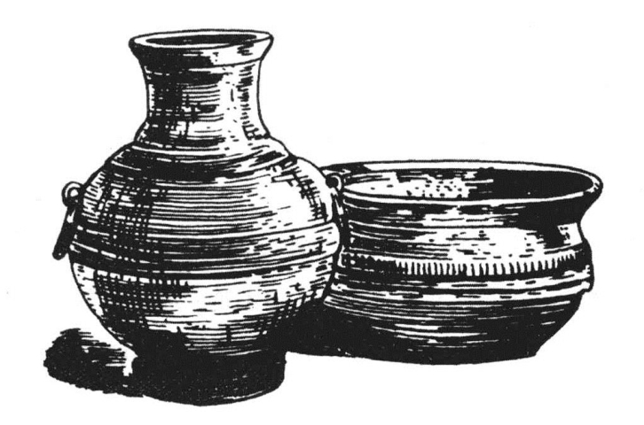

##### 二、铸铜及其他金属工业

据《汉书·地理志》所云，西汉不仅有盐铁之官，同时又有“铜官”“金官”及“采金银珠宝之官”。因此，又知当时铸铜的手工业以及其他金属手工业亦有相当之发展，且亦有国营工场之存在。

铜官设置之地，史籍不详，《汉书·地理志》仅载丹阳郡（治今安徽宣城）有铜官。此外桂阳郡（治今湖南郴州市）有金官。《补注》：先谦曰：“官本，金作铁。引宋祁曰：‘铁官，邵本作金官。’”是桂阳郡或亦有铜官。据《博古图录》所搜集之西汉铜器，其有款刻可以证实者，尚有平阳（治今山西临汾西南）、河东（治安邑，在今山西夏县西北）及安邑之地的铜官制造之铜器。[86]则上述诸地，或亦有铜官之设置。

铸铜手工业之发展，早在冶铁业之前。虽自冶铁业发展以后，铜制生产工具在社会生产领域内已退于次要或完全不重要的地位；但民间的日用器皿，皇家及贵族宫廷中所使用的奢侈品、装饰品和他们在宗庙中所使用的祭器，特别是钱币，还是用铜铸造。这些器物和钱币的铸造，仍然要以发展了的铸铜工业之存在为前提。

首先说到钱币的铸造。西汉的钱币，大概都是用铜铸造的。最初铸钱的特权属于国家。到文帝时，政府采取放任政策，令人民得以自由铸钱。[87]从此以后，人民“农事弃捐，而采铜者日蕃；释其耒耨，冶熔炊炭，奸钱日多”。[88]到武帝时，国家又收回铸币的特权，“县官往往即多铜山而铸钱。民亦盗铸，不可胜数”。[89]以后虽曾发布“盗铸诸金钱罪皆死”的严厉禁令，但是“吏民之坐盗铸金钱死者数十万人，其不发觉相杀者不可胜计，赦自出者百余万人，然不能半自出，天下大氐无虑皆铸金钱矣。犯法者众，吏不能尽诛”。[90]当时“细民人操造币之势，各隐屏而铸作，因欲禁其厚利微奸，虽黥罪日报，其势不止，乃者，民人抵罪，多者一县数百。及吏之所疑，榜笞奔走者甚众”。[91]这些史实，说明了一个事实，即西汉时代铸造钱币，已成为普遍民间之工业，而这就指示出当时铸铜工业的发展。

从西汉的钱币的数量之大，又可以证明当时铜的产量之多。据《汉书·食货志》云：“自孝武元狩五年，三官初铸五铢钱。至平帝元始中，成钱二百八十亿万余。”又《汉书·王嘉传》云：“孝元皇帝，奉承大业，温恭少欲，都内钱四十万万，水衡钱二十五万万，少府钱十八万万。”合计八十三万万。元帝时钱币数字尚系仅指国库所藏者而言。其流通于民间者，并不在内。如此庞大之铸币数量，当然要以大规模之采铜事业为前提。所以当世之人，以钱币紊乱，而归咎于铜之存在。《食货志》曰：“奸数不胜，而法禁数溃，铜使之然也。故铜布于天下，其祸博矣。”因而主张国家统制生铜，并使“采铜铸作者反于耕田”。

其次，铜的用途，是日用品的铸造。例如西汉遗物中之盉、卣、壶、銗、钟、钫、鐎斗、熨斗、盘、勺、锅、洗、盆、匜、镫、镜、量、杯及熏炉之属，都是用铜制的（插图二十）。此外，西汉的宗庙，多至二百所以上。[92]而诸侯王的宗庙，尚不在内。这些宗庙所用的祭器，如钟、鼎、鬲、甗之属，也都是用铜铸造的。这些器物都需要很高的铸铜技术才能创造出来。

再次，铜的用途是制造兵器。《汉书·食货志》载贾谊向文帝的建议，他主张“上收铜，勿令布”，使“铜毕归于上”，“以作兵器”，“制吾弃财，以与匈奴逐争其民，则敌必怀”。这种建议，就指明了西汉时代，铜制的兵器还在使用。

> 插图二十 西汉时的铜器

西汉使用铜兵的事，近来已经在考古学的发现中获得了证明。斯坦因曾在玉门附近的古长城遗址及烽燧附近发现许多青铜箭镞。在这些青铜箭镞的附近，同时发现许多汉简，“上书元康三年（公元前63年）、神爵三年（公元前59年）、五凤元年（公元前57年）诸年的美丽的历书，以及一段有名的小学书（按即《急就草》）”。[93]因此，证明了这些青铜箭镞乃是武帝以至宣帝之世，西汉的军队用以进攻匈奴的武器。

论者或谓此种青铜箭镞，安知非匈奴人之所遗留？但是据斯坦因云，他在长城废址中，又发现“一些木印盒，上有小槽，排列的形式，可以用绳缚住……还有以前附于盒子或袋子上的一片木简，上面写明盒内装有‘玉门显明燧蛮兵铜镞百完’字样。”[94]证明了这些箭镞是西汉政府颁发出来的。同时“又发现一个束扎住的小盒，中置带破干残羽的铜箭镞一枚，用和近代军事术语相合的当时公文语气来说，是‘（破）箭一支归库，另易新者’。古长城所得文书中纪及换发新弓新弩，归还敝损者甚多甚多。”[95]此外《居延汉简》中关于铜镞之记载亦多[96]，这又证明了这些铜镞是西汉的军队所使用的。

西汉时代还使用铜镞，并不足为奇。因为铜器之与铁器，正如石器之与铜器，前者虽是退于不重要的地位，但不是立即消灭，而是慢慢消灭的。所以即使在冶铁事业发达的西汉时代，而铜兵还是以残余的形态与铁兵平行地存在。

如上所述，当时因私铸钱币而犯罪者，多至百余万人，则当时小规模的铸钱场之多，可以想见。皇家与贵族的御用之多，以及宗庙数目多至二百所以上，则当时为活贵族铸造日用器皿，为死贵族铸造祭器的铸铜场，其数亦当不少。此外适应于军事上的大量矢镞之需要，打制兵器的铜兵场，其规模也必然宏大。即因有这样发展的铸铜工业之存在，所以西汉政府才专设铜官以管理全国的铸铜事业。此外，对于各国营铜场，则更有严密的管理组织，这种组织，我们至今还能从西汉铜器上的款识中看得出来。[97]大概当时每一国营铜场，皆置场长一人，名曰“令”；“令”之下有类似科长之“丞”“掾”；“丞”“掾”之下，有类似总工头之“啬夫”；“啬夫”之下，有类似工头之“护工”；以下则为工人。从这种庞大的工场管理组织，我们便可以想象当时国营铜场的规模了。

除铸铜的工业以外，采炼黄金的工业在西汉时也甚为发达。从史籍上我们可以看出，西汉时，黄金已被当作一般货币商品，不过尚未铸成钱币，而仅以其现实的重量，作为交易的媒介或赐赠的礼物。我们试一翻阅西汉的历史，到处都可以看到皇帝赏赐臣下以黄金的记载，多者数万斤（汉高帝一次赏给陈平就是四万斤）。少者亦数千百十斤不等。其用于彼此馈赠者，亦动辄千金（如韩信赠漂母千斤）数百十斤不等。又如梁孝文王死后，“藏府余黄金尚四十余万金”。[98]又吴王濞造反时，悬赏格曰：能斩扑大将者，赐金五千斤，列将三千金，裨将二千金，二千石千斤。[99]又史称王莽末年，“省中黄金万斤者为一匮，尚有六十匮。黄门、钩盾、臧府、中尚方处处各有数匮”。[100]这些数字就说明了西汉时代有巨额黄金储藏量之存在。这些巨量的黄金当然不会自己从地球的内部钻出来，跑到皇帝贵族与富豪的钱匮，而必然有着采金事业之存在。同时采出来的黄金也绝不会是生成的一斤一块，又必然有着炼金工业之存在。

据史籍所载，当时山西的首山（在今永济县南）[101]，山东的泰山[102]，陕西的南山（即终南山）[103]以及今日江西，当时的豫章（治今江西南昌市）[104]和湖南的桂阳[105]，大概都有采金的工场，在文帝时，随同“盗铸钱币令”的废止，采金也是自由的；到景帝时，又才禁止人民自由采金。《汉书·景帝纪》记景帝后三年诏曰：“吏发民若取庸采黄金珠玉者，坐赃为盗。”由此可以证明，随着这个禁令的发布，于是国家便设置了“金官”，及“采金银珠宝之官”以专司采金炼金和管理其他贵金属及宝货的采集之事。

西汉的黄金，虽以其现实的重量作为一种交换的媒介物，但亦曾铸为一定的形象。在汉初，铸成何种形象，不得而知。但在武帝以后，则用为货币的黄金皆改铸为麟足及马蹄之形。[106]

西汉采金之官，亦兼采银矿。银的用途，亦系铸造货币及制造装饰品。据史载，西汉时有银币，其时银币分三种，铸造精巧，皆有镂纹。[107]

又当时在四川、广汉有一大规模的国营的金银器制造场，每年用费各达五百万。[108]这个制造场所制的金银器物，完全是供给皇家和贵族的宫廷之用。据史载，汉自文帝以后，皇家御用的器物，都有金银之饰。以后贵族官僚亦相仿效，于是衣服、履绔、刀剑无不饰以金银珠宝。[109]乃至杯案亦有金银之饰。[110]此外，如铜器上，亦多涂以黄金，谓之涂黄。由此可以想见当时金银制作的手工业发展之一般。

除此以外，铅锡之冶铸亦甚普遍。这从当时铸官钱者渗锡、盗铸私钱者皆杂以铅铁可以证明。[111]总之，在西汉时代，金、银、铜、铁、锡、铅各种金属工业皆已达到相当的发展程度了。
