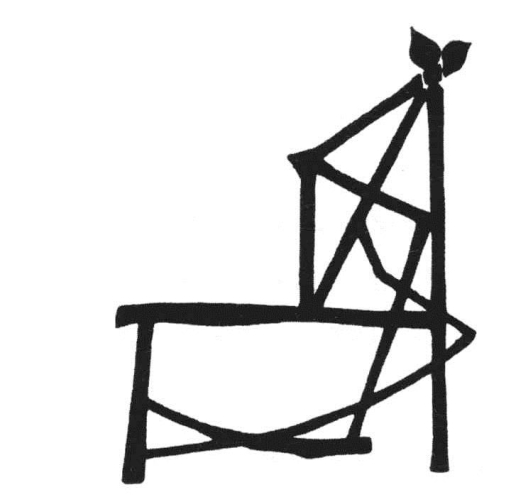
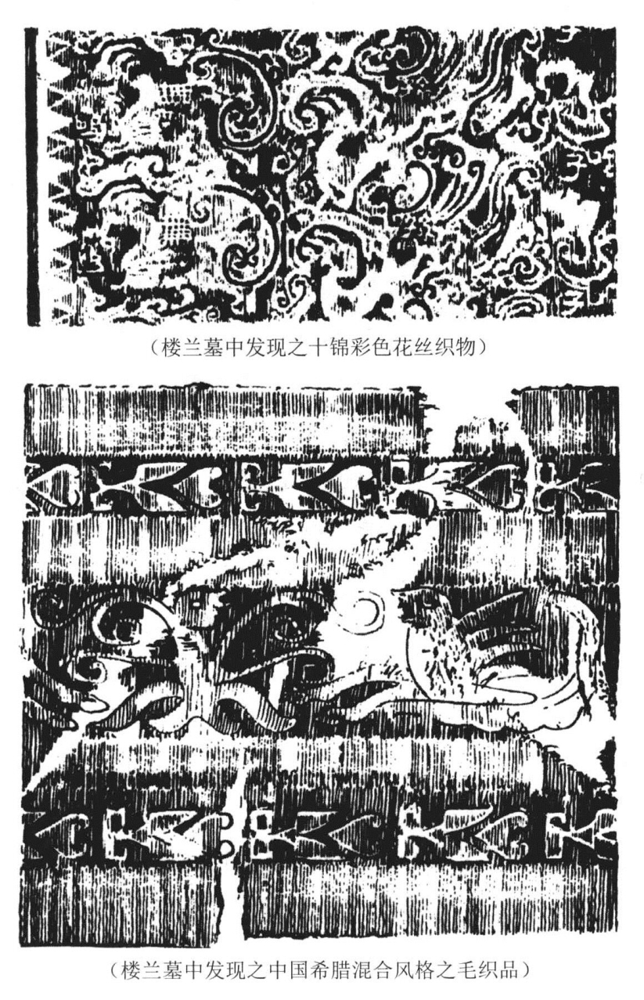
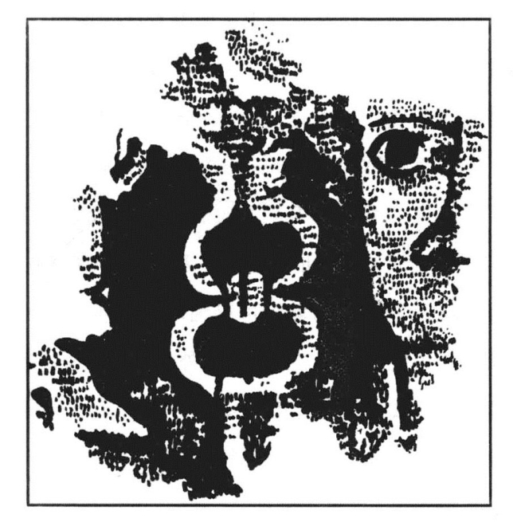

##### 三、纺织及与之有关的服物工业

纺织业是西汉最发达的一种手工业。关于这一点，从西汉布帛的使用量之大可以看出。

据《汉书》所载，西汉政府有着无数赐帛的事实。从文帝时起[112]，历武帝[113]、昭帝[114]、宣帝[115]、元帝[116]、成帝[117]以及平帝[118]，每一个皇帝都有赏赐布帛的事，而且每一个皇帝都不止赏赐一次。据赐帛的记载看来，当时的赐帛并不是赏赐一人两人，而是一种对全国的驯良百姓如三老、孝弟、力田者、鳏寡孤独及年高者之普遍的赏赐。这些人在社会上虽系少数，但以全国数量计之，则大有可观。据史载，汉武帝一次就赏赐百余万匹；一年之中，收天下帛五百万匹。[119]由此可以想见一般。

除对上述的赏赐以外，对于少数民族的贡纳和赐赠，亦须使用巨量的纺织物。如在西汉初，汉政府对匈奴每年皆有一定的贡纳；而贡纳品中，首为“絮缯”。[120]又如武帝时，张骞使西域，也带了大量的丝绸，作为外交的馈赠。[121]唐蒙通夜郎，亦以缯帛为先锋。[122]

此外，西汉的纺织物，以商品的性质而输出国外。当张骞至大夏时，在大夏市场上曾见蜀布。据说这种蜀布是经由印度商人之手运到中亚的。及汉通西域，中国的丝绸，大量地运到中亚乃至地中海沿岸一带，成为国际市场上最著名的商品。中国的商人，并因此而有“丝绸人”之称。

由上所述，可知当西汉之世，中国纺织物的生产，已经不仅是自足自给的生产，而是大规模的商品生产了。单就汉武帝于一年之中征集五百万匹布帛而言，这如果没有普遍发展的纺织业之存在，是不能实现的。

据史籍所载，当时纺织业最进步的地方，是今日的四川和山东。《盐铁论·本议篇》云：“非独齐陶之缣，蜀汉之布也。”正是说明这一事实。从“一女不织，或受之寒”的谚语看来，则在当时已无不知纺织的妇女了。

民间的纺织业，大概都是为了家庭自给的一种农村副业，但亦有以商品生产为目的之大规模的工场。例如张安世夫妇纺织场使用七百个工人，因此获利而与当时的辅政的大将军霍光比富[123]，即其一例。

除民间的纺织场以外，当时在长安有两个很大的国营纺织场：其一曰东织室，其二曰西织室。这两个国营纺织场，每年用费达五千万[124]，可以想见其规模之宏大。

这两个纺织场，专门制造皇家御用的缯帛[125]，主要的出品多系丝织物。当时丝织物织机的构造已经非常复杂。关于这种织机，有一个故事。传说谓：“霍光妻遗淳于衍蒲桃锦二十四匹，散花绫二十五匹，绫出巨鹿陈宝光家，宝光妻传其法，霍显召入其第，使作之。机用一百二十镊，六十日成一匹，匹值万钱。”[126]这个故事，告诉我们当时已有使用一百二十镊的织机，我们虽仍不能详知当时织机的构造，但可以想见其精巧。像这样的织机，当时国营纺织场，不会不采用的（插图二一）。

即因织机的进步，当时的织物已能织成各种复杂图案的花纹。关于这一点，也有一个故事。传说谓：有一次，赵飞燕之妹送给赵飞燕三十几件珍贵的礼物，其中丝织物有：金华紫轮帽、金华紫轮面披、织成上襦、织成下襦、五色文绶、鸳鸯襦、鸳鸯被、鸳鸯褥、金错绣裆、七宝綦履等五彩织花的绫锦。[127]这个故事的真假，当然大有问题。但是问题只在赵飞燕之妹曾否送过赵飞燕这些东西没有？而这些东西在当时之已经存在，则已为近来考古学的发现证实了。

据斯坦因于《西域考古记》中报告，1914年他在罗布泊一带考古时，曾于距古楼兰遗址四英里左右，位于离风蚀地面高约三十五英尺的一座孤立的土台之侧面的汉墓中，发现了“各种殉葬的器物，如死者个人用的有花的铜镜、木制兵器模型、家具、写在木版同纸上的中国文书。最了不起的，是炫耀在我眼前的光怪陆离的织物，其中有美丽的彩绢，很美的地毯、同绣品残片、堆绒地毯，此外还有粗制的毛织物同毯子。我当时明白各种衣饰残片，原来是用在这里缠裹尸体的”。[128]

> 插图二一 西汉时的织布机

“这里所得许多五彩和红色美丽的花绢（插图二二）据后来的证明，十足可以表现贸易仍采取此道经过楼兰以向西方的中国丝织物美术方面的风格以及技术上的完美。”[129]

以上的织物，据斯坦因的研究，其所属的“时期是在汉代，其时中国的贸易同国力，第一次向中亚扩展，约在西纪前二世纪的终了”。即正当西汉武帝、昭帝的时代。从这些被发现的古织物的残片之织作技巧看来，它们比之《西京杂记》所载各物，实在有过之而无不及。

关于毛织物的织作，西汉时也很发达，特别在西北诸游牧种族中，已经是一种极普遍的手工业。如汶山郡（治今四川茂汶北）的羌人最善于织作旄毯和班罽，匈奴和乌孙等皆以穹庐为室旃为墙。同时《汉书·王吉传》亦谓西汉的皇帝和他的大臣常在“广夏之下，细旃之上”，坐而论道。由此就可以想见一般。据斯坦因报告，当时希腊罗马式的毛织物或织作毛织物的技巧已经传入，此种具有希腊罗马式图案的毛织物，已在塔里木盆地的汉墓中发现。斯氏说：“装饰的织物中，精制的地毯残片所显示的风格，丝毫不错是‘希腊式’的。无论是本地制造或是从极西的中亚输入，我们可以看出一种文化力量显著的说明。”因为在这地毯上，“有十足‘希腊罗马式’图案的‘赫密士’（Hermes）的头部。另外一块地毯残片，很奇异地反映出中国同西方美术混合的影响，显然是中亚出品。在这块地毯上，边缘部分的装饰风格，很明白的是‘希腊罗马式’的；但花纹中有着附翼的马的图案，这又是中国汉代雕刻中所常见的”（插图二三）。[130]

> 插图二二 西汉时之彩绢及毛织物

西汉时又有国营的服物制作工场。《汉书·贡禹传》云：“方今齐三服官作工各数千人，一岁费数巨万。”此所谓齐三服官，即指设在山东的服物制造场。此种服物制造场制作服物，大概皆系供给宫廷的御用品。《汉书·元帝纪》云：“罢齐三服官。”师古注引李斐曰：“齐国旧有三服之官，奉献冠帻縰，为首服，纨素为冬服，轻绡为夏服，凡三。”这个注文，正是三服官的说明。从这个注文，我们又知道这个工场的主要出品，是冠帻（头巾）縰、纨素及轻绡之类的冠服。此外，据《汉书·地理志》云：“襄邑有服官。”但据师古云：“襄邑自出文绣，非齐三服也。”《南齐书·舆服志》亦云：“衮衣，汉世出陈留，襄邑所织。”据此则当时襄邑服官之工场，其主要的任务，乃系刺绣的工作。惟据《汉书·地理志》引胡公语曰：“服官主作文绣，以给衮龙之用。”则刺绣又实为一般服官之共同任务。《论衡·程材篇》云：“齐郡世刺绣，恒女无不能；襄邑俗织锦，钝妇无不巧。”则是齐郡亦刺绣，而襄邑亦兼织锦。

> 插图二三 西汉时希腊罗马式图案的地毡

又据《哀帝纪》云：哀帝即位，“诏齐三服官、诸官织绮绣，难成，害女红之物，皆止，无作输。”更证以《论衡》所云齐郡之女无不能刺绣，襄邑之妇无不能织锦之语，又可知西汉的纺织及刺绣工业多用女工。故薄姬被虏，即输织室。
