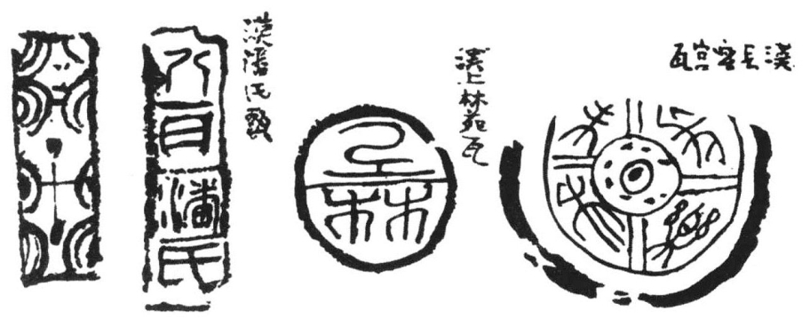

##### 四、漆器、砖瓦、造船及其他手工业

除上述的各种手工业以外，西汉政府又于手工业发达的地方设置工官，以管理或经营一般的手工业。《汉书·地理志》曾指出当时设置工官之地有十处，如河南郡的荥阳、南阳郡的宛县、济南郡的东平陵（治今山东章丘西）、泰山邵的泰山及奉高（治今山东泰安）、颍川郡的阳翟（治今河南禹县）、河内郡的怀县（治今河南武陟西南）、广汉郡的广汉（治今四川射洪南）及雒县（治今广汉北）、蜀郡的成都，都有工官的设置。这种史实，就指明了以上各地是西汉时代手工业最发达的城市。

据《后汉书·百官志》云：“凡郡县有工多者置工官，主工税物。”则工官之设似乎专主抽税。但是据《汉书·贡禹传》所示，则西汉的工官不仅主管抽税，而且主管设场制造。《贡禹传》云：“蜀、广汉主金银器，岁各用五百万，三工官官费五千万。”我们从蜀与广汉的工官及三工官的生产费用的数字，就可以想见各地所设的各种官工场的规模之宏大。

西汉十工官的制造物，其有款识可以确证者，惟有日人于平壤发现的成都和广汉二郡工官所制之漆器、扣器。此外，二郡工官漆器，著录于《骨董续记》者有四器，计成帝永始元年（公元前16年）、平帝元始三年（公元3年）、四年（公元4年）及孺子婴居摄三年（公元8年）之器各一，皆系“蜀郡西工”制造品。

据《骨董续记》所录永始元年之汉漆署款云：“永始元年蜀郡西工造乘舆 {左镸右来}汨画纻黄釦饷槃，容一升。{左镸右来}工黄、上工广、铜釦黄涂工政、画工聿、汨工威、清工东、造工林、造护工卒史安、长孝丞 {上䀠下石}、掾谭、守令史通主。”由此可知当时漆器制作的分工之精细。

又晚近发现之汉瓦，其上多有签署，如右钮、右军、右梦、右宜、右衣、左秦、左纪、右官、卒最、左官徒实、右官徒犁、嘉姚左官、右官、儢典、左三、高繇及右九、污、梦、官、屏、衣等等的字样，这些字样，大概都是主持制造者的工官之自署。这样看来，当时也应有国营砖瓦场之存在（插图二四）。

《汉书·地理志》谓庐江有楼船官。又西汉武帝时征伐东南沿海及朝鲜，皆系海陆并进。故当时有楼船将军、戈船将军。这种水军需要大量的战舰。而所谓楼船者，就是战舰。西汉有楼船官之设，则当然也有国营的造船场（插图二五）。

西汉时的酿造工业亦甚发达，如酿酒、制酱大概已经是普遍民间的工业了。当时四川所制之枸酱已运销于广东。

> 插图二四 西汉时的砖瓦

> 插图二五 西汉时的船

此外还有许多地方专长的小工艺品，如四川的邛竹杖，会稽的流黄簟[131]，以及衣衾、棺木等送死的物件，似乎都有专门的作坊[132]。乃至儿童玩具，亦有专业制造者，《后汉书·王符传》曰：“或作泥车瓦狗诸戏弄之具，以巧诈小儿，此皆无益也。”
