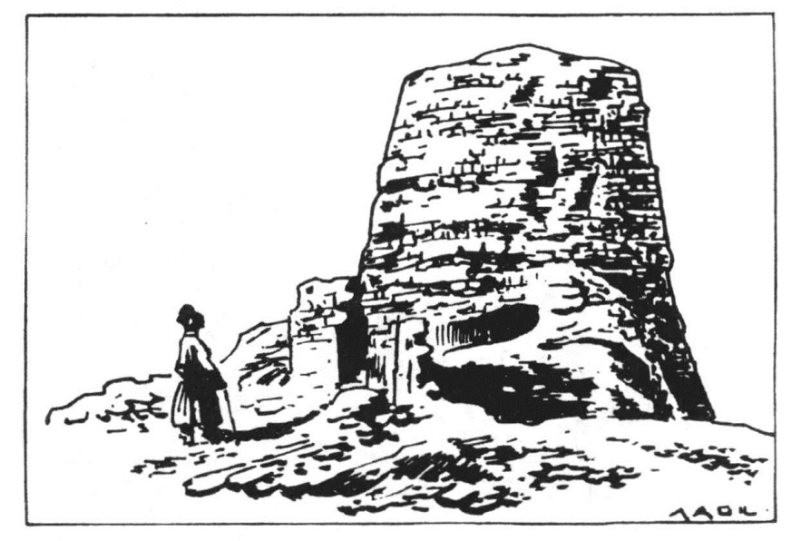
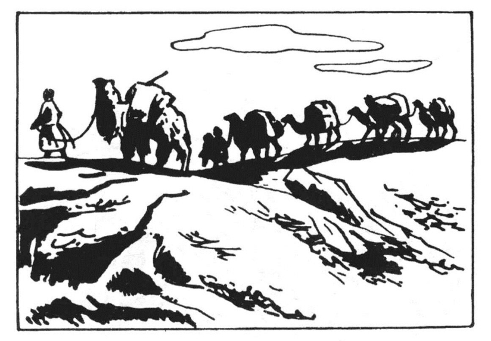
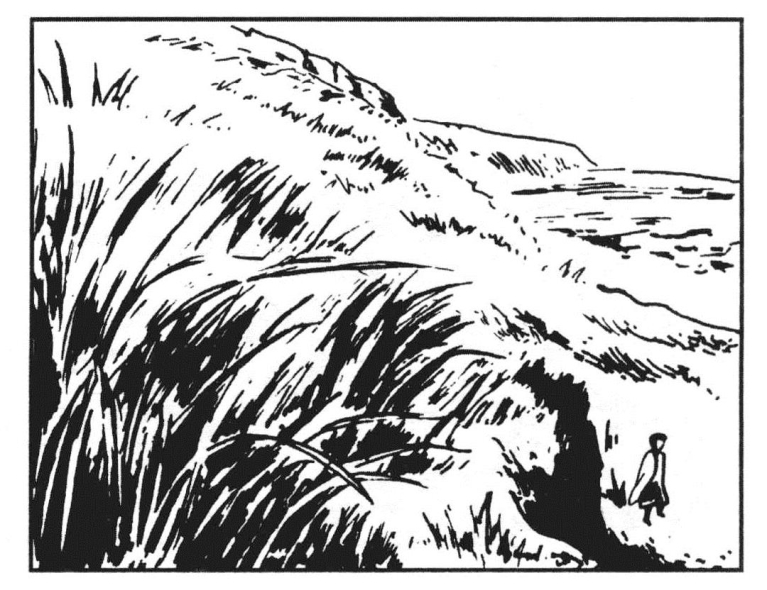
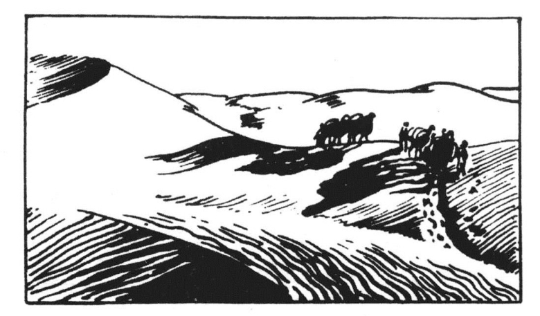
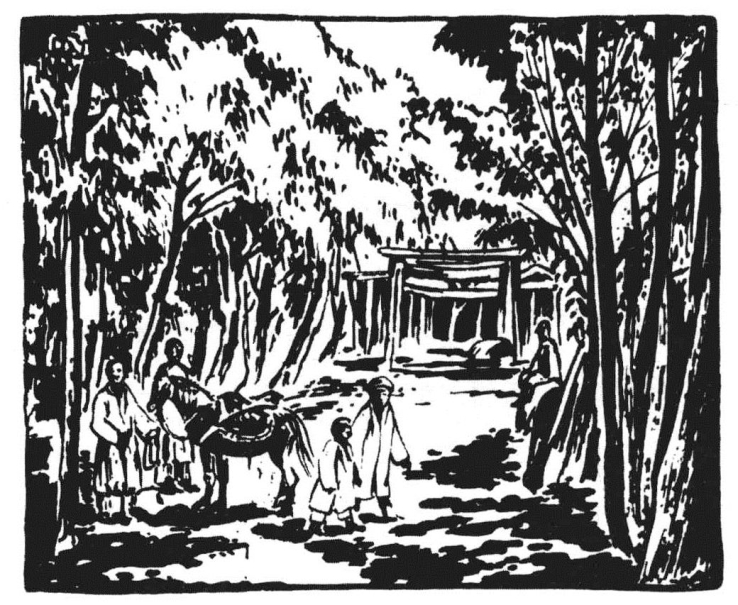

##### 五、周边和国际贸易的发展

汉武帝时，以长安为中心，西至塔里木盆地和中亚，西南至川、黔、滇和印度，东南至闽、粤和安南、南洋，东北至辽东和朝鲜、日本，都有中原商人的活动。同时，东南西北各国的商人，也纷纷来到中国。

张骞奉使西域，回来以后的报告，使中国人正确地知道当时西方世界的具体情况以及通达西方世界的道路。据张骞的报告，中亚诸国，如大宛、大厦、安息之属，皆大国，多奇物而兵弱，贵汉财物。其北大月氏、康居之属，兵虽强，可以赂遗设利，使之入朝进贡。诚得以义属之，则地广万里，重九译，致殊俗，威德遍于四海。惟通达中亚，只有一条捷径，即必须经南山北麓，而这里有匈奴人遮断通路，甚为危险。此外尚有一条通路，即从四川、贵州、云南经缅甸、印度以达中亚。因为在大夏，曾见邛竹杖和蜀布，据大夏国人云，此等竹杖和蜀布是从身毒买来的，身毒在大夏东南几千里，其国临大海。身毒既有蜀物，其地必去蜀不远，而且必有商路可通。因此照张骞的意见，如欲通中亚，只有两个办法，第一，是征伐匈奴，打通南山北麓之南道和北山南麓之大道，这是两条天然走廊；第二，是通西南夷，打通西南的国际通路。

这位探险家的海外奇谈，把好大喜功的汉武帝说得心花怒放。为了打通到中亚的商路，他决定从西北和西南两方面同时并进。讨伐匈奴的远征军，不久就不断地出动了；同时，派赴西南的政治使节，也“四道并出，出駹，出莋，出徙，出邛，出僰，皆各行一、二千里”（《汉书·张骞传》）结果，西南方面的国际商路，被阻于西南夷，始终没有打通，只能通过西南夷的中介，与印度商人进行间接的贸易。而在西北方面，则不久便打通了南山北麓和北山南麓的走廊，与西域诸国畅通无阻了。

南山北麓之东段，在过去本来是一片荒凉的溪谷（插图二七），在这里，只是稀稀落落有些匈奴人的帐幕和畜群，但是自从被西汉占领以后，这里便筑起了四个大城市，即武威、张掖、酒泉、敦煌，所谓河西四郡者是也。当时为什么要选定这几个地方设立郡治呢？其原因即因这几个地方，都有沙漠田，足以为屯戍军队的给养之补充。[159]自武帝时起，迄于西汉之末，河西四郡日趋繁荣，这些城市，不仅是汉朝往来西域的吏卒的补给站，也是国际贸易的商人寄顿之所。

当时国际贸易的商人，由长安出发前往西域，他们都必须经过河西四郡，由武威、张掖、酒泉而至敦煌。敦煌是河西走廊极西的一个都市，过此而西，则为西域的境界。这里在当时是汉军的根据地，驻屯着雄厚的边防军，囤积着如山的粮草，有巍然雄峙的堡垒（插图二八），有大将军的行营，有太守和田官的官署，有各种商店。李广利两次远征大宛，都是以敦煌为根据地出发的。

> 插图二七 南山山谷间的森林

因为敦煌是汉朝西部的一个城市，西域商人到了这里，就算是蹈入了汉朝的边境；他们如果要再向东进，必须于此办理一切入境手续。而且在经过了盐泽沙漠之艰苦的旅行以后，亦必须于此略事休息。同时汉朝商人由内地到达敦煌以后，亦必须于此办理出境手续。而且为了开始横断盐泽沙漠的旅程，亦必须于此作缜密而充分之准备，如雇赁骆驼，购备粮食，装载饮水等，亦需要相当的时间。由此我们可以想到当时的敦煌市上，一定到处可以看到军队、田卒、商人和一群一群的骆驼队。

自敦煌而西，汉朝的商人便西向玉门。玉门关是当时汉朝极西的大门，过此而西，则为荒旷的盐泽。足足有一百二十英里的沙漠旅程（插图二九），才能到达塔里木盆地极东的一个城市，即所谓楼兰者是也。

盐泽在今日已干涸为一望无涯的罗布泊沙漠，除了北风以外，没有其他的东西。但据斯坦因的报告，这里在汉代，库鲁克河尚挟其水量流贯楼兰，曲折以入于盐泽。直至今日，在干涸了的库鲁克河之狭窄低槽的两岸，尚倒卧着成列的白杨和红柳的死干，指出汉代盐泽中的风光（插图三十）。

> 插图二八 敦煌之汉代古垒

在汉代，横断盐泽，都有延续相望的堡垒，驻屯着守卫商道的戍兵。这些汉代戍兵留下来的铜箭镞、铁匕首、铁勒及建筑物上的木雕和器具，现在都已发现了。由此又知西汉时的商人通过盐泽时，沿途都有休息的驿站。

又据斯坦因报告，在罗布泊沙漠中一个较小的堡垒之北，发现了许多用树枝构成的房屋。在这里，发现了用古佉卢文、婆罗门文、窣利文及汉文等文字所写的木简。此外还有许多遗物，如美丽的漆盒、有画的丝织物、毛织物残片及木制农具等。在盐泽沙漠中的另一地方，又发现汉代古钱、金属零件及陶器碎片。又在距古楼兰遗址四英里左右之一突出的土台上，发现一葬地，其中除人骨棺木残片之外，尚发现各种殉葬物，如镂刻花纹的铜镜、木制兵器模型、家具、汉简、美丽的彩绢、地毡、绣品残片、堆绒毛织物及粗毛织物等。据斯氏说：“此等遗物，可以指定的时期，是在汉代，其时中国的贸易和国力第一次向中亚扩展，约在西元前第二世纪的终了。”又据斯氏报告，在盐泽的古道中，“沿途都可以找到中国的古钱，小件金属器物珠子之类的东西”。在某一个地方，“明明白白散布二百枚左右的中国古钱，距离相隔约三十码……这些方孔钱，都是汉代形式，似乎是新铸的一般，显然是护路人员（或商人）带的钱，绳子松了以后，从钱袋或箱子孔中逐渐漏了出来。”

> 插图二九 商队通过盐泽的情景

以上考古学上的诸发现，不仅指明西汉商人穿过盐泽的一条古道的痕迹，而且具体地指明了他们携带的什么商品，以及往来盐泽中的商人不仅是中国人，也有中亚各国的商人。

过了盐泽，便到达楼兰。楼兰在公元前二世纪的终末，正是汉朝商人西入塔里木盆地之第一站，亦即盐泽沙漠之西边的桥头。汉朝的商人，经过了长途沙漠旅行之后，到了楼兰，必须休息几天；同时，由此东行的商人，亦须于此作过盐泽之一切必须的准备。因此，汉代的楼兰，也是欧亚国际商路上的一个重要站口。

> 插图三十 盐泽南岸所见之冰块和芦苇

楼兰古城，早已埋没于沙漠中了。晚近西欧考古学者于罗布泊北发现一座古城，最初发现者为俄人希亭，彼于此处颇获古书。后德人喀尔亨利及孔拉第二氏，据其所得古书，定此城为古楼兰之墟。沙畹氏考证斯坦因所得遗物，亦从其说。但王国维氏根据汉简及史籍遗文考证此罗布泊北之古城，绝非楼兰废墟，而谓系古之龙城[160]。不论此古城为古龙城抑为古楼兰，在西汉时，罗布泊之北有一城市，为当时商人寄顿之所，则已为考古学的发现证实了。

据斯坦因氏的报告，在这座被认为是古楼兰的废址中，发现用红柳条和泥土相间筑成的城墙，以及排成行列的枯死的树干，足见这里在西汉时代是一座白杨、红柳掩映的城市。汉朝的商人，到此以后，可以一洗盐泽中的风尘之苦（插图三一）。

“在遗址的西南部，发现一所大建筑物，一部分是用土砖造的，虽已十分残破，尚能看出是一座衙门的遗址。其中有一小室，原来或系用作监牢的。”其旁有粗陋的小屋，“大约是供非中国人之本地官吏所住的”。[161]在这里，除发现金属、玻璃、石质小件、金属扣、石印、镂刻花纹的汉镜及汉代的方孔钱以外，还发现中国文、佉卢文和窣利文的简牍。在中国文书中，“有从西域长史发出或呈长史的文书，及显然不属于当地军事行动的记录之残简。但其中有一大部分文书，却是关于当时中国一个小屯田区的一切统治事项的记录，如种植、存贮及运输粮食之类的记录。对于官吏及士兵，常有减少口粮的命令，当地不能自给的困难，由此可以显示出来了”。[162]

“又在遗址东南一英里左右，发现了一个大住宅区，这里有一所环以篱笆的果园，其中还残存着死去的古代果树，这是这个遗址中所见的古代种植遗迹之唯一的证明。在这大住宅区遗址中，还发现了许多有趣的遗物，其中有雕刻华美而又加了漆的家具的残片，装饰用的织物，以及饰以西方式地毡图案之拖鞋。”[163]

从以上考古学的报告，我们可以想见，这座古城在西汉时代，有着壮丽的衙门，鳞比的市肆，阔人的住宅，青葱的果园，还有东来西往的国际商队，这是何等繁荣啊！

到了楼兰，汉朝的商人如果要深入塔里木盆地的西部，有两条道路可通。其一，经塔斯马干（塔克拉玛干）沙漠之南，沿昆仑山北坂而西；其二，经沙漠之北，沿天山南坂而西。前者谓之南道，后者谓之北道，由南、北两道而西的商人，最后皆会于疏勒（治今新疆喀什市）。因为疏勒是塔里木盆地极西的一个大都市，从此再往西，便是高入云霄的帕米尔高原的大雪山了。

> 插图三一 骆驼经过塔斯马干沙漠之情景

从南道而西的商人，离开楼兰以后，第一站是且末（今且末县南）。且末也只有沙漠田三十八平方公里，在沙漠田之四周，皆系流沙。这里在西汉时只有230户居民，1610人，他们就依靠这小小的沙漠田，种植谷物、果树和葡萄。斯坦因氏已经在这里发现了古代葡萄园和果树园的遗址，但这恐怕是东汉之物。

第二站是小宛（今且末县南）。这里在西汉时代，只有150户居民，计1050人。因为这里可耕的沙漠田更为狭小，而南边的昆仑山北坂，又都是草木不生的石山，不能养活更多的人口。

第三站是精绝（今民丰县北）。精绝在小宛西北，只有480户居民，计3360人。

第四站是戎卢（今民丰县南）。戎卢在精绝西南，是一个不大的城市，有居民240户，1610人。

第五站是扜弥（今新疆于田县城东北），扜弥是戎卢与于阗之间的一个城市，有居民3340户，20040人。到扜弥后，当时的商人可南到渠勒（今于田县南一带）。渠勒在扜弥西南，是一个小城，只有居民310户，2170人。

第六站是于阗（今和田西南）。于阗是南道最大的一个都市，位于于阗河的西岸。当时的于阗河，还是挟着昆仑山的水源，由南而北，纵贯沙漠，因之当时的商人，可以由于阗河的水路，通达北道诸国。于阗之所以成为一个大城市，主要是因为这里有很宽广的沙漠田（插图三二），其面积约达1600平方公里。在西汉时，这里即有居民3300户，19300人。当地的居民大抵以农业为生，而城市手工业，则以雕琢玉器闻名于当世。往来南道的商人，大都以购买于阗的玉器为主要的经商目标。

第七站是莎车（今莎车县）。莎车已经进到塔里木盆地西端大沃野之东头，这里有沙漠田2600平方公里，是盆地中的第二大沃野。在西汉时，这里有居民2339户，16373人。

第八站是疏勒。疏勒在塔里木盆地之极西，是南北两道商人总汇之所。这里，沙漠田东西长约100公里，南北宽约50公里，其面积达2650平方公里，为盆地中第一大沃野。有居民1510户，18647人。但在这里，往来的商队，其人数，或许超过土著人口。因为这里是南北两道商人会合之地，亦为东西商人必须寄顿之所。一方面，由中亚东来的商人，越过了帕米尔高原之后，必须于此休息；另一方面，由此往西的商人，亦须于此作逾越帕米尔高原之必要的准备。所以疏勒在当时，是一个五方杂处的国际城市。

现在，我们再折回楼兰，去追踪北道商人的旅程。从楼兰采取北道西进的商人，他们经过艰苦的沙漠旅程之后，才能到达尉犁（今库尔勒东北）。尉犁在焉耆河谷附近，有一小小的沙漠田，在西汉时，有土著居民1200户，9600人。当时汉朝政府在这里驻有戍兵，并派有田官田卒，在这里进行垦殖，以巩固这个军事据点。从这里北向焉耆（今焉耆县西南）的途中，沿途都有堡垒，以保障这条商路的安全。

第二站是焉耆，焉耆是北道的一个大城，在博斯腾湖的北边，当时有居民4000户，32100人。在博斯腾湖的西南岸，有一百余方里的沙漠田，出产谷物。这里在西汉时，无论在政治或经济上，都占重要的地位。

> 插图三二 于阗沙漠中的沃土

第三站是乌垒（今轮台东北）。乌垒是焉耆与龟兹之间的一个小城，只有居民110户，1200人。据斯坦因氏推测，这里附近的布古尔沙漠田，就是西汉时西域都护所在的轮台，可是并没有找到什么古代的遗迹，只是在从此西向龟兹去的土质沙漠中，沿路发现一群庞大的碉堡遗迹而已。

第四站是龟兹（今库车）。这里分布的沙漠田，其面积达1170平方公里，想见当时有着繁盛的农业。当时这里向北逾过天山，可以通达山北诸国，向南沿于阗河，可以横断塔斯马干（塔克拉玛干）沙漠，直抵于阗。地理的地位，既适宜于贸易，又想见当时有着繁盛的商业。据《西域传》云，这里在西汉时有居民6970户，81317人。人民从事田畜，亦能冶铸。

第五站是姑墨（今阿克苏）。姑墨在今拜城县西南一个小小的盆地之中，这里有沙漠田220平方公里。当时有居民3500户，24500人。

第六站是温宿（今乌什）。温宿位于今日阿克苏沃野之中，阿克苏沃野中的沙漠田，面积达1650平方公里，为盆地中第三大沃野。这里在西汉时，有居民2200户，8400人。

第七站是尉头（今阿合奇一带）。尉头是温宿以西的一个小城，在当时只有居民300户，2300人。过此而西南，则为疏勒。

从疏勒而西，中国的商人，便开始越过帕米尔高原之艰苦的行程。关于西汉时代中国通达中亚的古道必须经过的山地，斯坦因氏曾作几度冒险的探索。斯氏以为当时西行的商人，离开疏勒以后，即向着今日乌鲁克恰提关口和那一方面的帕米尔高原前进。第二天便要越过高达一万六千英尺的险峻隘口，陡然下降。在这险峻的高山上，如果纵目一望，“只见横越摩吉大山谷以达今日苏联所属之帕米尔东端的坚垒，白云弥漫，有若大海，真是汪洋大观”。当此之时，中国的商人，假若再读“登东山而小鲁，登泰山而小天下”之句，恐怕要发笑了（插图三三）。

据斯氏报告，从这个隘口往下看，可以看到从南方冰峰上流下来的一条冰河的中段和下段，长约十里，这种壮大的伟观，真是人间稀有的奇景。过了这个隘口，山势陡然下降。当“下降时，要经过一连串险峻的山峰，附近是一些小冰河穿插其间：全程甚是困难，有些地方驮东西的牲口，真是无法通过”。过了这些险峻的山路以后，便到达了摩吉下面的大山谷，这里在当时，大概有些塞种人放牧，来往的商人，大概可以在这些塞种人的帐篷里，得到休息的机会。

从此往西，沿着帕米尔的极北边，上到今日喀什噶尔河西源的峡谷，经过五六天的路程，于是又要横越高达一万三千八百英尺的克什贝尔山。在这个山口，可以看见横亘东西高峰在二万英尺以上的外阿拉山，再向前进，便升到流向疏勒的玛尔堪苏河的河床，这里的温度，常在零度上下。

从这里往下去，商人们便走到了称为红水河的肥沃的克则勒河谷，这就是大阿拉山谷。古代从中原及塔里木盆地来的丝商，即沿这条山谷而下，以达中亚。从阿拉山谷一直下到大宛，塞种人的村落，足足有七〇英里之多，这一路上是塞种人夏季的大牧场。沿路上，南面大雪岭的山脉以及高近二万三千英尺的高夫曼峰，远远看去，如在画中。

> 插图三三 帕米尔高原之大雪山

在这一带，斯坦因发现了一些古代垦殖和形制草率的石屋遗迹；同样，在疏勒方面伊尔克什坦木和上面高度相同的处所，也找到垦殖的遗迹。因而可以想见古代商人在这条横越世界屋脊的大路上，除去阿拉山最高部分七十英里长的那一段以外，沿途一定可以找到给养和安身之所。由于篇幅所限，我不能再描写古代中国商人爬过帕米尔的情形。总之，他们必须经过最大的艰苦，才能越过这作为东西两个世界之障壁的帕米尔，而到达有阡陌井然的麦田和果树林的今日的费尔干，古代的大宛。

从敦煌到大宛，还有一条道路可通，这就是取道天山以北的准噶尔高原。采取这条道路的商人，离开敦煌以后，必须经过楼兰东北之荒凉的盐泽以到达今日吐鲁番盆地。据斯坦因考察，这一带的盐泽，自古以来就是地球上一个最低陷之处，最低陷的地方低于海面五十四米以下。因之，在夏天来往的商人，往往在这里碰到奇热的天气。而且在这一段沙漠的旅程中，商人们不能看到一点有生命的东西。一直到库鲁克塔格山麓，才能偶尔看到一些胆小的野骆驼。再向前进，走到库鲁克塔格山中，便可以看到疏疏落落有四百五十户人家散居山谷之中，这就是《西域传》上所谓山国（今新疆东部博斯腾湖东）。这里有五千左右的土人，大都以狩猎与畜牧为生，无城郭，随畜转徙。来往的商人，可以在这些土人的帐篷中，获得一次喘息。

这一段沙漠的旅程，不但荒凉不毛，而且经常有匈奴小组骑兵队袭来的危险。因为这里正当天山东麓的缺口，而这个缺口是匈奴人进出塔里木盆地的孔道。历史上记载匈奴人从这里袭入塔里木盆地的史实，不止一次。但是西汉政府沿着库鲁克塔格山麓，却建筑了成列的堡垒，用以保障这条商路的安全。

向天山北路行进的商人，到了山国以后，大概还要经过焉耆，然后北向车师。车师在今日吐鲁番盆地迪化（今乌鲁木齐市）附近，土地肥美，农产丰富，在西汉时代，为汉与匈奴必争之地。因为匈奴人既不能南入黄河流域，就必须占领这个盆地，然后才能养活他们的畜群，并进而向沙漠田中定住的人民征收贡赋。而汉朝方面，如欲巩固塔里木盆地的统治，以及保障欧、亚商路的安全，也必须占领这个盆地。西汉政府把这个盆地占领以后，汉朝的商人，才能经由天山北路进入中亚。

由车师而西，汉朝的商人，沿着天山北坂，便走进了准噶尔高原，通过卑陆（今乌鲁木齐市东北）、且弥（今乌鲁木齐市）的境界，以入乌孙。在准噶尔斜坂的高处，自古以来，就有很大的松林。稍为下去，则为广阔的牧场。这里的人民，大概居住在帐幕之中，以游牧为生。由此而西南，则进入大宛，与天山南路的商人相会。所以大宛是中国商人进入中亚以后第一个站头。西汉的政府不惜劳师动众，两度远征大宛，就是为了要在中亚建立一个军事的据点，以保障在中亚的贸易。

大宛在今日俄罗斯所属的费尔干，这里是希腊人极东的一个控制区。有人口六万户，三十万人。在这里，布满了葡萄园和各种果树，有广大的牧场，出产名马，汉朝称之曰天马。汉朝的商人，有不少从大宛买了葡萄和天马就回国了，但有少数，则由此再向前进，或北入康居，或南入大月氏，而尤以南入大月氏者为最多。因为到了大月氏，就可以碰到安息、条支、印度乃至罗马的商人。

当时中国商人，在中亚究竟到了一些什么地方呢？据《汉书·张骞传》云：“（张骞第二次使西域）既至乌孙……即分遣副使，使大宛、康居、月氏、大夏……于是西北国始通于汉矣。”同《传》又云：“汉始筑令居以西，初置酒泉郡，以通西北国，因益发使抵安息、奄蔡、犛靬、条支、身毒国。”由此而知当时中国的政治使节，已远至于里海之北，波斯、阿拉伯与印度了。

在任何时代，特别在封建主义时代，国际贸易的进行，必须以政治力量作先锋。强国对弱国，则表现于军事的掠夺和政治的榨取。弱国对强国，则表现为朝贡的形式。因之西汉时代的所谓政治使节，实际上就是商队的领导人。关于这一点，我们从史籍上可以看出在这些外交使节的后面，跟随着大群的商人。《张骞传》谓自骞以后，前赴西域的“使者，相望于道，一辈大者数百，少者百余人”。以后虽渐减少，但在一年之中，“使者多者十余，少者五、六辈”。这些打着国旗做买卖的商队，他们赍操的货物与资本，“大放博望侯时”。而博望侯时的赍操，则为“牛羊以万数，赍金币帛直数千巨万”。这些商队依照各人买卖的目的，走向不同的地方，“远者八、九岁，近者数岁而反”。

又据《张骞传》云：“自骞开外国道以尊贵，其吏士争上书，言外国奇怪利害，求使。天子为其绝远，非人所乐，听其言，予节，募吏民，无问所从来，为具备人众遣之，以广其道。来还，不能无侵盗币物及使失指。天子为其习之，辄复按致重罪，以激怒令赎。复求使，使端无穷而轻犯法，其吏卒亦辄复盛推外国所有。言大者予节，言小者为副，故妄言无行之徒，皆争相效。其使皆私县官赍物，欲贱市以私其利。”由此而知当时派赴西域的成群结队的外交使节，并非朝廷的正式官吏，皆系一些妄言无行的冒险商人，他们利用政府的资本、货物，而贱卖以饱私囊。这些重装的外交使节，所以往往在路上遭到劫掠。

关于西南的国际贸易，史书所载极为简略，而又无考古学的发现足以印证，故无从详考。惟西汉时大夏市上有邛竹杖与蜀布，而此等货物又系自印度商人转贩而来，则当时四川与印度间之有直接或间接的贸易，又为确切之事。

汉武帝为了打通这条商路，曾派出许多使节，但据《张骞传》云：“其北方闭氐、莋，南方闭嶲、昆明，昆明之属无君长，善寇盗，辄杀略汉使，终莫得通。”

虽然如此，汉卒因此而通滇国。《张骞传》云：“然闻其西可千余里，有乘象国，名滇越。而蜀贾间出物者或至焉。”滇国在今日之昆明，与分布于今日滇、缅边境的哀牢夷，有着贸易的关系，当系可能之事。故以今日之地理度之，当时西南的国际商路，必系以蜀为中心，经犍为、越嶲、滇以至于昆明，通过西南夷的中介，由缅甸、印度以达于中亚之大夏。

现在，我们说到西汉时代的海洋贸易。《汉书·地理志》云：“自日南障塞、徐闻、合浦，船行可五月，有都元国；又船行可四月，有邑卢没国；又船行可二十余日，有谌离国；步行可十余日，有夫甘都卢国。自夫甘都卢国船行可二月余，有黄支国，民俗略与珠崖相类。其州广大，户口多，多异物，自武帝以来，皆献见。有译长，属黄门，与应募者俱入海，市明珠、璧、流离、奇石、异物，赍黄金杂缯而往，所至国皆禀食为耦，蛮夷贾船，转送致之。亦利交易，剽杀人。又苦逢风波溺死，不者数年来还。大珠至围二寸以下。平帝元始中，王莽辅政，欲耀威德，厚遗黄支王，令遣使献生犀牛。自黄支船行可八月，到皮宗；船行可八月，到日南、象林界云。黄支之南，有已程不国。汉之译使自此还矣。”以上所记的地名，我们虽不能确证其为今日何地，但以航行的时间计之，已在一年以上，以每日航行六十里计之，自合浦（今属广西）出发至其终点已程不国，当有二三万里的海程。

据晚近学者推测，谓黄支国即《大唐西域记》中西印度境之建志补罗国。如此，则黄支之南的已程不国，当即当时之狮子国，今日之锡兰岛（今名斯里兰卡）。而介于合浦与黄支之间的诸国，则当在今日婆罗洲、新加坡及苏门答腊一带。究竟如何，这还要有待于将来考古学的发现之证明。惟东汉时夫甘都卢国（在今缅甸伊洛瓦底江中游）人与中国有着往来，则为文献所证明。张衡《西京赋》有云：“乌获扛鼎，都卢寻橦。”又云：“非都卢之轻趫，孰能超而究升也。”这里所谓“都卢”，就是“夫甘都卢”的简称。

再说东北方面的国际贸易。所谓东北方面，即指辽东半岛、朝鲜半岛及日本而言。中原与辽东半岛及朝鲜半岛的诸种族，自古以来，即有着交易的关系，这已经从考古学的发现上获得证明。至于日本，在秦代亦以蓬莱三岛之名而出现于中国的史籍。徐市等或者已经到达了这里。惟史籍记载不明，无从确证而已。

东北方面的国际贸易之畅通，当始于汉武帝征服朝鲜以后。史载武帝于元封二年（公元前109年）以海军与陆军两道并发，陆军出辽东，海军浮渤海，两军会于朝鲜之首都王险城（今平壤市），并在朝鲜置真番，临屯、乐浪、玄菟四郡，于是朝鲜遂成为大汉帝国的疆土。我们从武帝征朝鲜之水陆并进，又知当时通达朝鲜，有水陆两道。而其贸易之中心地，则为当时之乐浪郡。这从乐浪已经发现许多汉代的漆器可以证明。

当时从陆路出发的商人，大都以今日的北平（今北京市），当时的燕（蓟）为根据，《史记·货殖列传》谓当时的燕，“北邻乌桓、夫余，东绾秽貉、朝鲜、真番之利”。由此可以想见，这些商人从燕出发，或北入今日热河（原热河省，辖今河北省东北部承德地区、辽宁省西南部及内蒙古东南部），与乌桓交易；或东入辽西、辽东，与夫余（在今吉林农安一带）交易；或由辽东更进而南行，进入朝鲜半岛，与朝鲜、秽貉（今朝鲜东部）、三韩（今朝鲜南部）贸易。其由海道赴朝鲜者，则大半由山东芝罘出发，因为芝罘在秦代即为海洋探险的商人麇集之地。到西汉初，当然更加发展了。

除朝鲜以外，当时中国与日本，也发生了繁盛的贸易关系。《后汉书·东夷传》云：西汉武帝时倭“使驿通于汉者三十许国”。又《汉书·地理志》云：“乐浪海中有倭人，分为百余国，以岁时来献见云。”从这种简略的记载，我们已经可以想见当时中、日之间的贸易关系。可惜东入倭国的商人之中，没有一个像张骞那样的人物，把这百余国的风土人情出产，详细记载出来，因而我们至今无从确考。但这些诸国，必系今日日本西北的诸部落，则可想见。因为只有这一带最接近于西方的大陆。当时日本的商人之入中国，大都先浮海至朝鲜之乐浪，《汉书·地理志》谓“乐浪海中有倭人”，即其明证。到乐浪后，舍舟陆行，经辽东半岛而入中国，故《文献通考》卷三百二十四《四裔考一》云：“倭人初通中国也，实自辽东而来。”

西汉时代，中、日之间确有贸易关系之存在，近来已有考古学发现的证明。日人木宫泰彦《中日交通史》谓在日本博多罗湾沿岸，发现中国古代的铜剑、铜鉾：在筑前国筑紫郡春日村大字须玖、并系岛郡怡土村大字三云发现瓮棺，内多中国古镜、璧玉之属；又由系岛郡小富士村之海岸遗址，发现王莽时的货泉。这些器物和货币在日本沿岸之发现，即足以确证当时日本沿海岸，已有中国商人的活动。

总上所述，我们可以了然于西汉时代国际贸易的概况。当时中国已有三条商路通达中亚，其一由今日之甘肃、新疆越帕米尔高原而入中亚；其二，由今日之四川、云南经缅甸、印度以入中亚；其三，由今日之广东之合浦（今属广西）沿安南海岸，经南洋以达印度，再由印度登陆以入中亚。此外，则由水、陆两道通于朝鲜，并远至于日本。当此之时，中国的商人翻山越岭，乘风破浪，海浮陆行，遍于世界，真可谓盛极一时。

同时，外国的商人，也由四方八面来到中国。如《张骞传》谓：“其所遣副使，通大夏之属者，皆颇与其人俱来。”《地理志》亦谓倭人百余国“以岁时来献”。又谓南洋诸国，“武帝以来，皆献见”。所以当武帝出外游历的时候，到处都可以碰到外国商人。《汉书·张骞传》云：“是时上方数巡狩海上，乃悉从外国客。大都多人则过之，散财帛赏赐，厚具饶给之，以览视汉富厚焉。大角氐出奇戏诸怪物，多聚观者。行赏赐，酒池肉林，令外国客遍观各仓库府臧之积，欲以见汉广大，倾骇之。及加其眩者之工，而角氐奇戏岁增变，其益兴自此始。而外国使更来更去……”这段史实，一方面指明了当时来到中国的外国商人之多，同时也指明了中国的统治者，往往在人民贫困之时，而惯于向外国人表现一种虚伪的阔绰。从古以来，就是如此。

[1]《汉书·食货志》。

[2]《汉书·高惠高后文功臣表》序。

[3]《汉书·地理志》记平帝始元二年（公元2年）人口总数为59594978人。

[4]《汉书·苏武传》云：“武以始元六年春至京师……拜为典属国，秩中二千石，赐钱二百万，公田二顷。”

[5]《汉书·宣帝纪》云：“地节三年冬十月诏曰……流民还归者假（即租也）公田。”《元帝纪》云：初元元年三月丙午，“以三辅太常郡国公田及苑可省者、振业贫民”。又云：二年三月，诏罢“水衡禁囿、宜春下苑、少府佽飞外池、严篥池田，假与贫民”。

[6]《盐铁论·园池篇》云：“今县官之多张苑囿、公田、池泽，公家有鄣假之名，而利归权家。”

[7]《汉书·食货志》（上）云：“自天子以至封君汤沐邑，皆各为私奉养。”

[8]《史记·萧相国世家》云：“客有说相国曰：‘……上所为数问君者，畏君倾动关中。今君胡不多买田地，贱贳贷以自污，上心乃安。’于是相国从其计，上乃大悦。上罢布军归，民道遮行上节，言相国贱强买民田宅数千万。上至，相国谒，上笑曰：夫相国乃利民。民所上书，皆以与相国。曰：君自谢民。”

[9]《汉书·高帝纪》（下）五年五月诏曰：“民前或相聚保山泽，不书名数。今天下已定，令各归其县，夏故爵田宅。”既有田宅而又有故爵之民，当然是旧地主。同诏中又曰：“异日秦民爵公大夫以上，令丞与亢礼。”

[10]《汉书·张敞传》云：“山阳郡户九万三千，□五十万以上，讫计盗贼未得者七十七人。它课诸事，亦略如此。”由此可知其户口调查之精密。

[11]《居延汉简》名籍类对于戍卒的籍贯，皆记其里，如：“戍卒淮阳郡招阳里阵贤。”“戍卒赵国邯郸县蒲里董平。”“戍卒张掖郡昭武（县）便处里丈夫薛褒。”“戍卒魏郡繁阳宜岁里公乘李广宗。”“戍卒梁国睢阳䚭里张竖。”“河南雒阳缑氏西槐里李实。”“荥阳宜秋里杜宣。”“居延西道里张图。”“汉中郡安阳承虎里褒益寿。”皆其例也。此外，如：“河内郡温西故里丈夫苏罢军，年三十五，长七尺三寸，黑色。”则并记其身材长短与肤色矣。

[12]《汉书·陈汤传》云：成帝时，解“万年与汤议……子公（汤字）妻家在长安，儿了生长长安，不乐东方，宜求徙”。

[13]《汉书·宣元六王传》云：“元帝即位……（宪）王上书，请徙外家张氏于国。”

[14]《汉书·叙传上》云：“成帝之初……大臣名家，皆占数于长安。”

[15]《汉书·景帝纪》云：“间者，岁比不登，民多乏食，夭绝天年，朕甚痛之。郡国或硗狭，无所农桑畜；或地饶广，荐草莽，水泉利而不得徙，其议民欲徙宽大地者听之。”由此足见若无政府明令，当时农民虽饿死硗狭之地，亦不得自由徙于丰饶之乡也。

[16]《盐铁论·水旱篇》云：“今县官作铁器，多苦恶，用费不省……盐铁贾贵，百姓不便。贫民或木耕手耨，土耰啖食，铁官卖器不售。”

[17]明徐光启《农政全书》卷二十一云：“前汉赵过又增其制度，三犁一牛，居世因之。”

[18]明徐光启《农政全书》云：“汉武帝以赵过为搜粟都尉，教民耕殖，其法三犁共一牛，一人将之，下种挽耧，皆取备焉，日种一顷。”

[19]《农政全书》自注云：“耧之制不一，有独脚、两脚、三脚之异。”

[20]按徐光启氏所述西汉之犁，其上有耧，与《三国志》所载皇甫隆所发明的“耧车”，无多差异。论者多以耧车之制，始于三国，以三国以前之文献，无耧车之记载也。但余以为三国时的耧车，或系西汉时具有挽耧的犁之发展。

[21]《通典》卷二《食货二》云：“文帝以文翁为蜀郡太守，穿煎㳛口，溉灌繁田千七百顷，人获其饶。”

[22]《汉书·沟洫志》云：“孝武元光中……时郑当时为大司农……引渭穿渠，起长安，旁南山下，至河三百余里……渠下民田万余顷，又可得以溉，此捐漕省卒而益肥关中之地，得谷。上以为然，令齐人水工徐伯表，发卒数万人，穿漕渠，三岁而通。……渠下之民，颇得以溉矣。”

[23]《汉书·沟洫志》云：“后河东守番系言……穿渠引汾，溉皮氏、汾阴下，引河溉汾阴、蒲阪下，度可得五千顷。故尽河堧弃地，民茭牧其中耳。今溉田之，度可得谷二百万石以上。……上以为然，发卒数万人，作渠田。”

[24]《汉书·沟洫志》云：“其后严熊言：临晋民愿穿洛以溉重泉以东万余顷，故恶地。诚即得水，可令亩十石。于是为发卒万人穿渠，自征引洛水至商颜下。”

[25]《汉书·沟洫志》云：“元鼎六年……兄宽为左内史，奏请穿凿六辅渠，以益溉郑国（渠）傍高卬之田。”按此渠之穿，后郑国渠136年。

[26]《汉书·沟洫志》云：“后十六岁，太始二年，赵中大夫白公复奏穿渠，引泾水，首起谷口，尾入栎阳，注渭中，袤二百里，溉田四千五百余顷，因名曰白渠。”

[27]《史记·河渠书》。

[28]《文献通考》卷六《田赋考六》引公非刘氏《七门庙记》云：“予为庐州从事，始以事至舒域，观所谓七门三堰者，问于居人，其田溉几何？对曰：凡二万顷。考于图书，则汉羹颉侯信始基，而魏扬州刺史刘馥实修其废。”

[29]《汉书·沟洫志》谓引洛水至商颜下时，“岸善崩，乃凿井，深者四十余丈。往往为井，井下相通行水，水隤以绝商颜，东至山领十余里间，井渠之生自此始”。

[30]《汉书·循吏传》云：“元帝建昭中，召信臣为南阳太守（略）行视郡中水源，开通沟渎，起水门堤阏凡数十处，以广溉灌，岁岁增加，多至三万顷。民得其利，畜积有余。信臣为民作均水约束，刻石立于田畔，以防分争。”

[31]《齐民要术》述氾胜之的区种法云：“以亩为率。令一亩之地，长十八丈，广四丈八尺。当横分十八丈，作十五町，町间分十四道，以通人行。道广一尺五寸，町皆广一丈五寸，长四丈八尺。尺直横凿町作沟，沟一尺，深亦一尺。积壤于沟间，相去亦一尺。尝悉以一尺地积壤，不相受，令弘作二尺地以积壤。种禾黍于沟间，夹沟为两行，去沟两边各二寸半，中央相去五寸，旁行相去亦五寸。一沟容四十四株，一亩合万五千七百五十株。”

[32]《汉书·循吏传》云：“（龚遂治渤海）……劝民务农桑，令□种一树榆，百本䪥；五十本葱，一畦韭，家二母彘、五鸡。民有带持刀剑者，使卖剑买牛，卖刀买犊。曰‘何为带牛佩犊？’春夏不得不趋田亩，秋冬课收敛，益蓄果实菱芡。”又同书《东方朔传》云：“泾渭之南……有粳稻梨栗桑麻竹箭之饶，土宜姜芋，水多蛙鱼。”

[33]《汉书·食货志》（上）云：赵“过能为代田，一亩三甽，岁代处，故曰代田。……广尺深尺曰甽，长终亩。一亩三甽，一夫三百甽，而播种于甽中。苗生叶以上，稍耨陇草，因隤其土以附苗根。……陇尽（即陇上之土尽隤于沟中）而根深，能风与旱”。

[34]西汉二百余年中，黄河决口七次。第一次，文帝十二年（公元前168年）十二月，河决酸枣，东溃金堤。第二次，武帝元光三年（公元前132年）春，河徙顿丘。第三次，同年夏，复大决于瓠子（今滑县）。第四次，宣帝本始二年（公元前72年），河决宣房（即瓠子塞口）。第五次，成帝建始四年（公元前29年）秋，大水，河决东郡金堤，泛滥豫、兖，凡灌四郡三十二县。第六次，成帝鸿嘉四年（公元前17年）河大溢。第七次，王莽始建国三年（公元11年），河决魏郡，泛清河以东数郡。

[35]《汉书·地理志》。

[36]《汉书·淮南王安传》。

[37]《汉书·衡山王传》。

[38]《汉书·窦田灌韩传》记田蚡使藉福请窦婴城南田事。

[39]《汉书·窦田灌韩传》记田蚡使藉福请窦婴城南田事。

[40]《汉书·公孙贺传》。

[41]《汉书·酷吏传》。

[42]《汉书·晁错传》记晁错对屯田之建议曰：“陛下（文帝）幸忧边境，遣将吏发卒以治塞，甚大惠也。然令远方之卒，守塞一岁而更，不知胡人之能。不如选常居者，家室田作，且以备之。……要害之处，通川之道，调立城邑，毋下千家……先为室屋，具田器，乃募罪人及免徒复作令居之；不足，募以丁奴婢赎罪及输奴婢欲以拜爵者；不足，乃募民之欲往者。皆赐高爵，复其家。……其亡夫若妻者，县官买予之。”

[43]《汉书·西域传》云：武帝“征和中……搜粟都尉桑弘羊与丞相御史奏言：‘故轮台以东，捷枝、渠犁皆故国。地广饶水草，有溉田五千顷以上，处温和，田美，可益通沟渠，种五谷，与中国同时孰。……臣愚以为可遣屯田卒诣故轮台以东……益种五谷……田一岁有积谷，募民壮健有累重（眷属）敢徙者诣田所，就畜积为本业，益垦溉田。稍筑列亭，连城而西，以威西国，辅乌孙为便。’”

[44]《史记·匈奴列传》云：“令大将军青、骠骑将车去病中分军，大将军出定襄，骠骑将军出代……是后，匈奴远遁，而幕南无王庭。汉度河，自朔方以西至令居，往往通渠，置田官、吏卒五六万人，稍蚕食，地接匈奴以北。”

[45]《史记·平准书》云：“初置张掖、酒泉郡，而上郡、朔方、西河、河西开田官，斥塞卒六十万人戍田之。”

[46]《汉书·西域传》云：“自敦煌西至盐泽（盐泽即今新疆东部之罗布泊），往往起亭。而轮台、渠犁皆有田卒数百人，置使者校尉领护。”

[47]《汉书·赵充国传》记其屯田奏曰：“计度临羌东至浩亹，羌虏故田及公田民所未垦，可二千顷以上。……愿罢骑兵，留弛刑应募及淮阳、汝南步兵与吏士私从者，合凡万二百八十一人……分屯要害处。”又荀悦《汉纪》记赵充国言屯田十二事，其一云：“分步兵九校吏士各万人留屯田以为武备，因田致谷。”按赵充国屯田湟中，始于宣帝神爵元年。

[48]《居延汉简考释》名籍类关于田卒之登记有云：“田卒大河郡瑕丘会成里王胜，年三十八。”又云：“田卒淮阳高平常昌里上造柳道，年二十三。”又云：“田卒昌邑国邵灵里公士朱广，年二十四。”此田卒登记之例也。同书书檄类亦云：“马长史即有吏卒民屯士亡者，具署郡、县、里、名、姓、年长、物色、房、衣服，赍操，初亡年月日，人数，白报具病已。谨案属丞始元二年戍田卒千五百人为骍马田官写泾渠，乃正月己酉淮阳部。”此亦田卒登记之一例也。

[49]《居延汉简考释》书檄类：“选家中书到遣都吏与县令逐捕搜索部界中，听亡人所隐匿，以必得为最，诏所名捕。”此追捕之例也。

[50]《居延汉简考释》名籍类载一田卒及其家眷人数与其所领田宅犁牛云：“妻一人，子男二人，子女二人，男同产二人，女同产二人（领）宅一区，直三千，田五十亩，直五千，用牛二，直五千。”此政府发给田宅犁牛之例也。由此吾人尚知当时居延一带之田价，每亩仅值百钱，牛则每头值二千五百文，而当时政府对每一田卒，须费一万三千也。

[51]《居延汉简考释》戍役类云：“右第二长官二处田六十五亩，租二十六石”，此收租之例也。吾人由此并知屯田之租每亩为四斗。

[52]《居延汉简考释》书檄类云：“延寿乃太初三年中，又以负马田敦煌，延寿与父俱□，田事已。”此“田事已”必书之例也。

[53]《汉书·孙宝传》云：“上复拜宝为冀州刺史，迁丞相司直。时帝舅红阳侯立使客因南郡太守李尚占垦草田数百顷，颇有民所假少府陂泽，略皆开发。上书愿以入县官。有诏郡平田予直，钱有贵一万万以上。（师古曰：增于时价。）宝闻之，遣丞相史按验，发其奸，劾奏立、尚怀奸罔上。”

[54]《汉书·哀帝纪》及《食货志》。

[55]《汉书·食货志》云：“或耕豪民之田，见税什五……汉兴循而未改。”

[56]《汉书·食货志》记晁错之言曰：“今农夫五口之家，其服役者不下二人，其能耕者不过百亩，百亩之收不过百石。”

[57]《汉书·食货志》云：汉兴，“天下既定……上（高祖）于是约法省禁，轻田租，什伍而税一。”

[58]《汉书·惠帝纪》。

[59]《汉书·食货志》云：“（文帝）乃下诏，赐民十二年租税之半；明年，遂除民田之租税。”《汉书·文帝纪》免田赋之诏曰：“农，天下之本，务莫大焉，今廑身从事而有税租之赋，是谓本末者无以异也，其于劝农之道未备。其除田之租税。”

[60]《汉书·食货志》及《西汉会要·田租篇》皆云：“孝景二年，令民半出田租，三十而税一也。”

[61]《通志》卷六十一《食货一》云：“（武帝时，赋敛繁多，律外而取。）孝昭始元六年……令民得以律占租。”

[62]《汉书·惠帝纪》云：六年，令“女子年十五以上至三十不嫁，五算”。由此足见当时女子不嫁者甚多。女子之不嫁，实由男子之不娶；男子之不娶，非无男女之欲也，而实因不敢生子，避逃口赋。然而西汉政府却能从未嫁之女，榨取他四个儿女的人头税，可谓巧取矣。又同《纪》注云：“汉律，人出一算……贾人与奴婢倍算。”这大概含有一点重赋富人的意思。

[63]《汉书·贾捐之传》。

[64]《汉书·宣帝纪》：“减民算三十。”

[65]《汉书·成帝纪》：“减天下赋钱，算四十。”孟康注曰：“本算百二十，今减四十，为八十。”

[66]《汉书·货殖传》云：“秦汉之制，列侯封君食租税，岁率户二百。千户之君则二十万，朝觐聘享出其中。”

[67]《汉书·食货志》：秦时“盐铁之利，二十倍于古……汉兴，循而未改”。

[68]《汉书·食货志》谓西汉的酒税，是“计其利而什分之，以其七入官，其三给醩截灰炭及工器薪樵之费”。据此，则当时的酒税率为值百抽七十。又《西汉会要·榷酤篇》谓昭帝时罢榷酤官，卖酒升四钱。

[69]《汉书·食货志》云：武帝元光六年，公卿言：“异时，算轺车……请算如故。……非吏比者、三老、北边骑士，轺车一算；商贾人轺车二算。船五丈以上，一算。匿不自占，占不悉，戍边一岁。……有能告者，以其半畀之。”

[70]《汉书·食货志》云：“宣帝时……大司农中丞耿寿昌……又白增海租三倍，天子皆从其计。”《平帝纪》颜师古注云：“海丞主海税。”按海租与海税，同为渔税之别称，而海丞者，则为管理滨海渔税之专官。

[71]《史记·平准书》谓西汉有“山川园池市井租税之人”。《汉旧仪》亦谓西汉时，“山泽鱼盐市税以给私用。”

[72]武帝时，租及六畜，租六畜者，即税牲畜。《汉书·昭帝纪》云：“元凤二年，其令郡国毋敛今年马□钱。”如淳曰：“所谓租及六畜也。”又《汉书·翟方进传》谓其后，翟方进请算马牛羊，其税率，张晏曰：“马牛羊头数出税，算千输二十也。”换言之，即百分之二的税率。余居巴县歇马乡，见乡长向农民征收鸡税，不论农民养鸡与否，每半年征鸡税百二十元，可谓有先王之遗风矣。

[73]《汉书·贡禹传》云：“已奉谷租，又出稿税。”师古曰：“稿，禾秆也”。是西汉时草亦有税也。

[74]《汉书·高帝纪》记高帝十一年诏曰：“今献未有程（章程），吏或多赋以为献，而诸侯王尤多，民疾之。令诸侯王、通侯，常以十月朝献，及郡各以其□数率，人岁六十三钱，以给献费。”

[75]《汉书·食货志》云：“时（武帝元狩四年）公卿言：异时算轺车贾人之缗钱皆有差，请算如故。诸贾人来作贳贷卖买居邑贮积诸物及商以取利者，虽无市籍，各以其物自占，率缗钱二千而算一，诸作有租及铸，率缗钱四千算一。……匿不自占，占不悉，戍边一岁，没入缗钱。有能告者，以其半畀之。”按所谓算缗钱即税财产也。此种财产税之直接负担者虽为商人及富豪，但他们又必然要将此种负担，转嫁于农民。

[76]《汉书·陈咸传》云：咸为南阳太守，“所居调发属县所出食物，以自奉养，奢侈玉食”。《汉书·薛宣传》云：“会邛成太后崩，丧事仓卒，吏赋敛以趋办。”《汉书·王嘉传》云：“（董）贤家有宾婚……使者护视，发取市物，百贾震动，道路讙哗。”以上所举不过略示其概。

[77]《汉书·昭帝纪》记昭帝元凤四年诏曰：“以前逋更赋未入者，皆勿收。”注云：“如淳曰：更有三品：有‘卒更’，有‘践更’，有‘过更’。古者正卒无常人，皆当迭为之。一月一更，是谓‘卒更’也。贫者欲得‘顾（雇也）更钱’（代人服役之钱）者，‘次直（值）者’（第二次轮役者）出钱顾之，月二千，是谓‘践更’也。天下人皆直戍边……之调，不可人人自行三日戍，又‘行者’（往服役者）当自戍三日，不可往便还，因便住一岁一更，诸‘不行者’，出钱三百入官，官以给戍者，是谓‘过更’也。”

[78]《居延汉简考释》名籍篇关于不及二十岁之戍卒有如此之记载：“十二。”“昌里虞武强年十三。”“显美骑士并廷里辅宪十四。”“葆鸾鸟大昌里不更李恽年十六。“居延西道里张图年十七。”“公乘孙辅年十八，长七尺一寸，黑色。”关于超过五十六岁者有云：“□□年五十七。”“五十九。”“□□□□上造王福年六十，长七尺二寸、黑色。”“觻得武安里黄寿年六十五。”

[79]《盐铁论·复古篇》云：“往者豪强大家，得管山海之利，采铁石鼓铸、煮盐，一家聚众或至千余人，大抵尽收放流人民也。远去乡里，弃坟墓，依倚大家，聚深山穷泽之中，成奸伪之业。”又《禁耕篇》云：“异时盐铁未笼，布衣有朐邴，人君有吴王，专山泽之饶，薄赋其民，赈赡穷小，以成私威，私威积而逆节之心作。”

[80]《盐铁论·错币篇》云：“文帝之时，纵民得铸钱、冶铁、煮盐。吴王擅鄣海泽，邓通专西山，山东奸猾咸积吴国，秦雍汉蜀因邓氏，吴邓钱布天下。”

[81]《汉书·食货志》云：“孔仅、咸阳言：山海天地之臧，宜属少府，陛下弗私，以属大农佐赋。愿募民自给费，因官器作鬻盐，官与牢盆。浮食奇民，欲擅斡山海之货，以致富羡，役利细民。其沮事之议，不可胜听。敢私铸铁器鬻盐者釱左趾，没入其器物。郡不出铁者，置小铁官，使属在所县。”

[82]《汉书·食货志》云：“使（孔）仅、咸阳乘传，举行天下盐铁，作官府，除故盐铁家富者为吏。”

[83]《文献通考》卷十五《征榷考二》谓置铁官之郡凡四十，其中有一郡置铁官两员乃至四员者。（一）京兆——郑，（二）左冯翊——夏阳，（三）右扶风——雍、漆，（四）弘农郡——宜阳、渑池，（五）河东郡——安邑、绛、皮氏、平阳，（六）太原郡——大陵，（七）河内郡——隆虑，（八）河南郡——河南，（九）颍川郡——阳城，（十）汝南郡——西平，（十一）南阳郡——宛，（十二）庐江郡——皖，（十三）山阳郡——山阳，（十四）沛郡——沛，（十五）魏郡——武安，（十六）常山郡——都乡，（十七）千乘郡——千乘，（十八）济南郡——东平陵、历城，（十九）太山郡——嬴，（二十）齐郡——临淄，（二十一）东莱郡——东弁，（二十二）东海郡——下邳、朐，（二十三）临淮郡——盐渎、堂邑，（二十四）桂阳郡——桂阳，（二十五）汉中郡——沔阳，（二十六）犍为郡——武陵、南安，（二十七）蜀郡——临邛，（二十八）琅邪郡——琅邪，（二十九）渔阳郡——渔阳，（三十）右北平郡——夕阳，（三十一）辽东郡——平郭，（三十二）陇西郡——陇西，（三十三）胶东郡——郁秩，（三十四）鲁国——鲁，（三十五）楚国——彭城，（三十六）广陵国——广陵，（三十七）城阳国——莒，（三十八）中山国——北平，（三十九）东平国——东平，（四十）涿郡——涿。

[84]《汉书·成帝纪》云：成帝阳朔三年（公元前22年）“夏六月，颍川铁官徒申屠圣等百八十人，杀长吏”。又云：永始三年（公元前14年），“山阳铁官徒苏令等二百二十八人，攻杀长吏”。以上铁官徒的数字，当然不是颍川或山阳冶铁工人的总数，但由此亦可以看出使用二百三百人的冶铁工场，在当时是很平常的事情。

[85]《汉书·贡禹传》云：“诸铁官皆置吏卒徒，攻山取铜铁，一岁功十万人已上。”

[86]《博古图录》卷五，汉汾阴宫鼎铭中有云：“平阳一斗鼎，重十斤。”同书卷九，甘泉上林宫行镫铭云：“河东为甘泉上林宫造行镫，重六斤十两，五凤二年（宣帝年号，公元前56年）王回夫山工谊作。”同书同卷，甘泉内者镫铭云：“内者，（宣帝）元康二年三月（公元前64年）河东安邑守者宣王轩造，重二十五斤十一两。”

[87]《汉书·文帝纪》云：孝文五年，“除盗铸钱令”。应劭注曰：“听民放铸也。”

[88]《汉书·食货志》。

[89]《汉书·食货志》。

[90]《汉书·食货志》。

[91]《汉书·食货志》。

[92]《汉书·韦贤传》附《韦玄成传》云：“初高祖时，令诸侯王都皆立太上皇庙。至惠帝，尊高帝庙为太祖庙，景帝尊孝文庙为太宗庙，行所尝幸郡国，各立太祖、太宗庙。至宣帝本始二年，复尊孝武庙为世宗庙，行所巡狩亦立焉。凡祖宗庙在郡国六十八，合百六十七所。而京师自高祖下至宣帝，与太上皇、悼皇考，各自居陵旁立庙，并为百七十六。又园中各有寝、便殿……昭灵后、武哀王、昭哀后、孝文太后、孝昭太后、卫思后、戾太子、戾后，各有寝园，与诸帝合，凡三十所。”合共二百六所。

[93]见斯坦因《西域考古记》128页。

[94]见斯坦因《西域考古记》129页。

[95]见斯坦因《西域考古记》134页。

[96]《居延汉简考释》器物类，关于铜镞之记载有云：“出稿矢，铜镞二百完”，“二月余陷坚稿矢铜镞四百六十一”，“十二月漆雕稿矢铜镞六十四”，“稿矢铜镞三百”，“稿虻矢铜镞三百”，“盲矢铜镞箭五十枚”。

[97]《独笑斋金石文考》一集卷五载汉五凤鐎斗款云：宣帝“五凤元年（公元前57年）考工贤友缮作府啬夫赵良，平阳府首长吴安光□□□福并省，重三斤十三两”。又《金石萃编》卷五汉雁足镫款云：元帝“建昭三年（公元前36年）考工工辅为内省造铜雁足镫，重三斤八两，护建，佐博，啬夫福，掾光主，右丞宫令相省”。又《博古图录》卷十二载汉绥和壶款云：成帝“绥和元年（公元前8年）供王昌为汤官造三十炼铜黄涂壶，容二斗，重十二斤八两，涂工乳，护级，掾临主，守右丞同守令宝省”。

[98]《汉书·梁孝王传》。

[99]《汉书·吴王刘濞传》吴王遗诸侯书。

[100]《汉书·王莽传》。

[101]《汉书·武帝纪》云：“朕礼首山，昆田出珍物，化或为黄金。”

[102]《汉书·武帝纪》云：“泰山见黄金。”

[103]《汉书·东方朔传》云：“夫南山，天下之阻也。……其山出玉石、金、银、铜、铁………不可胜原。”

[104]《史记·货殖列传》云：“豫章出黄金。”

[105]《汉书·地理志》谓桂阳有金官。

[106]《汉书·武帝纪》太始二年诏曰：“渥洼水出天马，泰山见黄金，宜改故名。今更黄金为麟趾袅蹄以协瑞焉。”颜师古注曰：“既云宜改故名，又曰更黄金为麟趾袅蹄，是则旧金虽以斤两为名，而官有常形制，亦由今时‘吉字金挺’之类矣。武帝欲表祥瑞，故普改铸为麟足马蹄之形，以易旧法耳。今人往往于地中得马蹄金，金甚精好而形制巧妙。”

[107]《汉书·食货志》云：“白金三品：其一曰重八两，圜之，其文龙，名白撰，直三千。二曰以重差小，方之，其文马，直五百。三曰复小，椭之，其文龟，直三百。”

[108]《汉书·贡禹传》云：“蜀、广汉主金银器，岁各用五百万。”

[109]《汉书·贡禹传》云：“孝文皇帝，衣绨履革，器亡雕文金银之饰。后世争为奢侈，转转益甚，臣下亦相仿效，衣服履绔刀剑，乱于主上，主上临朝入庙，众人不能别异，甚非其宜。”

[110]《汉书·贡禹传》云：“臣禹尝从之东宫，见赐杯案，尽文画金银饰，非当所以赐食臣下也。”

[111]《汉书·食货志》述贾谊之言曰：“铸铜锡为钱，敢杂以铅铁为它巧者，其罪黥。”

[112]《汉书·文帝纪》元年，赐年九十以上“帛人二匹，絮三斤”。十二年，“赐三老、孝者帛人五匹，弟者、力田二匹，廉吏二百石以上率百石者三匹”。

[113]《汉书·武帝纪》：元狩元年“赐县三老、孝者帛人五匹。”又“赐乡三老、弟者、力田帛人三匹，年九十以上鳏寡孤独帛人二匹，絮三斤”。六年“赐千石以下至乘从者帛，蛮夷锦各有差”。元封六年“赐天下贫民布帛人一匹”。

[114]《汉书·昭帝纪》：元凤元年“赐郡国所选有行义者涿郡韩福等五人帛人五十匹”。二年“吏民献牛酒者赐帛人一匹”。

[115]《汉书·宣帝纪》：地节三年及元康三年皆“赐鳏寡孤独高年帛”。元康四年“赐三老、孝弟、力田帛人二匹，鳏寡孤独各一匹”。神爵元年、四年先后“赐鳏寡孤独高年帛”。五凤元年“皇太后赐丞相、将军、列侯、中二千石帛人百匹，大夫人八十匹，夫人六十匹”。甘露二年“赐鳏寡孤独高年帛”。三年“赐汝南太守帛百匹，新蔡长吏、三老、孝弟、力田、鳏寡孤独各有差。”

[116]《汉书·元帝纪》：初元元年赐“三老、孝者帛五匹，弟者、力田帛三匹，鳏寡孤独二匹”。四年赐“鳏寡孤独高年帛”。五年赐“三老、孝者帛人五匹，弟者、力田三匹，鳏寡孤独二匹”。永光元年赐“鳏寡孤独高年帛”。二年赐“鳏寡孤独高年、三老、孝弟力田帛”。建昭五年赐“三老、孝弟力田帛”。

[117]《汉书·成帝纪》：建始元年赐“宗室诸官吏千石以下至二百石，及宗室子有属籍者、三老、孝弟力田、鳏寡孤独钱帛各有差”。鸿嘉元年“赐鳏寡孤独高年帛”。

[118]《汉书·平帝纪》：元始五年“赐宗师帛”。

[119]《汉书·食货志》云：“于是天子（武帝）北至朔方，东封泰山，巡海上，旁北边以归。所过赏赐，用帛百余万匹……一岁之中……诸均输帛五百万匹。”

[120]《汉书·匈奴传》云：“刘敬奉宗室女翁主为单于阏氏，岁奉匈奴絮缯酒食物各有数，约为兄弟以和亲。”

[121]《汉书·张骞传》谓武帝遣骞使西域，“赍金币帛直数千钜万”。

[122]《汉书·西南夷传》云：“乃拜蒙为中郎将……从巴莋关入，遂见夜郎侯多同，厚赐，谕以威德……夜郎旁小邑，皆贪汉缯帛。”

[123]《汉书·张汤传》：“张安世……夫人自纺绩，家童七百人，皆有手技作事，内治产业，累积纤微，是以能殖其货，富于大将军光。”

[124]《汉书·贡禹传》云：“三工官官费五千万，东西织室亦然。”

[125]《汉书·惠帝纪》云：四年七月“丙子，织室灾”。师古注云：“主织作缯帛之处。”又《宣帝纪》地节四年诏云：“乃者东织室……”应劭注云：“旧时有东、西织室，织作文绣郊庙之服。”

[126]《西京杂记》。

[127]《西京杂记》。

[128]《西域考古记》180页。

[129]《西域考古记》180页。

[130]《西域考古记》108至109页。

[131]《西京杂记》卷二云：“会稽岁时献竹簟，供御，世号为流黄簟。”

[132]《汉书·游侠传》云：“涉因入吊，问以丧事……削牍为疏，具记衣被棺木，下至饭含之物，分付诸客。诸客奔走市买，至日映皆会。”又同书《韩延寿传》：韩延寿令“百姓遵用其教，卖偶车马下里伪物者，弃之市道”。

[133]《史记·货殖列传》云：“宣曲任氏之先，为督道仓吏。秦之败也，豪杰皆争取金玉，而任氏独窖仓粟。楚汉相距荥阳也，民不得耕种，米石至万，而豪杰金玉尽归任氏，任氏以此起富。”这样看来，任氏者乃系一个囤聚居奇的官僚商人。

[134]《汉书·高帝纪》谓陈豨反，高帝讨之，“问豨将，皆故贾人（故贾人者秦时贾人）。上曰：‘吾知与之矣。’乃多以金购豨将，豨将多降”。按陈豨为代相，代在山西北部，地接匈奴，这里的贾人，当然是以奇缯物贾匈奴的商人。高帝深知商人的心理，是黄金第一。所以黄金一到，豨将皆降。

[135]《汉书·文帝纪》二年诏曰：“农，天下之大本也，民所恃以生也。而民或不务本而事末。”又后元年诏曰：“间者数年比不登……夫度田非益寡而计民未加益，以口量地，其于古犹有余，而食之甚不足者……无乃百姓之从事于末以害农者蕃？”《汉书·景帝纪》后元三年诏曰：“农，天下之本也……间岁或不登，意为末者众，农民寡也。”《武帝纪》元狩六年诏曰：“日者有司以币轻多奸，农伤而末众。”此外《东方朔传》云：“时天下侈靡趋末，百姓多离农亩。”《魏相传》亦云：“民多背本趋末，为陛下（宣帝）之忧。”

[136]长安西市，辟于惠帝六年。东市始于何时，不可考。

[137]《汉书·武帝纪》：元朔二年“徙郡国豪杰及赀三百万以上于茂陵”。太始元年又“徙郡国吏民豪杰于茂陵、云陵”。

[138]《汉书·昭帝纪》：始元四年“徙三辅富人云陵，赐钱户十万”。

[139]《汉书·宣帝纪》：本始元年“募郡国吏民赀百万以上徙平陵”。

[140]《汉书·成帝纪》：鸿嘉二年“夏，徙郡国豪杰赀五百万以上五千户于昌陵”。

[141]《汉书·外戚传》云：孝景“皇太后微时，所为金王孙生女俗，在民间……武帝始立……自往迎之，其家在长陵小市”。又同上《王尊传》云：“有诏左迁尊为高陵令。”

[142]《汉书·冯唐传》云：冯唐言：“臣大父言：李牧之为赵将，居边，军市之租皆自用飨士……今臣窃闻魏尚为云中守，军市租，尽以给士卒。”

[143]《盐铁论·通有篇》。

[144]班固《西都赋》有“九市开场”一语，李善注引《汉宫阁疏》曰：“长安九市，其六在道西，三在道东。”据此则当时长安西市又分六市，东市又分三市。但余以为九市者言其市别之多也，实则当时长安，百贾列肆，何止九市。

[145]关于市以类分的遗迹，我们今日尚能于具有历史的城市之街道的名称可以看得出来。例如在北平（今北京市）有珠宝市、骡马市、花儿市、绒线胡同、琉璃厂、米市大街等街名。在成都有打金街、打铜街、金玉街、铜丝街、皮房街、棉花街、锅锣巷、珠市巷、鹅市巷等街名。这些街名，现在多半不能名副其实，但它们的得名，确系因为它们各自所卖的特定的商品，盖即古代货别遂分的遗迹。

[146]《汉书·赵广汉传》云：“大将军霍光秉政，广汉事光。及光薨，广汉心知微指（微指者，皇帝的暗示），发长安吏自将，与俱至光子博陆侯禹第，直突入其门，廋索私屠酤，椎破卢罂，斧斩其门关而去。时光女为皇后，闻之，对帝涕泣。”

[147]《汉书·赵广汉传》云：“广汉客私酤酒长安市。”

[148]《汉书·贡禹传》云：贡禹“又欲令近臣自诸曹侍中以上，家亡得私贩卖，与民争利，犯者辄免官削爵，不得仕宦”。

[149]《汉书·食货志》。

[150]《汉书·食货志》云：“大农诸官尽笼天下之货物，贵则卖之，贱则买之。如此，富商大贾亡所牟大利则反本，而万物不得腾跃。故抑天下之物，名曰平准。”

[151]《汉书·食货志》云：“今弘羊令吏坐市列，贩物求利。亨弘羊，天乃雨。”

[152]铜币六品即“钱货六品”。（一）小钱——径六分，重一铢，文曰：小钱直一。（二）幺钱——径七分，重三铢，文曰：幺钱一十。（三）幼钱——径八分，重五铢，文曰：幼钱二十。（四）中钱——径九分，重七铢，文曰：中钱三十。（五）壮钱——径一寸，重九铢，文曰：壮钱四十。（六）大钱——径一寸二分，重十二铢，文曰：大钱五十。即前铸大钱。

[153]黄金重一斤，直钱万。银币二品，已如前述。

[154]龟币四品即“龟宝四品”。（一）元龟——岠冉长尺二寸，直二千一百六十，为大贝十朋。（二）公龟——九寸，直五百，为壮贝十朋。（三）侯龟——七寸以上，直三百，为幺贝十朋。（四）子龟——五寸以上，直百，为小贝十朋。

[155]贝币五品即“贝货五品”。（一）大贝——长四寸八分以上，二枚为一朋，直二百一十六。（二）壮贝——长三寸六分以上，二枚为一朋，直五十。（三）幺贝——长二寸四分以上，二枚为一朋，直三十。（四）小贝——长一寸二分以上，二枚为一朋，直十。（五）不盈寸二分——漏度不得为朋，率枚直钱三。

[156]布货十品——大布、次布、弟布、壮布、中布、差布、厚布、幼布、幺布、小布。小布长一寸五分，重十五铢，文曰小布一百。自小布以上，各相长一分，相重一铢，文各为其布名，直各加一百。上至大布，长一寸四分，重一两，而直千钱矣。是为布货十品。

[157]货泉，径一寸，重五铢，文右曰货，左曰泉，枚值一，与货布二品并行。

[158]货布，长二寸五分，广一寸，首长八分有奇，广八分。其圜好径二分半，足枝长八分，间广二分。其文右曰货，左曰布，重二十五铢，值货泉二十五。

[159]陈正祥氏《河西走廊》《沃野与都市》一篇中，谓“河西沃野之分布方式，东西两部，显然不同，嘉峪关以东，沃野大致互相连接，可称为‘连续沃野’，嘉峪关以西，沃野零星分布，孤悬于荒漠之中，可称为‘孤立沃野’”。陈氏于《河西走廊》一书中，曾列举沃野十处，而以张掖、酒泉、敦煌、武威为大。据云：“张掖沃野，自东南之古城子以迄西北之黄家堡，延长六十五公里，南起祁连山北麓，北迄合黎山南麓，南北宽度在十五一三十公里之间，全部面积约达一五〇〇方公里。”“酒泉沃野东西宽约三十二里，南北长约四十公里，全部面积九三〇方公里。”“敦煌沃野，东西宽约二十四公里，南北长约二十七公里，全部面积达三五〇方公里。”“武威沃野之面积，约为一二〇〇平方公里。”

[160]《流沙坠简·序》。

[161]《西域考古记》98页。

[162]《西域考古记》99页。

[163]《西域考古记》101页。
