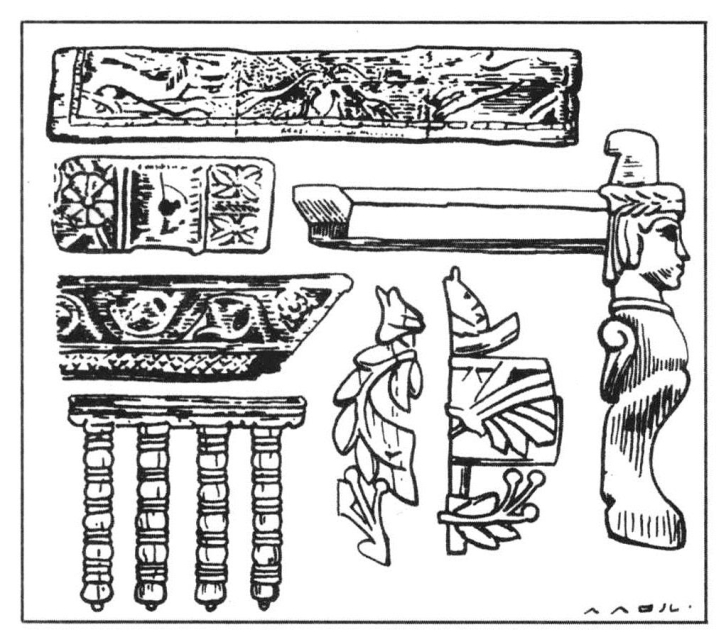
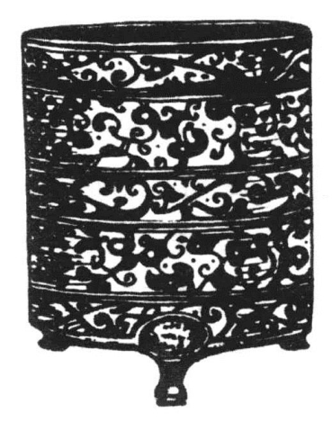
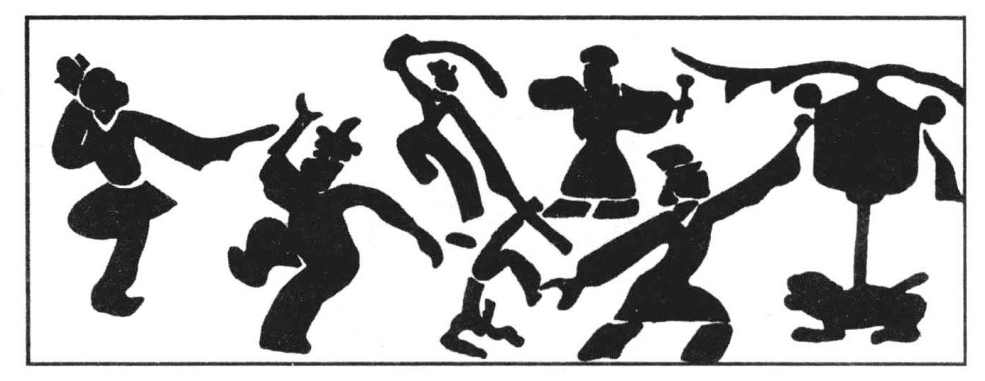

##### 二、中央集权政治的形成与疆域的奠定

西汉的政治，到武帝时，便走进了一个新的阶段，这就是完成了中央集权政治体制的建立。从此以后，直到昭、宣之世，西汉的政权正如丽日经天，照射着中国，乃至中国以外的世界。

西汉的政权之走向中央集权的道路，固然与自吕后、文、景以来半个世纪的主观斗争，不无关系，但主要还是客观形势推移的结果。换言之，即自汉初以来，几十年间社会经济的发展所引导出来的必然的结论。

具体的史实指示出来，在汉初的几十年间，旧的商人地主固然因其历史的蓄积，获得了长足的发展，但新兴的贵族官僚地主也同时挟其政治的权力，从事于强烈的超经济的收夺。《汉书·景帝纪》载景帝之诏曰：“今岁或不登，民食颇寡，其咎安在？或诈伪为吏，吏以货赂为市，渔夺百姓，侵牟万民，县丞，长吏也，奸法与盗盗，甚无谓也。”由此可以想见一般。

即因强烈的超经济收夺，于是这一个新兴的贵族官僚地主集团，上自皇家，下至小吏，无不变成巨富。《汉书·食货志》曰：自汉兴“至武帝之初七十年间，国家亡事。非遇水旱，则民人给家足，都鄙廪庾尽满，而府库余财。京师之钱累百巨万，贯朽而不可校。太仓之粟陈陈相因，充溢露积于外，腐败不可食。众庶街巷有马，阡陌之间成群，乘牸牝者摈而不得会聚。守闾阎者食粱肉，为吏者长子孙，居官者以为姓号。人人自爱而重犯法，先行谊而黜愧辱焉。于是罔疏而民富，役财骄溢，或至并兼豪党之徒以武断于乡曲。宗室有土，公卿大夫以下争于奢侈，室庐车服僭上亡限，物盛而衰，固其变也”。

即因新兴的贵族官僚地主亦变豪党之徒，所以他们亦多舍本逐末，兼营商业，因而由贵族官僚地主一变而为商人地主。同时，直至文景之世，虽仍有市井子弟不得为官吏之禁，但这是指那些坐列贩卖的小商人，至于那些积储倍息、废居都邑的大商人地主，则早已交通王侯，甚至使王侯低首仰给。由此看来，当时的商人地主已经在支配政治了。

即因贵族官僚地主之商人化，与商人地主之贵族官僚化，于是封建的政治收夺与商业盘剥合流，因而这两个地主集团的利害，遂趋一致。以前为了各自集团的利益而引起的政治冲突，到现在已没有必要。这样，诸侯王便失了经济的支持，反之，中央政府对商人的政策，遂由贱商一变而与商人地主合作了。

具体的史实指示出来，武帝即位之元年，即“诏丞相、御史、列侯、中二千石、二千石、诸侯相，举贤良、方正、直言、极谏之士”。[102]这里所谓“士”，当然不是新兴的贵族、官僚，因为这些人，早已做了大官或小官；也不是农民，因为农民根本就不够“士”的资格；毫无可疑，是那些有钱读书的地主知识分子，其中包括了商人地主知识分子。过了六年，又亲自考选地主知识分子。《武帝纪》元光元年诏贤良曰：“贤良明于古今王事之体，受策察问，咸以书对，著之于篇，朕亲览焉。”以后于元朔元年，又下诏曰：“夫本仁祖义，褒德禄贤，劝善刑暴，五帝三王所繇昌也。朕夙兴夜寐，嘉与宇内之士臻于斯路。故旅耆老，复孝敬，选豪杰，讲文学，稽参政事，祁进民心，深诏执事，兴廉举孝，庶几成风，绍修圣绪。夫十室之邑，必有忠信；三人并行，厥有我师。今或至阖郡而不荐一人，是化不下究，而积行之君子雍于上闻也。二千石官长纪纲人伦，将何以佐朕烛幽隐，劝元元，厉蒸庶，崇乡党之训哉！且进贤受上赏，蔽贤蒙显戮，古之道也。其与中二千石、礼官、博士议，不举者罪。”[103]这里所谓耆老、豪杰、孝廉、君子，也当然不是新官僚或穷苦的农民，主要是商人地主。自是以后，“不举孝，不奉诏，当以不敬论。不察廉，不胜任也，当免”。[104]这些文献，就很明显地指出了西汉的中央政府到武帝时，已大开政治之门，欢迎商人地主参加政治。

跟着政府对商人地主的政策之改变，商人地主的知识分子便在继续不断的考选推荐之中，走上了政治舞台。例如在武帝时号称文学之士的董仲舒[105]、公孙弘[106]、司马相如[107]、东方朔[108]、枚皋[109]、严助[110]、朱买臣[111]、吾丘寿王[112]、主父偃[113]、兒宽[114]、终军[115]等，都是由考选推荐或上书而获得其官职，并且成为皇帝左右的亲信。以上所举，不过是人中皎皎，此外名不见史籍者，尚大有人在。《汉书·董仲舒传》云：“武帝即位，举贤良文学之士前后数百……”《东方朔传》亦云：“武帝初即位，征天下举方正贤良文学材力之士，待以不次之位，四方士多上书言得失，自炫鬻者以千数。”由此可以想见那些以前不得为官吏的市井子弟，现在就像潮水一般，涌进了西汉政府的大门。

同时，政府又卖爵位，人民可以以缴纳一定额的货币、谷物、奴婢、畜群，而获得一定等级的爵位。这些有货币、谷物、奴婢、畜群可以缴纳的人们，当然也不是一般的农民，而是有钱的商人。即因如此，所以许多富商大贾，现在都有高爵，不少人一跃而为政府中的要人。《汉书·食货志》曰：“于是以东郭咸阳、孔仅为大农丞，领盐铁事；而桑弘羊贵幸。咸阳，齐之大鬻盐；孔仅，南阳大冶，皆致产累千金，故郑当时进言之。弘羊，洛阳贾人之子，以心计，年十三侍中。故三人言利事析秋毫矣。”此外，如卜式，河南人也，以田畜为业，羊数千头，买田宅，屡以产业助边，因得爵至关内侯。自从这些盐铁大贾，掌握了国家政权以后，他们便执行经济统制政策，以集中经济力量于中央政府，主要就是盐铁的国营，他们于郡国置铁官或小铁官，而“除故盐铁家富者为吏，吏益多贾人矣”。[116]

自从西汉政府开放政权以后，新旧土地所有者因而合流，西汉的政权，也就变成了执行土地所有者之共同利益的政权。在政治形势转换以后，旧的商人地主自然又要拥护中央的统一，反对诸侯王的割据。于是董仲舒便高唱大一统主张，而主父偃则再进“推恩”之议。董仲舒的大一统主张，引经据典，主张尊王。主父偃的削藩之奏，更表现得积极。其言曰：“古者诸侯地不过百里，强弱之形易制。今诸侯或连城数十，地方千里，缓则骄奢，易为淫乱；急则阻其强而合从，以逆京师。今以法割削，则逆节萌起，前日晁错是也。今诸侯子弟或十数，而適嗣代立。余虽骨肉，无尺地之封，则仁孝之道不宜。愿陛下令诸侯得推恩分子弟，以地侯之。彼人人喜得所愿，上以德施，实分其国，必稍自销弱矣。”[117]这个建议，被武帝采纳了，从此以后，诸侯王国一分再分，越分越小。

现在西汉的政治，已经集权中央了。在中央集权的政治之下，政令统一，关梁无阻，商业获得更疾速的发展。不久，随着汉武帝对边疆地区的经营，商人们的活动范围也日益扩大了。

据《汉书·食货志》云：武帝“即位数年，严助、朱买臣等招徕东瓯，事两粤，江淮之间萧然烦费矣。唐蒙、司马相如始开西南夷，凿山通道千余里，以广巴蜀，巴蜀之民罢焉。彭吴穿秽貊、朝鲜，置沧海郡，则燕、齐之间靡然发动。及王恢谋马邑、匈奴绝和亲，侵扰北边，兵连而不解，天下共其劳”。当此之时，羽檄飞驰，急如星火，号角之声，遍于全国，到处都可以看到绑赴郡、国的壮丁，到处都可以看到开上前线的军队。“行者赍，居者送”[118]，所有从土地上被排除出来的农民、奴婢、囚徒、赘婿、亡命、恶少年，都被集合起来，武装起来，逼迫他们去为着汉王朝和商人地主的利益而粉身碎骨于异域。

战争以日益扩大之规模而展开，于是王恢、韩安国、唐蒙、路博德、郭昌、魏广、杨仆、荀彘、李广、卫青、霍去病、李广利等将军，遂先后或同时出现为民族战争中的英雄。西汉的军队就在这些英雄的统率之下，走向东南西北的战场。他们开赴今日之辽东、朝鲜去打朝鲜，开赴今日之浙江、福建去打东瓯、闽粤，开赴今日之广东、广西去打南粤，开赴今日之贵州、云南去打西南夷，开赴今日之陕甘边境、内外蒙古去打匈奴。这些远征军或楼船浮海，或栈道梯山，或轻骑出塞，或重装屯田，前仆后继，接踵而死者，不知几十万人。此外凿山通道，转粮馈饷，人徒车马，万里相望，其转死于道路者，又不知几十万人。

除匈奴以外，其他的战事，都在短期内胜利地结束了。但是击败匈奴，是西汉商人地主最迫切的要求。因为当时的匈奴，正控制着河西走廊一带，而这一带，正是中原通达塔里木盆地及中亚惟一的通道。为了打通到达塔里木盆地及中亚的商路，首先就要把匈奴从河西走廊驱逐出去。因此汉武帝以全力进行对匈奴的战争。战争终于获得了报酬，公元前121年，西汉的军队，完全占领了河西走廊，打通了到塔里木盆地的通路。

西汉的势力很快就支配着塔里木盆地诸国，但匈奴的小组骑兵，仍然出没于天山南北，遮击西汉的外交使节和商人。西汉的势力，一天天地西展，到公元前102年，西汉的将军李广利，竟征服了大宛，把汉朝的势力推进到中亚。

西汉政府在奠定我国的疆域的事业中，在中国历史上创造了一页空前辉煌的纪录。两千年来，中国历史家，都把这种辉煌的伟业，归功于汉武帝个人的成就，所谓“雄才大略”者是也。一直到现在，汉武帝这个名字，成为中国传奇中的英雄之典型。诚然汉武帝的主观的创造作用，是不可否认的。但是如果没有推动这个事业的客观形势和要求，没有广大劳动人民的牺牲，则汉武帝即使有雄才大略，结果也只能停止在愿望的阶段。具体的史实指示出来，西汉对经略边疆地区的发动，胜利地进军，这决不仅依于汉武帝个人才能之发挥，而是当时中国社会经济的活力之历史的要求。换言之，不是汉武帝的勤远略的意图，推动了当时的大远征，而是社会经济的发展要求发动这个大远征，汉武帝的活动不过是体现了当时的社会经济发展的要求。

说到汉武帝，也会令人想到他是生长得怎样一副严肃的面孔。实际上，汉武帝是一位很活泼、很天真、重情感的人物。他除了喜欢穷兵黩武以外，还喜欢游历，喜欢音乐，喜欢文学，喜欢神仙。汉武帝，是军队最英明的统帅，又是海上最经常的游客，皇家乐队最初的创立人，文学家最亲切的朋友，方士们最忠实的信徒，特别是他的李夫人最好的丈夫。他决不是除了好战以外，一无所知的一个莽汉。

随着战争的胜利，中原地区的商人便蹈着士兵的血迹，走进了塔里木盆地和中亚诸国。在当时，我们可以看到络绎于西北国际大道上的，都是西汉的将军、校尉、骑士、田卒，和成群结队的商人。他们从长安出发，带着中国的丝织物和其他的手工业制品，经由金城、武威、张掖、酒泉而至敦煌，然后西出玉门，横断罗布泊沙漠，贸易于塔里木盆地诸国；甚至越过帕米尔高原，周行中亚，与罗马、印度的商人进行交易。同时，那些住在边地的将军们和出使绝国的无数外交使节，一个个也都在从事商业，大发横财。这样一来，于是长安遂不仅是西汉的首都，同时也是国际贸易的中心。这里是全国租税集中之地，也是庞大的商业利润总汇之所。因而长安城中，除了原有的贵族、官僚地主以外，又挤满了中外的商人。

现在，在长安城的天空中，耸立着无数高入云霄的建筑物，这些建筑物或名曰台[119]，或名曰阙[120]，或名曰观[121]，都非常雄伟壮丽。据说当时有一通天台，或曰神明台，高百余丈，云雨在其下。在台顶上，有一铜铸的仙人，手捧铜盘玉杯，作承露之状。[122]又有两凤凰阙，各高七十丈五尺，上各立一铜凤凰。[123]又有一飞廉观，高四十丈，上立一飞廉神，鹿头如雀，蛇尾而豹文。[124]这些崇高的建筑物，就象征着大汉帝国的庄严和伟大。

在长安城的市内及其近郊，到处都是金碧辉煌的宫殿。据说当时京兆所辖的境内，共有宫殿一百四十五所。班固《西京赋》中有云：“前乘秦岭，后越九峻，东薄河、华，西涉岐、雍，宫馆所历，百有余区。”这样看来，秦代的离宫三百，到武帝时，又重新装修起来了。在这些宫殿中，最为宏大的，是长乐、未央、建章、甘泉四宫。长乐、未央，皆在长安城内，建章在西郊，而甘泉则在长安西二百里之外。这几座宫殿，都非常壮丽而奢侈，诚如萧何所云：“且夫天子以四海为家，非令壮丽亡以重威，且亡令后世有以加也。”[125]

长乐宫是汉初所建，比较朴素，但规模亦极宏大。《三辅旧事》及《宫殿疏》两书都说：这座宫殿，“周回二十里。前殿东西四十九丈七尺，两杼中三十五丈，深十二丈。长乐宫有鸿台，有临华殿，有温室殿，信宫、长秋、永寿、永宁四殿”。

未央宫的规模就更大了。据《三辅黄图·未央宫》云：“未央宫周回二十八里，前殿东西五十丈，深十五丈，高三十五丈。”又云“至孝武，以木兰为棼橑，文杏为梁柱，金铺玉户，华榱璧珰，雕楹玉碣，重轩镂槛，青琐丹墀，左城右平，黄金为璧带，间以和氏珍玉，风至，其声玲珑然也。”（插图三四）在这个宫殿里，有楼台殿阁无数，都极尽华丽之能事[126]。其中最富丽者为掖庭宫，这是汉武的妃嫔所居之地，所谓禁闼者是也。据《三辅黄图》云：“武帝时，后宫八区，有昭阳、飞翔、增成、合欢、兰林、披香、凤皇、鸳鸯等殿。后又增修安处、常宁、苣若、椒风、发越、惠草等殿，为十四位。”这里可以说是“美人窝”，也可以说是“怨女馆”。此外，在这个宫殿里还有织室（纺织厂），有凌室（储冰厂），有暴室（染洗坊），有弄田（籍田），不胜枚举。

建章宫。《水经·河水注》云：“建章宫汉武帝造，周二十余里，千门万户。其东，凤阙，高七丈五尺……中作神明台、井幹楼，咸高五十余丈。……北有太液池，池中有渐台三十丈……南有璧门三层，高三十余丈。中殿十二间，阶陛以玉为之，铸铜凤五丈，饰以黄金。楼屋上椽首，薄以玉璧，因曰璧玉门也。”在这座宫殿里，也有无数的别殿。[127]其中有一桂宫，最为华丽。《三辅黄图》引《三秦记》云：“未央宫渐台西有桂宫，中有明光殿，皆金玉珠玑为帘箔，处处明月珠，金陛玉阶，昼夜光明。”又引《西京杂记》云：“武帝为七宝床、杂宝桉、厕宝屏风、列宝帐，设于桂宫，时人谓为四宝宫。”

> 插图三四 汉代装饰房屋之木雕

甘泉宫周围十九里，本秦代旧宫，武帝时再建，这算是一座最大的离宫。其中有紫殿，雕文刻镂，饰以玉璧。这里树木最多，风景极佳。扬雄《甘泉宫赋》中，曾赞赏这里的“玉树青葱”之美。所以这里别殿多以树木为名，如林光宫、棠梨宫等。

在长安西南几百里之内，布满了皇家的苑囿，及贵族、官僚、商人地主的花园和别墅。当时皇家的苑囿是很多的。每苑皆设有苑监，喂养鸟兽马匹的官奴婢也很多。其中最大者，有上林苑、甘泉苑、西郊苑、思贤苑、博望苑、宜春下苑及梨园等。关于上林苑，《三辅黄图·苑囿》引《汉书》云：“武帝建元三年，开上林苑，东南至蓝田宜春、鼎湖、御宿、昆吾，旁南山而西，至长杨、五柞，北绕黄山，濒渭水而东，周袤三百里，离宫七十所。皆容千乘万骑。”《汉旧仪》云：“上林苑方三百里，苑中养百兽，天子秋冬射猎取之。帝初修上林苑，群臣远方，各献名果异卉三千余种植其中。”

甘泉苑，据《三辅黄图·苑囿》云：“武帝置，缘山谷行，至云阳三百八十一里，西入扶风，凡周回五百四十里。苑中起宫殿台阁百余所。”同书又云：“西郊苑，汉西郊有苑囿，林麓薮泽连亘，缭以周垣四百余里。离宫别馆三百余所。”此外思贤苑、博望苑，皆系大苑，而梨园则专种梨树，乃系皇家的果园。

现在我们再看商人地主的花园。《三辅黄图·苑囿》云：“茂陵富民袁广汉，藏镪巨万，家僮八九百人，于北山下筑园，东西四里，南北五里，激流水注其中，构石为山，高十余丈，连延数里，养白鹦鹉、紫鸳鸯、牦牛、青兕，奇兽珍禽，委积其间。积沙为洲屿，激水为波涛，致江鸥海鹤，孕雏产，延漫林池。奇树异草，靡不培植。屋皆徘徊连属，重阁修廊，行之移晷，不能遍也。”这不过是一个例子而已，当时茂陵及其他诸陵的富人共有几十万家，像这样规模的花园，当然不知有若干。

现在，我们再看长安的市区。长安城的规模，本来就很宏大，据说周围有六十五里。有十二个城门。其中有纵横交错的街道，有十二条大街，无数的小巷。大街平正宽敞，两车可以并行，大街旁植有两行荫树。小巷曰里，为市民的住宅。[128]市场与住宅区是分开的，长安城内一共有九个市场，在这里有无数的店铺，陈列着各种商品。市场中有市楼，又曰旗亭，这就是征收商税的官署。武帝以前，长安并不很热闲。到武帝时，便大大地繁荣起来了。班固《西都赋》追述当时的盛况曰：“建金城而万雉，呀周池而成渊，披三条之广路，立十二之通门。内则街衢洞达，闾阎且千，九市开场，货别隧分，人不得顾，车不得旋，阗城溢郭，旁流百廛，红尘四合，烟云相连。”

以上所述，可以说是西汉武帝时及其以后的长安之缩写。这些雄伟的宫殿、台阙、苑囿，正是当时全国租税和庞大的商业利润之具体的体现。在超经济强制力量的高涨中，在社会经济的大发展中，西汉的商人地主们在胜利中昏迷了。

不消说，当时的汉武帝，他掌有四海的图籍，膺受万国的贡献，因而不但京师之钱，累百巨万；太仓之粟，陈陈相因；而且天马、葡萄，来自西域；明珠、象齿，贡自南越。于是离宫、别馆，遍于山谷；妃嫔美女，充乎宫廷；珍禽怪兽，布满苑囿；黻黼文锦，施之狗马。于是沙漠陈兵，犁庭扫穴；泰山封禅，望海求仙；长杨射猎，飞鹰走犬；甘泉祷祠，祀灶候神。出则千乘万骑，车马错列；入则男宠女色，歌舞纵横。

当时的贵族，如田蚡“治宅甲诸第，田园极膏腴；市买郡县器物，相属于道。堂前罗钟鼓，立曲旃，后房妇女以百数。诸奏珍物狗马玩好，不可胜数”。[129]

当时的官僚，如灌夫：“喜任侠，已然诺。诸所与交通，无非豪杰大猾。家累数千万，食客日数十百人。波池田园，宗族宾客为权利，横颍川。颍川儿歌之曰：‘颍水清，灌氏宁；颍水浊，灌氏族。’”[130]

当时的商人地主“卖僮者，为之绣衣丝履偏诸缘，内之闲中。是古天子后服，所以庙而不宴者也，而庶人得以衣婢妾。白縠之表，薄纨之里，緁以偏诸，美者黼绣，是古天子之服，今富人大贾嘉会召客者以被墙。古者以奉一帝一后而节适，今庶人屋壁得为帝服，倡优下贱得为后饰，然而天下不屈者，殆未有也。”[131]

现在，我们再看这个时代的反面，农民的生活。《汉书·食货志》（上）记晁错之言曰：“今农夫五口之家，其服役者不下二人，其能耕者不过百亩，百亩之收不过百石。春耕夏耘，秋获冬藏，伐薪樵，治官府，给繇役；春不得避风尘，夏不得避暑热，秋不得避阴雨，冬不得避寒冻，四时之间，亡日休息，又私自送往迎来，吊死问疾，养孤长幼在其中。勤苦如此，尚复被水旱之灾，急政暴（虐）〔赋〕，赋敛不时，朝令而暮改，当具有者半贾而卖，亡者取倍称之息，于是有卖田宅鬻子孙以偿责者矣。”于是有“家贫子壮则出赘”[132]者矣，于是有身被文绣“与牛马同兰”[133]而被卖者矣，于是有“罢夫羸老易子而咬其骨”[134]者矣，于是有因“穷则起为盗贼”[135]而身为囚徒者矣。

一方面是骄奢淫逸，一方面是饥饿死亡，这就是西汉全盛时代的社会内容。

汉武帝死后，其于昭帝继承大统。昭帝即位之年，只有八岁，这样一个幼主，而又生长在深宫之中，当然负不起统治帝国的任务。于是霍光与金日碑受遗诏辅政。霍光为霍去病之异母弟，以裙带关系，为大司马大将军。金日碑是匈奴的降人之子，曾没入官输黄门养马，后得贵幸为侍中驸马都尉。因此霍、金二人虽同时受遗诏辅政，而大权则掌握于霍光。当昭帝时，霍光实际上就是皇帝。

昭帝死，宣帝立。宣帝即位之初，即发动了进一步打击匈奴的战争，他于本始二年派遣五路大军，与乌孙联合，夹击匈奴于天山之北。从此以后，匈奴益衰。当时的匈奴，丁零迫其北，乌桓迫其东，乌孙迫其西，汉军迫其南，已处于四面楚歌之中。因为地盘缩小，生活穷蹙，分裂为五部，自相争乱。以后又分为南北两部，南匈奴降于汉，北匈奴则西走。即因匈奴或降或走，于是帕米尔东西，天山南北，遂完全纳于汉的统治之下。为了统治西域，西汉政府在塔里木盆地之乌垒城（今新疆轮台县），设立了西域都护府。郑吉、甘延寿、陈汤、常惠、冯奉世，都曾在西域任都护或其他官职。

在宣帝时，西羌的诸部落渐北徙，屡次截断通达西域的商路。于是又大发兵征西羌。在赵充国剿抚兼施的政策之下，西羌终于降服了，于是置金城属国，以处降羌。因此，终宣帝之世，西北的国际商路，仍然畅通无阻，汉朝在西域的声威，仍然很高。

宣帝死，元帝立。“元帝即位，天下大水，关东郡十一尤甚。二年，齐地饥，谷石三百余，民多饿死，琅邪郡人相食。”[136]这样严重的天灾，当然要影响西汉政府之统治。同时，当时北匈奴郅支单于盘踞康居，屡侵乌孙，企图卷土东来；而陇西诸羌，也屡犯河西诸郡。当此之时，汉朝的西域副校尉陈汤，征发西域诸国之兵、车师戊己校尉屯田吏士军共四万余人，与西域都护甘延寿远征康居，斩郅支单于，传其首于京师。同时，冯奉世也击平了西羌，又加强了对西域的统治。

自昭宣以至元帝之世这半个世纪的时期中，是西汉的社会经济继续发展的时代。经过这半个世纪的蓄积，西汉的商人地主就更加富厚了。现在我们再看这一时代商人地主集团的生活。

这一时代的皇帝，据说昭帝“于宫馆囿池弋猎之乐未有所幸”[137]，这大概是因为他死得太早，当他死的时候，还不过二十二岁。至于宣帝，则“颇修武帝故事，宫室车服盛于昭帝。”[138]到元帝时，则皇家之奢侈便达到惊人的程度。《汉书·贡禹传》曰：“方今齐三服官作工各数千人，一岁费数巨万。蜀、广汉主金银器，岁各用五百万。三工官，官费五千万，东西织室亦然。厩马食粟将万匹。臣禹尝从之东宫，见赐杯案，尽文画金银饰，非当所以赐食臣下也。东宫之费亦不可胜计，天下之民所为大饥饿死者是也。”（插图三五）

> 插图三五 汉代之错金奁

不但如此，他们死了之后，又以大量的财宝埋藏坟墓之中，并且用无数的青年女子去陪伴一个骷髅。同上传曰：“武帝时，又多取好女至数千人，以填后宫。及弃天下，昭帝幼弱，霍光专事，不知礼正，妄多臧金钱、财物、鸟兽、鱼鳖、牛马、虎豹、生禽，凡百九十物、尽瘗臧之，又皆以后宫女置于园陵……昭帝晏驾，光复行之。至孝宣皇帝时……亦随故事，甚可痛也！”

不仅如此，葬后又大修宗庙，岁时祭祀。据《汉书·韦贤传》云：汉至宣帝本始二年，各郡国宗庙之数，合百六十七所；京师陵旁之庙又为百七十六，而陵园寝殿尚不在内。当时这些宗庙寝殿，几乎每天都在为皇帝的祖宗举行祭祀。据同上传云：“日祭于寝，月祭于庙，时祭于便殿。寝，日四上食；庙，岁二十五祠；便殿，岁四祠。又月一游衣冠。”于是大量的牛羊豕，用作死人的牺牲。据同上传云：“一岁祠，上食二万四千四百五十五，用卫士四万五千一百二十九人，祝、宰、乐人万二千一百四十七人，养牺牲卒不在数中。”每当“衣冠出游，有车骑之众，风雨之气”。然而死贵族不能复生，而活穷人却因此饿死。

当时的贵族官僚竞为奢侈，转转益甚。据《汉书·贡禹传》云：“诸侯妻妾或至数百人。”而一般官僚，“衣服履绔刀剑，乱于主上。主上时临朝入庙，众人不能别异”。所以贡禹慨然叹曰：“令大夫僭诸侯，诸侯僭天子，天子过天道，其日久矣。”当时的官僚何以如此阔绰呢？因为当时的官僚大概很少不做买卖。所以贡禹上书“又欲令近臣自诸曹、侍中以上，家亡得私贩卖，与民争利。犯者辄免官削爵，不得仕宦”。但是当时的官僚，却宁肯免官削爵，还是要私贩卖，与民争利。他们“贪财（趋）〔诛〕利，不畏死亡”[139]，何况“不得仕宦”[140]。

当时的一般商人地主，已经发饱了洋财，但仍然货殖不已。据贡禹云：“富人积钱满室，犹亡厌足，民心〔动摇〕。商贾求利，东西南北，各用智巧。好衣美食，岁有十二之利，而不出租税。”

不但不出租税，而且当时地主大半身兼官吏，参加租税的分配。所以贡禹曰：“郡国恐伏其诛，则择便巧史书习于计簿能欺上府者，以为右职；奸宄不胜则取勇猛能操切百姓者，以苛暴威服下者，使居大位。故亡义而有财者显于世，欺漫而善书者尊于朝，悖逆而勇猛者贵于官。故俗皆曰‘何以孝弟为？财多而光荣；何以礼义为？史书而仕宦。何以谨慎为，勇猛而临官’。故黥劓而髡钳者犹复攘臂为政于世；行虽犬彘，家富势足，目指气使，是为贤耳。故谓居官而置富者为雄桀，处奸而得利者为壮士，兄劝其弟，父勉其子，俗之坏败，乃至于是！”

> 插图三六 鸣鼓巴渝画像

商人地主为官吏者，复参加政治的收夺，所以他们的生活，便能僭于王侯。《盐铁论·刺权篇》述当时的情况曰：“自利官之设，三业之起，贵人之家云行于涂，毂击于道……威重于六卿，富累于陶、卫：舆服僭于王公，宫室溢于制度；并兼列宅，隔绝闾巷；阁道错连足以游观，凿池曲道足以骋骛；临渊钓鱼，放犬走兔；隆豺鼎力，踢鞠斗鸡；中山素女，抚流征于堂上，鸣鼓巴俞，作于堂下。妇女被罗纨，婢妾曳絺纻；子孙连车列骑，田猎出入，毕弋捷健。”（插图三六）

现在，我们再看当时的农民，他们过的什么日子。《汉书·贡禹传》曰：“农夫父子暴露中野，不避寒暑，捽草杷土，手足胼胝，已奉谷租，又出稿税，乡部私求，不可胜供。”在这样强烈的榨取之下，而又益之以天灾，于是农民多半饿死。贡禹一方面看到皇家的穷奢极欲，另一方面又看到农民饥饿死亡，于是慨然而叹曰：“今民大饥而死，死又不葬，为犬猪（所）食，人至相食。而厩马食粟，苦其大肥，气盛怒至，乃日步作之。王者受命于天，为民父母，固当若此乎！”

当时农民的生活之恶化，绝不是偶然的，而是自武帝以来历昭、宣以迄于元帝之世，一个世纪以上的社会经济发展的结果。因为在这一百年中，商人地主积累了大量的社会财富。这些财富，一部分浪费于奢侈的生活之中，一部分是投资于手工业或商业，一部分则通过高利贷的过程，用于土地的收夺。广大农民被剥夺了土地，不得不进入都市，或流亡异乡。

自然，农民之失掉土地，政治的收夺，也是一个重要的原因。自武帝以来，一个世纪以上，边境地区的战争未尝休息。为了支持战争，出钱出力的，都是农民。在文帝时，就有农民卖儿鬻女的。在武帝以后的年代中，这样的情形当然更加发展，所以官、私奴婢之数日益增加。一个农民到了出卖自己的身体的时候，当然是除身体以外，已一无所有了。但是政治的收夺，主要是为了支持战争的需要；而战争之进行，对于西汉来说，又和当时的社会经济的发展分不开的。

即因一个世纪以来的政治收夺与经济榨取双管齐下，于是农民只有被迫而交出他们小块的土地，一部分赤条条地走进商人地主的手工业工场。当时的手工业虽然发达，但亦不能把农村中逃亡出来的人口，尽数容纳，因而大部分逃亡的农民成为流浪之群。这些流浪者，在城市中者，有些以窃盗和劫人为生。据《汉书·赵广汉传》云：广汉为京兆尹时，“长安少年数人会穷里空舍，谋共劫人”。又云：“富人苏回为郎，二人劫之。”又据《汉书·张敞传》，张敞不仅善于画眉，而且也善于捕盗。当其做京兆尹时，“京师废，长安市偷盗尤多，百贾苦之。……敞既视事，求问长安父老，偷盗酋长数人，居皆温厚，出从童骑，闾里以为长者。敞皆召见责问，因贳其罪，把其宿负，令致诸偷以自赎。偷长曰：‘今一旦召诣府，恐诸偷惊骇，愿一切受署。’敞皆以为吏，遣归休。置酒，小偷悉来贺，且饮醉，偷长以赭污其衣裾，吏坐里闾阅出者，污赭辄收缚之，一日捕得数百人。穷治所犯，或一人百余发，尽行法罚”。以上不过两个例子而已。《汉书》中此类记载触目皆是。长安如此，其他都市当亦无不如此。至于当时由农村中逃亡出来的女子，一部分则卖于贵族官僚地主为婢妾，另一部分则沦为娼妓。长安有大批娼妓的存在，其他各都市亦无不有娼妓。

由此看来，当时的社会竟是这样一幅色彩不调和的画面，但是封建的政权是建筑在农村经济之上，而农村的经济的繁荣，又是以耕者有其田为前提。今农民从土地上被排除出来，当然要使得农村经济衰落，因而影响官府租税的收入，从而影响到封建国家的财政和国力。所以到元帝末年，在对匈奴的关系方面，采取了“王嫱出塞”的政策，这也是必然的。
