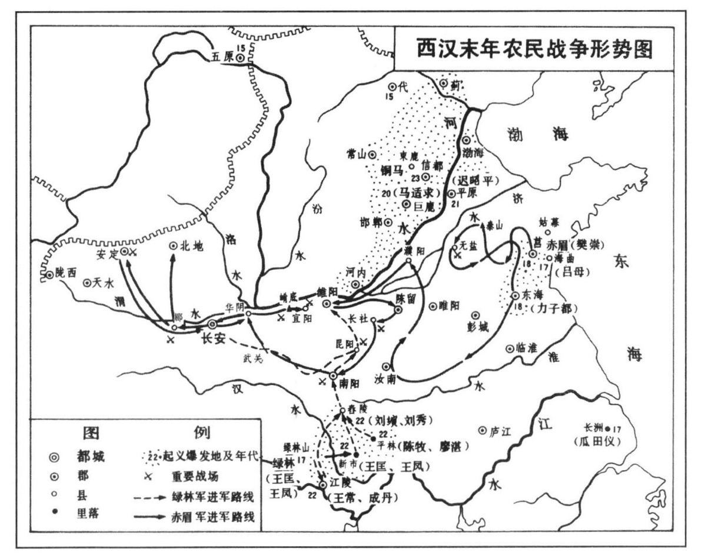

##### 二、绿林、赤眉大暴动与西汉的灭亡

紧接着王莽之改良主义的失败，中国的历史，又走进了一个暴风雨的时代。一方面是边疆各种族先后叛变，另一方面是各处的农民群起暴动。于是西汉王朝就在这场大动乱之中最终覆灭了。

如前所述，在成帝时，两汉政府已经撤销了“典属国”的衙门，这就说明了当时的政府，已经没有属国可典了。在王莽的改良失败后，社会内部不协调的现象日益高涨。王莽为了提高其威望，并从而转移人民的视线，因而大派使节，分赴东南西北，宣示新朝的威德。当时东出者至玄菟、乐浪、高句丽（今辽宁新宾县东）、扶余；南出者历益州（治今云南晋宁东北），至句町（治今云南广南）；西出者至西域；北出者至匈奴庭。这些使节分赴四表，当然是想招来一个“四夷来庭”的盛事；但是结果恰恰相反，四周诸种族却因此而知道汉朝正在大政变之中，反而先后反叛。

首先叛变的是匈奴。在王莽始建国二年（公元10年），匈奴占领天山东麓之车师。当时西汉驻屯西域之戊己校尉史陈良、终带等，杀了戊己校尉刁护，投降匈奴。自是西域诸国遂又处于匈奴的威胁之下。匈奴既西入车师，又乘汉朝之敝，南侵今晋陕，掠杀吏民。

跟着匈奴之后，东北诸种族如高句丽、秽貊等[174]，西南夷如句町、益州徼外诸蛮也叛变了[175]。西域诸国，焉耆首叛，杀都护但钦。[176]天凤三年（公元16年），又击杀莽将王骏、戊己校尉郭钦，侵入塞内。从此西域遂绝。

为了维持新朝的威信，王莽大发兵征四夷。他派了孙建等十二员大将，十道并出，征伐匈奴。[177]派严尤击高句丽、秽貉，派冯茂击句町及其他蛮夷，派王骏击西域，于是东南西北都发动了战争。

东征之军，算是以诱杀高句丽侯驺而结束。西征之军，以王骏死于焉耆之袭击而消灭。但北征匈奴南征西南夷之军，则变成了长期战争。

为了支持征伐匈奴和西南夷的战争，王莽先后多次令郡国大捉壮丁，以实边塞；苛征暴敛，以给军食。《王莽传》（中）曰：“募天下囚徒、丁男、甲卒三十万人，转众郡委输，五大夫衣裘、兵器、粮食，长吏送自负海江淮至北边，使者驰传督趣，以军兴法从事，天下骚动。”同传（下）曰：“莽乃大募天下丁男及死罪囚、吏民奴，名曰猪突豨勇，以为锐卒。一切税天下吏民，訾三十取一，缣帛皆输长安。令公卿以下至郡县黄绶皆保养军马，多少各以秩为差。”

当时征匈奴的将军吏士，“先至者屯边郡”，不敢与匈奴战；只是“货赂为市，侵渔百姓”。他们“各为权势，恐猲良民，妄封人颈，得钱者去。毒蠚并作，农民离散。”[178]征西南之军，“自越嶲、遂久、仇牛、同亭、邪豆之属反畔以来，积且十年，郡县距击不已……费以亿计，吏士离毒气死者什七”。[179]王莽没有办法，于是异想天开，大募天下有奇技异能足以攻匈奴者，将待以不次之位，因而言便宜者以万数。有谓能渡水不用舟楫；有谓能制药物，使三军服之不饥；有谓能一日飞行千里。但这不过是对王莽讨伐四夷的讽刺而已。

民族战争，并无结束之望。王莽每年运往西河（治今内蒙古东胜县境）、五原（治今包头市西北）、朔方（治今乌拉特前旗东南）、渔阳（治今北京市怀柔县东南）一带的钱谷，每郡以百万数。又令郡国买马，发帛四十五万匹输长安，前后相续于道路。而贪官污吏，又假借战争之名，压榨百姓。当此之时，“中郎将、绣衣执法在郡国者，并乘权势，传相举奏。又十一公士分布劝农桑，班时令，案诸章，冠盖相望，交错道路，召会吏民，逮捕证左，郡县赋敛，递相赇赂，白黑纷然”。又利用新政，鱼肉人民，因盗铸钱币而犯法者，“伍人相坐，没入为官奴婢。其男子槛车，儿女子步，以铁锁琅当其颈，传诣钟官，以十万数。到者易其夫妇，愁苦死者什六七。”[180]长安城已经变成了杀人犯的窠巢，“春夏斩人都市，百姓震惧，道路以目。”其贪污、搜刮、黑暗如此。

与战争同时，又大兴徭役。当时王莽在长安城南，划出了一万亩面积的地方，大修王家的九庙。因此“乃博征天下工匠、诸图画，以望法度算，乃吏民以义入钱谷助作者，骆驿道路。坏彻城西苑中建章、承光、包阳、大台、储元宫及平乐、当路、阳禄馆，凡十余所，取其材瓦，以起九庙。……殿皆重屋……为铜薄栌，饰以金银雕文，穷极百工之巧。带高增下，功费数百巨万”。当建筑之时，王莽亲自监工，几十个“将作”，日夜督工，“卒徒死者万数”。[181]

王莽以古有“黄帝”，曾以百二十女致神仙，因遣中散大夫及谒者各四十五人，分行天下，博采乡里所高有淑女者上名，挑选一百二十名。于是一面和这些青年淑女，求所以为神仙之道；一面和公卿大夫制礼作乐，讲合六经，求所以为圣人之道；又发号施令，南征北伐，与诸将求所以为英雄之道；同时，贪财专制，刚愎自用，并没有忘记求所以为暴君之道。据《汉书·王莽传》（中）云：“莽自见前颛权以得汉政，故务自揽众事，有司受成苟免。诸宝物名、帑藏、钱谷官，皆宦者领之；吏民上封事书，宦官左右开发，尚书不得知。其备臣下如此。又好变改制度，政令烦多，当奉行者，辄质问乃以从事，前后相乘，愦眊不渫。莽常御灯火至明，犹不能胜。尚书因是为奸寝事，上书待报者连年不得去，拘系郡县者逢赦而后出，卫卒不交代三岁矣。”“县宰缺者，数年守兼。”[182]又悭吝自私，储黄金六十余柜，每柜一万斤，而不发官吏的薪俸。诸如此类，不胜枚举。一个皇帝到亡国的时候，往往倒行逆施，不独王莽如此。

西汉的农民，在哀、平之际，已经只有七亡而无一得，七死而无一生。好容易等到了一个王莽改制，他们以为或者由此而得救；但是想不到王莽的改制，是从维护王莽的统治出发的，又因为商人地主的反对而中途取消。王莽的政权从此由温和的改良政策走向反动的暴力政策。农民的希望适得其反了。

王莽政权的这一转向，较之哀、平之际，必然更加暴虐。因为王莽曾一度给农民以新的希望，现在既不能兑现，他知道农民必然由希望而失望，由失望而怨恨，而“叛乱”。为了镇压这些失望的农民，就必须用更大的残酷，这就是王莽走向暴力主义的原因。

当王莽推行暴力政策的时候，又恰巧平行着严重的天灾。当此之时，天下郡国或则洪水漫野，或则蝗虫满天，或则淫雨连月，或则大旱经年，或则雪深盈丈，或则雹大如拳。这里是中郎将赋车籍马，那里是绣衣使驰驿乘传；这里是郡守县令拘押催租，那里是将军吏士绑票要钱；这里是大夫谒者选妃进贡，那里是三老亭长捉人实边。一队一队的壮丁开赴前线，一车一车的囚犯解到长安，一柜一柜的黄金运进宫廷，一群一群的百姓饿死田间。这正是王莽推行暴力政策时候的景象。在这样的情形之下，农民的大“叛乱”爆发了。

“叛乱”最初从西北边境五原、代郡（治今河北蔚县西南）一带爆发。据《王莽传》（中）云：“天凤二年（公元15年）……谷常贵，边兵二十余万人仰衣食，县官愁苦。五原、代郡尤被其毒，起为盗贼，数千人为辈，转入旁郡。”接着在长江下游，也爆发了“叛乱”。《王葬传》（下）云：“天凤四年……临淮瓜田仪等为盗贼，依阻会稽长州”，发动“叛乱”。同年，在今山东也爆发了“叛乱”。琅邪女子吕母起于海曲（今山东日照西）。吕母本是海曲一个商人地主家中的妇女，因为县宰以小罪杀了她的儿子，所以倾其家产，招聚饥饿的农民，以图报复。后来亲率农民攻陷海曲城，杀了海曲宰，以宰之头祭其子墓，然后自称将军，入海为盗。[183]

与今江苏、山东的“叛乱”同时，在今鄂西一带也爆发了“叛乱”。因为当时的鄂西，连年大旱，农民相率在野泽中采草根为食，而政府尚加以榨取[184]，于是成群的饥民，相与啸聚，推戴新市（今湖北京山东北）人王匡、王凤为首领，在今日当阳境内的绿林山，揭起反叛的旗帜。一时诸亡命如马武、王常、成丹之徒，都投到绿林山中，出现为“叛乱”的首领。不到几月，绿林山中集合了七八千以上的农民。这就是历史上所谓“绿林兵”。

绿林山的“叛逆”，一天天成为荆州的威胁，于是荆州牧派了两万大军去围剿这群饥饿的农民。大军行进到云杜（今京山县北），便遇到绿林兵的迎击，剿灭者被剿灭了。绿林兵从官军得了大量的军械和粮食，因而得以展开了一个更大的出击。他们攻拔竟陵（今潜江西北），转击云杜、安陆，打开富人的谷仓，救活了不少的饥民。当他们回到绿林山的时候，有五万以上的农民加入了他们的队伍。

地皇三年，大疾疫降临鄂西，绿林山的叛民，死了一半。为了求生，他们相率离开了荒野的森林，分作两队，转向他地。一队由王常、成丹领导，西入南郡（治今江陵），是为下江兵。当时秦丰已聚众万人起于南郡，再加上下江兵，南郡一带的封建秩序遂被捣毁无余了。其另一队，由王匡、王凤、马武、朱鲔、张卬等领导，北入南阳，是为新市兵。当新市兵东攻随县的时候，平林（今随县东北）人陈牧、廖湛也聚合了数千农民，号平林兵，响应新市兵的进攻。由于新市兵与平林兵的结合，鄂北豫南一带遂完全变成“叛乱”世界了。

在鄂西的“叛乱”发生之次年（天凤五年），今山东、苏北也爆发了更大的“叛乱”。当时青、徐大饥，寇贼蜂起。今山东莒县的饥民共推琅邪人樊崇为首领，尊之曰“三老”。他们后以泰山为根据地，不到一年，聚合于樊崇旗下者万余人。同时，东海（山东郯城西北）人徐宣、谢禄、杨音也出现为农民“叛乱”的领导人物，他们各人都聚合了万余人，加入樊崇的集团。于是樊崇遂成了山东农民“叛乱”的总领袖，而泰山也就成为当时农民“叛乱”的中心。“叛乱”的群众一天天加多。为了获得生活资料，他们进攻莒县，转掠姑幕（今诸城西北）。当时王莽派田况进剿，樊崇大败田况之军。遂乘胜北入青州，还至泰山，并以支队占据南城（今费县西南）（插图三七）。

继樊崇之后，今山东河北饥饿的农民四方蜂起，各推首领，侵略郡县。据《后汉书·光武帝纪》（上）云：“别号诸贼：铜马、大肜、高湖、重连、铁胫、大抢、尤来、上江、青犊、五校、檀乡、五幡、五楼、富平、获索等，各领部曲，众合数百万人，所在寇掠。”又据《东观汉记》所载，当时“诸贼或以山川土地为名，或以军容强盛为号。铜马贼帅东山荒秃、上淮况等。大肜渠帅樊重，尤来渠帅樊崇，五校贼帅高扈，檀乡贼帅董次仲，五楼贼帅张文，富平贼帅徐少，获索贼帅古师郎等”。[185]其余“贼”，亦各有其渠帅。以上所述诸“叛乱”的首领乃见之于史册者，当然是较大的“叛乱”集团。其余包括在“山东群盗”之中而不名者尚不知有多少。由此可以想见当时“叛乱”者的声势之浩大与集团之繁多。

当时用以为组织“叛乱”的工具，有宗教迷信。在哀帝末年，中原一带的饥民就相互传西王母筹以相结聚。到王莽末年，虽史无农民传西王母筹之记载，但此种信仰一定还存在于农民心中。《汉书·王莽传》（下）谓地皇二年“平原女子迟昭平能说经博以八投，亦聚数千人在河阻中”。这里所谓“经”，史无明释，不知是何经，但决非当时地主子弟用以进取功名的“五经”，则可断言。服虔曰：“博弈经，以八箭投之。”[186]这显然是借说经以啸聚群众，集中武器。由此而知此所谓经，大概就是一种宗教仪式中的咒语。当时山东的农民，大概有不少都是在这一类宗教咒术的呼唤之中，投箭而起。

> 插图三七

当时的“叛乱”集团，目的极其单纯，组织亦非常简单。《后汉书·刘盆子列传》云：“初，崇等以困穷为寇，无攻城徇地之计。众既浸盛，乃相与为约：杀人者死，伤人者偿创。以言辞为约束，无文书、旌旗、部曲、号令，其中最尊者号三老，次从事，次卒吏（史），泛相称曰臣（巨）人。”不仅樊崇的集团如此，其他“叛乱”集团，无不如此。《汉书·王莽传》（下）云：“初，四方皆以饥寒穷愁起为盗贼，稍稍群聚，常思岁熟得归乡里。众虽万数，亶称巨人、从事、三老、祭酒，不敢略有城邑。转掠求食，日阕而已。诸长吏牧守皆自乱斗中兵而死，贼非敢欲杀之也。”由此看来，当时“叛乱”的集团初起之时，既无攻城循地之计，又不敢公然杀戮牧守长吏，更未尝树立旗帜，发布政治号召，他们只是转掠求食，日暮而已。这就说明了他们完全是迫于饥寒，起为“盗贼”，并没有丝毫政治野心。同时从他们不准杀人伤人之相互约束看来，又知这些所谓“盗贼”，并不是穷凶极恶的匪徒，而是一群群驯良的百姓。他们与普通百姓不同的，只是因为他们没有饭吃。

关于上述的情形，曾有许多从“盗匪区域”逃出来的官吏报告王莽。但是王葬却大加申斥。他说：“夫吏者，理也。宣德明恩，以牧养民，仁之道也。抑强督奸，捕诛盗贼，义之节也。今则不然，盗发不辄得，至成群党，遮略乘传宰士。士得脱者，又妄自言‘我责数贼：何故为是？贼曰：以贫穷故耳，贼护出我’。今俗人议者率多若此。惟贫困饥寒，犯法为非，大者群盗，小者偷穴，不过二科。今乃结谋连党以千百数，是逆乱之大者，岂饥寒之谓邪？”[187]照王莽看来，当时的群盗，并不是为了饥寒，而是“天生的盗贼”。所以他下令要各地的守令，务予殄灭，以后“有不同心并力，疾恶黜贼，而妄曰饥寒所为，辄捕系，请其罪”。自是以后，臣下“莫敢言贼情者，亦不得擅发兵，贼由是遂不制”。[188]

为了要殄灭这些“天生的盗贼”，王莽便准备展开大规模的军事围剿。当时曾经亲身领略过“盗贼”教训的田况看见王莽想玩火，实在太危险，于是大胆地向王莽建议，劝他不要发动大规模的军事围剿。田况说：“盗贼始发，其原甚微，非部吏、伍人所能禽也。咎在长吏不为意，县欺其郡，郡欺朝廷，实百言十，实千言百。朝廷忽略，不辄督责，遂至延曼连州，乃遣将率，多发使者，传相监趣。郡县力事上官，应塞诘对，供酒食，具资用，以救断斩，不给复忧盗贼治官事。将率又不能躬率吏士，战则为贼所破，吏气寖伤，徒费百姓。前幸蒙赦令，贼欲解散，或反遮击，恐入山谷转相告语，故郡县降贼，皆更惊骇，恐见诈灭。因饥馑易动，旬日之间更十余万人，此盗贼所以多之故也。今雒阳以东，米石二千。窃见诏书，欲遣太师、更始将军，二人爪牙重臣，多从人众，道上空竭，少则亡以威视远方。宜急选牧、尹以下，明其赏罚，收合离乡。小国无城郭者，徙其老弱置大城中，积藏谷食，并力固守。贼来攻城，则不能下，所过无食，势不得群聚。如此，招之必降，击之则灭。今空复多出将率，郡县苦之，反甚于贼。宜尽征还乘传诸使者，以休息郡县。委任臣况以二州盗贼，必平定之。”[189]

王莽不纳田况之言，十几万剿“匪”的大军，在太师王匡、更始将军廉丹的指挥之下出动了。这些官兵“所过放纵”。“东方为之语曰：‘宁逢赤眉，不逢太师！太师尚可，更始杀我！’卒如田况之言。”[190]当时的官军“反甚于贼”。以残暴甚于“盗贼”的官军去剿“盗贼”，当然不会有胜利的希望，所以廉丹在成昌一战，便被赤眉军杀死，而太师王匡则落荒而走。

以前不略城邑，不杀长吏的樊崇“叛乱”集团，现在真是变成了红眉毛绿眼睛的“暴徒”了。当莽军来剿的时候，樊崇“恐其众与莽兵乱，乃皆朱其眉以相识别，由是号曰赤眉”。[191]赤眉击败王莽的官军以后，追至无盐（今山东东平东），转攻莒县。当时吕母已病死，吕母的部众，一部分加入铜马、青犊，而另一部分则加入赤眉。赤眉既败莽军，又加入生力军，声势更大。他们知道与王莽不能两立，于是展开了攻势，首先进攻东海（今山东城），由此转旗而西，掠楚（治今江苏徐州市）、沛（治今安徽濉溪西北）、汝南、颍川，还入陈留（治今河南开封市东南），攻拔鲁城，转至濮阳。从此以后，今山东、苏北、皖北及河南、河北的部分地区，都是赤眉的天下了。

正当赤眉的“叛乱”展开之时，新市、平林的“叛乱”也在日益扩大之中，南北遥遥若相呼应。王莽的宝座已经发生动摇了。同时，商人地主以刘縯为首领，在南阳的舂陵（今湖北枣阳县南）也举起了叛旗，企图利用农民“叛乱”的力量，恢复自己的政权。

刘绩，字伯升，是南阳一个很大的土豪，好侠养士，横于南阳。他的胞弟刘秀，是南阳一个很大的谷商。他们兄弟既富有资财，又广结豪侠，目极天下大乱，大可以作一次政治的冒险。恰好新市、平林之兵北入南阳，于是刘縯遂在舂陵发动“叛乱”，刘秀亦起兵于宛，响应新市、平林的进攻；并进而与之联军，企图把“叛乱”农民的力量引导到自己的政治目的。

为了上述的目的，刘縯兄弟与新市、平林合伙。但是没有想到，早在他们之前，平林军中已经钻进了一个野心家，这就是刘玄。[192]当时刘玄在平林军中任安集掾，因为他具有高于农民的知识，所以他在平林兵中多少可以起着操纵的作用。刘玄早已把平林、新市当作自己的政治资本，现在看到刘縯兄弟带着武器加入新市、平林，这当然要动摇他在新市、平林中既得的地位。因此刘玄就开始进行打击刘縯兄弟的工作，使新市、平林诸领袖排斥刘縯兄弟而接近自己。农民头脑简单，他们相信了刘玄的话，于是二月辛巳，设坛于清水（今河南白河）上沙滩中，陈兵大会，拥立刘玄为天子，是为更始皇帝。

刘玄既立为皇帝，于是组织政府，新市、平林的诸将领及刘縯，都变成了这个政府中的主要人物。[193]新政府一面派刘縯、刘秀等出师北伐，一面发布复兴刘氏的政治号召。于是“海内豪杰翕然响应，皆杀其牧守，自称将军，用汉年号，以待诏命。旬月之间，遍于天下”。[194]

当此之时，旱灾更甚，蝗虫满天，“盗贼”遍地，黄金一斤易豆一升而不可得，中原一带，人相食。而“剿匪”的官军，乘传的钦差，贪污剥刮如故。于是流民入关者数十万人，整个长安，变成了饥民收容所。而三辅的“盗贼”，亦相挺而起，捣毁了关中的秩序。同时，王莽政府的内部，也不断发现叛变的阴谋，如刘歆、王涉等的叛变，甚至王莽的儿子王临，也要谋杀他。再加以刘玄建号改元，声势浩大。现在，王莽骇昏了。

为了应付这样险恶的环境，首先必须安定京师秩序，于是王莽一面打开了皇家的谷仓，派“养赡官”，发给饥民粮食。但那些经理放粮的中央高官，即所谓“使者监领，与小吏共盗其禀，饥死者十七八”，另一方面，“……乃置捕盗都尉官，令执法谒者追击长安中，建鸣鼓攻贼幡，而使者随其后”。[195]

王莽在这样一个布置之后，自以为首都秩序可保无虞。因大发兵讨伐中原“群盗”。《汉书·王莽传》（下）云：“遣大司空王邑驰传之雒阳，与司徒王寻发众郡兵百万，号曰‘虎牙五威兵’，平定山东。得颛封爵，政决于邑，除用征诸明兵法六十三家术者，各持图书，受器械，备军吏。倾府库以遣邑，多赍珍宝猛兽，欲视饶富，用怖山东。邑至雒阳，州郡各选精兵，牧守自将，定会者四十二万人，余在道不绝，车甲士马之盛，自古出师未尝有也。”

当“剿匪”的大军出发以后，王莽以为群盗的殄灭不过旦夕之间，于是抱着“符命威斗”[196]，坐着“华盖车”[197]鸣鼓开道，巡行长安，喜气洋洋，等待着前方的捷报。但是等到的消息，不是捷报，而是全军覆没。

当王莽的大军聚结洛阳之时，刘玄的北伐之师在王匡、王凤、刘秀等指挥之下，已经击溃了王莽的前锋严尤、陈茂之军，占领了昆阳（今叶县）、定陵（今郾城西北）及郾县（今郾城县南）一带的地方。同时，刘縯以别军占领了宛。这时刘玄的政府已奄有今日豫西大部分地方。所以王邑、王寻等首先就指挥大军，进剿刘玄军。两军大战于昆阳。结果莽军大败，王寻诛死，王邑、严尤、陈茂轻骑而逃。

昆阳大捷以后，刘秀的威名大震。刘縯占领宛以后，把政府迁到宛，放在他的控制之下，大有杀刘玄而自为皇帝之势。于是新市、平林诸将领遂与刘玄决议，杀了刘縯。当时刘秀正在前线作战，虽知其兄被杀，迫于新市、平林的势力，亦不敢有所动作，只是装着笑脸，引过谢罪而已。

刘玄既杀刘縯，把大权集中于自己手中，遂分兵两路，讨伐王莽。一路由王匡领导，北向洛阳；一路由申屠建、李松指挥，西向武关。军事的进展，非常顺利。当申屠建等进攻武关之时，析人邓晔、于匡起兵应汉，攻破武关，欢迎汉兵。所过之处，农民无不欢迎。于是刘玄西入武关之军，由华阴而进到长安的郊外。当此之时，痛恨新政之关中的商人地主无不起兵响应。据《王莽传》（下）云：“王宪北至频阳，所过迎降。大姓栎阳申砀、下邽王大，皆率众随宪。属县斄严春、茂陵董喜、蓝田王孟、槐里汝臣、整厔王扶、阳陵严本、杜陵屠门少之属，众皆数千人，假号称汉将。”

当刘玄之军，西入武关之时，王莽已经急得手足无所措。当时其臣有崔发者告诉他说：《周礼》及《春秋左氏》皆谓国有大灾，则哭以厌之。故《易》称“先号咷而后笑”。宜呼嗟告天以求救。于是王莽乃率群臣至南郊，仰天而呼曰：“皇天既命授臣莽，何不殄灭众贼？即令臣莽非是，愿下雷霆诛臣莽！”[198]因“搏心大哭”，至于气尽。不但自己哭，并且强迫诸生小民也帮助他哭。但是王莽愈哭，而“盗贼”愈近，不久，长安便被“盗贼”包围得水泄不通。王莽虽欲到南郊举行“哭典”，也不可能了。这时他只有死死地用眼睛盯着六十几柜黄金，等待“盗贼”的裁判。

十月一日，城外起了大火，王莽的九庙，一时化为灰烬。新市、平林打破了宣平门，王莽的官军守住北阙。就在北阙，展开激烈的巷战。

太阳快要偏西了，城中到处大火，许多官府邸第都被焚毁了。第二日，城中的饥民在少年朱弟、张鱼等领导之下，也暴动起来，响应刘玄军。这些饥民，他们放火烧了作室门，用斧头斩开了敬法闼，一路冲进宫廷。他们大呼：“反虏王莽，何不出降？”[199]

火势延烧得更大，已经烧进了皇宫。王莽的妃嫔和新选入宫的一百二十名淑女东逃西窜，群呼：“当奈何！”这时，王莽避火宣室前殿，穿着一件深青而发赤的衣服，戴着皇帝的“玺韨”，手里拿着“虞帝匕首”，前面摆着一个“威斗”，旁边有一位天文郎替他转动斗柄，他就随着斗柄所指的方向而坐。为了替自己壮胆，他自言自语说：“天生德于予，汉兵其如予何！”[200]说话的时候，声音很微弱，因为他已经三日不食了。

三日早晨，天将明，群臣扶莽自宣室前殿，南下阶台，西出白虎门，乘车逃往渐台。渐台在池中，欲阻池水以拒“贼”。这时，王莽还是抱着他那用以镇压“盗贼”的“符命威斗”，从官还有一千多人。但是王莽的官兵已经在巷战中，死伤略尽。“贼兵”已经杀进了皇宫。他们大呼：“反虏王莽安在？”[201]“有美人出房曰：‘在渐台。’”于是“众兵”追至渐台，围渐台数百重。台上亦有弓弩，互相对射。后台上矢尽，无以复射，于是短兵接，王莽的将官多死于肉搏中。

下午，“众兵”攻上渐台，商人杜吴杀王莽，校尉公宾就斩莽首。军人分裂莽身，支节肌骨脔分，争相杀者数十人。传莽首诣更始，悬宛市，百姓共提击之，或切食其舌。

班固曰：“王莽始起外戚，折节力行，以要名誉，宗族称孝，师友归仁。及其居位辅政，成、哀之际，勤劳国家，直道而行，动见称述。……及其窃位南面，处非所据，颠覆之势险于桀、纣，而莽晏然自以黄、虞复出也。乃始恣睢，奋其威诈，滔天虐民，穷凶极恶，毒流诸夏，乱延蛮貉，犹未足逞其欲焉。是以四海之内，嚣然丧其乐生之心，中外愤怨，远近俱发，城池不守，支体分裂，遂令天下城邑为虚，丘垅发掘，害遍生民，辜及朽骨，自书传所载乱臣贼子无道之人，考其祸败，未有如莽之甚者也。昔秦燔《诗》《书》以立私议，莽诵《六艺》以文奸言，同归殊涂，俱用灭亡。”[202]岂不可哀！

当西入武关之军，攻陷长安的时候，刘玄的北伐之军，也攻陷了洛阳。这时刘玄的政府遂由宛县北迁洛阳。不久，申屠建、李松等从长安传送乘舆服御从官，奉迎迁都，刘玄遂入长安。当时长安“惟未央宫被焚而已，其余宫馆一无所毁。宫女数千，备列后庭，自钟鼓、帷帐、舆辇、器服、太仓、武库、官府、市里，不改于旧”。[203]刘玄就算做了现成的皇帝。

刘玄到了长安，大封宗室、功臣，因而新市、平林的将领乃至下级军官、起义的商人地主，一齐都衣冠登台。据《刘玄传》云：“其所授官爵者，皆群小贾竖，或有膳夫庖人，多着绣面衣、锦袴、襜榆、诸于，骂詈道中。长安为之语曰：‘灶下养，中郎将。烂羊胃，骑都尉。烂羊头，关内侯。’”

因为长安没有经历很大的破坏，繁荣与奢侈的环境很快就使刘玄的集团趋于腐化。当时刘玄“日夜与妇人饮燕后庭。群臣欲言事，辄醉不能见。时不得已，乃令侍中坐帷内与语”。[204]同时“李轶、朱鲔擅命山东，王匡、张卬横暴三辅”。[205]像这样一个新政权，当然使得天下大失所望。在实际上，也不能解决农民的饥饿问题。

当此之时，赤眉正散布于汝南、颍川、陈留一带，饥饿无以为食。当刘玄攻陷洛阳之时，樊崇等曾亲至洛阳，诣谒刘玄，要求他解决农民的饥饿问题，但是刘玄对樊崇等提出的问题，并没有答复。于是樊崇由洛阳回到颍川，开始自由行动。他把赤眉之众分为两部，一部由他自己和逄安领导，另一部由徐宣、谢禄、杨音领导。樊崇所部攻拔长社（今河南长葛东北），南击宛，斩县令。徐宣等所部亦拔阳翟（今禹县），引之梁（今临汝西），击杀河南太守。但当时的河南，赤地千里，城无所夺，野无可掠，所以“赤眉众虽数战胜，而疲敝厌兵，皆日夜愁泣，思欲东归”[206]樊崇等知东归则群众必散，乃决计西向长安。

更始二年的冬天，赤眉分两道西进：樊崇等自武关，徐宣等自陆浑关（今河南嵩县东北）。三年正月，两军俱至弘农（今灵宝东北），与刘玄诸将连战皆捷，众遂大集。乃重新编制，以万人为一营，凡三十营，每营置三老、从事各一人。进至华阴，有士人方阳者，怨刘玄杀其兄方望，乃逆说崇等曰：“更始荒乱，政令不行，故使将军得至于此。今将军拥百万之众，西向帝城，而无称号，名为群贼，不可以久。不如立宗室，挟义诛伐，以此号令，谁敢不服？”[207]樊崇等以为然，因就军中求得城阳景王刘章之后七十余人，惟刘盆子[208]、其兄刘茂及刘孝最为近属，遂立刘盆子为皇帝。

赤眉继续西进，至高陵，刘玄将张卬叛降赤眉，遂联兵共攻长安城东都门，城破。刘玄出走，为其部下所擒。赤眉下书曰：“圣公降者，封长沙王，过二十日勿受。”[209]刘玄乃肉袒诣长乐宫，献玺绶于刘盆子。

现在西汉王朝最终地灭亡了，在西汉皇帝的宝座上，坐的是一位农民军的领袖。

[1]《汉书·刘敬传》云：“夫诸侯初起时，非齐诸田，楚昭、屈、景莫与。今陛下虽都关中，实少人。北近胡寇，东有六国强族，一旦有变，陛下亦未得安枕而卧也。臣愿陛下徙齐诸田，楚昭、屈、景，燕、赵、韩、魏后，及豪杰名家，且实关中。无事，可以备胡；诸侯有变，亦足率以东伐，此强本弱末之术也。”

[2]《汉书·高帝纪》云：九年“十一月，徙齐、楚大族昭氏、屈氏、景氏、怀氏、田氏五姓关中，与利田宅”。据《刘敬传》所记，此次所徙，共为十万余口，这五姓，真可谓大族了。又据《汉书·地理志》云：“汉兴立都长安，徙齐诸田，楚昭、屈、景及诸功臣家于长陵。……盖亦以强干弱支，非独为奉山园也。”

[3]《后汉书·光武帝》注引《汉官仪》。

[4]《汉书·高帝纪》云：九年，“捕赵王敖下狱，诏敢有随王，罪三族”。三族者，父族、母族、妻族也。

[5]《汉书·隽不疑传》云：张延年自称卫太子，“坐诬罔不道，要斩东市”。要斩者，即腰斩也。

[6]《汉书·景帝纪》云：中元二年，“改磔曰弃市”。磔刑者，张其尸也。

[7]《汉书·景帝纪》注：“师古曰：弃市者，取刑人于市，与众弃之也。”

[8]《汉书·景帝纪》云：中元四年，死罪“欲腐者许之”。腐刑曰宫刑，又曰下蚕室。谓之腐者，以丈夫割势，不能生子，如腐木不生实也。

[9]《汉书·高帝纪》云：九年，“郎中田叔、孟舒等十人，自髡钳为王家奴”。髡者，割发也；钳者，以铁束头也。

[10]《汉书·惠帝纪》云：惠帝即位，“民年七十以上，若不满十岁，有罪当刑者，皆完之”。完者，不加肉刑，髡之也。

[11]《汉书·惠帝纪》云：“有罪当刑及当为城旦舂者。”城旦者，旦起行治城；舂者，妇人不豫外徭，但舂作米；皆四年徒刑也。

[12]《汉书·惠帝纪》云：“皆耐为鬼薪、白粲。”鬼薪者，取薪给宗庙；白粲者，坐择米使正白；皆三年徒刑也。

[13]《汉书·高帝纪》云：七年，“令郎中有罪耐以上，请之”。耐或作耏，轻罪不至于髡，完其耐鬓。一岁为罚作，二岁耐，以上为耐也。

[14]见上注，罚作，一年徒刑也。

[15]《汉书·刑法志》：“当斩左止者，笞五百；当劓者，笞三百。”又云：“景帝元年下诏曰：加笞与重罪无异，幸而不死，不可为人。”

[16]《汉书·惠帝纪》云：惠帝元年，“民有罪，得买爵三十级，以免死罪”。应劭注曰：“一级直钱二千，凡为六万。”《文献通考》卷一百七十一《刑考十》云：“孝文时，纳晁错之说，募民入粟塞下，得以除罪。”《汉书·食货志》云：“孝景时，上郡以西旱，复修卖爵令……得输粟于县官以除罪。”同书《武帝纪》云：武帝天汉四年，“令死罪入赎钱五十万，减死一等”。

[17]《汉书·儒林传》云：“（博士弟子）能通一艺以上，补文学掌故缺；其高第可以为郎中。……以治礼掌故，以文学礼义为官，迁留滞。请选择，其秩比二百石以上及吏百石通一艺以上，补左右内史、大行卒史，比百石以下补郡太守卒史，皆各二人，边郡一人。先用诵多者，不足，择掌故以补中二千石属。文学掌故补郡属备员。”又云：“平帝时，王莽秉政，增元士之子得受业如弟子，勿以为员。岁课甲科四十人为郎中，乙科二十人为太子舍人，丙科四十人补文学掌故云。”

[18]《汉书·龚遂传》：“（龚遂）以明经为官。”《汉书·召信臣传》：“（召信臣）以明经甲科为郎。”又《文献通考》卷二十八《选举考一》云：“孝平元始五年，召天下通知逸经、古记、天文、历算、钟律、小学、史篇、方术、本草及以五经、论语、孝经、尔雅教授者，在所为驾一封轺，传遣诣京师，至者数千人。”

[19]《汉书·郑崇传》：“（郑）崇父宾，明法令，为御史。”《汉书·薛宣传》：“（薛宣）以明习文法，诏补御史中丞。”

[20]《汉书·艺文志》云：“汉兴，萧何草律……曰：太史试学童，能讽书九千字以上，乃得为史。又以六体试之，课最者以为尚书御史史书令史。”

[21]《文献通考》卷三十六《选举考九》云：“汉制凡郡国之官，非傅、相，其他既自署置。又调僚属及部人之贤者，举为秀才、廉吏，而贡于王庭。多拜为郎，居三署，无常员，或至千人，属光禄勋。故卿、校、牧、守居闲待诏，或郡国贡送，公车征起悉在焉。光禄勋复于三署中，铨第郎中，岁举秀才、廉吏，出为他官，以补阙员。”

[22]《汉书·武帝纪》云：元光元年冬，“初令郡国举孝廉各一人”。《汉书·董仲舒传》：“董仲舒曰：臣愚以为使诸列侯、郡守、二千石，各择其吏民之贤者，岁贡各二人。……州郡举茂材孝廉，皆自仲舒发之。”

[23]《汉书·昭帝纪》：始元元年，“遣故廷尉……持节行郡国，举贤良”。《汉书·宣帝纪》：本始四年，“令三辅、太常、内郡国，举贤良方正各一人”。

[24]《汉书·武帝纪》：“元封五年……其令州郡察吏民有茂材异等，可为将相及使绝国者。”又宣帝及元帝之世，均有举茂材异等之事。

[25]惠帝四年、高后元年、文帝十二年及宣帝地节三年均有举孝弟力田之事。

[26]《文献通考》卷三十三《选举考六》云：“武帝即位，举贤良文学之士，前后百数。而董仲舒以贤良对策，天子览其对而异焉，乃复策之，对毕复策之，遂以为江都相。”《汉书·杜钦传》云：“上尽召直言之士，诣白虎殿对策。”

[27]《汉书·儒林传》赞云：“武帝立五经博士，开弟子员，设科射策，劝以官禄。”

[28]《汉书·东方朔传》：“武帝初即位，征天下举方正贤良文学材力之士，待以不次之位。四方士多上书言得失，自炫鬻者以千数，其不足采者，辄报闻罢。”《史记·滑稽列传·东方朔传》：“朔初入长安，至公车，上书凡用三千奏牍，公车令两人共持举其书，仅然能胜之。人主从上方读之，止辄乙其处，读之二月乃尽，诏拜以为郎。”

[29]《汉书·终军传》云：“（终军）至长安上书言事，武帝异其文，拜军为谒者给事中。”

[30]《汉书·枚皋传》云：“（枚皋）上书北阙，自陈枚乘之子。上得之大喜，召入见待诏。”

[31]《汉书·百官公卿表》云：“秦兼天下，建皇帝之号，立百官之职。汉因循而不革，明简易、随时宜也。其后颇有所改。”

[32]《汉书·百官公卿表》云：“高帝即位，置一丞相。十一年，更名相国，绿绶。孝惠、高后置左、右丞相。文帝二年，复置一丞相。有两长史，秩千石。哀帝元寿二年，更名大司徒。”

[33]《汉书·百官公卿表》云：“武帝建元二年，省；元狩四年，初置大司马，以冠将军之号。”

[34]《汉书·百官公卿表》云：“成帝绥和元年，更名大司空……哀帝建平二年，复为御史大夫。元寿二年，复为大司空。”

[35]《汉书·百官公卿表》云：“景帝中六年，更名太常。”

[36]《汉书·百官公卿表》云：“武帝太初元年，更名光禄勋。”

[37]《汉书·百官公卿表》云：“景帝初，更名中大夫令。后元年，复为卫尉。”

[38]《汉书·百官公卿表》云：“景帝中六年，更名大理。武帝建元四年，复为廷尉……哀帝元寿二年，复为大理。”

[39]《汉书·百官公卿表》云：“景帝中六年，更名大行令。武帝太初元年，更名大鸿胪。”

[40]《汉书·百官公卿表》云：“平帝元始四年，更名宗伯。”

[41]《汉书·百官公卿表》云：“景帝后元年，更名大农令。武帝太初元年，更名大司农。”

[42]《汉书·百官公卿表》云：“武帝太初元年，更名执金吾。”师古曰：“金吾，鸟名也，主辟不祥。天子出行，职主先导，以御非常。故执此鸟之象，因以名官。”

[43]《汉书·百官公卿表》云：“景帝中六年，更名将作大匠。”

[44]《汉书·百官公卿表》云：“武帝元鼎二年初置。”

[45]《汉书·百官公卿表》云：“成帝河平元年省，并大鸿胪。

[46]《汉书·百官公卿表》云：“成帝鸿嘉三年，省詹事官，并属大长秋。”

[47]《汉书·百官公卿表》云：“景帝中六年，更名长信（宫）少府。平帝元始四年，更名长乐（宫）少府。”

[48]《汉书·百官公卿表》云：“景帝中六年，更名大长秋，或用中人，或用士人。”

[49]《汉书·百官公卿表》云：“太傅，古官，高后元年初置……后省。八年复置，后省。哀帝元寿二年复置，位在三公上。”同书又谓平帝元始元年，初置太师、太保。太师、太傅、太保，是谓上公。此等上公，在西汉末，位在三公之上。

[50]《汉书·霍去病传》云：“（武帝元狩四年）乃置大司马位，大将军、票骑将军皆为大司马。定令，令票骑将军秩禄与大将军等。”票骑或作骠骑。

[51]《汉书·百官公卿表》云：“皆周末官，秦因之，位上卿……汉不常置，或有前后，或有左右，皆掌兵及四夷。”

[52]《汉书·霍去病传》。

[53]《汉书·百官公卿表》有戊校尉、己校尉。

[54]见《汉书·百官公卿表》。“越骑校尉，掌越骑。”如淳曰：“越人内附，以为骑也。”师古曰：“《宣纪》言：佽飞射士、胡越骑，又此有胡骑校尉。”胡骑校尉掌胡骑，与越骑校尉俱在八校尉数。

[55]《汉书·严延年传》师古曰：“郡守为郡将者，以其兼领武事也。”

[56]《汉书·冯奉世传》师古注引如淳曰：“《汉注》：边郡置都尉及千人司马，皆不治民也。”

[57]《汉书·地理志》云：“本秦京师为内史，分天下作三十六郡。汉兴，以其郡太大，稍复开置，又立诸侯王国。武帝开广三边。故自高祖增二十六，文、景各六，武帝二十八，昭帝一，讫于孝平，凡郡国一百三，县邑千三百一十四，道三十二，侯国二百四十一。”

[58]《汉书·百官公卿表》云：“郡守，秦官……景帝中二年，更名太守。”

[59]《通典·职官典》。

[60]《汉书·百官公卿表》云：“郡守……有丞，边郡又有长史，掌兵马。”

[61]《通典·职官典》云：“郡为诸侯王国者置内史，以掌太守之任。……成帝绥和元年，省内史，以相治民，则相职为太守。”

[62]《后汉书·百官志》云：“（武帝）边郡置农都尉。”

[63]《后汉书·百官志》云：“（武帝）又置属国都尉。”《汉书·武帝纪》云：“元狩二年，置五属国。”师古曰：“凡言属国者，存其国号而属汉朝，故曰属国。”

[64]《汉书·百官公卿表》云：“县令、长，皆秦官，掌治其县。万户以上为令，秩千石至六百石。减（不及）万户为长，秩五百石至三百石。皆有丞尉，秩四百石至二百石，是为长吏。百石以下，有斗食佐史之秩，是为少吏。”

[65]《史记·淮南王安传》云：“淮南相怒寿春丞留太子逮不遣。”如淳曰：“丞主刑狱囚徒。”

[66]《汉书·百官公卿表》云：“武帝征和四年初置。持节，从中都官徒千二百人，捕巫蛊，督大奸猾。后罢其兵，察三辅、三河、弘农……成帝元延四年省。绥和二年，哀帝复置，但为司隶……属大司空。”

[67]《汉书·百官公卿表》云：“监御史，秦官，掌监郡，汉省。丞相遣史分刺州，不常置。武帝元封五年，初置部刺史，掌奉诏条察州，秩六百石，员十三人。成帝绥和元年，更名牧，秩二千石。哀帝建平二年，复为刺史。元寿二年，复为牧。”

[68]所谓异姓诸王者，即齐王韩信、梁王彭越、赵王张耳、韩王信、淮南王英布、燕王臧荼、长沙王吴芮。

[69]以后异姓诸王除长沙王吴芮以外，皆被诛灭。高帝乃封其从父弟刘贾为荆王，同父弟刘交为楚王，仲兄子刘濞为吴王，子肥为齐王，子喜为代王，子如意为赵王，子长为淮南王，子恢为梁王，子友为淮阳王，子建为燕王。是为同姓诸王。

[70]《汉书·高惠高后文功臣表》序云：“（高帝）八载而天下乃平，始论功而定封。讫十二年，侯者百四十有三人。”

[71]《汉书·百官公卿表》云：“诸侯王……掌治其国。有太傅辅王，内史治国民，中尉掌武职，丞相统众官，群卿大夫都官如汉朝。”《通典·职官典》亦云：“凡诸侯王……掌治其国……凡诸侯王官，其傅为太傅，相为丞相。又有御史大夫、诸卿，皆秩二千石。百官皆如汉朝。汉朝唯为置丞相，其御史大夫以下，皆自置之。”

[72]《汉书·百官公卿表》云：“景帝中五年，令诸侯王不得复治国，天子为置吏。改丞相曰相，省御史大夫、廷尉、少府、宗正、博士官，大夫、谒者、郎，诸官长丞，皆损其员。武帝改汉内史为京兆尹，中尉为执金吾，郎中令为光禄勋，故王国如故。损其郎中令秩千石，改太仆曰仆，秩亦千石。成帝绥和元年，省内史；更令相治民，如郡太守，中尉如郡都尉。”

[73]《汉书·食货志》云：“浑邪王率数万众来降，于是汉发车三万两迎之……胡降者数万人，皆得厚赏，衣食仰给县官。县官不给，天子乃损膳，解乘舆驷，出御府禁臧以澹（赡）之。”

[74]《汉书·汲黯传》云：“浑邪王至，贾人与市者，坐当死五百余人。”

[75]《汉书·汲黯传》。

[76]关于政府征募奴隶的记载，《汉书》中常见。例如《食货志》云：“府库并虚，乃募民能入奴婢，得以终身复。”“终身复”者，即免其终身之徭役也。同《志》又云：“匈奴侵寇甚，莽大募天下囚徒人奴，名曰猪突豨勇。”猪突豨勇者，即奴兵之意，言奴之卑贱如猪也。又《晁错传》云：“不足，募以丁奴婢赎罪，及输奴婢欲以拜爵者。”此种征募奴婢之权，只属于天子，“列侯、太夫人、夫人、诸侯王子及吏二千石无得擅征捕”（《文帝纪》）。但据《王莽传》云：“今则不然，各为权势，恐猲良民，妄封人颈，得钱者去。”由此可以想见当时豪家之强横。

[77]《汉书·陆贾传》云：“乃以奴婢百人……遗贾为食饮费。”又《郊祀志》云：“赐列侯甲第，童千人。”此外如《外戚传》谓武帝曾赐其大姊奴婢三百人。《霍光传》谓宣帝曾赐霍光奴婢一百七十人。《史丹传》谓史丹从皇家所得的赏品中，有“僮奴以百数”。由此因知当时的官奴婢多由这样的赏赐而转化为私奴婢。

[78]《汉书·诸侯王表·序》。

[79]《汉书·诸侯王表·序》。

[80]《汉书·诸侯王表》。

[81]《汉书·王陵传》。

[82]《汉书·食货志》（上）。

[83]《汉书·食货志》（下）。

[84]《史记·吕太后本纪》云：“是时，高祖八子：长男肥，孝惠兄也，异母，肥为齐王；余皆孝惠弟，戚姬子如意为赵王，薄夫人子恒为代王，诸姬子恢为梁王，子友为淮阳王，子长为淮南王，子建为燕王，高祖弟交为楚王，兄子濞为吴王，非刘氏功臣番君吴芮子臣为长沙王。”

[85]《史记·高祖本纪》云：“陈平、灌婴将十万守荥阳，樊哙、周勃将二十万定燕、代。”

[86]《史记·高祖本纪》引吕后语。

[87]《史记·吕太后本纪》。

[88]《史记·吕太后本纪》。

[89]《史记·吕太后本纪》云：惠帝“三年，方筑长安城，四年就半，五年、六年城就”。《汉书·惠帝纪》云：“三年春，发长安六百里内男女十四万六千人城长安，三十日罢。”“五年……复发长安六百里内男女十四万五千人城长安，三十日罢。”

[90]《史记·吕太后本纪》。

[91]《史记·吕太后本纪》云：“太后称制，议欲立诸吕为王，问右丞相王陵。王陵曰：‘高帝刑白马盟曰：非刘氏而王，天下共击之。今王吕氏，非约也。’太后不说……十一月，太后欲废王陵，乃拜为帝太傅，夺之相权，王陵遂病免归。”

[92]《史记·吕太后本纪》云：“（吕后）以辟阳侯审食其为左丞相。左丞相不治事，令监宫中如郎中令。食其故得幸太后，常用事，公卿皆因而决事。”

[93]诸吕受封爵者，如吕禄为胡陵侯、吕种为沛侯、吕平为扶柳侯、吕忿为吕城侯、吕更始为赘其侯、吕他为俞侯、吕婴为临光侯。

[94]诸宫中美人子受封者如强为淮阳王，不疑为常山王，山为襄城侯，朝为轵侯，武为壶关侯。

[95]《汉书·贾谊传》。

[96]《汉书·吴王刘濞传》。

[97]《汉书·百官公卿表》（上）。

[98]《汉书·贾谊传》。

[99]《汉书·文帝纪》。

[100]《汉书·景帝纪》。

[101]《汉书·景帝纪》。

[102]《汉书·武帝纪》。

[103]《汉书·武帝纪》。

[104]《汉书·武帝纪》。

[105]《汉书·武帝纪》：元光元年，武帝亲策贤良，“于是董仲舒、公孙弘等出焉”。

[106]《汉书·武帝纪》。

[107]《汉书·司马相如传》云：“蜀人杨得意为狗监，侍上。上读《子虚赋》而善之。曰：‘朕独不得与此人同时哉！’得意曰：‘臣邑人司马相如，自言为此赋。’上惊，乃召问相如。”后拜为中郎将，建节使西南夷。

[108]《汉书·东方朔传》云：“朔初来。上书……文辞不逊，高自称誉，上伟之，令待诏公车。”

[109]《汉书·枚乘传》云：“皋亡至长安，会赦，上书北阙，自陈枚乘之子。上得之大喜，召入见待诏，皋因赋殿中。诏使赋平乐馆，善之。拜为郎，使匈奴。”

[110]《汉书·严助传》云：“严助，会稽吴人，严夫子子也，或言族家子也。郡举贤良，对策百余人，武帝善助对，繇是独擢助为中大夫。”

[111]《汉书·朱买臣传》云：“朱买臣字翁子，吴人也。家贫，好读书，不治产业……会邑子严助贵幸，荐买臣。召见，说《春秋》，言楚词，帝甚说之，拜买臣为中大夫，与严助俱侍中。”

[112]《汉书·吾丘寿王传》云：“吾丘寿王字子赣，赵人也。年少，以善格五召待诏。诏使从中大夫董仲舒受《春秋》，材高通明。迁侍中中郎。”

[113]《汉书·主父偃传》云：“主父偃，齐国临菑人也……以诸侯莫足游者。元光元年，乃西入关……上书阙下。朝奏，暮召入见。”

[114]《汉书·兄宽传》云：“兒宽，千乘人也，治《尚书》，事欧阳生。以郡国选，诣博士，受业孔安国……以射策为掌故，功次，补廷尉文学卒史。”

[115]《汉书·终军传》云：“终军字子云：济南人也。少好学，以辩博能属文闻于郡中……至长安，上书言事。武帝异其文，拜军为谒者给事中。”

[116]《汉书·食货志》（下）。后卜式主张罢盐铁国营。

[117]《汉书·主父偃传》。

[118]《汉书·食货志》（下）。

[119]《三辅黄图·台榭》谓长安西北八里有灵台，高十五仞，上有相风铜鸟，风来则鸟动，盖即天文台也。又有渐台，在未央宫太液池中，高十丈，王莽死于此。又有凉风台，在长安城西。又长乐宫中有鱼池台、酒池台、著室台、斗鸡台、走狗台、坛台，未央宫中有果台、东山台、西山台、钩弋台、通灵台、望鹄台、眺蟾台、桂台、商台、避风台。

[120]《汉书》谓高祖七年，萧何造未央宫，立东阙、北阙。《三辅黄图》引《汉宫殿疏》曰：“未央宫有……玄武、苍龙二阙。”

[121]《三辅黄图》谓武帝在昆明池中造观，曰昆明观。又于长杨宫造射熊观。

[122]《三辅黄图·建章宫》引《庙记》曰：“神明台，武帝造，祭仙人处。上有承露盘，有仙人。舒掌捧铜盘玉杯，以承云表之露。”《长安记》谓：“仙人掌大七围，以铜为之。”

[123]《三辅黄图·建章宫》云：“建章北阙门也，又有凤凰阙，汉武帝造，高七十丈五尺……古歌云长安城西有双阙，上有双铜雀，一鸣五谷成，再鸣五谷熟。”

[124]《三辅黄图·观》云：“飞廉观，在上林，武帝元封二年作……高四十丈。于甘泉作延寿观，亦如之。”

[125]《汉书·高帝纪》。

[126]《三辅黄图·未央宫》云：“未央宫有宣室、麒麟、金华、承明、武台、钩弋等殿。又有殿阁三十有二，有寿成、万岁、广明、椒房、清凉、永延、玉堂、寿安、平就、宣德、东明、飞雨、凤凰、通光、曲台、白虎等殿。《庙记》云‘未央宫有增成、昭阳殿。’《汉宫殿疏》曰：‘未央宫有麒麟阁、天禄阁，有金马门，青琐门，玄武、苍龙二阙，朱鸟堂，画堂，甲观，非常室，又有钩盾署，弄田。’《三辅决录》曰：‘未央宫有延年殿、合欢殿、回车殿。’又《汉宫阁记》云：‘未央宫有宣明、长年、温室、昆德四殿，又有玉堂、增盘阁、宣室阁。’《三辅旧事》云：‘武帝于未央宫起高门、武台殿。’”

[127]《三辅黄图·未央宫》云：“建章有骀荡、驭娑、枍栺、天梁、奇宝、鼓簧等宫，又有玉堂、神明堂、疏圃、鸣銮、奇华、铜柱、函德二十六殿。”

[128]《汉书》谓万石君奋徙家长安戚里。宣帝在民间时，常在尚冠里。刘向《列女传》谓节女，长安大昌里人也。

[129]《汉书·田蚡传》。

[130]《汉书·灌夫传》。

[131]《汉书·贾谊传》。

[132]《汉书·贾谊传》。

[133]《汉书·王莽传》（中）。

[134]《汉书·食货志》（上）。

[135]《汉书·贡禹传》。

[136]《汉书·食货志》（上）。

[137]《汉书·王吉传》。

[138]《汉书·王吉传》。

[139]《汉书·王吉传》。

[140]《汉书·贡禹传》。

[141]《资治通鉴·汉纪·孝成皇帝》（上）。

[142]《资治通鉴·汉纪·孝成皇帝》（上）。

[143]《赵飞燕外传》谓：飞燕“丰若有余，柔若无骨”，“纤便轻细，举止翩然”，所以有飞燕之名。又“习乐声，亡章曲，任为繁手哀声，自号凡靡之乐”。又善舞蹈，因体态轻盈，故说她能作掌上之舞。据同书说，飞燕有妹名合德，更为美丽，亦善歌舞。当她被召入宫之时，“为卷发，号新髻，为薄眉，号远山黛；施小朱，号慵来装。衣故短，绣裙小袖，李文袜”。所以当时披香博士淖万成看见这一对姊妹花，唾曰：“此祸水也，灭火必矣。”按《赵飞燕外传》为伪书，但亦可作为传说看。

[144]《资治通鉴·汉纪》成帝永始元年。

[145]《汉书·成帝纪》云：“建始元年……大风，拔甘泉畤中大木十韦以上。郡国被灾什四以上，毋收田租。”三年，“关内大水”，“郡国被水灾，流杀人民，多至千数”。四年，“河决东郡金堤”。河平三年，“犍为地震、山崩，雍江水，水逆流”。四年，山阳“火生石中”。阳朔二年，“关东大水”。

[146]《汉书·成帝纪》。

[147]《汉书·成帝纪》。

[148]《汉书·成帝纪》。

[149]《文献通考·田赋》。

[150]《汉书·董贤传》云：“贤宠爱日甚……出则参乘，入御左右，旬月间，赏赐累巨万，贵震朝廷。常与上卧起，尝昼寝偏藉上袖。上欲起，贤未觉，不欲动贤，乃断袖而起。其恩爱至此。……上以贤难归，诏令贤妻得通引籍殿中，止贤庐。……又召贤女弟以为昭仪，位次皇后……昭仪及贤与妻旦夕上下，并侍左右。赏赐昭仪及贤妻亦各千万数。迁贤父为少府，赐爵关内侯，食邑；复徙为卫尉。又以贤妻父为将作大匠，弟为执金吾。”

[151]《汉书·董贤传》云：“诏将作大匠为贤起大第北阙下，重殿洞门，木土之功穷极技巧，柱槛衣以绨锦。下至贤家僮仆皆受上赐。及武库禁兵，上方珍宝，其选物上弟尽在董氏，而乘舆所服乃其副也。及至东园秘器，珠襦玉柙，豫以赐贤，无不备具。”

[152]《汉书·董贤传》云：“又令将作为贤起冢茔义陵旁，内为便房，刚柏题凑，外为徼道，周垣数里，门阙罘罳甚盛。”

[153]《汉书·董贤传》云：“上有酒所，从容视贤笑，曰：‘吾欲法尧禅舜，何如？’”

[154]《汉书·鲍宣传》。

[155]《汉书·鲍宣传》。

[156]《汉书·王莽传》（上）。

[157]《汉书·王莽传》（上）。

[158]《汉书·王莽传》（上）。

[159]《汉书·王莽传》（上）。

[160]《汉书·王莽传》（上）。

[161]《汉书·王莽传》（上）。

[162]《汉书·王莽传》（上）。

[163]《汉书·王莽传》（下）。

[164]《汉书·王莽传》（中）。

[165]《汉书·王莽传》（中）。

[166]《汉书·食货志》（下）。

[167]《汉书·食货志》（下）。

[168]《汉书·王莽传》（中）。

[169]《汉书·王莽传》（中）。

[170]《东观汉记·世祖光武皇帝》。

[171]《东观汉记·世祖光武皇帝·赤眉》。

[172]《汉书·王莽传》（下）。

[173]《汉书·食货志》（下）。

[174]《汉书·王莽传》（中）云：“先是，莽发高句丽兵，当伐胡。不欲行，郡强迫之，皆亡出塞，因犯法为寇。辽西大尹田谭追击之，为所杀。……秽貉遂反，诏尤击之……于是貉人愈犯边，东北与西南夷皆乱云。”

[175]《汉书·王莽传》（中）云：始建国“四年……改句町王以为侯，王邯怨怒不附。莽讽群牁大尹周歆诈杀邯。邯弟承起兵攻杀歆。天凤元年……益州蛮夷杀大尹程隆，三边尽反”。

[176]《汉书·王莽传》（中）云：“西域诸国以莽积失恩信，焉耆先畔，杀都护但钦。”时始建国五年，公元十三年也。

[177]《汉书·王莽传》（中）：“命遣立国将军孙建等凡十二将，十道并出，共行皇天之威，罚于知之身。”

[178]《汉书·王莽传》（中）。

[179]《汉书·王莽传》（中）。

[180]《汉书·王莽传》（下）。

[181]《汉书·王莽传》（下）。

[182]《汉书·王莽传》（中）。

[183]《后汉书·刘玄列传》云：“天凤元年，琅邪海曲有吕母者，子为县吏，犯小罪，宰论杀之。吕母怨宰，密聚客，规以报仇。母家素丰，赀产数百万，乃益酿醇酒，买刀剑衣服，少年来酤者，皆赊与之；视其乏者，辄假衣裳，不问多少。数年，财用稍尽，少年欲相与偿之。吕母垂泣曰：‘所以厚诸君者，非欲求利，徒以县宰不道，枉杀吾子，欲为报怨耳。诸君宁肯哀之乎！’少年壮其意，又素受恩，因许诺。其中勇士自号猛虎，遂相聚得数十百人，因与吕母入海中，招合亡命，众至数千。吕母自称将军，引兵还攻，破海曲，执县宰。诸吏叩头为宰请。母曰：‘吾子犯小罪，不当死，而为宰所杀，杀人当死，又何请乎？’遂斩之，以其首祭子冢，复还海中。”

[184]《后汉书·刘玄列传》云：“王莽末，南方饥馑，人庶群入野泽，掘凫茈而食之，更相侵夺。”

[185]《后汉书·光武帝纪》（上）李贤注。

[186]《汉书·王莽传》（下）颜师古注。

[187]《汉书·王莽传》（下）。

[188]《汉书·王莽传》（下）。

[189]《汉书·王莽传》（下）。

[190]《汉书·王莽传》（下）。

[191]《后汉书·刘玄列传》。

[192]《后汉书·刘玄列传》云：“刘玄字圣公，光武族兄也。弟为人所杀，圣公结客欲报之。客犯法，圣公避吏于平林，吏系圣公父子张。圣公诈死，使人持丧归舂陵，吏乃出子张。圣公因此逃匿。”王莽末，“……平林人陈牧、廖湛复聚众千余人，号平林兵……圣公因往从牧等，为其军安集掾。……四年正月，破王莽前队大夫甄阜、属正梁丘赐，斩之，号圣公为更始将军。众虽多而无所统一，诸将遂共议立更始为天子”。

[193]《后汉书·刘玄列传》。

[194]《后汉书·刘玄列传》。

[195]《汉书·王莽传》（下）。

[196]《汉书·王莽传》（下）云：“是岁八月，莽亲之南郊，铸作威斗。威斗者，以五石铜为之，若北斗，长二尺五寸，欲以厌胜众兵。既成，令司命负之，莽出在前，入在御旁。铸斗日，大寒，百官人马有冻死者。”

[197]《汉书·王莽传》（下）云：“或言黄帝时建华盖以登仙。莽乃造华盖九重，高八丈一尺，金瑵羽葆，载以秘机四轮车，驾六马，力士三百人，黄衣帻，车上人击鼓，挽者皆呼‘登仙’。莽出，令在前。百官窃言‘此似輭车，非仙物也’。”

[198]《汉书·王莽传》（下）。

[199]《汉书·王莽传》（下）。

[200]《汉书·王莽传》（下）。

[201]《汉书·王莽传》（下）。

[202]《汉书·王莽传·赞》。

[203]《后汉书·刘玄列传》。

[204]《后汉书·刘玄列传》。

[205]《后汉书·刘玄列传》。

[206]《后汉书·刘盆子传》。

[207]《后汉书·刘盆子传》。

[208]《后汉书·刘盆子传》云：“刘盆子者，太山式人，城阳景王章之后也。祖父宪，平帝时，封为式侯。父萌纲，王莽篡位，国除，因为式人焉。”

[209]《后汉书·刘玄列传》。
