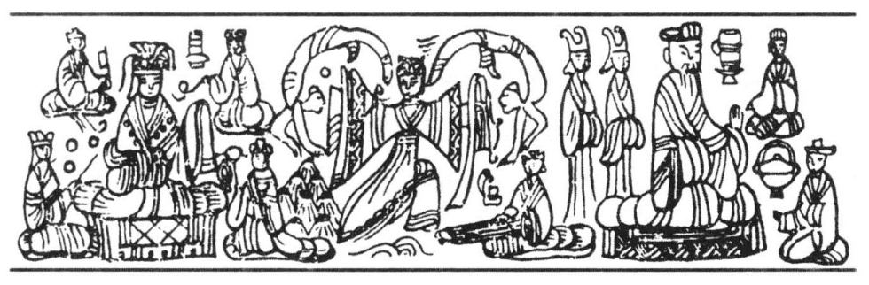
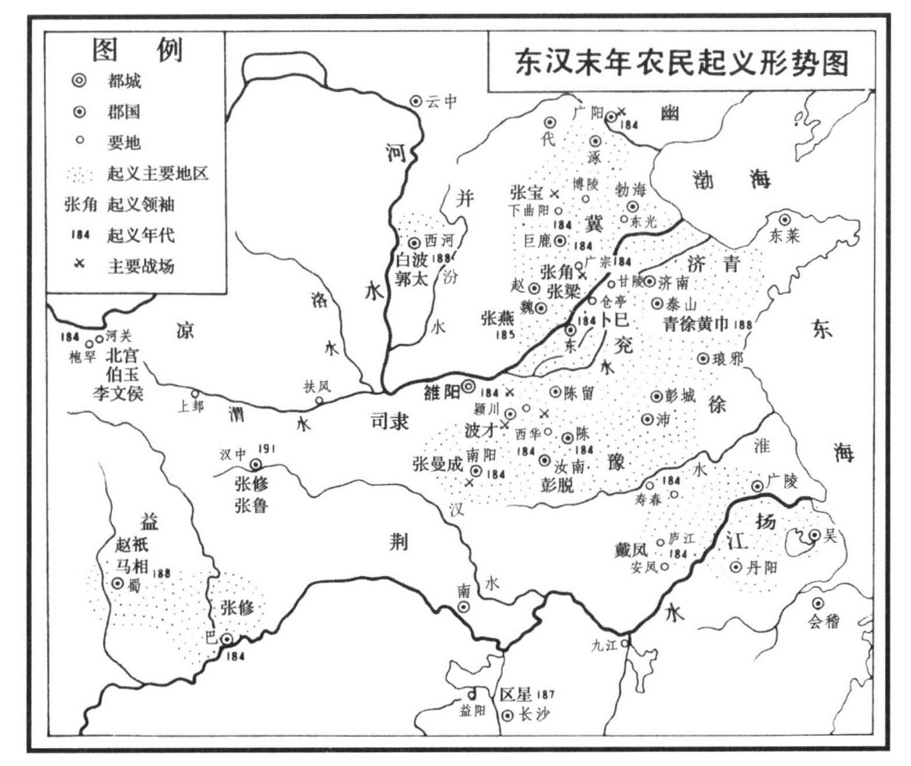

#### 第五节 黄巾大暴动与东汉王朝的灭亡

公元168年正月己亥日，洛阳夏门外的万寿亭挤满了文武百官，并且停着一辆漂亮的青盖车。百姓们知道，这是欢迎从河间接来的新皇帝。

不久，一连串的白盖小车，在羽林军的护卫之中，驰向洛阳而来，看热闹的小孩们都唱起来了：“白盖小车何延延。河间来合谐，河间来合谐！”[133]

所有的白盖小车都停在万寿亭了。在一辆白盖小车中，走出一位十二岁的孩子，换乘了青盖车，于是这辆青盖车和其余的白盖小车，在文武百官和羽林军的拥护之下，驰入皇宫。第二天，这个十二岁的孩子，即皇帝位，是为灵帝。[134]

百姓们对于这位新皇帝，或者还知道得不清楚，但确切地知道他有一个爱钱的母亲，这就是后来的永乐太后。所以当时京师的儿童又为之谣曰：“车班班，入河间。河间姹女工数钱，以钱为室金为堂。石上慊慊舂黄粱，梁下有悬鼓，我欲击之丞卿怒。”[135]

灵帝即位之元年，宦官曹节等欲再兴党狱，屠杀士大夫，请他批准，因谓党人欲图谋不轨，他竟不知道：“何谓不轨？”后来，他的年龄已经很大，常登永安侯台，宦官恐其望见他们华美的第宅，因使尚但谏曰：“天子不当登高，登高则百姓虚散。”[136]自是他竟不敢复登台阁。像这样一块材料，用以支持行将倾覆的大厦，当然没有不倒塌的道理。

如前所述，在灵帝即位的元年，宦官们就大兴党狱，把当时的士大夫，几乎屠杀殆尽，因而当灵帝初年，宦官的权势达到绝顶的高扬。据史载，当时因屠杀士大夫有功而封侯的宦官，有王甫、曹节等十八人[137]，以后因诬杀桓帝弟勃海王悝有功而封者又十二人。[138]此外张让、赵忠、夏恽、郭胜、孙璋、毕岚、栗嵩、段珪、高望、张恭、韩悝、宋典这一大群宦官，皆为中常侍，封侯贵宠。这真如当时一位善良的宦官所云：“陛下不悟，妄授茅土，开国承家，小人是用。”[139]宦官既高居朝堂，于是他们遂“割裂城社，自相封赏。父子兄弟，被蒙尊荣；素所亲厚，布在州郡；或登九列，或据三司。不惟禄重位尊之责，而苟营私门，多蓄财货，缮修第舍，连里竟巷。盗取御水，以作鱼钓；车马服玩，拟于天家。群公卿士，杜口吞声，莫敢有言；州牧郡守，承顺风旨，辟召选举，释贤取愚。”[140]这真是好威武的奴才呵！

不仅如此，他们看到太学的学生不可靠，一律禁锢不用，而另设鸿都门学[141]，专门训练一批走狗。鸿都门学的学生，都是由州郡或三公保举而来，绝对没有危险分子[142]。在鸿都门学受过训练的学生，出则为刺史、太守，入则为尚书、侍中，亦有封侯者。但当时的正人君子，则耻与为列。

不仅如此，他们又窃取兵权，组织武装。据《后汉书·何进传》所载：中平五年，是时置西园八校尉，以小黄门蹇硕为上军校尉，并任之以为元帅，督司隶校尉以下，虽大将军亦领属焉。从训练爪牙，组织武装等创举看来，灵帝时的宦官，较之他们的前辈已经进步得多了。即因如此，所以当时的东汉，就变成了匪类的天下；而当时的洛阳，则是匪类的窟穴。

现在我们看东汉的皇帝在做什么？光和元年，他大开西邸卖官。二千石，二千万；四百石，四百万。县令县长，当面议价：因为缺有好坏，价有高低。富者交现款，贫者到任以后，加倍缴纳。又私令左右卖公卿，公千万，卿五百万。除皇帝不卖，自关内侯、虎贲、羽林，都有一定的行市。

此外，“刺史、二千石及茂材孝廉迁除，皆责助军修宫钱，大郡至两三千万，余各有差。当之官者，皆先至西园谐价，然后得去。有钱不毕者，或至自杀。其守清者，乞不之官，皆迫遣之。时巨鹿太守河内司马直新除，以有清名，减责三百万。直被诏，怅然曰：‘为民父母，而反割剥百姓，以称时求，吾不忍也。’……即吞药自杀”。[143]

不仅如此，又据《吕强传》云：“时帝多稸私藏，收天下之珍，每郡国贡献，先输中署，名为导行费。”

灵帝把他在各种名义之下敲索而来的钱财，一部分拿到他原来的封邑河间去买田宅，起第观；一部分则窖藏在他的奴才们的家里[144]，另一部分则用于浪费。当时吕强看到灵帝贵为天子，富有四海，还要蓄私产，曾上疏谏曰：“天下之财，莫不生之阴阳，归之陛下。归之陛下，岂有公私？而今中尚方敛诸郡之宝，中御府积天下之缯，西园引司农之臧，中厩聚太仆之马，而所输之府，辄有导行之财。”[145]吕强不知道，这正是亡国之君的作风，因为亡国之君，总要替自己准备后事，他总以为国亡而家尚可保，所以移国就家，准备在亡国以后去享受。灵帝之公私分明，正是为了这种原因。灵帝又大兴土木，光和三年作罩圭、灵昆苑。[146]光和五年，起四百尺观于阿亭道。中平二年，造黄金堂于西园。中平三年，复修玉堂殿，铸铜人四，黄钟四，及天禄、虾蟆。为了修宫殿，灵帝“令敛天下田，亩税十钱”。“又发太原、河东、狄道（今甘肃临洮）诸郡材木及文石，每州郡部送至京师，黄门、常侍辄令谴呵不中者，因强折贱买，十分顾一，因复货之于宦官，复不为即受，材木遂至腐积，宫室连年不成。刺史、太守，复增私调，百姓呼嗟。”

宫室既成，“灵帝于宫中西园驾四白驴，躬自操辔，驱驰周旋，以为大乐。于是公卿、贵戚，转相仿效，至乘辎耕以为骑从，互相侵夺，（驴）贾与马齐。”[147]而当时马价一匹至二百万。[148]

“帝作列肆于后宫，使诸采女贩卖，更相盗窃争斗，帝着商估服，饮宴为乐。”[149]

“又于西园弄狗，着进贤冠，带绶”，以为笑乐。据说当时有一冠带之狗，走入司徒府门，或见之者，莫不惊怪。《后汉书·五行志》曰：“司徒，古之丞相，壹统国政。天戒若曰：宰相多非其人，尸禄素餐，莫能据正持重，阿意曲从；今在位者皆如狗也，故狗走入其门。”又曰：“灵帝宠用便嬖子弟，永乐宾客、鸿都群小，转相汲引，公卿牧守，比肩是也。……实狗而冠者也。”

现在我们再看当时外戚、宦官的奢侈。《后汉书·吕强传》云：“今外戚四姓贵幸之家，及中官公族无功德者，造起馆舍，凡有万数。楼阁连接，丹青素垩，雕刻之饰，不可单言。丧葬逾制，奢丽过礼，竞相仿效，莫肯矫拂。”再看当时商人地主的生活。《后汉书·仲长统传》载《昌言·理乱篇》云：“（当时）豪人之室，连栋数百，膏田满野，奴婢千群，徒附万计。船车贾贩，周于四方；废居积贮，满于都城。琦赂宝货，巨室不能容；马牛羊豕，山谷不能受。妖童美妾，填乎绮室；倡讴妓（伎）乐，列乎深堂（插图五十）。宾客待见而不敢去，车骑交错而不敢进。三牲之肉，臭而不可食；清醇之酎，败而不可饮。睇盼则人从其目之所视，喜怒则人随其心之所虑。此皆公侯之广乐，君长之厚实也。苟能运智诈者，则得之焉，苟能得之者，人不以为罪焉。”

不仅京师如此，当时豪富的商人地主，遍于全国。同上传《损益篇》云：“豪人货殖，馆舍布于州郡，田亩连于方国。身无半通青纶之命，而窃三辰龙章之服；不为编户一伍之长，而有千室名邑之役。荣乐过于封君，势力侔于守令。财赂自营，犯法不坐。刺客死士，为之投命。”

> 插图五十 倡讴伎乐列乎深堂画像

最后，我们看看这个金碧辉煌的社会之另一面农民的生活。同上篇又云：“弱力少智之子，被穿帷败，寄死不敛，冤枉穷困，不敢自理。”《后汉书·吕强传》云：“比谷虽贱，而户有饥色。案法当贵而今更贱者，由赋发繁数，以解县官，寒不敢衣，饥不敢食。民有斯厄，而莫之恤。”所以结果演成人吃人的惨剧。《后汉书·灵帝纪》云：“建宁三年，河内人妇食夫，河南人夫食妇。”就在这样一个时代，而宦官的血手，还在扼住农民的咽喉，要他们再吐出一些油水来。这还是人的世界吗？

太阳熄灭了，黑暗笼罩整个的社会。在黑暗中可以听到魔鬼们胜利的欢呼，也可以听到农民们饥饿的悲号。他们用不协调的声音奏出人类历史的进行曲。就在这沉沉的黑暗当中，张角就出现为苦难人民的救星。

张角，巨鹿人。他的家世不得而考，但知他最初出现在农民大众面前，是一个慈祥的教主。他奉事黄老道，是中国太平道一派的创始人，自称“大贤良师”。张角虽然是一位教主，但他并不告诉农民把希望寄托在天国，在死后会进入天堂；反之，而是告诉农民要争取这现实的世界，及身的时代。这位教主，具有拯救人类的热情和反对罪恶的勇气，具有推翻当时暴虐的政治的决心。他看到当时士大夫改良运动的失败，是因为没有把他们的运动和农民大众的力量结合起来。他知道要推翻这个政权需要力量，而惟一的力量就是农民。他又知道，要唤起这些苦难的农民，使他们由悲哀而愤怒，需要一种刺激，而宗教就是最好的工具。因为宗教可以给苦难的农民以一种新的希望。因此，这位教主，披起宗教的外衣，走进农民大众的队伍。

灵帝时，正是中国史上的一个大疠疫时代。疠疫之神，翱翔中国，人民死亡，绝家灭户。于是张角乃用神道的符咒、宗教的圣水，去替当时的农民医病。本来有些农民，实在就是患的一种饥饿病，一旦得到一种宗教的安慰，也就豁然而起。张角就用这样的神道，在广大的人民当中获得了信仰。因而得以进行革命的组织，不久他就团结了不少的干部在他的周围。这些干部也和他一样，用符水咒术分道进行革命的组织。于是这位教主遂一变而为农民暴动的组织人。

不要误会了，黄巾的暴动是张角用魔术煽动起来的。在任何时代，农民暴动都不能用一杯符水灌出来，也不能用几句咒语咒出来，只有贫穷饥饿和杀人的政治才能把它唤起来。如果没有广大的饥民存在，则张角的符水咒术，决不会在农民大众中起着政治作用。而且事实证明，在张角出现之前，即在没有宗教的鼓舞之前，当时的农民已经到处暴动了。

过去农民“叛乱”的历史教训了这位革命的教主。他知道，没有组织的暴动是要失败的。他看到当时全国各地都有农民在暴动。全国各地的农民暴动都各不相属，以致有许多都被各个击破。这样的情形，显然是重复了过去的失败路线。因此，他派了八个干部，使于四方，进行统一组织的工作。经过了十余年的努力，竟然把散布于青、徐、幽、冀、荆、扬、兖、豫八州零碎的暴动集团，组织起来，合计人数已有数十万。于是把这些暴动集团，重新编制，分为三十六方。大方万余人，小方六七千人，各立渠帅，而皆隶属于张角的统一指挥之下。

为了动员更广大的农民，这位革命的教主发出了神道的号召。他向农民宣言：“苍天已死，黄天当立，岁在甲子，天下大吉。”跟着在京城寺门、州郡官府的墙壁上，到处出现了用白土书写的“甲子”字样。这对于当时的统治者，自然是一种神经的攻势。

为了更妥慎起见，荆、扬方面渠帅马元义，又常常往来洛阳，探听政府的动静，并且收买了宦官封谞、徐奉，要他们在京师发动“叛乱”，响应农民暴动。一切都准备好了，暴动的总部，决定了在中平元年三月五日，内外俱起。

这次的准备，较之过去几次的农民暴动，总算要精密得多。但是不幸在革命的集团中，出现一个名叫唐周的叛徒，他把起义的日期和一切里应外合的秘密，报告了政府，当作他投降的礼物。于是马元义车裂于洛阳。此外，宫廷的卫士和被指为奉事张角道教的人民，也有一千多人被捕杀。

当灵帝发现他最忠实的宦官与黄巾沟通的时候，他才知道宦官比士大夫更不可靠。《后汉书·宦者列传·张让传》记灵帝责张让之语云：“汝曹常言党人欲为不轨，皆令禁锢，或有伏诛。今党人更为国用，汝曹反与张角通，为可斩未？”

不幸的消息，很快就传到农民暴动的总部。这个消息就无异警告张角，再犹豫，就是等着被屠杀。夜已深了，洛阳政府中的要人，正在调兵遣将，准备明天的大屠杀；州郡的贪官污吏们，正带着昨天的宿酒，做着明天搜刮的好梦。即于此时，那位革命的教主，在灯光之下，一连写了三十六封檄文。然后派遣了可靠的干部，教他们将这些檄文，星夜飞送诸方渠帅，约定于檄文到达之日，立即起义。凡属同盟的诸方，士卒皆用黄巾缠头，以为共同的标志。所以当时的人民，称之曰“黄巾”，东汉政府称之曰“黄巾贼”或“蛾贼”。

传达命令的使者，分道出发以后，这位革命的教主，立即召集左右的干部，命令他们就在夜晚准备明天的大起义。

太阳出来了，在巨鹿，飘起了三树大旗。一树写着“天公将军”（张角），一树写着“地公将军”（张宝），一树写着“人公将军”（张梁）。号角之声，响彻云霄，成千成万的农民，都扎上了黄巾，拿起了武器，集中到这三树大旗的下面。革命的教主走到旗下，他用了一颗贪官的脑袋，祭告天地，这就是历史上所载黄巾“杀人以祠天”的内容。

革命的行动，很快地由巨鹿向四方八面展开了。同时，南阳黄巾在张曼成领导之下，杀了郡守褚贡。汝南黄巾击败太守赵谦于召陵（今河南郾城东）。广阳黄巾攻杀幽州刺史郭勋及太守刘卫。颍川黄巾占据郡城，其他各地的黄巾，无不先后相铤而起。此外安平甘陵（今山东临清东北）人亦各执其王，以响应黄巾的起义。他们到处燔烧官府，杀戮富豪，其势勇猛，所至披靡。于是“州郡失据，长吏多逃亡，旬日之间，天下响应，京师震动”。[150]把汉家的天下，打得七零八落（插图五一）。

这个消息，传到了洛阳，灵帝乃召集紧急会议，商讨应变万策。当时全场一致都主张武装剿灭。惟有中常侍吕强主张，应释放党人，先收民心。他说：“党锢久积，人情多怨。若久不赦宥，轻与张角合谋，为变滋大，悔之无救。”[151]这个建议，灵帝算是接受了，但是不久吕强即为宦官所诬陷，自杀而死。又有郎中张钧主张诛杀宦官，以谢人民，则不动干戈，而大乱自平。他说：“窃惟张角所以能兴兵作乱，万人所以乐附之者，其源皆由十常侍多放父兄、子弟、婚亲、宾客典据州郡，辜榷财利，侵掠百姓，百姓之冤无所告诉，故谋议不轨，聚为盗贼。宜斩十常侍，悬头南郊，以谢百姓。又遣使者布告天下。可不须师旅，而大寇自消。”[152]但是灵帝的回答是：“此真狂子也。十常侍固当有一人善者不？”[153]结果，忠心耿耿的张钧被宦官替他加上了一个通黄巾的罪名，亦被诬杀。

> 插图五一

最后的决定，还是要剿。于是“诏敕州郡，修理攻守，简练武器，自函谷、太谷、广城、伊阙、轘辕、旋门、孟津、小平津诸关，并置都尉”。[154]现在，灵帝也大破悭囊，把中藏的私钱，西园的私马，也拿出来作为军事之用。又调集五校、三河的骑士并招募新兵合四万余，令皇甫嵩、朱轘各统一军，开始屠灭饥饿农民的战争。

战争展开了。朱辍的官军进至颍川境内，便遇着了波才所指挥的一个黄巾支队的迎头痛击，杀得大败而回，只好进保长社（今河南长葛东），波才又引黄巾围长社。当时皇甫嵩的官兵，已经骇得发抖，眼看黄巾围长社而不敢救。在这一个战役中，波才将军本有把官军完全消灭的可能，但因黄巾究竟是一群没有经过战斗训练的农民，他们冲锋有余，而机动不足。当他们围攻长社之时，依草结营，而又没有警戒，不幸有一天大风，皇甫嵩乃因风纵火，鼓而奔其阵。当时，骑都尉曹操也带来一支生力军，加入了皇甫嵩的战斗，同时，朱轘也打开了城门，冲杀出来。在这样一个里应外合的攻击之中，黄巾遂转胜为败。这一役，皇甫嵩等屠杀了几万农民，嵩因功封都乡侯，朱轘进封西乡侯。

现在，东汉的官军又在皇甫嵩等的指挥之下，乘胜进击汝南。陈国黄巾，追讨波才于阳翟，击彭脱于西华，皆破之。自是颍川、汝南、陈国的黄巾溃散。官军又再进击东郡黄巾卜己于仓亭（今山东阳谷东北），卜己被俘。这一役又屠杀农民七千余人。

同时，朱轘又指挥官军，进击南阳的黄巾。其时南阳黄巾的渠帅张曼成已经战死，继起的领导者为赵弘，拥众十余万人，占据宛县。朱轘以八千人围宛县，两月不能拔。不久赵弘以出城应战死，韩忠继之，据宛县如故。以后黄巾被诱出城，终为官军所败。这一役，韩忠被俘，农民被屠杀者万余人。但是黄巾复以孙夏为首领，再据宛县，旋以迫于官军的攻势，退向西鄂（今河南南阳县东北）精山（今南阳县北）。在退却中，为官军所乘，农民被屠杀者又万余人。以后这一支黄巾，遂散为小股，出没于豫鄂边区。

与皇甫嵩、朱轘之进讨河南黄巾的同时，北中郎将卢植与东中郎将董卓也在以大军进讨张角。但史称他们“并无功而还”。当河南黄巾剿平以后，灵帝乃复派皇甫嵩前往进讨张角。据《后汉书·皇甫嵩传》云：“嵩与角弟梁战于广宗。梁众精勇，嵩不能克。明日，乃闭营休士，以观其变，知贼意稍懈，乃潜夜勒兵，鸡鸣，驰赴其阵，战至晡时，大破之。”这一役，张梁战死，农民被屠杀者三万余人，被驱赴河死者五万余人，焚烧农民车辆三万余辆，俘虏农民妻子儿女无数。其时张角已病死，也从坟墓里斩棺暴尸，传首京师。

最后，皇甫嵩又与巨鹿太守郭典连兵，共攻角弟张宝于下曲阳（今河北晋县西北），大破之。这一役，张宝战死，农民被屠杀者十余万人。据史载，皇甫嵩将军用农民的尸骨“筑‘京观’于城南”，以纪念他对农民的胜利。

以上都是中平元年的事，这一篇血账结下来，总计皇甫嵩和朱轘所屠杀的农民共达三十万人以上，至于那些被官军所俘虏的无数的农民的妻子儿女，后来如何发落，《后汉书》上没有下文。因为屠杀农民的丰功，战事结束以后，朱轘、皇甫嵩都得了重赏。皇甫嵩官至左车骑将军，领冀州（今河北临漳西南）牧，封槐里侯，食槐里、美阳两县，合八千户。朱辍官至右车骑将军，封西乡侯，迁镇贼中郎将，光禄大夫，增邑五千，更封钱塘侯。皇甫嵩到了冀州以后，大得豪族欢心，当时豪家为之歌曰：“天下大乱兮市为墟，母不保子兮妻失夫，赖得皇甫兮复吾居。”[155]

黄巾暴动的高潮虽然已成过去，但并非完全消灭。因当时的饥民遍于全国，没有那样多的刀斧手可以把他们斩尽杀绝。贫困产生暴动，消灭暴动，要扫除贫困，不是压迫人民忍受贫困，东汉政府却反其道而行之，所以屠杀了一批饥民，又出现了第二批饥民。中平二年，黄巾的余众和各地饥民，又打着各种各样的旗帜，出现于河北原野。《后汉书·朱辍传》云：“自黄巾贼后，复有黑山、黄龙、白波、左校、郭大贤、于氐根、青牛角、张白骑、刘石、左髭丈八、平汉、大计、司隶、掾哉、雷公、浮云、飞燕、白雀、杨凤、于毒、五鹿、李大目、白绕、畦固、苦哂之徒，并起山谷间，不可胜数。其大声者称雷公，骑白马者为张白骑，轻便者言飞燕，多髭者号于氐根，大眼者为大目。如此称号，各有所因。大者二三万，小者六七千。贼帅常山人张燕，轻勇趫捷，故军中号曰飞燕，善得士卒心，乃与中山、常山、赵郡、上党、河内诸山谷寇贼，更相交通，众至百万，号曰黑山贼。河北诸郡县，并被其害，朝廷不能讨。燕乃遣使至京师，奏书乞降。遂拜燕平难中郎将，使领河北诸山谷事，岁得举孝廉、计吏。燕后渐寇河内，逼近京师。于是出俊为河内太守，将家兵击却之。其后诸贼多为袁绍所定。”

从以上的记录中，我们可以看出继黄巾而起的暴动集团之多，而且每个“叛乱”集团都团结了六七千以至两三万的农民。特别是“黑山贼”张燕，聚众至百万，朝廷不能讨。由此可知当时暴动的农民，其数量，已超过黄巾暴动的高潮时期。但是他们为什么不能像黄巾暴动时期一样，形成一个整然的阵势，卷起一个暴动的高潮呢？这就是因为他们已经失去了统一的组织和统一的领导，因而又回复到黄巾暴动以前那种各不相属的分散状态，从而不能集中力量，整齐步伍，向着他们的敌人进军。虽然张燕曾有与诸山谷“寇贼”更相交通之事，然而他并不能把他们领导起来。而且张燕并不像张角一样，是一个具有拯救人民的热情的人物，而是一个意识不坚定的人。当他起事之初，非常勇敢，所以“善得士卒心”。到他做了平难中郎将以后，也就不能控制他的部下不“渐寇河内，逼近京师”了。即因没有张角那样的领导人物，所以继黄巾而起的农民暴动，便又回复了原始的性质，这从他们的命名，就可以看得出来。所谓原始的性质，即饥则求食，饱则退入山谷，所以当时称之曰山谷“寇贼”。换言之，他们完全以直接掠夺生活资料为目的，并没有推翻生活资料之垄断者的政治企图了。所以这就决定了他们在后来被袁绍、曹操、公孙瓒等各个击破。虽然，他们的出现，也就说明了一个事实，即社会的贫困，不是武力所能剿灭的。

到中平五年，黄巾复起。据《后汉书·灵帝纪》所载：是年二月，“黄巾余贼”郭太等起于西河白波谷（今山西襄汾永固镇），寇太原、河东。四月，汝南葛陂（今河南新蔡北）黄巾攻没郡县。六月，益州黄巾马相攻杀刺史郗俭，自称天子。又寇巴郡，杀郡守赵部。九月，青、徐黄巾复起，寇郡县。黄巾的暴动，继续了十年，一直到献帝初平四年（公元193年），才没入豪族的部伍中。而“黑山贼”则直至献帝建安十年（公元205年），才由张燕率领投降了曹操，转化为官军。此外，与黄巾暴动同时，在蜀郡，张修、张鲁也造作五斗米道，煽起“叛乱”。这一个“叛乱”集团一直到建安二十年（公元215年），才为曹操所平定。

农民暴动镇压下去了，但东汉的天下，也被这些平乱的英雄瓜分了。自灵帝死后，东汉政府内部发生了政变。大将军何进诛宦官，反为宦官所杀。袁绍又勒兵闭北宫门，逮捕所有的宦官，无少长皆诛戮之，凡二千余人。宦官绝了种，权臣又登台。董卓废少帝，另立陈留王为帝，是为献帝。董卓放弃了洛阳，把献帝送到长安，而以大军屯驻潼关之外，欲挟天子以令诸侯。于是，中原豪族以讨董卓为名，乘时蜂起。天下大局，遂由农民暴动转入豪族混战的局面。所以献帝在位虽然有三十一年，实际上，东汉王朝已经等于灭亡了。

[1]《文献通考·兵考》曰：“光武以幽、冀、并州兵，克定天下，始于黎阳立营，领兵骑常千人，以谒者监之。”

[2]《文献通考·兵考》云：“（东汉时）京师南、北军如故，于北军则并胡骑、虎贲二校为五营，以北军中候易中垒以监之。于南军，则光禄勋省车户骑三将及羽林令。都尉省旅贲及卫士一丞。”

[3]《后汉书·光武帝纪》云：“建武六年，是岁初罢郡国都尉官。”又云：“七年三月，诏罢轻车、材官、楼船士及军假吏。”注引《汉官仪》云：“军假吏，谓军中权置吏也。令悉罢之。”

[4]《文献通考·兵考》云：“光武罢都试而外兵不练，虽疆场之间，广屯增戍，列营置坞，而国有征伐，终借京师之兵以出。盖自建武迄于汉衰，匈奴之寇，鲜卑之患，岁岁有之。或遣将出击，或移兵留屯，连年暴露，奔命四方，而禁旅无复镇卫之职矣。”

[5]《文献通考·兵考》云：“至安帝永初间，募入钱谷，得为虎贲羽林缇骑营士，而营卫之选亦衰矣。桓帝延熹间，诏减羽林虎贲不任事者半俸，则京师之兵，亦更弱矣。外之士兵不练，而内之卫兵不精，设若盗起一方，则羽檄被于三边，兴发甲卒，取办临时，战非素具，每出辄北。”

[6]《文献通考·兵考》云：“至东汉以来，又举五官郎将、羽林虎贲，以职属大夫。议郎、谒者、仆射以文属。分属之后，政令不行于其间。而又光禄大夫不在宿直，议郎不与执戟，惟不在宿直执戟之列，则凡为禁卫者，皆非士人之流，而郎宫三省尽为诸黄门之庐耳。故宦内典门户，外与政事。”

[7]《后汉书·何进传》云：“（灵帝中平）五年……诏使（何）进悉领兵屯于（平乐）观下。是时，置西园八校尉，以小黄门蹇硕为上军校尉……特亲任之，以为元帅。督司隶校尉以下，虽大将军，亦领属焉。”按西园八校尉者，即上军校尉、中军校尉、下军校尉、典军校尉、助军校尉、右校尉、左校尉、佐军校尉是也。

[8]《后汉书·陈宠传》云：和帝永元六年，廷尉陈宠“又钩校律令条法曰：‘……今律令死刑六百一十，耐罪千六百九十八，赎罪以下二千六百八十一……汉兴以来，三百二年，宪令稍增，科条无限。’又律有三家，其说各异。宜令三公、廷尉平定律令，应经合义者，可使大辟二百，而耐罪、赎罪二千八百，并为三千，悉删除其余令。……未及施行。……及宠免后遂寝。而苛法稍繁，人不堪之。（宠子）忠略依宠意，奏上二十三条，为《决事比》，以省请谳之敝”。

[9]《后汉书·应劭传》云：应劭“删定律令为《汉仪》。建安元年乃奏之。曰：‘……逆臣董卓，荡覆王室，典宪焚燎，靡有孑遗……窃不自揆，贪少云补，辄撰具《律本章句》《尚书旧事》《廷尉板令》《决事比例》《司徒都目》《五曹诏书》及《春秋断狱》，凡二百五十篇。蠲去复重，为之节文。又集驳议三十篇，以类相从，凡八十二事。其见《汉书》二十五，《汉记》四，皆删叙润色，以全本体。其二十六，博采古今瑰玮之士，文章焕炳，德义可观。其二十七，臣所创造。……’献帝善之”。

[10]《后汉书·光武帝纪》：建武七年“非犯殊死，皆一切勿案其罪”。注云：“殊死，谓斩刑殊绝也。”

[11]《后汉书·光武帝纪》建武七年，诏“耐罪、亡命，吏以文除之。”注云：“犯耐罪而背名逃者。”

[12]《后汉书·明帝纪》：“右趾至髡钳、城旦舂……完城旦舂至司寇作。”注云：“右趾，谓刖其右足，次刖左足，次劓，次黥，次髡钳为城旦舂。”

[13]《后汉书·明帝纪》云：“前书谓之罚作，一岁刑也。”

[14]《后汉书·韦彪传》注云：“左校，署名，属将作。”

[15]《后汉书·庞参传》：参“拜左校令，坐法，输作若卢”。注云：“若卢，狱名。”

[16]《后汉书·光武帝纪》，建武十二年十二月，“遣骠骑大将军杜茂将众部施刑，屯北边。”注云：“施读曰弛，谓有赦令……去其钳釱赭衣。”

[17]《后汉书·光武帝纪》云：建武三年诏曰：“女徒雇山归家。”注云：“女子犯徒，遣归家，每月出钱雇人，于山伐木，名曰雇山。”

[18]《后汉书·光武帝纪》云：建武二十八年，“诏死罪系因，皆一切募下蚕室，其女子宫”。注云：“谓幽闭也。”

[19]《后汉书·明帝纪》记明帝中元二年诏曰：“边人遭乱，为内郡人妻，在己卯赦前，一切遣还边，恣其所乐。”又《后汉书·安帝纪》记安帝永初四年，“诏自建初以来，诸妖言他过坐徙边者，各归本郡，其没入官为奴婢者，免为庶人”。

[20]《后汉书·窦融传》云：“窦融自祖及孙，官府邸第，相望京邑，奴婢以千数。”《后汉书·马援传》云：“防兄弟贵盛，奴婢各千人已上。”《后汉书·光武十王传》云：“济南安王康奴婢至千四百人。”《后汉书·方术列传》云：“（折国）有赀财二亿，家僮八百人。”《后汉书·梁冀传》云：“冀或取良人悉为奴婢，至数千人，名曰自卖人。”

[21]《后汉书·宦者列传·张让传》云：“让有监奴，典任家事，交通货赂，盛形煊赫。”

[22]《后汉书·安帝纪》云：“至有走卒奴婢被绮縠，着珠玑。京师尚若斯，何以示四远？”《后汉书·宦官列传》云：单超，徐璜，具瑗，左悺，唐衡皆竞起第宅，“其仆从皆乘牛车而从列骑”。

[23]《后汉书·儒林传》。

[24]《后汉书·儒林传·序》云：“本初元年，梁太后诏曰：‘大将军下至六百石，悉遣子就学。’……自是游学增盛，至三万余生。”又云：“顺帝……乃更修黉宇，凡所造构二百四十房，千八百五十室。试明经下第补弟子，增甲乙之科员各十人。”

[25]《后汉书·明帝纪》：永平九年，“为四姓小侯开立学校，置五经师”。注云：“四姓为外戚樊氏、郭氏、阴氏、马氏诸子弟。”

[26]《后汉书·桓帝邓皇后传》：安帝元初六年，“邓太后诏征和帝弟济北、河间王子男女年五岁以上，四十余人，又邓氏近亲子孙三十余人，为开邸第，教学经书，躬自监试”。

[27]《后汉书·百官志》云：“举孝廉，郡□二十万举一人。”《后汉书·丁鸿传》云：和帝“时大郡□五六十万举孝廉二人，小郡□二十万并有蛮夷者亦举二人。帝以为不均，下公卿会议。鸿与司空刘方上言，‘凡□率之科，宜有阶品……自今郡国率二十万□岁举孝廉一人，四十万二人，六十万三人，八十万四人，百万五人，百二十万六人。不满二十万二岁一人，不满十万三岁一人’。帝从之”。又《后汉书·和帝纪》：永元十三年十一月，“诏郡□十万以上岁举孝廉一人，不满十万，二岁举一人”。

[28]《后汉书·和帝纪》：永元六年，诏“昭岩穴，披幽隐，遣诣公车”。《后汉书·逸民列传·序》云：“光武侧席幽人，求之若不及，旌帛蒲车之所征贲，相望于岩中矣。”

[29]《通典·选举》云：“凡郡国之官……调属僚及部人之贤者，举为秀才廉吏而贡于王庭，多拜为郎。”又云“郎吏，岁举秀才廉吏，出为他官，以补缺员”。

[30]《后汉书·仲长统传》云：“光武皇帝愠数世之失权，忿强臣之窃命，矫枉过直，政不任下，虽置三公，事归台阁。自此以来，三公之职备员而已。”

[31]《后汉书·百官志》云：“每郡置太守一人，二千石……王国之相亦如之。”

[32]《后汉书·百官志》云：“中兴都洛阳，以河南郡为尹。”

[33]《后汉书·百官志》云：“边郡往往置都尉及属国都尉，稍有分县，治民比郡。”

[34]《后汉书·百官志》云：“每县、邑、道，大者置令一人，千石；其次置长，四百石；小者置长，三百石；侯国之相，秩次亦如之。……丞各一人。尉，大县二人，小县一人。……边县有障塞尉。本注曰：掌禁备羌夷犯塞。”

[35]《后汉书·百官志》云：“乡置有秩、三老、游徼。本注曰：有秩，郡所署，秩百石，掌一乡人；其乡小者，县置啬夫一人。皆主知民善恶，为役先后，知民贫富，为赋多少，平其差品。三老，掌教化。凡有孝子顺孙，贞女义妇，让财救患，及学士为民法式者，皆扁表其门，以兴善行。游徼掌徼循，禁司奸盗。又有乡佐，属乡，主民收赋税。”

[36]《后汉书·百官志》云：“亭有亭长……本注曰：亭长，主求捕盗贼，承望都尉。”

[37]《后汉书·百官志》云：“里有里魁，民有什伍，善恶以告。本注曰：里魁掌一里百家。什主十家，伍主五家，以相检察。民有善事恶事，以告监官。”

[38]《后汉书·百官志》云：“刺史……成帝更为牧，秩二千石。建武十八年，复为刺史，十二人，各主一州，其一州属司隶校尉。”

[39]《后汉书·光武帝纪》。

[40]《后汉书·朱浮传》。

[41]《后汉书·光武十王传》。

[42]《后汉书·窦融传》谓“窦固（融之弟）字孟孙，少以尚公主为黄门侍郎。好览书传，喜兵法，贵显用事。……显宗（明帝）即位，迁中郎将，监羽林士（即禁卫军司令），后坐从兄穆有罪，废于家十余年。时天下又安，帝欲遵武帝故事，击匈奴，通西域，以固明习边事，十五年冬，拜为奉车都尉。以骑都尉耿忠为副，谒者仆射耿秉为驸马都尉，秦彭为副，皆置从事、司马，并出屯凉州”。

[43]《后汉书·明帝纪》载：永平十五年、十六年，皆有大赦天下囚徒诣军营徙戍边塞的诏令。

[44]《后汉书·窦宪传》云：“宪字伯度，父勋被诛，宪少孤。建初二年，女弟立为皇后，拜宪为郎。”

[45]斯坦因《西域考古记》记载在古长城的废址中，曾发现有些文书，提到土官名称的，如有一木简上写明“玉门显明燧蛮兵铜镞百完”字样。又于半段木简上发现书有古撒马尔干和布哈拉通行的古窣利语，并发现用最古的纸书写的窣利语文的私人函札。因此证明当时的兵籍中有中亚的夷兵。

[46]张衡《东京赋》中有云：“建象魏之两观，旌六典之旧章。”李善注云：“象魏，阙也，一名观也。”

[47]张衡《东京赋》云：“其西则有平乐都场，示远之观。”李善注云：“平乐，观名也……在城西也。”

[48]张衡《东京赋》云：“龙雀蟠蜿，天马半汉。”李善注云：“龙雀，飞廉也；天马，铜马也；……华峤《后汉书》曰：‘明帝至长安，迎取飞廉并铜马，置上西门平乐观也。’”

[49]张衡《东京赋》云：“启南端之特闱，立应门之将将。”李善注云：“端门，南方正门；应门，中门也。”《洛阳宫舍记》云：“洛阳有端门。”

[50]见班固《东都赋》。

[51]见张衡《东京赋》。

[52]张衡《东京赋》云：“濯龙芳林，九谷八溪。”李善注引《洛阳图经》曰：“濯龙，池名。故歌曰：濯龙望如海，河桥渡似雷。芳林，苑名。九谷八溪，养鱼池。”

[53]张衡《东京赋》云：“于南则前殿灵台，和欢安福，謻门（冰室门也）曲榭，邪阻城洫，奇树珍果，钩盾所职。”李善注云：“灵台，台名也。和欢、安福，二殿名，并在德阳殿之南。”

[54]张衡《东京赋》云：“九龙之内，实曰嘉德，西南其户，匪雕匪刻。”

[55]张衡《东京赋》云：“于东则洪池清籞（籞者，捕鸟之具），渌水澹澹，内阜（阜者多也）川禽，外丰葭菼。献鳖蜃与龟鱼，供蜗与菱芡。”李善注云：“洪，池名也，在洛阳东三十里。”

[56]张衡《东京赋》云：“西登少华，亭候修敕。”李善注云：“西园中有少华之山。”

[57]张衡《东京赋》云：“永安离宫，修竹冬青，阴池幽流，玄泉冽清，鹎鶋秋栖，鹘鸼春鸣，鴡鸠丽黄，关关嘤嘤。”

[58]《后汉书·百官志》谓将作大匠并掌“树桐梓之类，列于道侧”。

[59]《后汉书·光武十王传》谓琅邪孝王京“好修宫室，穷极伎巧，殿馆壁带皆饰以金银”。

[60]《后汉书·孝明八王纪》记梁节王畅因犯罪自陈之词曰：“臣畅小妻三十七人，其无子者，愿还本家，自选择。谨敕奴婢二百人，其余所受虎贲、官骑及诸工技、鼓吹、苍头奴婢，兵弩厩马，皆上还本署。”

[61]王符《潜夫论·浮侈篇》云：“今京师贵戚，衣服、饮食、车舆、文饰、庐舍，皆过王制，僭上甚矣。从奴仆妾，皆服葛子升越，筒中女布……犀象珠玉，琥珀瑇瑁，石山隐饰，金银错镂，獐麂履舄，文组彩牒，骄奢僭主，转相夸咤。”

[62]《后汉书·舆服志》云：“大贵人、贵人、公主、王妃、封君油画軿车。大贵人加节画辀。皆右騑而已。皇太子，皇子皆安车，朱班轮，青盖，金华蚤，黑文，画轓文辀，金涂五末。皇子为王，锡以乘之，故曰王青盖车。”

[63]王符《潜夫论·浮侈篇》曰：“富贵嫁娶，车骈各十，骑奴侍童，夹轂节引。富者竞欲相过，贫者耻不逮及，是故一飨之所费，破终身之本业。”

[64]见王符《潜夫论·浮侈篇》。

[65]《后汉书·舆服志》谓东汉官吏舆服有等差之别。车制，中二千石、二千石皂缯盖朱两轮。千石、六百石皂缯盖朱左轮。三百石以上布皂盖。二百石以下，白布盖。此外冠带佩刀亦有等差，所以别尊卑，章等级也。

[66]王符《潜夫论·浮侈篇》。

[67]王符《潜夫论·浮侈篇》。

[68]斯坦因《西域考古记》云：“有一似乎供仆人用的小室，小室之外，联一大室。大室二十六英尺见方，三面有一隆起的灰质平台，很像近代土耳其斯坦家屋中的客厅。现存八根柱子，排成方形，显出中间地方，在以前曾有一隆起的屋顶，为通光透气之用。”

[69]斯坦因《西域考古记》谓这里所发现的古佉卢文字体，是公元初三世纪间即贵霜朝诸王时代流行于印度西北一带的文字，而与此际适相值者，正是东汉时代。

[70]斯坦因《西域考古记》。

[71]《后汉书·明帝纪》。

[72]《后汉书·明帝纪》。

[73]《后汉书·光武十王传》。

[74]《后汉书·章帝纪》。

[75]《后汉书·章帝纪》。

[76]《后汉书·和帝纪》。

[77]《后汉书·和帝纪》。

[78]《后汉书·殇帝纪》。

[79]《后汉书·殇帝纪》。

[80]《后汉书·窦融传附窦宪传》。

[81]《后汉书·西羌传》云：“冬，遣车骑将军邓骘，征西校尉任尚副，将五营及三河、三辅、汝南、南阳、颍川、太原、上党兵合五万人，屯汉阳。明年春，诸郡兵未及至，钟羌数千人先击败骘军于冀西，杀千余人。……其冬，骘使任尚及从事中郎司马钧，率诸郡兵与滇零等数万人战于平襄，尚军大败，死者八千余人。于是滇零等自称‘天子’于北地，招集武都、参狼、上郡、西河诸杂种，众遂大盛。东犯赵、魏，南入益州，杀汉中太守董炳，遂寇钞三辅，断陇道。湟中诸县粟石万钱，百姓死亡不可胜数。朝廷不能制，而转运难剧。遂诏骘还师，留任尚屯汉阳，为诸军节度。”

[82]《后汉书·西羌传》云：“五年春，任尚坐无功征免。羌遂入寇河东，至河内，百姓相惊，多奔南度河。使北军中候朱宠将五营士，屯孟津，诏魏郡、赵国、常山、中山缮作坞候六百一十六所。羌既转盛，而二千石、令、长，多内郡人，并无守战意，皆争上徙郡县，以避寇难。朝廷从之。遂移陇西徙襄武，安定徙美阳，北地徙池阳，上郡徙衙。百姓恋土，不乐去旧，遂乃刈其禾稼，发彻室屋，夷营壁，破积聚。时连旱蝗饥荒，而驱蹙劫略，流离分散，随道死亡……丧其太半。”又同上传云：“元初二年，遣任尚为中郎将，将羽林、缇骑五营子弟三千五百人……屯三辅。……明年夏，度辽将军邓遵率南单于及左鹿蠡王须沈方骑，击零昌于灵州……任尚遣兵击破先零羌于丁奚城……四年……冬，任尚将诸郡兵……进北地，击狼莫……大破之……自零昌、狼莫死后，诸羌瓦解，三辅、益州，无复寇儆。”

[83]《后汉书·西羌传》。

[84]《后汉书·安帝纪》。

[85]《后汉书·安帝纪》。

[86]《后汉书·唐檀传》。

[87]《后汉书·陈忠传》。

[88]《后汉书·陈忠传》。

[89]《后汉书·杨震传》。

[90]《后汉书·西域传·序》云：“顺帝永建二年，班勇（班超之子）击降焉耆（先已击平车师）；于是龟兹、疏勒、于阗、沙车等十七国皆来服从，而乌孙、葱岭以西遂绝。六年，帝以伊吾庐膏腴之地，傍近西域，匈奴资之，以为钞暴，复令开设屯田，如永元时事，置伊吾司马一人。”

[91]《后汉书·西羌传》云：顺帝永和“五年夏且冻、傅难种羌等遂反叛，攻金城，与西塞及湟中杂种羌胡，大寇三辅，杀害长吏。……于是发京师近郡及诸州兵讨之，拜马贤为征西将军，以骑都尉耿叔副，将左右羽林、五校士及诸州郡兵十万人屯汉阳。又于扶风、汉阳、陇道作坞壁三百所，置屯兵，以保聚百姓。且冻分遣种人寇武都，烧陇关，掠苑马。六年春，马贤将五六千骑击之，到射姑山，贤军败，贤及二子皆战殁。……于是东西羌遂大合。巩唐种三千余骑寇陇西，又烧园陵，掠关中，杀伤长吏……武威太守赵冲追击巩唐羌，斩首四百余级……羌二千余人降。诏冲督河西四郡兵，为节度。罕种羌千余，寇北地，北地太守贾福与赵冲击之，不利。秋，诸种八九千骑寇武威，凉部震恐”。

[92]《后汉书·西羌传》云：“汉安元年，以赵冲为护羌校尉。冲招怀叛羌，罕种乃率邑落五千余户诣冲降。……唯烧何种三千余落，据参䜌北界。三年夏，赵冲与汉阳太守张贡，掩击之，斩首千五百级。……冬，冲击诸种，斩首四千余级。……冲复追击于阿阳，斩首八百级。于是诸种前后三万余户，诣凉州刺史降。建康元年春，护羌从事马玄遂为诸羌所诱，将羌众亡出塞……赵冲复追叛羌……遇羌伏兵，与战殁。冲虽身死，而前后多所斩获，羌由是衰耗。”

[93]《后汉书·西羌传》云：冲帝“永嘉元年……以汉阳太守张贡代为校尉，左冯翊梁并，稍以恩信招诱之，于是离浦、狐奴等五万余户诣并降，陇右复平……自永和羌叛，至乎是岁，十余年间，费用八十余亿。”

[94]《后汉书·顺帝纪》：永建元年八月，鲜卑寇代郡。二年二月，鲜卑寇辽东、玄菟。三年九月，鲜卑寇渔阳。四年十一月，鲜卑寇朔方。阳嘉元年九月，鲜卑寇辽东，二年八月，鲜卑寇代郡。

[95]《后汉书·顺帝纪》云：阳嘉四年，乌桓寇云中，围度辽将军耿晔于兰池。永和三年九月，匈奴、乌桓、西羌连兵寇上郡。汉安元年八月，匈奴左部反。

[96]《后汉书·顺帝纪》云：永和元年十二月，象林蛮夷叛。二年正月，武陵蛮以太守加租叛，围充县，又寇夷道。五月，日南蛮叛，攻郡府。七月，九真、交趾二郡兵叛。建康元年，日南蛮夷叛。

[97]《后汉书·周举传》。

[98]《后汉书·宦者列传·孙程传》云：“其封（孙）程为浮阳侯，食邑万户；（王）康为华容侯，（王）国为郦侯，各九千户；黄龙为湘南侯，五千户；彭恺为西平昌侯，孟叔为中庐侯，李建为复阳侯，各四千二百户；王成为广宗侯，张贤为祝阿侯，史汎为临沮侯，马国为广平侯，王道为范县侯，李元为褒信侯，杨佗为山都侯，陈予为下隽侯，赵封为析县侯，李刚为枝江侯，各四千户；魏猛为夷陵侯，二千户；苗光为东阿侯，千户。”“是为十九侯。加赐车马金银钱帛各有差。”

[99]《后汉书·张纲传》。

[100]《后汉书·梁统传附梁冀传》。

[101]《后汉书·梁统传附梁冀传》。

[102]《后汉书·樊英传》。

[103]《后汉书·鲜卑传》云：“桓帝时，鲜卑檀石槐者……勇健有智略……尽据匈奴故地……寇北边。……朝廷积患之而不能制。……乃自分其地为三部，从右北平以东至辽东，接夫余、濊貊二十余邑为东部；从右北平以西上谷十余邑为中部；从上谷以西至敦煌、乌孙二十余邑为西部。各置大人主领之，皆属檀石槐。”

[104]《后汉书·桓帝纪》：建和元年二月，“荆、扬二州人多饿死”。元嘉元年四月，“任城、梁国饥，民相食”。永兴元年七月，“郡国三十二蝗。河水溢。百姓饥穷，流冗道路，至有数十万户，冀州尤甚”。永寿元年二月，“司隶、冀州饥，人相食”。延熹九年，“司隶、豫州饥，死者什四五，至有灭户者”。

[105]《后汉书·桓帝纪》：元嘉元年正月，京师疾疫；二月，九江、庐江大疫。延熹四年正月，大疫。

[106]《后汉书·梁统传附梁冀传》云：“建和元年，益封冀万三千户，增大将军府举高第茂才，官属倍于三公。又封（冀弟）不疑为颍阳侯，不疑弟蒙西平侯，冀子胤襄邑侯，各万户。”

[107]《后汉书·梁统传附梁冀传》云：“和平元年，重增封冀万户，并前所袭，合三万户。”

[108]《后汉书·梁统传附梁冀传》。

[109]《后汉书·梁统传附梁冀传》云：“元嘉元年，帝以冀有援立之功，欲崇殊典，乃大会公卿，共议其礼。于是有司奏冀入朝不趋，剑履上殿，谒赞不名，礼仪比萧何。悉以定陶、阳成余户，增封为四县，比邓禹。赏赐金钱、奴婢、彩帛、车马、衣服、甲第，比霍光。以殊元勋。每朝会，与三公绝席，十日一入，平尚书事。宣布天下，为万世法。冀犹以所奏礼薄，意不悦。专擅威柄，凶恣日积，机事大小，莫不咨决之。宫卫近侍，并所亲树，禁省起居，纤微必知。百官迁召，皆先到冀门，笺檄谢恩，然后敢诣尚书。”

[110]《后汉书·梁统传附梁冀传》。

[111]《后汉书·梁统传附梁冀传》。

[112]《后汉书·宦者列传·单超传》云：“单超，河南人；徐璜，下邳良城人；具瑗，魏郡元城人；左悺，河南平阴人；唐衡，颍川郾人也。桓帝初，超、璜、瑗为中常侍，悺、衡为小黄门史……延熹二年，皇后崩……（以诛冀功）封超新丰侯，二万户，璜武原侯，瑗东武阳侯，各万五千户，赐钱各千五百万；悺上蔡侯，衡汝阳侯，各万三千户，赐钱各千三百万。五人同日封（侯），故世谓之‘五侯’。又封小黄门刘普、赵忠等八人为乡侯。自是权归宦官，朝廷日乱矣。”

[113]《后汉书·宦者列传·侯览传》云：“侯览者，山阳防东人……托以与议诛梁冀功，进封高乡侯。”

[114]《后汉书·宦者列传·单超传》云：“超病，帝遣使者就拜车骑将军。明年薨，赐东园秘器，棺中玉具，赠侯将军印绶，使者理丧。及葬，发五营骑士，（将军）侍御史护丧，将作大匠起冢茔。”

[115]《后汉书·宦者列传·单超传》。

[116]《后汉书·梁统传附梁冀传》云：“扶风人士孙奋，居富而性吝，冀因以马乘遗之，从贷钱五千万，奋以三千万与之，冀大怒，乃告郡县，认奋母为其守臧婢，云盗白珠十斛、紫金千斤以叛，遂收拷奋兄弟，死于狱中，悉没资财亿七千余万。”

[117]《后汉书·梁统传附梁冀传》云：“其四方调发，岁时贡献，皆先输上第于冀，乘舆乃其次焉。吏人赍货求官请罪者，道路相望。”

[118]《后汉书·梁统传附梁冀传》云：“冀用（其妻孙）寿言，多斥夺诸梁在位者，外以谦让，而实崇孙氏宗亲。冒名而为侍中、卿、校尉、郡守、长吏者十余人，皆贪叨凶淫，各遣私客籍属县富人，被以它罪，闭狱掠拷，使出钱自赎，资物少者至于死徙。”

[119]《后汉书·梁统传附梁冀传》云：“（宛令吴）树到县，遂诛杀冀客为人害者数十人。”

[120]《后汉书·刘宠传》云：“（宠为会稽太守，）有五六老叟……自若邪谷间出，人赍百钱以送宠。……曰：‘山谷鄙生，未尝识郡朝，它守时吏发求民间，至夜不绝，或狗吠竟夕，民不得安。自明府下车以来，狗不夜吠，民不见吏。年老遭值圣明，今闻当见弃去，故自扶奉送。’”

[121]《后汉书·宦者列传·单超传》。

[122]《后汉书·宦者列传·单超传》。

[123]《后汉书·陈蕃传》。

[124]《后汉书·冲帝纪》载：建康元年九月，徐、扬“贼”范容攻杀扬州刺史尹耀，九江太守邓显。十一月，九江“盗贼”徐凤、马勉等称“无上将军”，攻烧城邑。十二月，九江“贼”黄虎等攻合肥。是岁“群盗”发宪陵。

[125]《后汉书·质帝纪》载：永嘉元年正月，广陵“贼”张婴等复反，攻杀堂邑、江都长。九江“贼”徐凤等攻杀曲阳、东城长。三月，九江“贼”马勉称皇帝。四月，丹阳“贼”陆宫等围城，烧亭寺。七月，庐江“盗贼”攻寻阳，又攻盱台。十一月，历阳“贼”华孟，自称黑帝，攻杀九江太守杨岑。

[126]《后汉书·桓帝纪》载：建和元年十一月，清河刘文反，杀国相谢暠。同月，陈留“盗贼”李坚自称皇帝。二年十月，长平陈景，自号黄帝子，署置官属。又南顿管伯亦称真人，并图举兵。和平元年二月，扶风“妖贼”裴优自称皇帝。永兴二年九月，蜀郡李伯诈称宗室，当立为太初皇帝。十一月，太山琅邪“贼”公孙举等反叛，杀长吏。永寿二年七月，太山“贼”公孙举等寇青、兖、徐州。延熹三年九月，太山、琅邪“贼”劳丙等复叛，寇掠百姓。十一月，太山“贼”叔孙无忌攻杀都尉侯章。五年四月，长沙“贼”起，寇桂阳、苍梧。五月，长沙、零陵“贼”起，攻桂阳、苍梧、南海、交趾。八月，艾县“贼”焚烧长沙郡县，寇益阳，杀县令。六年七月，桂阳“盗贼”李研等寇郡界。十一月，南海“贼”寇郡界。八年六月，桂阳胡兰、朱盖等复反，攻没郡县，转寇零陵。同月，苍梧太守为“盗”所执。十月，渤海“妖贼”盖登等称太上皇帝。九年正月，沛国戴异得黄金印，无文字，遂与广陵人龙尚等共祭井，作符书，称太上皇。永康元年五月，庐江“贼”起，寇郡界。《后汉书·灵帝纪》载：建宁二年九月，丹阳“山越贼”围太守陈夤。三年九月，济南“贼”起，攻东平陵。熹平元年十一月，会稽人许生自称越王，寇郡县。以上都是黄巾大暴动以前的农民暴动。

[127]《资治通鉴·汉纪》桓帝永兴元年。

[128]《后汉书·史弼传》。

[129]《后汉书·李膺传》。

[130]《后汉书·窦武传》。

[131]《后汉书·郭太传》。

[132]《资治通鉴·汉纪》灵帝熹平五年。

[133]《后汉书·五行志》。

[134]《后汉书·灵帝纪》云：“孝灵皇帝讳宏，肃宗玄孙也。曾祖河间孝王开，祖淑，父苌。世封解渎亭侯，帝袭侯爵。……桓帝崩，无子，皇太后与父城门校尉窦武，定策禁中，使守光禄大夫刘倏持节，将左右羽林至河间奉迎。建宁元年春正月壬午，城门校尉窦武为大将军。己亥，帝到夏门亭，使窦武持节，以王青盖东迎入殿中。庚子，即皇帝位，年十二。改元建宁。”

[135]《后汉书·五行志》。

[136]《后汉书·宦者列传·张让传》。

[137]《后汉书·宦者列传·曹节传》云：“长乐食监王甫为黄门令，将兵诛武、蕃等……节迁长乐卫尉，封育阳侯，增邑三千户；甫迁中常侍；黄门令如故；（朱）瑀封都乡侯，千五百户；（共）普、（张）亮等五人各三百户；余十一人皆为关内侯，岁食租二千斛。”

[138]《后汉书·宦者列传·曹节传》云：“（曹）节遂与王甫等诬奏桓帝弟勃海王悝谋反，诛之。以功封者十二人。甫封冠军侯。节亦增邑四千六百户，并前七千六百户。”

[139]《后汉书·宦者列传·吕强传》。

[140]《后汉书·宦者列传·曹节传》。

[141]《后汉书·灵帝纪》：光和元年，“始置鸿都门学生”。注云：“鸿都，门名也，于内置学。时其中诸生，皆敕州、郡、三公举召，能为尺牍、辞赋及工书鸟篆者，相课试，至千人焉。”

[142]《后汉书·灵帝纪》。

[143]《后汉书·宦者列传·张让传》。

[144]《后汉书·宦者列传·张让传》云：“又还河间买田宅，起第观。帝本侯家，宿贫，每叹桓帝不能作家居，故聚为私臧，复（臧）寄小黄门常侍钱各数千万。”

[145]《后汉书·宦者列传·吕强传》。

[146]《后汉书·灵帝纪》：光和三年，是岁作罩圭、灵昆苑。注云：“罩圭苑有二，东罩圭苑周一千五百步，中有鱼梁台，西罼圭苑周三千三百步，并在洛阳宣平门外也。”

[147]《后汉书·五行志》。

[148]《后汉书·灵帝纪》：“光和四年春正月，初置騄骥厩丞，领受郡国调马。豪右辜榷，马一匹至二百万。”

[149]《后汉书·灵帝纪》。

[150]《后汉书·皇甫嵩传》。

[151]《后汉书·党锢列传》。

[152]《后汉书·宦者列传·张让传》。

[153]《后汉书·宦者列传·张让传》。

[154]《后汉书·皇甫嵩传》。

[155]《后汉书·皇甫嵩传》。
