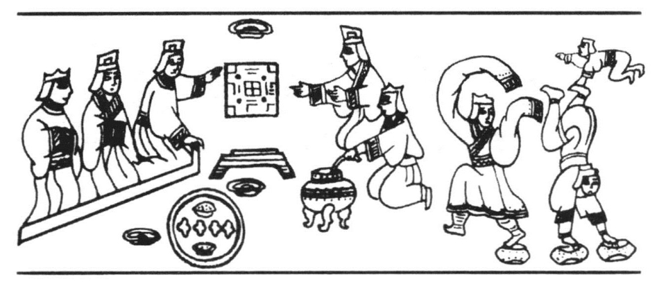
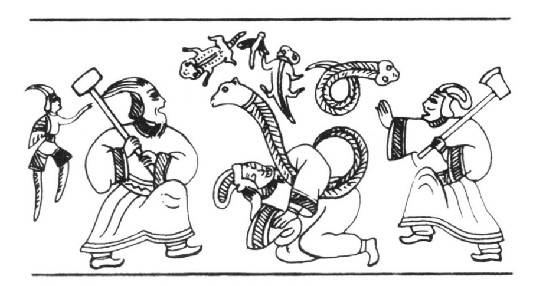

##### 三、汉代的音乐和歌舞

我们已经说过，汉初，民间流行着一种楚歌。楚歌的歌词既平易通俗，而又慷慨激越，有蹈水赴火之音[91]；所以那些没有文化修养的汉代新贵都喜好这种楚歌。特别是刘邦，他酷爱这种楚歌。叔孙通卑鄙龌龊而又不达时务，他费尽心力，作了一套古乐，想借此取得新皇帝的宠爱。但是他不知道古乐，大半多为乐神之乐；而新时代的新皇帝所需要的音乐则是乐人之乐。所以叔孙通所作的古乐，只是当作古物陈列在宗庙里。而新皇帝所喜爱的，还是他的唐山夫人所作的楚歌体的《房中乐》。[92]由此我们可以看出过了时的乐舞，也是不能存在的。同时，又可以看出逢迎献媚，臣不如妾也。

楚歌可以独唱，亦可合唱。如汉高祖发沛中儿百二十人，合唱《大风歌》，即合唱之例。同时配合楚歌，亦有楚舞。如汉高祖的宠姬戚夫人，即善楚舞。惟楚歌所用的乐器，似乎很简单。如汉高祖唱《大风歌》时，除筑以外，并没有其他的乐器。楚歌的曲子，存于今日者尚多，惟楚舞的内容如何，今无可考，大概系由楚人降神的巫舞中脱化而出。

一般说来，武帝以前汉代流行的歌舞，皆系楚歌、楚舞。到武帝时，随着国际商路的开通，边疆和外国乐舞的传入，于是汉朝的音乐和歌舞便起了很大的变化。最主要的是新的乐器的输入。新的乐器的出现，必然要改变歌舞的内容。正犹新的武器的发明，必然要改变军队的组织一样。我们知道，中国古乐中最主要的乐器是打击乐器，如钟鼓磬钲之类。像这一类的乐器，在今日的音乐中只是用于敲出音乐的节奏，并不能独立地奏出一种乐曲。固然在中国古乐中，也有笙簧一类的管乐，琴瑟一类的弦乐；但乐队的构成，还是非常简单。到武帝时，许多西域的乐器，如箜篌、觱篥、羯鼓、羌笛之类，都加入了汉朝的乐队。这新的乐器之输入，要求与之相适应的乐曲和歌词。为了改编乐曲和歌词，当时武帝设立一个音乐院，谓之曰乐府，派人到赵、代、秦、楚各地，采集民歌。民歌不一定都能协于新乐之律，于是当时的歌人李延年，遂奉派为协律都尉而出现为汉代的作曲名家。同时，司马相如等文学家，也就担负起雅化民歌的任务了。[93]

据说李延年曾造新声二十八曲，其后惟存十曲，其曲名曰《黄鹄行》《陇头吟》《出关》《入关》《出塞》《入塞》《折杨柳》《黄覃子》《赤之杨》《望人行》。从这些曲名看来，皆系当时远征军所唱的军歌，即所谓马上横吹之曲。而此种马上横吹之曲，正是胡羌之音，据说此种横吹之曲初由张骞自西域传入，其时惟有一曲曰《摩诃兜勒》。据此则李延年之曼声协律，并非全无所本，其所作新声，实即西域乐曲之拟作。

武帝时代，是汉代音乐与歌舞的转捩点，正因为这一时代是汉代政治、经济的转捩点。自此以后，迄于东汉之末，西域之道畅通，西域的乐曲，不断地传入中原，于是在中原地区古典的音乐中，注入了新的声律，从而又改变了中国古典歌舞的场面。

汉代的歌声，我们现在已经听不见了。当时美丽如花的歌女，我们即使能够偶尔碰见，也是一堆腐骨而已，她再也不能向我们唱出那清脆的歌曲了，但是汉代的乐器和舞蹈，却在汉石刻画像上留下不少的形象。这些形象几乎再现出当时轻歌曼舞的场面。

乐舞的画像，在武氏祠、两城山及南武阳石阙中，都可以看见。我们现在举几个例子。例如武氏祠左室第三石后段有一乐舞图，作九人：二人弹琵琶，一人抚琴，一人弹筝，一人吹直笛，一人吹排箫，一人舞，舞者以左手左足蹋鞠，而扬其右手右足，又二人手各持小棒，微屈其膝，立于舞者之两旁，作对唱状。从这幅画像上，我们不但可以看到舞态，而且仿佛有琵琶琴筝箫笛之音与歌者的歌声从画面中播送出来（插图五八）。

> 插图五八 汉代乐舞交作画像

又孝堂山第十石第二层有一图，作四人挽一鼓车；一人坐车击鼓；前一人屈一足跪地吹觱篥；后二人各顶一花盆，似兰叶；最后一人负剑。这显然是一个贵族家庭的小小鼓吹乐队（插图四九）。

又武氏祠前室第十石，有一宴会乐舞的画像。画像一端为舞蹈的表演。另一端为贵人宴客。歌舞者三人：一人两手蹋鞠倒竖，两足朝天；一人长袖蹋鞠而舞；又一人以一手撑在倒竖者之左足上，悬空而歌。宴会者五人，分东西坐，位于西者三人为宾，位于东者二人为主，宾主之间，有案，有盘，有盂，有三足罂，罂中有勺。我们看了这幅画像，再读班固《东都赋》中：“献酬交错，俎豆莘莘；下舞上歌，蹈德咏仁”之句，便觉恍然在画中（插图五九）。

乐舞画像近来在南阳汉墓中又大有发现。据滕固《南阳汉画像石刻之历史的及风格的考察》一文中所录，有如此的各种画面：

“存于石桥镇的一石，图作六人：一人击鼓，一人舞鼗，一人倒竖，三人作舞，中间一长袖者，蹋鞠而舞。”

存于“草店墓的楣石上有数景：一景八人，其中四人摇鼗，二人抱箭，二人坐。一景七人，一人击磬，二人击鼓，余坐。又一景九人，一人长袖蹋鞠舞，一人拂（巾）而舞，一人跪其右足，作唱讴状，一人抚琴，一人抱箭，余坐。此三景神情相属，望之隐隐作钟鼓声”。

“还有存于七孔桥的一楣石，宽约丈余，左面一部作贵人车骑，护卫森严。右部作乐舞，凡十人，自左至右，二人坐，一人倒竖，二人蹋鞠对舞，二人摇鼗，二人坐，一人击鼓。此作绘声摹影，与草店墓物，同属一风格，图像中作倒竖，作长袖舞，作抚琴，作击树鼓，作拂舞等。”

> 插图五九 献酬交错下舞上歌画像

又此类乐舞交作图，亦见于汉镜的花纹中。在汉镜中有一人物画像镜，此镜边缘饰以回龙舞凤之图案，镜背以钮为中心分为四格，四格虽各绘一事，然过细观察，实一乐舞图之各部。

其一格，正中立一人，张大袖而舞，扬其一足，衣褶分明，帽似簪花，衣有边缘。旁一人坐地抚琴，琴旁有一香炉，后有一剑。又二女子裸体，翻身而舞，细腰如线，似不胜乎罗绮，舞态轻盈，若仙女之乘风，嚼清商而却转，如惊鹤之出群（插图五十）。

在舞者之左右二格，各坐一贵人重席而坐。在左格，贵人左右，侍坐者各二人，有摇鼗者，其他亦各有执持，想系乐器。右格贵人之旁亦有二人侍坐，又有二女子垂手侍立，皆高髻大袖，细腰长裙。此二贵人大概为主人，侍坐者则为乐人或部从，垂手侍立之女子，则为婢妾。其又一格，则为门外车马，作两车相值，车皆驾以五马，圆盖而方轸，显系来赴宴会的宾客之所乘。

我们看了这些乐舞交作的画像，再读仲长统“妖童美妾，填乎绮室；倡讴伎乐，列乎深堂”[94]之句，便觉东汉豪人之家荒淫无耻的生活，如在目前。而桓宽所谓“中山素女，抚流徵于堂上；鸣鼓巴俞，交作于堂下”[95]的歌舞大会，也就跃然纸上了。

在以上歌舞交作诸画像中，最值得提出来讨论的，就是出现于汉人物画像镜上的裸体跳舞的图像。这种裸体跳舞，当然不是当时艺术家的空想之构图，而是当时实有其事。《汉书·广川惠王刘越传》云：广川王“去数置酒，令倡俳裸戏坐中以为乐”。按此所谓裸戏，除解释为裸体舞以外，没有其他的意义。此种裸体舞的画像近来在南阳石刻中，亦有发现，据滕固前文所录，有如次的一幅画像：“左一人右手持剑，直刺右一人之腿部；右一人左手持一匕首，作奔上势；中界飘带，动作甚为活泼，而持剑者又似裸体。”据此则在汉代，那些青年男女，实有裸体献技于贵族之前的事实，而这也就是尊孔崇儒的汉代贵族的“严肃生活”之写真（插图六一）。

中国自春秋时即有侏儒之舞。侏儒者，实为中国最古的优人，除歌舞外，又兼以笑谑竞技为事。此种侏儒之舞，在秦汉时代继续流行。如《史记·滑稽列传》曰：“优旃者，秦倡侏儒也”，《汉书·徐乐传》曰，“帷幄之私，俳优侏儒之笑”，皆其例证。侏儒之舞，近来亦在南阳石刻中发现。据滕固前文所录，在南阳发现一石刻画像（插图六十），作“右一男左手挟杖，右手伸拳，衣下拖出长巾。左一高髻大袖女子，向男跪，屈身伸臂作舞，左手挈一侏儒，亦作舞状”。从这幅画像上看来，颇像表演着一种简单的故事，也许就是最初的戏剧。

总上所述，汉代的音乐与歌舞，已经加进了不少外来的成分。以乐器而论，除箫鼓琴瑟之外，琵琶、箜篌、觱篥、羌笛已经加入了汉朝的乐队。以乐曲而论，新声曲已经加入了汉朝的乐谱。以舞蹈的姿态而论，已经不是猗欤那欤的连蜷之态，而是如傅毅《舞赋》中所谓：“浮腾累跪，跗蹋摩跌”；或如张衡《舞赋》中所谓：“抗修袖以翳面兮，展清声而长歌。”特别是裸体舞之出现，更足以说明当时的歌舞，受了野蛮种族的歌舞之影响。因为裸体舞是生活于较为原始的历史阶段中之歌舞的形式，此种歌舞的形式，在中原地区，亦曾存在过，但随着历史的进展，早已消灭了。尤其在儒家哲学支配一切文化思想的汉代，此种不合封建礼教的裸体舞决不会在本土再生长出来，因而确切地证明这是一种外来的歌舞形式。

> 插图六十 汉代倡优侏儒之舞画像

汉代的歌舞有着外来的成分，这是非常明白的。但究竟从何而来呢？历来学者以为来自巴俞。巴俞者，即今日之四川。而当时的巴俞之人，即所谓西南夷之支裔。如此说来，则汉代之新的乐舞乃来自南蛮。按汉代有巴俞舞当系事实，但如谓凡鸣鼓而舞者皆为巴俞舞，则我以为不然。因为鸣鼓而舞，乃系一般野蛮种族之通习，非仅巴俞之人为然也。证之外来的乐器，琵琶、觱篥，皆西域之乐，因而我以为汉代的乐舞，其所受于西域诸种族的影响，较之受于南蛮为多。

汉代不仅从西域传入了新的乐舞，而且又传入了新的西洋把戏。《史记·大宛列传》云：武帝元封六年安息“以大鸟卵及黎轩善眩人献于汉。……是时上方数巡狩海上，乃悉从外国客……大角抵，出奇戏诸怪物……及加其眩者之工，而角抵奇戏岁增变，甚盛益兴，自此始”。按角抵者，应劭曰：“角者，角技也；抵者，相抵触也。”据此，则武帝时已有安息的马戏班来到中国，表演角力、杂耍、戏兽等技艺。

又《后汉书·南蛮西南夷列传》云：安帝“永宁元年，掸国王雍由调复遣使者诣阙朝贺，献乐及幻人，能变化吐火，自支解，易牛马头。又善跳丸，数乃至千。自言我海西人。海西即大秦也，掸国西南通大秦”。大秦即罗马也。据此，则在东汉中叶，罗马的魔术团，也来到中国了。

关于汉代的外国马戏或魔术，张衡《西京赋》中说得很详细。他说，马戏和魔术表演的地点，大概都在广场之中。[96]有各种的节目，如角力、竞技、假面戏、化装歌舞、斗兽、魔术表演等。

《西京赋》中所谓：“乌获扛鼎，都卢寻橦，冲狭燕濯，胸突铦锋，跳丸剑之挥霍，走索上而相逢。”就是角力竞技的节目。所谓“总会仙倡，戏豹舞罴，白虎鼓瑟，苍龙吹篪”，就是假面戏。所谓“女娥坐而长歌，声清畅而蜲蛇；洪涯立而指麾，被毛羽之谶襹”，就是化装歌舞。所谓“熊虎升而拏攫，猨狄超而高援；怪兽陆梁，大雀踆踆；白象行孕，垂鼻辚困”，就是斗兽或戏兽。所谓“海鳞变而成龙，状蜿蜿以蝹蝹：含利颬颬，化为仙车；骊驾四鹿，芝盖九葩；蟾蜍与龟，水人弄蛇；奇幻倏忽，易貌分形；吞刀吐火，云雾杳冥；画地成川，流渭通泾”，这都是幻术的表演。又如所谓：“东海黄公，赤刀粤祝；冀厌白虎，卒不能救，挟邪作蛊，于是不售。”这又指明并有故事的表演。又如所谓：“突倒投而跟絓，譬陨绝而复联；百马同辔，骋足并驰。”这又指明有马术的表演。由此看来，当时马戏的内容，是何等的丰富。而且从“都卢寻橦”与“水人弄蛇”二语看来，当时的马戏班中，又有南洋群岛人及印度人参加，盖“都卢”为南洋之国名，而“弄蛇”，则为印度人的把戏。

以上各种把戏，在今日已不可复见。惟假面之戏及水人弄蛇尚保留在汉代石刻画像中。据滕固前文所录，谓在南阳发见一石，今存城北阮堂，图作：“左一人戴兽面，腰间置一长矛，张手蹲地作舞姿；右一人坐以相对，左手握刀（或他种兵械）。又左端有一侍者捧物。还有一石，今存于陇西寨，此石十分诡异。右端戴有角兽面的人执杖作俯蹶状，杖头有球状物。而其左面戴兽面的一人，持杖向其球作挑拨状。中部右面一戴兽面者以长矛刺其左面的大袖女人。左端坐一作四起髻的贵妇和其左的侍者作谈话状。此石六人，盖每两人一组，以显出其全景的动作。”按此种画像，就是当时假面戏的表演（插图六一）。

武氏祠左室第五石上层及下层，皆画弄蛇者。上层正中有一喇叭形之物立于地上，其上盘一蛇，头向上。蛇之左右，各立一人，作对话状，其右一人高冠后垂，为弄蛇者。在画之左右两端，各作二人皆作惊悸之状。下层一图（插图六二）作三人，中一人双膝并拢跪在地下，又以右臂着地，侧身蜷伏，两臂相交，右臂挟一蛇，蛇头竖立，蛇后盘曲。左右各一人，右一人长袍高冠后垂，左手持斧，出其右手与右足，开口作与左一人对话之状。左一人亦长袍，但不着冠，短发竖立，持一锤，张口作与右一人对话状。此外尚有一蛇飞舞于上，及四足蛇之类的东西点缀其中。在图之最左端，又有一有翼神。

> 插图六一 汉代假面戏画像

> 插图六二 汉代水人弄蛇画像

我们看了这些画像，因知张衡《西京赋》中所说的角觝之戏，并非虚妄之辞。
