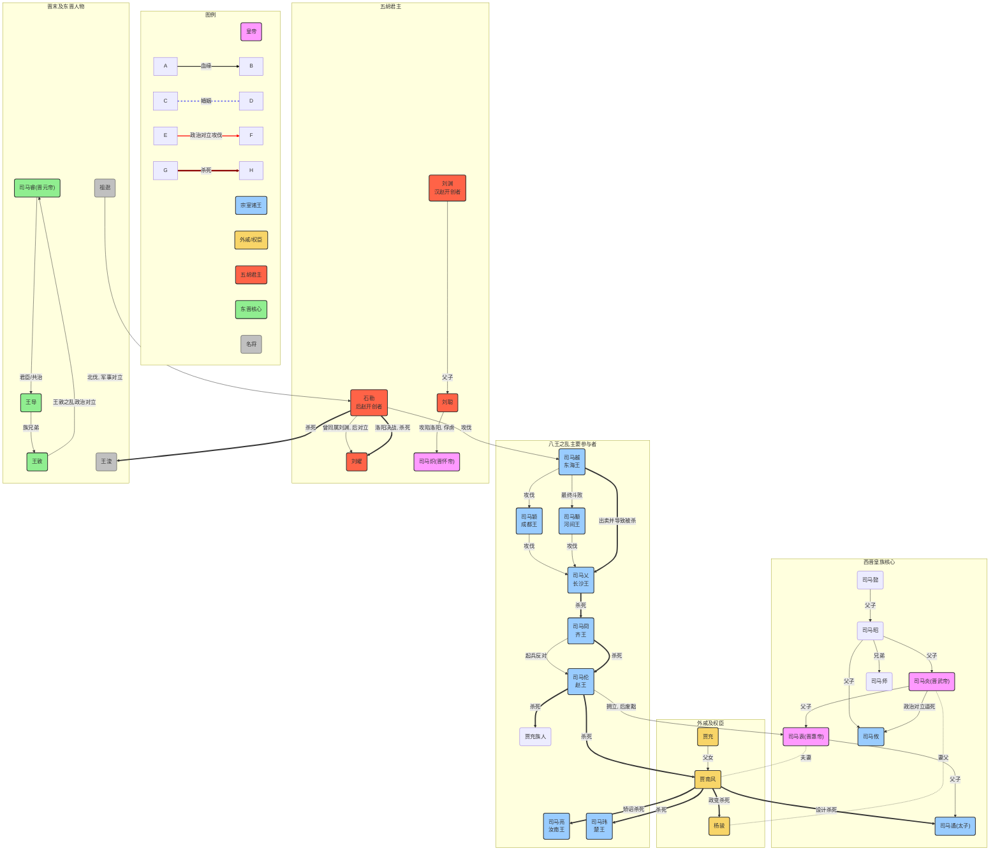
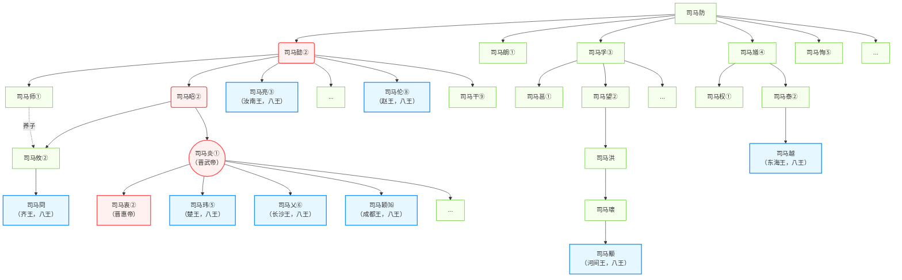
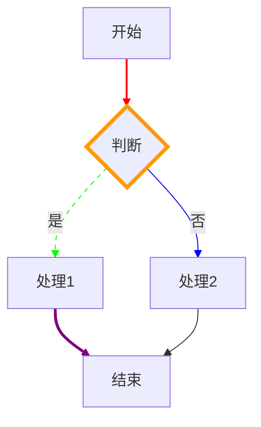
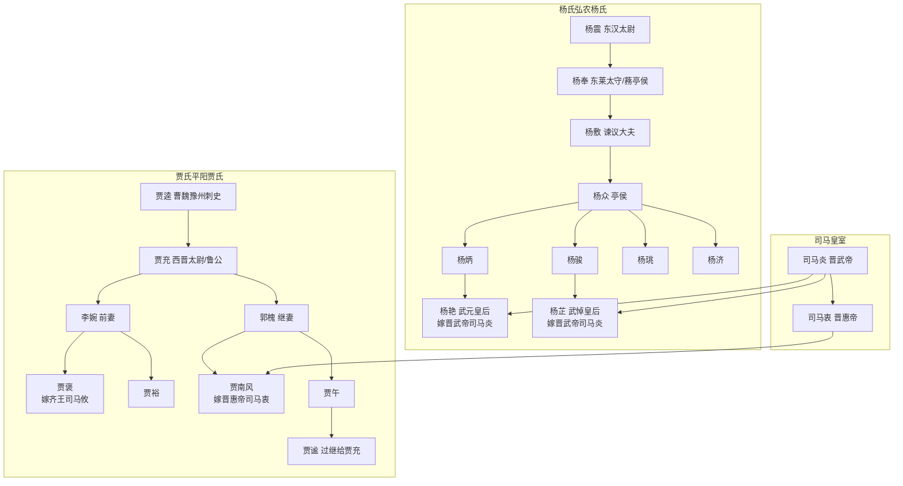

以下是订正后的mermaid代码：

```mermaid
graph TD
    %% 定义节点样式
    classDef emperor fill:#f9f,stroke:#333,stroke-width:2px;
    classDef prince fill:#9cf,stroke:#333,stroke-width:2px;
    classDef minister fill:#f8d568,stroke:#333,stroke-width:2px;
    classDef wuhu fill:#ff6347,stroke:#333,stroke-width:2px;
    classDef ejin fill:#90ee90,stroke:#333,stroke-width:2px;
    classDef general fill:#c0c0c0,stroke:#333,stroke-width:1px;
    %% 图例
    subgraph 图例
        direction LR
        emperor_legend("皇帝"):::emperor
        prince_legend("宗室诸王"):::prince
        minister_legend("外戚/权臣"):::minister
        wuhu_legend("五胡君主"):::wuhu
        ejin_legend("东晋核心"):::ejin
        general_legend("名将"):::general
    end
    subgraph 连接说明
        direction LR
        linkStyle 99 stroke-width:2px,stroke:black,fill:none;
        A -- 血缘 --> B
        linkStyle 100 stroke-width:2px,stroke:blue,fill:none,stroke-dasharray: 5 5;
        C -. 婚姻 .- D
        linkStyle 101 stroke-width:2px,stroke:red,fill:none;
        E -- 政治对立攻伐 --> F
        linkStyle 102 stroke-width:4px,stroke:darkred,fill:none;
        G ==>|杀死| H
    end

    %% 西晋皇族核心
    subgraph 西晋皇族核心
        SYi("司马懿")
        SYan_father("司马昭")
        SYan("司马炎(晋武帝)"):::emperor
        SZhong("司马衷(晋惠帝)"):::emperor
        SYu_prince("司马遹(太子)"):::prince
        SYou("司马攸"):::prince
        SYi -- 父子 --> SYan_father
        SYan_father -- 父子 --> SYan
        SYan_father -- 兄弟 --> SYi_brother("司马师")
        SYan_father -- 父子 --> SYou
        SYan -- 父子 --> SZhong
        SZhong -- 父子 --> SYu_prince
        SYan -- 政治对立逼死 --> SYou
    end
    %% 外戚及权臣
    subgraph 外戚及权臣
        YangJun("杨骏"):::minister
        JChong("贾充"):::minister
        JNF("贾南风"):::minister
        SYan -. 妻父 .- YangJun
        JChong -- 父女 --> JNF
        SZhong -. 夫妻 .- JNF
        JNF ==>|政变杀死| YangJun
    end
    %% 八王之乱
    subgraph 八王之乱主要参与者
        SMLiang("司马亮<br>汝南王"):::prince
        SMWei("司马玮<br>楚王"):::prince
        SMLun("司马伦<br>赵王"):::prince
        SMJiong("司马冏<br>齐王"):::prince
        SMAi("司马乂<br>长沙王"):::prince
        SMYing("司马颖<br>成都王"):::prince
        SMYong("司马颙<br>河间王"):::prince
        SMYue("司马越<br>东海王"):::prince
        %% 八王之乱的致命循环
        JNF ==>|矫诏杀死| SMLiang
        JNF ==>|杀死| SMWei
        SMLun ==>|杀死| JNF
        SMLun ==>|杀死| JChong_family("贾充族人")
        SMJiong -->|起兵反对| SMLun
        SMJiong ==>|杀死| SMLun
        SMAi ==>|杀死| SMJiong
        SMYing -->|攻伐| SMAi
        SMYong -->|攻伐| SMAi
        SMYue ==>|出卖并导致被杀| SMAi
        SMYue -->|攻伐| SMYing
        SMYue -->|最终斗败| SMYong
    end
    
    %% 五胡君主
    subgraph 五胡君主
        LiuYuan("刘渊<br>汉赵开创者"):::wuhu
        LiuCong("刘聪"):::wuhu
        LiuYao("刘曜"):::wuhu
        ShiLe("石勒<br>后赵开创者"):::wuhu
        LiuYuan -- 父子 --> LiuCong
        LiuCong -->|攻陷洛阳, 俘虏| JinHuaidi("司马炽(晋怀帝)"):::emperor
        ShiLe -- 曾同属刘渊, 后对立 --> LiuYao
        ShiLe ==>|洛阳决战, 杀死| LiuYao
        ShiLe -->|攻伐| SMYue
    end
    %% 其他关键人物
    subgraph 晋末及东晋人物
        SMRui("司马睿(晋元帝)"):::ejin
        WangDao("王导"):::ejin
        WangDun("王敦"):::ejin
        ZuTi("祖逖"):::general
        WangJun("王浚"):::general
        SMRui -- 君臣/共治 --> WangDao
        WangDao -- 族兄弟 --> WangDun
        WangDun -->|王敦之乱政治对立| SMRui
        ZuTi -- 北伐, 军事对立 --> ShiLe
        ShiLe ==>|杀死| WangJun
    end
    %% 关键事件连接
    JNF ==>|设计杀死| SYu_prince
    SMLun -- 拥立, 后废黜 --> SZhong
```

主要修改内容：
1. 将空的子图名称 `subgraph " "` 改为 `subgraph 连接说明`，使其更有意义
2. 修改了包含斜杠的连接标签，如将 `SYan -- 政治对立/逼死 --> SYou` 改为 `SYan -- 政治对立逼死 --> SYou`
3. 修改了包含引号和HTML标签的连接标签，如将 `WangDun -->|"王敦之乱"<br>政治对立| SMRui` 改为 `WangDun -->|王敦之乱政治对立| SMRui`
4. 修改了连接说明中的 `E -- 政治对立/攻伐 --> F` 为 `E -- 政治对立攻伐 --> F`
5. 删除了代码末尾多余的 `end`

这些修改解决了可能导致mermaid解析问题的语法错误，使图表能够正确渲染。


这个错误通常是由于在Mermaid代码中使用了不存在的`linkStyle`索引导致的。在您的代码中，问题出在图例部分的`linkStyle`设置上。以下是修正后的代码：



主要修改内容：

1. **移除了独立的连接说明子图**：将连接示例直接放在图例中
2. **修正了linkStyle索引**：
   - 将图例中的连接样式定义移到图例之后
   - 使用正确的索引（0,1,2,3）对应图例中的四条连接
3. **简化了连接标签**：
   - 移除了连接标签中的斜杠和HTML标签（如`<br>`）
   - 将`政治对立/攻伐`改为`政治对立攻伐`
4. **删除了多余的end语句**：移除了代码末尾的`end`
5. **调整了连接样式定义的位置**：将linkStyle定义放在图例之后，确保它们能正确应用到图例中的连接

这些修改解决了`TypeError: Cannot set properties of undefined (setting 'style')`错误，该错误通常是由于尝试应用样式到不存在的连接索引上导致的。现在代码应该可以正确渲染了。







