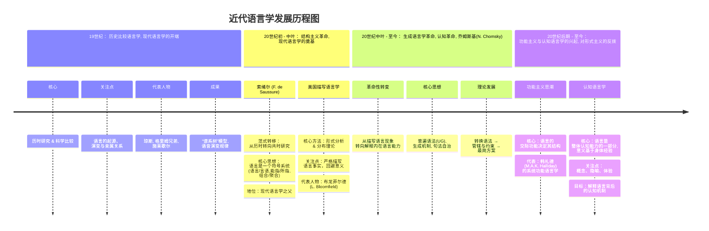

### 第一讲：人类独有的特性——语言

本讲主要介绍语言的基本概念，探讨了语言作为人类独有特征的本质、语言与民族及国家的关系、语言的分类方法，并阐述了语言的多种表现形式及其作为符号和结构系统的特性。

- 1.1 认识人类的语言
 - 为什么只有人类才有语言：人类语言与动物的“语言”（沟通方式）有本质区别。人类语言具有内容无限、功能多样和能够创造的特点。动物的信号系统通常由外界刺激引起，意义有限且形式固定。人类语言不仅用于交际，还具备标志、记录、思维和认知等高级功能，其核心在于能用有限的部件（音素、词）通过规则创造出无限的句子。
 - 语言和民族、国家的关系：语言、民族与国家的关系错综复杂，并非简单的一一对应。虽然语言常被视为民族或国家的标志（如汉语之于汉族），但“相互听懂”并非划分语言的绝对标准。例如，相互可懂的瑞典语和挪威语被视为两种语言，而相互差别很大的广东话和普通话同属汉语。西方语言学中“一个民族、一种语言、一个国家”的概念源于欧洲历史，并不普遍适用。同一民族/国家使用多种语言（如瑞士）或不同民族/国家使用同一种语言（如英语国家）的现象很常见。
 - 怎么根据语言的特点给语言分类：语言学主要有两种分类方法。一是**谱系分类法**（或亲属关系分类法），根据语言在语音、词汇、语法上的历史渊源，将语言划分为语系、语族、语支等层级，如印欧语系和汉藏语系。二是**形态分类法**（或结构类型分类法），根据语言的结构特征进行划分。例如，可分为通过词形变化表达语法意义的“形态语”（或称综合性语言，包括屈折语、黏着语等）和主要依靠语序和虚词的“孤立语”（或称分析性语言），汉语即属后者。

- 1.2 语言的各种表现形式
 - 语言和言语：遵循索绪尔的理论，区分为“语言”（langue）和“言语”（parole）。“语言”是社会共有的、抽象的规则系统，存在于人的大脑中；“言语”是个人具体的、可观察的说话行为和产物（言语动作和言语作品）。语言学通过研究具体的“言语”来探究抽象的“语言”系统。
 - 本体知识和外围知识：语言学研究可分为两个层面。“本体知识”研究语言系统内部的要素，如语音、词汇、语法、语义、语用等。“外围知识”则研究语言与外部现象的联系，如语言与思维、社会、文化、科技等的关系。现代语言学强调首先要明确和研究语言的本体。
 - 口语和书面语：口语是语言的第一性形式，任何语言都有口语，但并非都有书面语。书面语是在口语基础上产生的第二性形式，是经过提炼和加工的口语。书面语一旦形成便具有相对独立性，并能反过来影响口语。语言研究应以口语为主要和首要对象。

- 1.3 语言符号和语言结构
 - 语言的符号特性：语言是一种符号系统。其特性包括：1）由能指（声音形象）和所指（概念意义）构成，二者不可分割。2）能指与所指的联系是任意的、约定俗成的，没有必然的理据。3）语言符号具有相对的“不变性”（一旦约定俗成不能随意改变）和绝对的“可变性”（在历史长河中会缓慢演变）。
 - 语言的结构特性：语言符号系统具有严密的结构。其特性包括：1）**线性和离散性**：语言信号按时间顺序线性排列，并可切分为独立的单位。这使得用有限的音素组合成词，再用有限的词组合成无限的句子成为可能。2）**层次性和层级性**：语言单位的组合并非简单的线性相加，而是具有层次结构（如“我爸爸爱看电视”的内部组合关系）。同时，语言系统本身也分为语音、语法、语义等不同层级，各层级内部又有更小的单位（如语法层有语素、词、词组、句子）。3）**组合关系和聚合关系**：语言单位在线性序列中的横向搭配关系是“组合关系”；而在某一位置上可以相互替换的纵向关系是“聚合关系”。组合规则管搭配，聚合规则管归类，二者共同构成了语言结构规则的基础。

### 第二讲：研究语言的科学——语言学

本讲阐述了语言学的定义、任务、学科分类和研究取向，并回顾了语言研究的古代传统与现代思潮，旨在为语言学这门科学勾勒出一个整体轮廓。

- 2.1 语言学的任务
 - 社会的需要推动了语言学的发展：语言学的产生和发展始终服务于社会需求。早期为解读古典文献（形成中国的“小学”和欧洲的形态学）。近代随着民族国家的形成，推动了民族共同语建设和历史比较语言学。当代，濒危语言的抢救、多民族国家的语言规划，以及信息时代对自然语言处理的需求（如机器翻译、人工智能），都为语言学提出了新的任务和发展方向。
 - 语言学的学科分类和研究取向：语言学是一棵分支庞杂的“大树”。从研究对象看，可分为语音学、语义学、语法学、语用学、文字学、方言学等。从研究角度看，有生成语言学、功能语言学、认知语言学等。从应用领域看，则有应用语言学（包括语言教学、计算语言学、心理语言学、社会语言学等）。语言学兼具人文社会科学与自然科学、基础科学与应用科学的双重属性。学术界通常将其研究取向划分为四大板块：语言的本体研究（共时与历时）、语言与心理研究、语言与社会研究、语言学的应用研究。

- 2.2 语言研究的古代传统
 - 语言研究中的哲学思考：最早关心语言问题的是哲学家。古希腊和古中国都曾就“名”（名称）与“实”（事物）的关系展开辩论。哲学家们还探讨了语言与逻辑的关系，提出了主词、述词等早期语法概念。欧洲哲学家也对语言起源提出了多种假说（如感叹说、社会契约说）。
 - 语言研究中的语文传统：世界四大语文学传统（古印度、古希腊罗马、古代中国、古代阿拉伯）均起源于对经典文献的阐释。古印度有巴尼尼的《梵语语法》。古希腊罗马奠定了词类和句子成分分析的基础。古代中国形成了以文字学、音韵学、训诂学为核心的“小学”传统，代表作有《尔雅》《说文解字》《切韵》等。
 - 语言研究中的历史比较方法：19世纪欧洲兴起的历史比较语言学，通过科学比较不同语言间的语音对应规律，证明了语言的亲缘关系，建立了语言的“谱系分类”。它标志着语言学成为一门独立的现代科学，其代表人物有琼斯、葆朴、格里姆等，以及后来的“青年语法学派”。

- 2.3 语言研究的现代思潮
 - 语言的描写方法与结构语言学：以索绪尔的《普通语言学教程》为标志，语言学进入现代阶段。索绪尔明确了语言学的研究对象是语言系统本身（langue），并提出了一系列核心概念（语言/言语、能指/所指、共时/历时、组合/聚合）。其后发展的美国描写语言学（以布龙菲尔德为代表）建立了严格的形式分析方法论，如直接成分分析法（层次分析法）和分布分析法，对汉语语法研究产生了深远影响。
 - 语言的生成机制与生成语言学：20世纪中叶，乔姆斯基发起了“生成语言学革命”。其目标是探寻人类普遍存在、与生俱来的语言能力，即“普遍语法”（Universal Grammar）。该理论以“句法自治”为核心，认为句法是独立于语义和语用的计算系统。其理论框架从早期的“转换语法”发展到后期的“管辖与约束理论”和“最简方案”，形成了“原则与参数”的理论体系，即人类语言遵循共同的原则，差异则体现在少数参数的设置上。
 - 语言的认知功能与功能语言学：功能语言学是一股与形式主义（尤其是生成语言学）相对的思潮，强调语言的交际功能和认知基础。其中，以韩礼德为代表的系统功能语言学从社会交际角度出发，提出了语言的三大元功能。另一主要流派是认知语言学，它反对句法自治，认为语言能力是人类一般认知能力的一部分，语法结构植根于人的身体经验和概念构建，语义研究必须联系人的主观认知。

### 第三讲：语言的物质载体——语音

本讲系统介绍了语音学的基本知识，包括语音的定义、单位、记录符号，语音的物理、生理、心理和社会属性，以及分析语音的两种核心方法：“元辅音分析”和“声韵调分析”。

- 3.1 语音是语言的物质载体
    - 什么是“语音”：语音是由人的发音器官发出、用于交际并表达一定意义的声音。它既区别于风雨雷电等非人发出的自然声音，也区别于咳嗽、打嗝等不具备稳定交际意义的人体声音。语音是语言得以存在和传递的物质外壳。
    - 语音有哪些表现形式：语音单位具有层级性，从大到小依次为：音流（语段）、音段（句子）、节拍群（词组）、轻重音组（词）、音节（汉字/语素），以及最小的分析单位——音素。音素又可分为功能性的“音位”和物理性的“音素（音位变体）”。
    - 用什么办法记录语音：为记录转瞬即逝的语音，人类发明了多种方法。汉语历史上主要有直音法（读若等等）、反切法、注音字母（由来华传教士带来）和现行的汉语拼音方案。为了能精确记录世界上各种语言的语音，语言学界通用的是“国际音标”（IPA），它遵循“一个音素一个符号，一个符号一个音素”的原则。

- 3.2 语音的自然属性和社会属性
    - 语音的物理属性：声音由物体振动产生声波形成。语音的物理四要素为：1）**音高**（由频率决定）；2）**音强**（由振幅决定）；3）**音长**（由振动持续时间决定）；4）**音质**（又称音色，由复音中陪音的数量和振幅决定），是区别不同音素的最重要特征。
    - 语音的生理属性：语音由人的发音器官协同工作产生，分为三部分：1）**动力源**（肺部提供气流）；2）**发音体**（喉头内的声带，其振动与否决定语音的清浊）；3）**共鸣器**（咽腔、口腔、鼻腔，通过调节其形状产生不同音质）。
    - 语音的心理属性：语音的感知是一种心理现象，主观听觉与客观声学效果并非完全对应。大脑听觉中枢会对声音信号进行选择和概括，忽略非本质差异（如个人音色），提取能区别意义的特征。
    - 语音的社会属性：这是语音区别于一般声音的本质属性。语音必须与特定意义结合，这种音义结合是社会约定俗成的。一种语言中哪些音质差异能区别意义（构成不同音位），哪些不能，完全由社会选择决定，体现了语音的民族性和地域性。

- 3.3 “元辅音分析”和“声韵调分析”
    - 元辅音分析：这是适用于所有语言的音素分析法。音素分为**元音**和**辅音**两大类。元音发音时气流不受阻碍，声带振动；根据舌位高低、前后和唇形圆展可绘制“元音舌位图”进行分类。辅音发音时气流受阻；根据发音部位（如双唇、舌尖）和发音方法（如塞音、擦音、送气与否、清浊等）进行分类。
    - 现代汉语拼音（辅音）
        | 发音方式↓ | 发音位置→ | 双唇音 | 唇齿音 | 齿龈音 | 翘舌音 | 龈颚音 | 软颚音 |
        |------|------|------|-------|------|------|------|------|
        | 塞音 | 不送气 | b [p] |  | d [t] |  |  | g [k] |
        |      | 送气 | p [pʰ] |  | t [tʰ] |  |  | k [kʰ] |
        | 鼻音 | 浊音 | m [m] |  | n [n] |  |  | |   |
        | 塞擦音 | 不送气 |  |  | z [ts] | zh [ʈʂ] | j [tɕ] |   |
        |      | 送气 |  |  | c [tsʰ] | ch [ʈʂʰ] | q [tɕʰ] |   |
        | 擦音 | 清音 |  | f [f] | s [s] | sh [ʂ] | x [ɕ] | h [x] |
        | 近音 | 浊音 |  |  |  | r [ɻ] |  |   |
        | 边音 | 浊音 |  |  | l [l] |  |  |   |
    - 声韵调分析：这是汉语传统的音节分析法，将一个汉语音节（通常等于一个字）分解为**声母**（音节开头的辅音）、**韵母**（声母之后的部分）和**声调**（贯穿整个音节的音高变化）。没有辅音声母的音节被称为“零声母”音节。韵母内部又可分为韵头、韵腹、韵尾。声调则通过“调值”（实际音高变化）和“调类”（声调的类别）来描述。
    - 音节结构：汉语音节结构严密，通常为“(声母)+(韵头)+韵腹+(韵尾)+声调”的形式。例如：与其他语言（如英语）相比，汉语音节不允许出现复辅音（辅音连缀），且作为韵尾的辅音仅限于鼻音[n]和[ŋ]。
    - 汉语普通话音节结构层次构造图示：
        <table><tr><td colspan="4">声调</td></tr><tr><td rowspan="3">声母</td><td colspan="3">韵母</td></tr><tr><td rowspan="2">韵头</td><td colspan="2">韵</td></tr><tr><td>韵腹</td><td>韵尾</td></tr></table>

- 3.4 “音位”和“音素（音位变体）”
    - 为什么要建立“音位”：音位是从社会功能的角度对音素进行的功能性归纳，是一个抽象的音类，而构成这个音位的具体语音实体则是“音素（音位变体）”。例如，汉语拼音字母“a”是一个音位，它代表了[a]、[A]、[ɑ]等多个不区别意义的音素（音位变体）。
    - 怎么确定一种语言中的“音位”
        - 归纳音位主要遵循三条原则：1）**对立原则**：在相同语音环境中能区别意义的两个音素，分属不同音位。例如三和山，只有声母不同，韵母和声调全同。即最小对立体。2）**互补原则**：从不出现在相同语音环境中的两个音素，可归为一个音位。例如音素[a]、[A]、[ɑ]，它们不可能在“最小对立体”中共现。3）**语音近似原则**：处于互补关系的音素，还需在音质上相似才能归为一个音位。一个音位可被看作是一组“区别特征”的集合。
        - 音位的区别特征：区别通过一个或几个语音特征实现，如前面提到的元辅音发音发音特征。将复杂的语音属性简化为一系列二元对立的“是/否”判断。例如：我们先通过对立原则，认定波bō[po⁵⁵]、坡pō[pʰo⁵⁵]中的/p/和/pʰ/是两个独立的、不同的音位；随后，我们分析它们各自的发音特性，b/p/：双唇、不送气、清、塞音；p/pʰ/：双唇、送气、清、塞音。因而音位/p/和/pʰ/的本质区别在于[±送气]这个区别特征。这个特征就是它们能够区分“波”和“坡”的根本原因。

- 3.5 “语流音变”和“韵律节奏”
    - 语流音变：在连续的话语中，音节会因相互影响而发生音变。主要类型包括：同化、异化、弱化、脱落（统称“变音”）；声调因相邻声调影响而改变调值，如普通话的上声变调和“一”、“不”的变调（统称“变调”）；以及在音节末尾加上卷舌动作的“儿化”现象。
    - 韵律节奏：指大于音节的语音片段的整体节奏模式。主要包括：1）**停延**（停顿），用于换气、切分结构和表达情感。2）**轻重**（重音），包括词语内部的轻重音（如汉语轻声、英语词重音）和句子层面的重音（节律重音和强调重音）。3）**升降**（句调/语调），通过句末音高的升降变化表达陈述、疑问、感叹等不同语气。

### 第四讲：语言的书写符号——文字

本讲探讨了文字的本质、作用及其与语言的关系，介绍了文字符号的形式、文字的类型划分，并追溯了文字的起源、演变规律，最后重点讨论了汉字的历史、现状与改革问题。

- 4.1 文字是语言的书写符号
 - 为什么人类的语言要有“文字”：语言的口头形式受时间和空间的限制，声音一发即逝。文字的发明克服了这一局限，使信息得以远距离传播和长期保存。更重要的是，文字使得知识和经验得以积累和代代相传，极大地加速了人类文明的发展。
 - “文字”和“语言”是什么关系：文字是记录语言的符号系统，是“符号的符号”，处于第二性地位；语言（语音）是第一性的。不能将会认字等同于掌握了更高级的语言，也不能将文字（如汉字）与书面语或词语数量混为一谈。语言的特点对文字的形式有一定影响（如闪含语多为辅音字母），但并非决定性关系，同一种语言在不同时期可以采用不同的文字系统。

- 4.2 文字符号的形式和文字的类型
 - 什么才是文字的“字”：文字符号（字符）是与语言中某种单位（如音位、音节、语素）建立起确定、系统联系的书写图形。它区别于一般的符号、图画和仅起提示作用的“文字画”。文字的基本单位是“字符”，字符可分为“单纯字符”和由单纯字符构成的“复合字符”。
 - 文字有哪些不同的类型：文字系统主要分为两大类。一是**表音文字**（拼音文字），其字符与语音单位挂钩，包括与音节对应的“音节文字”（如日语假名）和与音素对应的“音素文字”（如拉丁字母）。音素文字又可细分为仅记录辅音的“辅音音素文字”（如阿拉伯文）和记录元音及辅音的“全音素文字”。二是**表意文字**，其字符与音义结合的单位（如语素、词）挂钩，现代汉字是典型的“语素文字”。由于表意文字的字符也表音，因此常被称为“意音文字”。关于汉字是否属于“象形文字”的说法是一种误解，“象形”仅是早期的一种造字方法，而非文字类型。

- 4.3 文字的起源和演变
 - 文字是怎么产生和演变的：文字起源于图画和契刻，经历了从象形符号到表意字符，再到兼表意音的字符的演变。世界三大古文字（苏美尔楔形文字、古埃及圣书字、中国甲骨文）都体现了这一过程。完全表音的“字母”是在表意/意音文字基础上，通过借用和改造产生的。腓尼基人首先创造了辅音字母系统，古希腊人在此基础上增加了元音字母，从而诞生了完整的音素文字系统。
 - “自源文字”、“他源文字”和“三阶段说”、“两方向说”：“自源文字”指独立产生和发展的文字（如汉字），通常是表意的；“他源文字”指借用其他文字而产生的文字（如拉丁字母），通常是表音的。关于文字发展规律，传统的“三阶段说”认为文字沿着“表意→音节→音素”的线性高级化路径演变。而“两方向说”则认为，意音文字之后的发展取决于语言特点，可能走向“表音化”，也可能（如汉字）走向更精致的“表意化”，二者是不同方向而非高低阶段。

- 4.4 古往今来话汉字
 - 汉字的过去：汉字是怎么产生和演变的：汉字的起源传说有“结绳记事”和“仓颉造字”，但科学考古将其源头追溯至约6000年前的陶器刻符。汉字经历了从“象形”、“指事”、“会意”等表形表意阶段，发展到通过“假借”和“形声”来兼顾表音的阶段。由于汉语单音节、少形态变化的特点，汉字最终没有走上纯表音道路，而是形成了以形声字为主体的意音文字体系。汉字字体也经历了甲骨文、金文、小篆、隶书到楷书的演变。
 - 汉字的今天：完备而又复杂的汉字大家族：现代汉字是一个复杂的系统。可从不同角度对其成员进行分类：从构造看，有“六书”中的象形、指事、会意、形声字；从形义关系看，有古今字、异体字、繁简字、同源字；从形音义关系看，有同音字、多音字。其中，形声字占绝大多数，其形旁（表意）和声旁（表音）的作用虽因历史演变有所弱化，但仍是汉字系统的支柱。
 - 汉字的“特点”和汉字的“优缺点”：汉字的主要特点（优点）包括：与汉语的语法结构基本适应、形音义统一、具有超时空性（利于古今和方言区交流）。其主要缺点是：缺乏完备的表音系统、字符数量多、字形结构复杂，导致“难认、难读、难写、难记”。
 - 汉字改革何去何从：汉字改革需审慎，但并非不需要。当前改革主要任务是“定量”（确定通用字、常用字）和“定形”（推行简化字、废除异体字）。关于长远的拼音化道路，学界尚有争议。目前，制定和推行《汉语拼音方案》作为辅助标音工具，是汉字改革的重要一步，但其最终方向仍取决于语言发展和社会应用的客观需要。

### 第五讲：语言的建筑材料——语汇

本讲将词和语（固定词组）的总和——“语汇”——比作语言的建筑材料。内容涵盖了语汇的定义与性质，词与语的分类系统，以及词语构造的复杂机制。

- 5.1 语汇是语言的建筑材料
 - 什么是“语汇”：语汇（或称词汇）是一种语言中所有“词”和“语”（固定词组、熟语）的总和。它是一个集合概念，是语言结构的三大要素之一。词是最小的、能独立运用的音义结合单位；语是由多个词构成、但意义和形式相对固定的语言片段，如成语、专有名词等。
 - 语汇有什么样的性质和特点：1）**任意性与理据性**：单个词的音义联系最初是任意的，但许多复合词和同源词的构成具有理据性。2）**普遍性与民族性**：所有语言都能表达人类共通的基本概念，但词语的具体内涵、外延和引申义又深刻反映了本民族的独特文化和认识方式。3）**活跃性与稳定性**：语汇是语言各要素中变化最快、最活跃的部分，新词不断产生，旧词不断消亡；但其核心部分——基本词汇——则相对稳定，保证了交际的连续性。
 - “语汇学”研究些什么内容：语汇学是研究语汇的构成、发展和规律的学科。其地位特殊，与语法学、语义学交叉。本讲中，语汇学主要研究语汇的类聚系统（词的分类）和语汇的构造形式（构词法）。

- 5.2 词语的“类聚关系”
 - 语汇系统中的“词”和“语”：语汇系统首先分为“词”和“语”两大类。“词”是语汇和语法的基本单位，其分类可从语法功能（词性）或语汇学角度（构造、来源等）进行。“语”是意义凝固、整体使用的固定词组或熟语，其分类主要依据自身的形式特点，如专有名词、成语、惯用语、谚语等。
 - 从多种角度看“词”的分类：
 - 音节数量：分为单音节词、双音节词、多音节词。现代汉语有明显的双音节化趋势。
 - 构造形式（语素数量）：分为“单纯词”（由一个语素构成，如“人”、“葡萄”、“巧克力”）和“合成词”（由两个或以上语素构成，如“火车”）。
 - 音形关系：分为同音词（音同形/义不同）、同形词（形同音/义不同）和同音同形词。
 - 来源性质：分为“基本词”（核心、稳定、构词能力强）和“一般词”。一般词又可细分为新造词、古语词、方言词、外来词（借词）。
 - 用途特点：分为“常用词”（使用频率高）和“非常用词”；“通用词”（全社会使用）和“非通用词/专用词”（如科技术语、行业语）。

- 5.3 词语构造的“魔方”
 - “语素”和“词”是什么关系：语素是最小的音义结合单位，是构成词的基础。语素可从不同角度分类：能否独立成词（成词/不成词语素）、能否独立使用（自由/黏着语素）、位置是否固定（定位/不定位语素）、意义虚实（实义/虚义语素）。英语等形态丰富的语言，语素还可分为词根、词缀（构词语素）和词尾（构形语素）。
 - “词”有哪些不同的构造形式：词的构造方式多种多样。
    - 成词：单个语素直接构成词（单纯词），如“人”、“in”；或通过词性转变、逆序、简缩等方式形成词。
    - 构词（语汇构词）：两个以上语素组合构成新词（合成词）。主要方式有：1）**复合**：由两个或以上词根构成，如“火车”、“blackboard”；2.）**派生**：由词根加词缀构成，如“桌子”、“worker”；3）**重叠**：通过语素重叠构成，如“爸爸”、“刚刚”。
    - 构形（语法构词）：通过附加词尾改变词的语法形式（如时、体、数、格），但不产生新词，常见于形态丰富的语言，如“works”、“worked”。
 - “语”有哪些构造特点：“语”（固定词组/熟语）的构造特点是**结构的固定性**（成分不能随意替换、增删、颠倒）和**意义的整体性**（整体意义往往不能从字面简单推导，常有比喻或典故义）。其内部结构基本是词组或句子的结构，但各有特殊格式，如汉语成语多为四字格，惯用语多为三字格。

### 第六讲：语言的结构规则——语法

本讲集中阐述了语言的骨架——语法。内容包括语法的定义与性质，语法研究的不同范畴与视角，语法的基本单位，以及语法结构的核心关系——聚合与组合。

- 6.1 语法是组词造句的规则
 - 什么是“语法”：语法是语言中关于词的构成、变化以及词组成词组和句子的规则总和。它本质上是母语者头脑中一种潜在的、约定俗成的直觉知识（语感），而非人为硬性规定。
 - 语法规则有什么样的性质和特点：1）**抽象性**：语法规则是对无数具体语言现象的归类和概括。2）**递归性**：有限的语法规则可以反复运用于结构中，生成无限的句子。3）**系统性**：各项语法规则相互关联、相互制约，构成一个严密的系统。4）**稳定性**：与语汇和语音相比，语法是语言系统中最稳定的部分，其演变极为缓慢。
 - 语法与其他语言现象有什么关系：语法并非孤立存在，它与语音（如重音、停顿、句调）、语汇（词义与搭配）、修辞、语境乃至逻辑都有着密切的联系，这些因素都可能影响语法规则的体现和运用。

- 6.2 语法和语法研究的“万花筒”
 - “语法”的两种含义：需区分客观存在的“语法规律”和语言学家主观研究后总结出的“语法规则”（即语法学）。后者因研究范围、目的、理论和方法的不同而呈现多样性。
 - 语法研究的分类：可从不同维度划分。1）**历时语法 vs. 共时语法**：前者研究语法的历史演变，后者研究特定时期的语法系统。2）**教学语法 vs. 信息语法**：前者面向人，追求简明实用；后者面向计算机，追求精确严谨。3）**普遍语法 vs. 个别语法**：前者探索人类语言的共性规律，后者描写特定语言的个性特征。
 - 语法现象的划分：传统上分为**词法**（研究词的形态变化和分类）和**句法**（研究句子结构）。结构主义语法分为**组合规则**（管搭配）和**聚合规则**（管替换和归类）。形式语法分为**核心语法**（纯句法规则）和**外围语法**（与词汇、语义等相关的部分）。
 - 大大小小的语法单位：语法单位有层级之分，从小到大依次是：**语素**（构词单位）、**词**（造句单位）、**词组**、**句子**（表达单位）和**句组/篇章**。其中，词和句子是连接各层级的核心单位。

- 6.3 “形式”和“意义”：这一面和那一面
 - 语法形式和语法意义的关系：二者如纸之两面，不可分割。语法形式是能够体现一类共同语法意义的形式手段；语法意义是由一类共同语法形式所体现的意义。
 - 主要的语法形式（语法手段）：1）**词法手段（综合性手段）**：通过词本身的变化表达语法意义，如词形变化（附加词缀、内部屈折）、词的轻重音、词的重叠。2）**句法手段（分析性手段）**：通过词的组合方式表达语法意义，如使用虚词、词类选择、语序和句调。
 - 主要的语法意义（语法范畴）：1）**词法范畴**：主要由词形变化表示，如体词的性、数、格、定与不定；谓词的时、体、态、人称。2）**句法范畴**：主要由句法手段表示，如词的类别意义（词性）和结构关系意义（主谓、动宾等）。

- 6.4 “聚合”和“组合”：竖着看和横着看
 - 词的聚合（词类）：词类是具有相同分布（即可以出现在一系列相同语法位置上）的词的聚合。划分词类的标准主要有形态标准、意义标准和分布标准。对于汉语这类缺少形态变化的语言，分布标准是根本标准。词类系统具有普遍性（各语言都有名词、动词等）和特殊性（汉语的量词、区别词等）。
 - 词的组合（词组）：词与词按照一定规则组合成词组。词组类型主要有：主谓、动宾、偏正、动补、联合等基本词组，以及介词词组、数量词组等特殊词组。复杂的词组具有层次性，可通过层次分析法进行切分。
 - 句子的聚合（句类）：句子是基本的表达单位，可从不同功能角度进行聚合分类。1）**句型类**（结构分类）：分为主谓句（又可细分）、非主谓句等。2）**句式类**（变换分类）：分为基本句和由基本句通过移位、增删、替换等变换构成的特殊句式（如被动句、把字句）。3）**功能类**（用途分类）：分为陈述句、疑问句、祈使句、感叹句。4）**简繁类**：分为单句（包括复杂单句）和复句。

### 第七讲：语言的表达内容——语义

本讲深入探讨语言的灵魂——语义。内容涉及语义的定义与性质、语义学在语言系统中的地位，并重点分析了词义的构成要素、词义之间的关系（如同义、反义），以及句子意义的构成和分析方法。

- 7.1 语义是语言形式表达的内容
 - 什么是“语义”：语义是语言形式所表达的内容。它可分为：1）**语汇意义** vs. **语法意义**；2）**语段意义**（字面意） vs. **语用意义**（言外之意）；3）**理性意义**（概念、思想） vs. **非理性意义**（情感、态度）。狭义的语义学主要研究语段意义中的理性意义。
 - 语义有什么样的性质和特点：1）**概括性**：无论是词义还是句义，都是对现实世界某一类对象或现象的概括反映，而非对个体的精确指称。2）**模糊性**：许多词义的边界是不清晰的，具有“中间精确，边缘模糊”的特点，这为语言的灵活性和表达效率提供了保障。3）**民族性**：不同民族由于文化、历史、思维方式的差异，对同一客观事物的认知和划分可能不同，导致不同语言的词义内涵、外延和引申方式存在差异。
 - 在语言系统中如何处理语义问题：语义研究在语言学中地位重要但处理方式不一。为保证研究的系统性，需要将语义从语音、语法中独立出来，但又要与它们紧密联系。语义学研究需区分语言意义与非语言意义（如百科知识）、语法意义、语用意义，其核心研究对象是词义和句义。

- 7.2 词义构成的各个要素
 - “义类”：词语中两种不同类型的意义：词义包含**理性意义**（对客观或主观对象的反映，分为通俗意义和科学意义）和**非理性意义**（即附加色彩）。非理性意义主要包括感情色彩（褒义、贬义、中性）、语体色彩（口语、书面语）和形象色彩（由词的构成成分引发的联想）。
 - “义项”：一个词语形式的不同意义：一个词语形式可以有多个相互关联的意义，每个意义即为一个“义项”。词典编纂即是对词的义项进行划分和释义。多义词的各义项间存在联系，可分为**本义**（最初的意义）、**基本义**（最常用的意义）和**引申义**。引申主要通过**借代**（基于相关性）和**比喻**（基于相似性）两种方式实现。
 - “语素义”：语素义的组合和词义：合成词的词义由其构成语素的意义组合而成，但并非简单的“1+1”相加。有时词义等于语素义的直接组合或引申组合；有时词义只保留了部分语素的意义（偏义复合词）；有时则因典故、比喻或语素义晦涩、失落，导致词义难以从字面直接推导。
 - “义素”：词义的区别特征：借鉴音位学的区别特征理论，一个词的义项可以进一步分解为一系列最小的语义特征，即“义素”。通过义素分析，可以精确地揭示词义间的异同和组合的语义限制条件。

- 7.3 根据词义的异同给词语归类
 - “单义词”和“多义词”：根据义项数量，词可分为只有一个义项的“单义词”和有多个关联义项的“多义词”。多义现象是语言经济原则的体现，也是词义发展的主要方式。
 - “同义词”和“反义词”：
 - 同义词指意义相同或相近的一组词。可分为词义完全相同的**等义词**和意义有细微差别的**近义词**。近义词之间的差别主要体现在理性意义（范围、侧重、程度）和非理性意义（感情、语体、形象色彩）上，这些差别决定了它们在搭配和使用上的分工。
 - 反义词指意义相反或相对的一组词。可分为非此即彼的**绝对反义词**（基于矛盾关系，如“生-死”）和存在中间状态的**相对反义词**（基于反对关系，如“冷-热”）。
 - “语义场”：指由一组在意义上相互关联、具有共同类属义素的词语构成的集合，如同一个“词语家族”（如“桌子、椅子、柜子”同属[家具]语义场）。语义场内部的词义相互补充、相互制约，其结构反映了特定语言对某一概念领域的划分方式。

- 7.4 句子的意义和句子的语义分析
 - 句子包括哪几种意义：句子本身的语段意义主要由三部分构成：1）**语汇意义**（句子中词语本身的意义及词语间的搭配意义）；2）**关系意义**（由语法结构关系和语义结构关系赋予的意义）；3）**语气意义**（通过句调、语气词等表达的陈述、疑问、祈使等功能意义）。
 - 句子的“语义结构”：句子的核心语义结构是一个由“谓词”（通常是动词或形容词）和若干个“论元”（通常是名词性成分）构成的“论元结构”。论元的数量和性质由谓词的语义决定。句子中成分之间的“语义指向”（哪个成分与哪个成分发生语义联系）和各成分的“语义角色”（如施事、受事、工具）及“语义特征”（如[+人]、[+持续]），是分析句义的关键。
 - 句子为什么会有“歧义”和怎么分化歧义句：“歧义”指同一个语言序列可以有两种或以上不同的理解。它区别于语义的“模糊”和“笼统”。歧义产生的原因多样，主要包括语汇歧义（由同音词、多义词造成）和组合歧义（由语法结构层次、关系或语义结构关系不同造成）。在实际交际中，歧义可通过语音手段（停顿、重音）、语境和语法手段（替换、添加、变换）来消除。

### 第八讲：语言的运用特点——语用

本讲探讨了语言在实际运用中所呈现的规律和特点，即语用学。内容涵盖语用学的研究目标与范围、语境对语句意义和话语结构的影响、会话合作原则与礼貌原则，以及言语行为理论和语用法的语法化现象。

- 8.1 语言的运用与语用学
 - 为什么要研究语言的运用问题：语言不仅是抽象的结构系统，更是社会交际的工具。许多语言现象（如言外之意、语境依赖等）无法仅靠句法和语义层面来解释，必须考察语言在实际使用中的规律，这正是语用学产生的原因。
 - 语用学主要研究什么问题：语用学研究语言符号与使用者之间的关系，即研究在特定语境中语言如何被使用和理解。其核心研究内容包括：词语的**指示与指称**、**言语行为理论**和**会话含义理论**。
 - 语用学与语言学其他学科的联系和区别：语用学与语义学、社会语言学、心理语言学等密切相关。与语义学相比，语用学更关注非字面意义、非真值条件意义，即“言外之意”。与修辞学相比，语用学更侧重交际功能的规律，而非文学表达的技巧。

- 8.2 语境与语句意义和话语结构
 - 语境的作用：语境是理解和使用语言的决定性因素。**狭义语境**（语言语境，即上下文）有助于确定多义词的义项、补全省略成分和消除结构歧义。**广义语境**（非语言语境，包括交际的时间、地点、参与者身份、文化背景等）则决定了语句的具体所指和言外之意。
 - 语境与词语所指的解释：语境是确定词语所指的关键。语用学区分两种所指关系：1）**指示**：指代词、时间/地点副词等词语的意义依赖于说话情景（以说话人为中心），如“我、这里、明天”。2）**指称**：一般名词在话语中与具体对象的联系，分为有指/无指、定指/不定指、任指/全指等类型。
 - 话语的篇章分析和会话分析：大于句子的语言片段称为**话语**，分为独白的“篇章”和对话的“会话”。**篇章分析**研究句子间的衔接（cohesion）与连贯（coherence），包括主题推进模式和词汇、语法等衔接手段。**会话分析**则研究由“话轮”构成的对话结构、话轮转换规则以及插话、修正等调节手段。

- 8.3 会话准则和会话含义
 - 会话的准则：为了有效交际，人们会自觉或不自觉地遵守某些准则。
 - 合作原则（格赖斯提出）：包括四条准则：**质**（真实）、**量**（适量）、**关系**（相关）、**方式**（清晰）。
 - 礼貌原则（利奇提出）：作为合作原则的补充，包括得体、慷慨、赞誉、谦逊、一致、同情等准则，旨在维持和谐的人际关系。
 - 违反会话原则与“会话含义”：在交际中，人们有时会故意违反合作原则，其目的并非不合作，而是为了表达一种超出字面意义的隐含信息，即**会话含义**。听话人能根据共享的合作原则，推导出说话人的言外之意。这是语用推理的核心机制。
 - “蕴含义”和“预设义”：这两种特殊的会话含义，性质介于语义和语用之间。**蕴含义**指句子字面内容逻辑上包含的意义，分为固定的“衍推义”和可被语境取消的“隐含义”。**预设义**是句子说出时所依赖的背景信息，其特点是在句子被否定后通常仍然成立，但也可在特定语境中被消除。

- 8.4 言语行为和语用法的语法化
 - 语句类型与言语行为：遵循奥斯汀和塞尔的理论，说话不仅仅是描述事实（言有所述），更是在实施行为（言有所为）。任何话语都包含三个层面：**述事行为**（说出句子的行为）、**行事行为**（通过说出句子所实施的行为，如命令、请求、承诺）和**成事行为**（话语对听者产生的影响）。行事行为是核心，分为**直接言语行为**（句子形式与功能直接对应，如用祈使句表命令）和**间接言语行为**（用一种句子形式实施另一种功能，如用疑问句表请求），后者是礼貌原则的重要体现。
 - 语用法的语法化：语言在长期使用中，某些出于语用目的（如礼貌、委婉）而产生的临时用法或间接表达方式，会随着时间的推移而逐渐凝固、简化，最终演变为固定的语法规则或结构。例如，英语中用于建议的“Why not do sth?”句式，就是从完整的疑问句“Why don't you do sth?”在特定语用功能下逐渐语法化而来的。这体现了语言用法对语法结构的塑造作用。

### 第九讲：语言的发展和变化

本讲探讨了语言的动态维度，内容包括语言的起源与早期发展，语言系统内部及外部的演变规律，以及语言随社会分化与统一而呈现出的宏观变化图景。

- 9.1 语言的产生和发展
 - 语言是怎么产生和形成的：关于语言起源，古代有“神授说”，近代有“人创说”（包括摹声说、感叹说、手势说等）。恩格斯提出“劳动创造了语言”，认为劳动产生了交际的需要，并促进了思维和发音器官的进化，为语言产生提供了社会、心理和生理三大条件。现代科学研究（如对灵长类动物、古人类化石的研究）进一步证实，人类语言大约在4-5万年前的晚期智人时期产生，是从原始的叫唤声等交际手段逐步演化而来的。
 - 语言是怎么发展和演变的：语言是不断发展演变的。这种演变体现在语言系统的各个层面：**语音**（如古今音变）、**语汇**（新词产生、旧词消亡）、**语义**（词义的扩大、缩小、转移）和**语法**（语序、句法规则的变化）。语言发展演变的根本原因是社会的变化，包括社会进步、社会的分化与统一、以及不同社会间的接触。同时，语言系统内部各要素的相互制约（系统压力）也是推动演变的重要内因。语言的演变具有两大特点：**渐变性**（为保证交际的稳定性，变化是缓慢的）和**不平衡性**（语汇变化最快，其次是语音，语法最慢）。

- 9.2 语言的分化和统一
 - 语言是随着社会的分化而分化的：
 - 地域方言：统一的语言会因社会的地域分化（如人口迁徙、地理隔绝）而产生地域变体，即方言。汉语七大方言（官话、吴、湘、赣、客、粤、闽）的形成就与历史上的人口迁徙密切相关。方言间的差异体现在语音、词汇和语法等各个方面，但由于同出一源，语音上仍存在规律性的对应关系。
 - 亲属语言：当方言区所属的社会完全分裂成独立的政治实体后，方言可能上升为独立的语言，这些从同一母语分化出的语言互为“亲属语言”。根据亲属关系的远近，可将语言划分为语系、语族、语支，即“语言的谱系分类”。
 - 社会方言：在同一地区内，因阶级、职业、年龄、性别、文化程度等社群差异而形成的语言变体。它不像地域方言有独立的系统，主要表现为用词和表达风格上的某些特点，如行业语、黑话（隐语）等。
 - 语言是随着社会的统一而统一的：
        *   随着社会经济、政治、文化的统一，方言分歧会成为交际障碍，从而产生对统一语言的需求。
        *   语言的统一并非消灭方言，而是通过推广**民族共同语**来实现。共同语通常在某一个具有政治、经济或文化优势的方言（基础方言）上形成。例如，普通话就是以北京语音为标准音、以北方方言为基础方言形成的。
        *   共同语经过规范化，制定出明确的标准，就成为**民族标准语**。共同语的普及是一个长期的过程，它会引导各方言向其靠拢，并逐渐扩大使用范围，最终实现语言的统一。

- 9.3 语言的接触和影响

本节探讨了不同语言或方言因社会接触而产生的相互影响及其结果，主要包括借用、并存、转用和混合四种情况。

- 语言的“借用”： 这是语言接触最普遍的现象，主要表现为词语的借用（外来词/借词）。借词方式包括纯音译（如“沙发”）、半音译半意译（如“啤酒”）、音译兼意译（如“可口可乐”）。与借词相对的是“意译词”和“仿译词”。不同语言对借词的接受程度不同，汉语更倾向于意译和改造。除了词语，语音成分和语法规则也可以被借用。
- 语言的“并存”： 指一个社群中两种或多种语言（或方言与共同语）并用的现象，即“双语（多语）现象”或“双言现象”。这是由民族杂居、外语教育等多种社会原因造成的。双语现象不等于“双语制”（国家的法律规定）。
- 语言的“转用”： 指一个民族（全部或部分）放弃母语而改用另一种语言的现象。这是实现语言统一的另一重要方式。语言转用通常发生在人口、经济、文化占优势的民族与相对弱势的民族之间，并且经历一个从单语到双语，再到新的单语的漫长过程。被替代的语言往往会在替代语言中留下一些底层成分。
- 语言的“混合”： 在特定语言接触环境中，可能产生一种混合多种语言成分的新交际工具。
 - 洋泾浜语（皮钦语）：母语不同的人群在有限的交际中（如贸易）形成的一种结构简化、词汇有限的混合语。它不是任何人的母语。
 - 克里奥耳语：当洋泾浜语成为某一社群的母语后，其词汇和语法会迅速复杂化、系统化，从而发展成为一种完备的、新的语言。

### 第十讲：语言的规划和规范

本讲论述了社会对语言进行的有意识、有组织的管理和干预，即语言规划与规范。内容包括其主要任务、特点，以及在确定官方语言、推广共同语、制定民族语言政策和进行文字改革等方面的具体实践。

- 10.1 语言规划和规范的主要内容
 - “语言规划”的特点：语言规划是政府或专门机构对社会语言生活的人为干预，具有政策性和社会性。它关系到国家的统一、经济文化的发展乃至社会稳定，是政治问题的重要组成部分。
 - 怎样选择一个国家的“官方语言”：新兴独立国家或多民族国家面临选择官方语言的任务。选择原殖民宗主国语言可能便利国际交往，但有损民族文化发展；选择本土语言则需考虑其通行范围和发展水平。各国实践各不相同，有的采用多语制（如新加坡），有的采用单语制（如中国以汉语为官方语言）。
 - “民族共同语”怎样加以推广和规范：建设民族共同语需要**推广**和**规范**两方面工作。**推广**主要依靠国家政策和法律力量，通过教育、传媒等途径扩大其使用范围。**规范**则是为共同语制定明确的标准（如普通话的“三标准”），并对语言中出现的新现象进行评价和引导，形成动态的规范观。
 - “民族语言政策”的具体内容：主要指对待国内少数民族语言的政策。核心内容包括：1）保障少数民族语言文字的法律地位平等；2）保障少数民族接受本民族语言教育的权利，并推行双语教育。

- 10.2 文字的创制与改革
 - “文字创制”：指为没有文字的语言创制文字系统。20世纪，许多新兴国家和我国政府都曾为少数民族创制以拉丁字母为基础的拼音文字。此项工作需综合考虑方言基础、民族意愿和社会使用价值等复杂因素，成功推广并非易事。
 - “文字改革”：指对已有的文字系统进行改造。其动因是文字的稳定性跟不上语言的演变，导致文-语脱节或内部混乱。改革方式有三类：1）**局部调整**：不改变文字系统，仅调整规则或个别字符，如汉字简化。2）**字符替换**：文字类型不变，但更换字符体系，如土耳其文从阿拉伯字母改为拉丁字母。3）**系统改变**：改变文字类型，通常是从意音文字变为表音文字，如越南文从“字喃”变为拉丁化拼音文字。
 - 汉字改革何去何从：汉字改革需兼顾其文化遗产价值与工具实用性。当前的任务是**定量**（确定通用字、常用字范围）和**定形**（推行简化字、整理异体字）。关于汉字最终是否走向拼音化，学界尚无定论，这是一个需要极其审慎、并取决于语言自身发展和社会客观需求的长期过程。目前，《汉语拼音方案》作为辅助标音工具，是汉字改革的重要步骤。

- 10.3 全社会都要关心语言文字问题
 - 动态的语言文字规范观：语言规范不是一成不变的，而应是动态的。规范工作需要：1）在制定标准时**排除**方言土语等例外现象。2）尊重语言发展的**约定俗成**规律，对民众普遍使用的新用法、新读音予以承认。3）对新出现的语言现象采取**兼容并蓄**的态度，允许在特定范围（如文学、网络）内存在一定的灵活性。
 - 关注社会语文生活：语言规范的成功依赖于全社会的共同参与。当代社会出现了许多值得关注的语文现象，如“汉外混用”、网络用语、时尚词语等。对待这些现象，既不能简单粗暴地禁止，也不能放任自流，而应在承认其存在合理性的同时，通过教育和媒体进行积极引导，鼓励社会公众共同建设一个健康、文明的语言环境。

### 第十一讲：语言的获得和学习

本讲探讨了人类掌握语言的两种不同途径：“语言获得”（Language Acquisition）和“语言学习”（Language Learning），分析了儿童语言获得的过程与动因，并比较了外语学习与母语学习的特点与方法。

- 11.1 人是怎么“掌握”语言的
 - 什么是“语言获得”与“语言学习”：“语言获得”指儿童在自然语言环境中，通过内在的、非有意识的过程掌握母语的能力。它更像是一种本能的、创造性的发展过程。“语言学习”则是指通过有意识的、外在的教学和练习来掌握一种语言（无论是母语的深入学习还是外语的学习）。
 - 语言能力中哪些需要“获得”，哪些需要“学习”：儿童期掌握母语的听说能力和日常交际能力，主要依赖“获得”。而成年后对母语读写、文学语言能力的深化，以及外语的学习，则主要依赖“学习”。二者并非截然分开，儿童掌握母语后期也需要学习，成人学习外语后期也需要获得过程的参与。

- 11.2 “语言获得”的过程和原因
 - 儿童获得语言的过程：儿童语言获得遵循一个大致普遍的顺序和阶段：
        1.  **语言前阶段（0-1岁）：** 包括非自控的哭、笑和后期的“咿呀学语”，此阶段主要发展语音感知能力。
        2.  **单词句阶段（约1岁）：** 开始说出有意义的单词，一词代一句。
        3.  **双词句阶段（约1.5-2岁）：** 将两个词组合，开始形成初步的语法关系。
        4.  **电报句阶段（约2-2.5岁）：** 能说出多个实词构成的简单句，但缺少虚词和形态变化。
        5.  **成人句阶段（约2.5岁以后）：** 开始掌握虚词、复杂句式和语法规则，语言系统基本完善。
 - 儿童获得语言的主要条件：对于儿童为何能迅速掌握语言，主要有两类解释：
 - 外部条件论：强调后天环境的作用。包括“模仿说”（儿童模仿成人语言）和“强化说”（成人的正负反馈塑造儿童语言行为）。但这两种理论无法解释儿童语言的创造性和系统性错误。
 - 内部条件论：强调先天因素。以乔姆斯基为代表的“天赋说”认为，人类大脑中存在与生俱来的“普遍语法”或“语言获得机制”（LAD），儿童只需在语言环境中将其激活。“认知说”则认为，语言能力是儿童整体认知能力发展的一部分，语言发展与思维发展同步。

- 11.3 “语言学习”中的外语学习和母语学习
 - 外语学习的特点和方法：
 - 特点：1）**基础性**：需从零开始系统学习语音、词汇、语法等基础知识。2）**交叉性**：学习者已有的母语知识会对外语学习产生影响，既有帮助（正迁移），也有干扰（负迁移）。3.）**多元性**：学习者、学习环境和教学方法多样。学习过程中会出现独特的“中介语”系统。
 - 方法：主要教学法流派有注重规则讲解和读写的“翻译-语法法”，以及注重听说和情景模仿的“听说法”、“交际法”等。
 - 母语学习（语文教学）的特点和任务：母语教学是在已具备基本听说能力的基础上进行的更高层次的学习。其任务包括：
        1.  **打牢语言基础：** 从听说能力发展到读写能力，巩固和补充语言知识。
        2.  **培养读写与思维能力：** 发展高级的阅读欣赏和书面表达能力，并将语言作为逻辑思维的工具。
        3.  **提高文化素质和建设语言文明：** 学习规范、得体、文明地使用语言，使语言成为个人文化素养的体现。
 - 语言学习和语言词典：词典是语言学习的重要工具。需区分主要解释事物概念的“知识词典”（百科词典）和主要解释词语本身意义和用法的“语言词典”（语文词典）。正确选择和使用不同类型的词典，是提高语言能力的关键。

### 第十二讲：语言与思维活动

本讲探讨了语言与人类高级认知活动——思维的复杂关系，内容包括思维的定义，学界关于二者关系的主要争论（起源先后、范围对应、主导作用），以及语言在人类认知活动中扮演的关键角色。

- 12.1 人是靠语言来“想”问题的
    *   “思维”可广义地理解为人类“想问题”的过程，既包括“思考”这一动态的心理活动，也包括“思想”这一静态的认识结果。
    *   语言是思维最重要的工具和物质载体。如同工具之于劳动、仓库之于粮食，语言不仅是进行思维活动（如形成概念、判断、推理）的手段，也是固化和传递思维成果（知识、思想）的载体。

- 12.2 关于“语言与思维关系”的争论
 - 先有思维还是先有语言：对此有三种主要观点：1）**独立说**：认为二者各自发展，思维可脱离语言。2）**同步说/同一说**：认为二者同时产生，思维即无声的语言。3）**思维先于语言说**：认为人类先具备了思维能力，之后才产生了语言。现代科学研究（如古人类学、儿童心理学、病理语言学）的证据更多地支持第三种观点。
 - 语言与思维是否相互对应：这个问题取决于如何界定思维。如果将思维分为**感性思维**（直觉、表象）、**抽象思维**（概念、逻辑）和**发散思维**（情感、文化意识），那么：
 - 抽象思维（或称逻辑思维、语言思维）与语言的关系最为密切，必须借助于语言才能进行。
 - 感性思维和**发散思维**（或称非语言思维、形象思维）不一定需要语言的直接参与，但语言仍在其中扮演辅助或表现的角色。
        *   即便在抽象思维层面，语言与思维也不是简单的一一对应关系。概念与词、判断与句子之间存在着复杂的多对一或一对多关系。
 - 语言与思维哪个是主导：
 - 语言决定论（“萨丕尔-沃尔夫假说”）：认为语言的结构和范畴塑造并限制了人的思维方式，不同的语言导致不同的世界观。
 - 思维决定论：目前更普遍接受的观点。认为思维是第一性的，它决定了语言的产生和发展。语言中的差异更多是不同民族社会文化和认知需求在语言上的反映，而非语言本身决定了思维。

- 12.3 语言在人的认知活动中的作用

尽管思维在根本上决定语言，但从语言学的角度看，语言对人类的认知活动（尤其是抽象思维）起着不可或缺的巨大作用，具体表现为：

- 帮助完成认知过程： 语言是进行思考的直接工具。无论是默默自语、打腹稿，还是学习外语时依赖母语进行转换，都表明复杂的思维活动必须通过语言来组织和推进。
- 储存认知成果： 语言（尤其是文字）能将个体的、转瞬即逝的思想和灵感固化下来，形成可以积累、传播和共享的知识体系。它通过概括、抽象，将复杂的认知结果凝聚在词语和概念中。
- 发展认知能力： 语言是儿童认知能力发展的重要支架，帮助他们从混沌的感知世界中建立起有序的概念体系。更高层次的语言能力（如掌握复杂句式、逻辑关联词）是进行高级、严密思维的前提。语言还能将头脑中整体的、模糊的意象转化为离散的、线性的、清晰的分析性思维。

### 第十三讲：语言与文学创作

本讲探讨了语言与文学的紧密关系，阐述了文学作为“语言的艺术”的本质，并从词句锤炼、修辞手法和语言形式（语体、格律）三个方面，详细论述了语言运用于文学创作的具体技巧和规则。

- 13.1 语言和文学密不可分
    *   文学的本质是“语言的艺术”，语言是文学创作的第一要素和基础。优秀的文学作品必然是语言运用的典范，而伟大的作家也必然是语言大师。反之，优秀的文学作品也极大地丰富和发展了语言本身，成为语言规范和学习的源泉。

- 13.2 文学写作中的词句锤炼
 - 锤炼词句的必要性：文学用语追求的最高境界是“妙”，即“准确”与“美”的统一，既能清晰达意，又能产生艺术感染力。这需要作家“吟安一个字，捻断数茎须”的苦心孤诣。
 - 锤炼词语的要求与方法：
 - 基本要求：1）**准确朴实**：能清晰、真实地表达意思；2）**简洁有力**：用最经济的文字达到最好的效果；3）**新鲜活泼**：避免陈词滥调，巧用、活用词语；4）**形象生动**：能唤起读者的感官体验和联想。
 - 主要方法：1）**精心挑选关键词语**（“诗眼”）；2）**恰当使用修饰词语**以增强色彩和表现力；3）**注意词语的巧妙配合**以创造节奏感和特殊效果。
 - 选择句式的考量：表达同一内容可以选用不同句式，其效果各异。应根据上下文、语境和表达重点进行选择。主要需注意**长句**（逻辑严谨、细致）与**短句**（简练明快、节奏感强），**肯定句**（直率明确）与**否定句**（委婉平和、双重否定表强调），**陈述句**与**疑问句**（包括设问、反问），以及**常句**与**变句**（如倒装）的搭配使用。

- 13.3 文学写作中的修辞手法
 - 修辞格：是经过长期使用总结出的特定表达格式，旨在增强语言的表现力和感染力。
 - 比喻：用有相似点的事物打比方，分为明喻、暗喻、借喻。
 - 借代：不用本体，而用与其相关的事物来代替，如以部分代整体、以特征代本体。
 - 比拟：把物当作人（拟人）或把人/此物当彼物（拟物）来写，赋予其生命或不同属性。
 - 夸张：有意言过其实，分为夸大和缩小，以突出事物特征，抒发强烈情感。
 - 双关：利用词语的同音或多义现象，使语句在字面意义之外，兼含另一层意思，分为谐音双关和语义双关。
 - 幽默律：制造理智性可笑效果的修辞规律。
 - 岔断：打破听者的心理期待，给出意料之外但又相关的结果。
 - 倒置：通过倒换结构、词序或原句引用的方式，使前后语句意义形成反差。
 - 转移：故意改变原句意义，如说反话或引用他人的错话。
 - 干涉：将看似矛盾或不相干的词句并置，产生统一的讽刺或哲理效果。
 - 降格：把通常用于褒义描写的修辞手法（如比喻、比拟）故意用于贬义或不雅的方面。

- 13.4 文学写作中的语言形式
 - 文章写作的“语体”要求：指文章为适应不同交际目的、场合、对象而形成的语言风格。主要分为：
 - 口头语体：模仿口语，自然、通俗。如日常对话、部分小说叙事。
 - 书面语体：规范、严谨、正式。如科技论文、法律公文、新闻评论。
 - 文学语体：以形象性和情感性为特征的艺术化语言，包括诗歌体、散文体、戏剧体等。
 - 诗词歌赋的语言形式规则（格律）：
 - 韵感：汉语的单音节、声调变化、双音节词优势使其天然富有音乐感。
 - 韵味：诗歌语言讲究**节拍**（音步）的规整和**押韵**（音色和谐）。
 - 格律：特指近体诗（律诗、绝句）等必须严格遵守的语言形式规则，主要包括**押韵**（规定用平声韵、一韵到底）、**平仄**（句中各字声调的平仄交替安排有固定格式）和**对仗**（颔联、颈联的词语在意义、词性、平仄上需两两相对）。

### 第十四讲：语言与民族文化

本讲深入探讨了语言与文化之间不可分割的密切关系，阐述了语言作为文化一部分的属性，分析了二者如何相互作用、相互反映，并通过丰富的语言文字现象，揭示了其背后蕴含的民族文化信息。

- 14.1 语言就是一种文化
 - 语言和文化的共同点和不同点：
 - 共同点：语言具备文化的所有核心属性——都是人类创造的、后天习得的、为社会共享的、具有符号性的、并受社会规范约束的。因此，语言本身就是一种文化现象。
 - 不同点：文化的外延比语言更广。广义文化包含的物质文化层面（如器物、技术）与语言没有直接关系。狭义文化（精神文化）中，一部分通过非语言形式（如音乐、舞蹈）表现，另一部分则与语言（自然语言）紧密相连、相互作用。
 - 语言和文化怎样相互联系和相互作用：
 - 语言是民族的标志：语言是区分民族最直观的标志，是民族凝聚力的重要来源和民族精神的象征。
 - 语言反映民族文化：语言是民族历史文化的“活化石”，词源、地名、亲属称谓等语言现象中都积淀着丰富的历史文化信息。
 - 文化影响语言形式：不同民族的社会历史、思维方式、价值观念等文化因素，会反过来影响该民族语言的词义系统、语法特点和表达习惯。

- 14.2 从语言现象透视民族文化
 - 语言文字保留古代文化的遗迹：
 - 文字中的文化线索：汉字的字形演变记录了古代的生产方式（如“射”、“渔”）、社会制度（如“礼”、“巫”）、审美意识（如“美”、“好”）等文化信息。
 - 词语中的文化信息：词语的来源（如汉语中从“贝”的字多与财务有关）、构造（如汉语并列词语的尊卑长幼次序）、意义引申（如“吃茶”在古代指女子受聘定亲）都蕴含着特定时代的文化内涵和民族心理。
 - 特殊语言成分的文化含义：数字（如“八”谐音“发”）、人名地名等特殊语言成分，也承载着丰富的文化象征意义和历史记忆。
 - 语言文字表现民族文化的互动：
 - 文字的兴替：一种文字的传播、消亡或被借用，直接反映了不同文化间的强弱对比和交流融合，如楔形文字的传播、古埃及文字的消亡、日文对汉字的借用与改造。
 - 方言的分化：方言是语言随地域文化、人口迁徙而分化的结果，方言的地理分布图往往就是一张民族迁徙和文化扩散的历史地图。
 - 词语的借用：外来词是文化交流最直接的证据。借词的来源和领域，可以清晰地勾勒出不同历史时期民族间交往的内容和方向。
 - 语言文字反映当代文化的变化：
 - 吉祥话与避讳语：通过谐音等方式“讨口彩”或避开不吉利的词语，反映了当代社会趋吉避凶的文化心理。
 - 称谓语的变迁：社会称谓（如“同志”、“小姐”、“师傅”）的兴衰更替，是社会结构、人际关系和价值观念变化的灵敏“晴雨表”。
 - 广告语的人文色彩：当代广告语巧妙运用双关、比喻等修辞，融入情感和文化内涵，体现了商业文化向人文关怀的转变。

- 14.3 从民族文化诠释语言特点
 - 从民族文化看语言要素的特点：
 - 对语汇的影响：民族文化决定了词义的形成、引申和特定内涵。不同文化背景会导致对同一概念（如“龙”、“狗”）产生截然不同的词义联想和褒贬色彩。
 - 对语音的影响：文化交流带来的借词会引入新的音素或音位，改变原有语音系统。一个民族的政治、文化中心的确立，也决定了其标准语音（民族共同语语音）的形成。
 - 对语法的影响：语言接触和文化影响可能导致语法结构的“欧化”或简化（如洋泾浜语）。一些学者认为，民族的思维方式（如综合性思维 vs. 分析性思维）也会影响到该语言的语法类型（如意合 vs. 形合），但这尚存争议。
 - 从民族文化看语言运用的特点：
 - 社会心理与交际规范：不同文化背景下的社会心理（如权势关系、谦逊观念）决定了不同的交际规范，体现在称谓语、委婉语、谦辞等语言表达的选择上。
 - 物质生活与语句选择：地理环境、生产方式、生活习惯的差异，会影响人们的联想和比喻方式，导致不同语言在描述同一事物时选用不同的意象（如汉语用“春笋”，俄语用“蘑菇”比喻新生事物）。
 - 审美情趣与文学样式：一个时代的社会状态和审美情趣，会深刻影响该时代文学作品的主流风格和样式，如汉赋的铺陈、魏晋骈文的华丽、唐诗的格律等。

### 第十五讲：语言与科学技术

本讲探讨了语言学作为一门科学的内外联系，重点介绍了其在生命科学和信息科学这两大前沿科技领域中的应用价值与研究前景，展示了语言学在现代科技发展中的重要角色。

- 15.1 语言学与其他科学技术的联系
 - 语言学的应用和“应用语言学”：语言学研究分为**理论/本体研究**和**应用研究**。二者密不可分，理论为应用提供基础，应用需求也反过来推动理论的发展。传统上，应用语言学主要指语言教学。广义上，它涵盖了语言学在人文科学（如文学、历史、哲学）和自然科学（如信息科学、生命科学）中的所有交叉应用。
 - 语言研究和其他科学技术的联系：
 - 与人文社会科学的联系：语言学与民族学、政治学（研究语言与民族国家关系）、历史学与考古学（解读古文字与文献）、文学与文化学、哲学与逻辑学（研究语言、思维与意义）等学科有着天然的紧密联系。
 - 与自然科学的联系：当代科技发展使语言学与自然科学的交叉日益重要。在**信息科学**领域，实现计算机的智能化（语音识别、机器翻译、人机对话）离不开语言学的支持。在**生命科学**领域，探索人类语言能力的起源和生物基础（大脑机制、遗传等），也需要语言学的深度参与。

- 15.2 生命科学与人的语言能力研究
 - 人的大脑构造与语言能力：人的语言能力最终源于大脑。神经语言学、病理语言学等交叉学科通过对大脑的研究来揭示语言能力的奥秘。
 - 大脑构造与语言能力关系的重要研究成果：
        1.  **大脑的单侧化**：研究证实，人类大脑左右半球功能不同，左半球是主要的语言中枢。
        2.  **大脑左半球的分区**：左半球内部有进一步分工，如布洛卡区主要负责语言的生成，威尔尼克区主要负责语言的理解。不同区域受损会导致不同类型的失语症。
        3.  **语言遗传机制**：乔姆斯基等人提出，人脑中可能存在与生俱来的、普遍的语法原则（语言获得机制），这是儿童能迅速掌握语言的内在基础。
        4.  **语言功能的临界期**：大脑的语言潜能必须在一定的年龄期限内（通常认为是青春期前）由语言环境激活，否则将难以正常发展或恢复。
        5.  **大脑构造的独特性**：上述大脑功能的高度特化，是人类区别于其他动物、独有复杂语言能力的关键所在。

- 15.3 信息科学与语言信息处理研究
 - 语言学与语言信息的计算机处理：让计算机能够处理和理解人类的自然语言，是信息科学的核心目标之一。这需要将语言学知识转化为计算机能够执行的规则和数据。对此，主要有两种技术路线：**基于规则**（依赖语言学家构建的形式化语法和语义规则）和**基于经验/统计**（利用大规模语料库，让计算机自动学习语言模型）。
 - 语言学知识在已实现技术中的应用：
 - 汉字编码与处理：常用字的确定、输入法的设计（拼音、字形）都基于语言学研究。
 - 语料库建设：大规模语言材料的自动分词、词性标注等加工，需要精确的词汇和语法规则。
 - 语音实验与识别/合成：让计算机“听懂”和“说出”人话，依赖于语音学的声学、生理学和音系学知识。
 - 文本自动校对与摘要：需要语法、语义和篇章结构知识来判断错误和提炼核心信息。
 - 语言学知识在信息处理技术中的应用前景：
 - 机器翻译：要实现高质量的自动翻译，必须在词对词翻译的基础上，攻克句法、语义乃至语境层面的分析难题。
 - 人机对话：让计算机理解人的意图并做出恰当回应，需要深度的句法语义分析和庞大的知识库支持。
 - 人工智能：创造能够像人一样主动思考和运用语言的智能体，是语言信息处理的终极目标，它不仅需要语言本体知识，更依赖于对人类语言生成和思维机制的深刻理解。这些前沿领域的研究，都将语言学置于了核心地位。