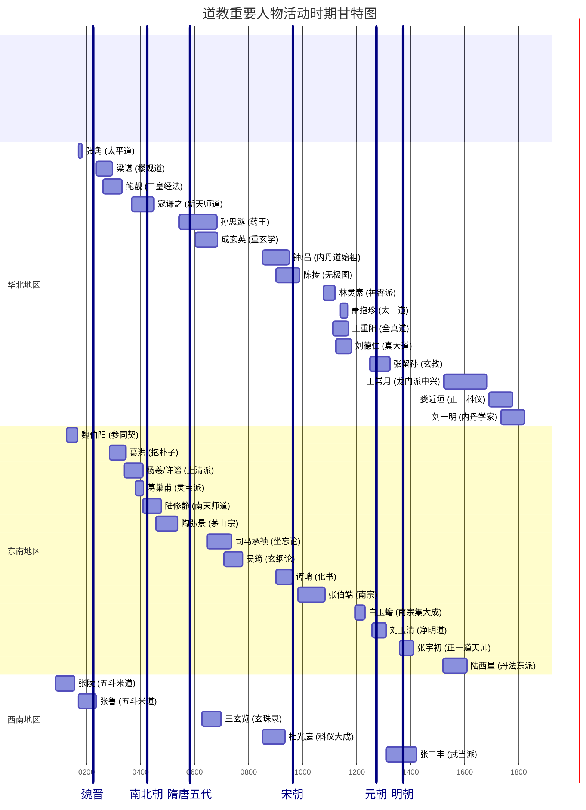

## 道教史提纲

- 起源与形成
    - 历史条件
        1. 社会矛盾的激化，东汉中后期政治腐败，大量流民出现
        2. 宗教化的儒学，谶纬盛行
        3. 佛教刺激，有组织的宗教活动传入
    - 思想渊源
        1. 殷商至周的鬼神崇拜（天神、地祇、人鬼），巫祝祭祀传统，成为道教多神信仰的源头
        2. 战国时期的神仙之说与方士方术，燕齐方仙道宣扬海上神山、不死之药，阴阳五行学说融入
        3. 两汉之黄老道，将黄帝、老子神化，形成具有宗教色彩的黄老崇拜，为道教直接前身
        4. 其他，谶纬神学，《太平经》对墨家思想的吸收
    - 组织准备
        1. 西汉成帝时，齐人甘忠可造《包元太平经》，开太平道先河
        2. 东汉顺帝时，于吉纂集《太平青领书》（《太平经》），太平道理论体系形成
        3. 东汉顺帝时，张道陵在蜀郡鹤鸣山创立五斗米道，建立成熟的宗教组织体系（二十四治、祭酒制度、收信米等）
- 早期道教
    - 张角与太平道，东汉灵帝时，以《太平经》为经典，组织庞大宗教团体，发动黄巾起义，失败后信徒多融入五斗米道
    - 张鲁与五斗米道，张道陵之孙，在汉中建立政教合一政权，推行“义舍”、“三官手书”等，后降曹，五斗米道得以传播
    - 魏伯阳与金丹道，顺帝、桓帝时撰《周易参契》，被誉为“丹经之王”，奠定丹鼎派理论基础
    - 早期道教所信仰的神、仙、鬼，继承古代鬼神崇拜与神仙家传统，形成多神崇拜，相信人死后魂魄为鬼，存在幽冥世界
    - 理论基础，核心是“天人感应”和“心神合一”（人体是小宇宙，体内诸神与天地神灵相通），强调“天道承负”与善恶报应
- 魏晋南北朝时期
    - 曹魏制约道教与五斗米道北迁，曹操招致方士，限制民间宗教活动；张鲁降曹后，汉中民众北迁，五斗米道在北方民间流传
    - 西晋陈瑞领导的巴蜀天师道团，被益州刺史镇压
    - 东晋末年，孙恩、卢循利用五斗米道发动“长生人”暴动，沉重打击东晋门阀统治，暴露民间道教的原始落后性
    - 葛洪《抱朴子·内篇》，系统论证神仙存在与可求，确立以金丹道为中心的神仙理论体系，为上层道教奠定基础
    - 上清、灵宝、三皇经法之出现（东晋）
        1. 江东士族杨羲、许谧等造作上清经系，重“存神服气”和诵经，后形成茅山上清派
        2. 葛巢甫造构灵宝经系，重斋醮科仪，以元始天尊为核心构建鬼神体系
        3. 鲍靓造作三皇经系，重“劾召鬼神”的符图术
    - 楼观道兴起与佛道斗争，楼观道以终南山为中心，宣扬老子化胡说，积极参与佛道之争，推动《西升经》《化胡经》流传
    - 北魏寇谦之“清整”道教，依托神授，改革五斗米道，废除租米钱税、男女合气之术，引入儒家礼法与佛教轮回思想，规范斋醮仪式，形成新天师道（北天师道），得北魏太武帝崇奉
    - 刘宋陆修静总括三洞，搜集整理道经，首创“三洞四辅”分类法，编撰《三洞经书目录》，规范斋醮科仪，形成南天师道
    - 梁陶弘景开创茅山宗，以上清经为主，兼容各派，撰《真诰》整理上清历史，著《真灵位业图》排定神仙谱系，经箓派趋于成熟
- 隋唐五代时期
    - 隋代道教，虽文帝崇佛抑道，但炀帝崇信方术；道士苏元朗首倡“内丹”之说，开启内丹道先河
    - 道教与皇权深度结合，唐代统治者攀附老子为始祖，尊《老子》为《道德真经》，确立道先佛后政策，高宗、玄宗等多次加封老子，道教成为皇族宗教
    - 傅奕反佛与佛道之争，唐初傅奕七次上疏请废佛教，引发佛道大辩论，道教在论争中进一步发展义理
    - 道教的义理化（重玄学），吸收佛教中观思想与儒家伦理，王玄览、司马承祯、吴筠等阐发“道性”、“坐忘”等理论，深化道教心性论
    - 内丹的兴起与发展，钟离权、吕洞宾（钟吕金丹道）倡导内丹修炼，施肩吾《钟吕传道集》系统阐述内丹理论，内丹渐成道教主流
    - 唐玄宗开元年间，编纂第一部官方《道藏》——《开元道藏》（《三洞琼纲》）
    - 唐末五代，杜光庭整理斋醮科仪，完成《道门科范大全集》等，集道教仪范之大成
- 宋元新道派的兴起
    - 北宋真宗、徽宗崇道，真宗伪造天书，尊圣祖赵玄朗；徽宗自称“教主道君皇帝”，推广神霄派，崇道抑佛，导致政治腐败
    - 宋初陈抟作《无极图》，以图式阐发内丹哲理，开宋代图书学派先河
    - 张伯端著《悟真篇》，承钟吕内丹，倡“先命后性”的修炼次第，形成内丹南宗（紫阳派），后经石泰、薛道光、陈楠、白玉蟾递传
    - 北方金代新道派
        * 太一道，萧抱珍创于金天眷间，重符箓斋醮，传“太一三元法箓”，历金元两代兴盛
        * 真大道（大道教），刘德仁创于金皇统间，以苦节危行为要，不妄取于人，勤耕自养，元宪宗赐名“真大道”
        * 全真道，王重阳创于金大定间，主张三教合一，专主内丹，出家守戒，倡“性命双修”，门下“北七真”各开一派，丘处机获元太祖尊崇，全真鼎盛
    - 由龙虎宗到正一道
        * 唐末五代，张陵后裔定居江西龙虎山，形成“龙虎宗”
        * 宋代，“三山符箓”并立：龙虎山（正一）、茅山（上清）、阁皂山（灵宝）
        * 元代，三十六代天师张宗演受封，统领江南道教；三十八代天师张与材授“正一教主，主领三山符箓”，正式形成正一道，与全真并峙
    - 净明道的兴起，南宋何真公、元初刘玉清等倡导“净明忠孝”，以许逊为祖师，融合儒家理学，强调“忠孝神仙”
    - 张君房编《云笈七签》（北宋），为《道藏》节本，有“小道藏”之称；宋、金、元多次重修《道藏》，重要者有《政和万寿道藏》《大金玄都宝藏》《玄都宝藏》等
- 明清时期
    - 明代对道教的检束与利用，太祖设道录司，限制宫观数量，但仍利用斋醮；成祖崇奉真武，大修武当山宫观
    - 明世宗（嘉靖）狂热崇道，宠信邵元节、陶仲文，自封道号，日事斋醮，导致朝政废弛
    - 武当道与张三丰，张三丰活动于明初，被尊为武当派祖师，主张三教合一，内丹与武术结合，传“内家拳”
    - 内丹东派、西派出现，明陆西星创东派，主阴阳双修；清李涵虚创西派，亦主双修，皆托名吕洞宾传授
    - 清初全真道士王常月中兴龙门派，著《龙门心法》，强调戒律修持，公开传戒，使全真龙门派复兴
    - 清初正一道士娄近垣整理《黄箓科仪》，使斋醮仪式系统化，得雍正帝宠信
    - 清代全真道士刘一明，著《道书十二种》，总结全真内丹理论，融汇三教
    - 明英宗正统年间刊成《正统道藏》，明神宗万历年间刊成《万历续道藏》，为现存唯一官修《道藏》
    - 清代道教整体衰落，统治者转向扶植藏传佛教，道教政治地位下降，教团腐化，理论停滞，但民间信仰仍广泛存在
    - 明清时期民间宗教勃兴，如黄天教、红阳教等大量吸收道教内丹、符箓内容，成为道教在民间的重要流衍

## 道教历史概要

### 道教的起源

#### 道教产生的历史条件

*  社会矛盾的激化：东汉中后期，外戚与宦官交替专政，政治腐败黑暗。豪强地主疯狂兼并土地，大量农民沦为流民，加之天灾频发，社会苦难深重。这种背景为渴望拯救与精神慰藉的宗教提供了滋生的土壤。
*  统治思想的宗教化：汉代经董仲舒改造后的儒学，引入“天人感应”神学体系，将“天”人格化。至东汉，儒学与谶纬神学结合，进一步神化儒家经典与圣人，使社会整体思想氛围趋向宗教化，为道教的产生创造了有利条件。
*  佛教的刺激作用：佛教于两汉之际传入中国，其斋戒、礼拜等有组织的宗教活动形式，为当时寻求建立本土宗教的方士提供了直接的启示和借鉴模式，起到了催生的作用。

#### 道教产生的思想渊源

本章探讨了道教形成之前的思想与信仰基础，将其追溯至三种并存的中国古代原始宗教意识。

- 鬼神崇拜：道教的源头之一可追溯至殷商时期的鬼神信仰。这一时期的宗教意识已具备以上帝为中心的天神系统、与宗法结合的祖先崇拜以及通过占卜和巫祝沟通神意的实践。周代进一步将鬼神崇拜系统化为天神、人鬼、地祇三个体系，这为后来道教庞杂的多神信仰系统奠定了基础。道教的斋醮、上表、诵经等仪式，均可视为古代祭祀和巫祝传统的延续与演变。

- 战国时期的神仙之说与方士方术：道教的另一核心源头是战国时期兴起的神仙信仰及追求长生的方术。以《庄子》、《列子》为代表的先秦典籍描绘了超凡脱俗的“神人”、“至人”，以及如“蓬莱”、“瀛洲”等海外仙境，激发了人们对长生不死的向往。伴随此思潮，出现了掌握各类方术的“方士”，他们最初仅有方术而缺乏理论体系。战国末期，方士邹衍融合阴阳五行学说，为神仙信仰提供了理论框架，形成了“方仙道”。秦始皇与汉武帝对不死仙药的痴迷，极大地推动了方仙道的发展，使其在社会上产生了广泛影响。

- 两汉之黄老道：方仙道因其方术屡屡不验而声名受损，部分神仙家转而依附于当时社会上颇具影响力的黄老之学。西汉初期的“黄老之术”主要是“清静无为”的治国方略，尚未与神仙信仰结合。至汉武帝后，神仙家为建立新的理论体系，效仿儒家尊崇圣贤的模式，开始将黄帝和老子宗教化、神化，逐步形成了具有宗教色彩的“黄老道”。至东汉桓帝时期，老子已被完全神化为“道”的化身和至高神灵，并享受国家祭祀；《老子》一书也被重新诠释为指导修炼成仙的经典，如《河上公章句》的出现即是标志。这标志着黄老道的正式形成。它不仅讲求方术，也开始宣扬系统的修道养寿理论，成为道教正式出现前的直接母体。

- 其他思想：吸收了谶纬神学中关于宇宙生成、神化圣贤的模式。道教对老子的神化，以及存思身内外诸神的方术，均受到谶纬神学的启发；另外，《太平经》明显吸收了墨家“天志”、“明鬼”和“兼爱”、“尚同”的思想，主张财物公有、互助互利、自食其力。

### 道教的形成

本章论述了从方仙道、黄老道这两个阶段的前身信仰，到太平道和五斗米道这两个有组织、有教义的宗教实体正式出现的过程，标志着道教的最终形成。

- 方仙道：形成于战国中后期，是一个以追求长生不死为核心的信仰集团。它吸收了阴阳五行学说作为理论基础，尊奉黄帝为始祖，并发展出“形解销化”（类似尸解）的信仰和多种修炼方术。但方仙道仅是一个松散的信仰团体，尚未形成严密的宗教组织和仪式，是道教的雏形。

- 黄老道，甘忠可与《包元太平经》：西汉成帝时期，方士甘忠可融合黄老道与儒家谶纬学说，造作了《天官历》和《包元太平经》。该经书宣称汉朝国运将终，需“更受命于天”，并假托神仙“赤精子”下凡传授救世之道。这标志着神仙信仰开始与社会政治变革理论相结合，为太平道的思想奠定了初步基础。

- 于吉与《太平青领书》之出现：东汉顺帝时，于吉在《包元太平经》的基础上，汇集民间流传的各种相关文本，编纂成一百七十卷的《太平青领书》（即后世所称的《太平经》）。该书系统阐述了以“奉天地、顺五行”为核心，杂糅巫觋之术的宗教思想，其内容深刻反映了东汉末期的社会矛盾与民众疾苦。作者认为，《太平经》的问世，实际上就标志着道教的形成。

- 张道陵与五斗米道：与太平道几乎同时，张道陵在蜀郡鹤鸣山创立了五斗米道。此教派融合了黄老道与巴蜀地区的巫觋传统，因此更注重符箓、章表和斋醮仪式。五斗米道建立了成熟的宗教组织体系，以“二十四治”为教区中心，设“祭酒”等职官进行管理。入教者需缴纳五斗米，故而得名。教义核心包括诵习《老子五千文》、首过、符水治病等。由于其孙张鲁在汉中建立了长达三十年的政教合一统治，使得五斗米道组织稳固、影响深远，后世因此尊张道陵为道教的创教者。

### 早期道教

本章界定从汉桓帝到汉献帝时期为“早期道教”，并分析了当时道教分化的三个主要流派及其基本信仰。

- 张角与太平道：张角继承并发展了于吉的太平青领道，自称“大贤良师”（约在东汉灵帝年间，168-172年）。其教义、称号（如“天公将军”）、口号（如“岁在甲子，天下大吉”）及法术（如九节杖、符水疗病）均与《太平经》密切相关。太平道迅速发展为拥有数十万徒众的庞大宗教团体，并最终演变为旨在推翻东汉统治的黄巾起义（中平元年，184年）。起义失败后，太平道随之消亡，其信徒多融入五斗米道。

- 张鲁与五斗米道：由张陵于东汉顺帝年间（126-144年）在蜀郡鹤鸣山创立五斗米道，其孙张鲁继承祖父教法，并在汉中地区进一步发展壮大。他完善了教区的“义舍”制度，规定了“春夏禁杀”、“禁酒”等教规，创立了“三官手书”等祭祷仪式。其教义与《太平经》思想相通，但其教团组织更为稳固，并在汉中建立了持续近三十年的政教合一政权。张鲁归降曹操后，五斗米道随民众北迁而传播至中原地区，并逐渐演变为后世的“天师道”与“正一道”的主脉。

- 早期道教所信仰的神、仙、鬼：早期道教尚未形成统一的“三清”神系，其最高神称谓不一，如“后圣九玄帝君”（即神化老子）、“天君”等，呈现多神崇拜的特点。其神仙体系将自然万物人格化，并认为人体内亦有“五脏神”。对“仙”的信仰继承了神仙家传统，认为通过学道积德可以成为长生不死的仙人，但更强调仙人有管理四时风雨等职能。同时，也相信人死后魂魄分离为“鬼”，并存在一个由地府神灵掌管的幽冥世界。

- 早期道教的神学理论基础：早期道教的理论核心是“天人感应”和“心神合一”。前者认为“天”是有人格意志的宇宙主宰，能通过灾异或祥瑞来警示或嘉奖人间的善恶行为，这与汉代儒家董仲舒的学说一脉相承。后者则认为人体是小宇宙，体内诸神与天地神灵相通，通过“存思”等内心修炼，即可与神灵沟通，实现长生。

- 魏伯阳与金丹道：在太平道与五斗米道走向民间的同时，另一支黄老道方士则转向理论探索，其代表为魏伯阳。他撰写的《周易参同契》被誉为“丹经之王”，该书首次将《周易》的阴阳变化哲理、黄老思想与炉火炼丹术（外丹）相结合，将炼丹方术提升至义理化的高度，为后世道教的丹鼎派（包括内丹和外丹）奠定了坚实的理论基础。

### 魏晋南北朝道教的盛行与发展

这一时期是道教经历重大变革与发展的关键阶段，神仙理论得以系统化，新的经法体系和重要宗派相继形成。

- 曹魏之制约道教与道教之传播：曹魏政权鉴于黄巾起义的教训，对道教采取了招揽、利用但又严格控制的政策。部分方士被门阀贵族吸纳，使其在上层社会传播，出现了王、谢、杜、沈等一批信奉天师道的世家大族；同时，五斗米道在北方民间也因信徒北迁而继续流传，并为之后在江南的盛行埋下伏笔。

- 葛洪与神仙理论体系的确立：东晋道教学者葛洪，在其著作《抱朴子·内篇》中，系统地总结和论证了神仙的存在与可求性。他吸取玄学思想，以“玄”为宇宙本原，确立了以“还丹金液”（外丹）为核心的修仙理论，并强调“我命在我不在天”以及“形神双修”的重要性。葛洪的理论体系标志着道教神仙信仰从零散的方术传说发展为系统化的宗教哲学。

- 孙恩“长生人”之暴动：东晋末年，以孙恩、卢循为首的五斗米道信众发动了大规模起义。起义者自称“长生人”，其宗教行为表现出对长生、成仙的狂热信仰。这次起义反映了当时阶级矛盾的激化，也显示了民间五斗米道与服务于贵族的“大道”之间的分化。

- 上清、灵宝、三皇经法之出现：东晋时期，江南天师道分化出以造作和传授经法为核心的经箓（符箓）派。主要分为三个系统
    - 上清经系，由杨羲、许谧等在东晋兴宁二年（364年）以扶乩方式造作，重“存思”之术，修炼方式更为雅致，迎合了上层士族的精神需求；造作了以《大洞真经》为代表的上清经系。其修行方术重“存神服气”和诵经，不重符箓斋醮，反对房中术，尊奉元始天王等新神灵。其发展可见本节所述陆修静、陶弘景的茅山宗。
    - 灵宝经系，由葛巢甫（葛洪的从孙）等在古《灵宝经》基础上增修而成，重斋醮科仪，并初步确立了以元始天尊为核心的鬼神天地体系。灵宝派在南朝后一度沉寂，至北宋时期，在江西阁皂山形成了传授灵宝经箓的“阁皂宗”，为符箓三宗之一。
    - 三皇经系，由鲍靓等人造作，重“劾召鬼神”的符图之术。
这三大经系的出现，标志着天师道向义理化和仪式化的重大演变。

- 楼观道与佛道斗争：在西北地区，以终南山楼观为中心的楼观道派兴起。该派以《道德经》为主要经典，宣扬老子西去印度化身为佛的“化胡”之说，撰造了《西升经》和《老子化胡经》，成为佛道长期论争的重要源头，标志着佛道矛盾的激化。楼观派在北朝及隋唐时期因受统治者支持而兴盛，安史之乱后逐渐衰落，至元代并入全真道。

- 寇谦之“清整”道教及新天师道之形成：北魏道士寇谦之对五斗米道进行了重大改革。他假托太上老君亲授《新科之诫》，废除了租米钱税和男女合气等旧法，引入儒家礼法和佛教轮回思想，并规范了斋醮仪式。改革后的道教与北魏皇权紧密结合，一度成为国教，史称“新天师道”或“北天师道”。

- 陆修静提倡斋仪、总括三洞及南天师道之出现：南朝刘宋时期的道士陆修静，对道教进行了系统的整理。他首次将道教经书分为“三洞”（洞真、洞玄、洞神），编纂了最早的《道藏》目录《三洞经书目录》。同时，他大力提倡和规范斋醮科仪，撰写了百余卷仪范，强调“斋直为求道之本”。他改革后的道教被称为“南天师道”。

- 陶弘景开创茅山宗：陆修静之后，南朝道教学者陶弘景在茅山创立了茅山宗。他以《上清经》为主体，兼容各派道法及儒、释思想，主张三教调和。他编纂的《真诰》和《真灵位业图》，系统整理了上清派的历史和神仙谱系，使茅山成为上清派的中心。陶弘景的学说标志着道教经箓派的成熟，对后世影响深远，其在隋唐时期极为兴盛，俨然成为道教正宗。

### 隋唐五代的道教

这一时期，道教因与唐代皇室的特殊关系而进入全盛阶段，教义理论也进一步深化和发展。

- 隋代之道教：隋朝国祚短促，统治者崇佛抑道，道教发展受限。但这一时期最重要的发展是“内丹”学说的兴起。道士苏玄朗等人，鉴于外丹烧炼的弊害，开始倡导以人体为炉鼎、以精气神为药物的内丹修炼术，标志着道教修炼方术的重大转向。

- 道教与皇权之结合：唐代统治者为抬高门第，认道家始祖老子（李耳）为同姓先祖，从而将道教奉为“皇族宗教”。从唐高祖起，历代皇帝多给予道教崇高地位，下诏“道先佛后”，尊老子为“太上玄元皇帝”，并将《道德经》列为科举考试内容。唐玄宗更是亲受法箓，成为“道士皇帝”。皇权的扶持使道教在唐代获得了空前的社会地位和发展空间。

- 傅奕与赵归真之誉道毁佛：在唐代，佛道之争异常激烈。初唐太史令傅奕多次上疏，从民族文化、国家经济和伦理道德等方面猛烈抨击佛教，引发了大规模的论辩。至唐武宗时期，道士赵归真等人乘皇帝崇道之机，进言排佛，最终促成了“会昌法难”，大规模废毁佛寺、勒令僧尼还俗。这些斗争的实质是皇权与僧侣集团在政治和经济利益上的深刻矛盾。

- 道教在义理化方面的发展：在唐代浓厚的学术氛围及佛道之争的刺激下，道教理论进一步发展。以王玄览、吴筠、司马承祯为代表的道教学者，大量吸取佛教（尤其是法相宗、禅宗）和儒家的思想，来阐释老庄哲理与道教修持方法。司马承祯的《坐忘论》系统论述了“主静”的修真次第，而杜光庭则在教义上力图融合儒道，并集道教斋醮科仪之大成。

- 钟吕金丹道的崛起：唐末五代，以内丹修炼为核心的钟吕金丹道兴起。以钟离权、吕洞宾为代表的内丹家，系统地建立了内丹道的理论与方法，将人体内在的精、气、神修炼视为成仙的根本途径。这一派别的崛起，标志着道教修炼方术的重心从外丹转向内丹，对宋元以后道教的发展产生了决定性影响。

- 道书及《开元道藏》：隋唐五代是道教经书大量涌现的时期。唐玄宗开元年间，朝廷组织编纂了中国第一部官方《道藏》，名为《开元道藏》（或称《三洞琼纲》），收录道书数千卷。这部《道藏》的编成与颁行，标志着道教经籍的系统化和规范化达到了新的高度。

### 宋元新道派的兴起

宋元时期，社会动荡与思想融合共同推动了道教的深刻演变，多个新道派涌现，南北宗派分立，最终形成了全真与正一两大派别并存的格局。

- 宋真宗、徽宗之崇道：北宋真宗为巩固统治，大搞“天书下降”的神道设教，并伪造赵氏始祖“赵玄朗”为道教尊神。徽宗更是自封“教主道君皇帝”，将道教抬至国教地位，广建宫观，大规模整理《道藏》，使道教在官方层面达到前所未有的鼎盛。但这种狂热崇道也导致了政治腐败和民生凋敝。

- 陈抟与张伯端之发展修丹理论：与官方的狂热并存，道教内丹理论在宋代取得重大突破。宋初道士陈抟创作《无极图》，将宇宙生成论与内丹“逆以成丹”的修炼过程相结合，使内丹学说哲理化。其后，张伯端著《悟真篇》，系统阐述了“先命后性”的内丹修炼次第，并明确提出三教合一思想，该书与《参同契》并称为“丹经之王”。

- 河北新道派之出现：金代统治下的北方地区，因社会苦难和民族矛盾，兴起了三个新道派
    - 太一道，由萧抱珍于金初（1138-1140年）创立。重符箓斋醮，与正一道相近，但要求道士出家。元代后期，该派逐渐并入正一道。
    - 真大道，由刘德仁于金皇统年间（1142年）创立。教义以《老子》为本，融合儒家伦理与佛教戒律，强调自食其力、不重炼丹飞升，而以静默祈祷为修行方式。元代时，该教一度分裂为两派，后天宝宫一系成为正统并得到元室大力扶持，教派兴盛。元末之后，可能并入了全真道。
    - 全真道，由王喆（王重阳）于金大定年间（1167年）创立，是北方新道派中影响最大的一派。其特点是：1. 强调三教合一，以《道德经》、《般若心经》、《孝经》为必修经典，理论上深受禅宗影响；2. 修行上专主内丹，不尚符箓；3. 严格要求道士出家并遵守清规戒律。后经其弟子丘处机远赴西域见成吉思汗，获元室支持，掌管天下道教，全真道进入鼎盛期。
    - 全真道与南方的内丹派（以张伯端为代表）形成了教理和地域上的差异，被称为“北宗”，而张伯端的丹法流派则被称为“南宗”。

- 龙虎宗的形成：东晋南朝时期，经过改革后的天师道日趋成熟，但之后又进入一段较长的沉寂期。至唐末五代，张陵后裔定居于江西龙虎山，建立了“龙虎宗”，延续其教法。在宋代皇室的扶持下，龙虎宗与茅山宗、阁皂宗并称为“三山符箓”。

- 两宋时期南方道教中的符箓派：神霄、清微、东华、天心诸派，这些派别均在北宋末至南宋间形成，皆属符箓道教，但各有侧重。神霄派以行雷法著称；清微派自称融合上清、灵宝等四派道法；东华派由灵宝派分化而来；天心派则被视为龙虎宗的一个支派。它们共同的特点是将雷法与内丹术相结合，或对斋醮科仪进行整理更新。

- 由龙虎宗到正一道，主领三山符箓：元代，统治者为安定江南，对龙虎山天师道给予极高礼遇。三十八代天师张与材被封为“正一教主，主领三山符箓”，正式将龙虎山、茅山、阁皂山以及神霄、清微等江南各符箓派统一在天师的管辖之下，形成了“正一道”，事在成宗大德八年（1304年）。正一道以龙虎山天师为首，道士可婚娶、居家修行。
    - 元世祖至元年间（1276-1278年），天师弟子张留孙在京师创立玄教，作为正一道在北方的分支，权势显赫。明朝后，玄教解体，重新归入正一道。

- 净明道与“忠孝神仙”：宋元年间，在江西西山形成了以“忠孝”为核心教义的净明道。该派尊东晋许逊为祖师，由刘玉清正式创立，深受儒家理学影响，强调“正心诚意”和“忠孝为本”，是一种将封建伦理道德与符箓方术相结合的新道派。

- 全真道与正一道对峙局面的形成：辽宋金元时期，北方兴起三个大的教派：太一道、真大道和全真道；南方则有两个：正一道和净明道。太一道、真大道和净明道早已失传，明代以来，道教形成了以全真道（北宗，内丹）和正一道（南宗符箓派的集合）为主的两大宗派。

- 张君房编《云笈七签》与宋、金、元之重修《道藏》：宋代多次重修《道藏》，其中张君房在编纂《大宋天宫宝藏》时，撮其精要编成《云笈七签》，成为后世研究宋以前道教的重要类书。金代和元代也分别编纂了《玄都宝藏》。元代两次大规模的“焚经事件”，使道教经籍遭受了巨大损失。

### 明清时期的道教

明清时期，道教在官方地位和理论创新上均呈衰落趋势，教派活动主要在已有基础上延续。

- 明代之检束道教与世宗之迷道：明朝对道教采取利用与严格控制相结合的政策。明太祖取消了“天师”称号，并从制度上限制道观数量和出家人数。除明世宗一度痴迷道教方术，重用道士外，明代大部分皇帝对道教持审慎态度。

- 武当道与丹法东派、西派之出现及刘一明之丹道：明代，因皇室对真武大帝的崇奉，湖北武当山成为新的道教中心，形成了以张三丰为代表，融合内丹与武术的“武当道派”。同时，内丹学在明清时期分化出主张阴阳双修的“东派”（陆西星）和“西派”（李涵虚）。清代全真道士刘一明则是清修派丹法的集大成者，其著作系统总结了全真道的内丹理论。

- 王常月的《龙门心法》及娄近垣之《黄箓科仪》：清初，全真道龙门派律师王常月致力于重振教风，开坛说戒，其讲稿被整理为《龙门心法》，强调以戒律修持为本，使全真道风从偏重丹法转向注重戒行。同时期，正一道士娄近垣则对斋醮科仪进行了系统整理，编订了《黄箓科仪》，成为清代正一道科仪的重要范本。

- 《正统道藏》及重要道书的编纂刊行：明英宗正统年间，在官方主持下，完成了现存版本《道藏》的主体部分——《正统道藏》。明神宗万历年间，又增补了《万历续道藏》。这两部道藏成为后世研究道教最根本的文献依据。清代彭定求等人又在此基础上编选了《道藏辑要》。

- 道教之衰微：进入清代，道教总体呈衰落趋势。原因包括：清政府对道教的严峻态度，逐步削弱了正一天师的政治地位；新文化思想和西方科技的传入，冲击了传统的宗教意识；基督教等外来宗教的竞争；以及道教自身理论停滞，缺乏创新。道教的社会影响力日渐减弱，步入衰微期。

---

## 道教人物小传

### 两汉时期

1.  张陵
    - 大致活动年份与地点：34–156年（此为道教传统说法，学界对其生平有不同研究），沛国丰（今江苏丰县）人，主要活动于蜀郡鹤鸣山（今四川大邑）。
    - 事迹与贡献：道教的实际创始人，被尊为第一代天师。他在东汉顺帝年间创立了五斗米道，建立了道教史上第一个有组织的教团。他以符水为人治病，教人首过（忏悔罪过），并设立了“二十四治”作为教区和行政管理单位，奠定了早期道教的组织基础和社会功能。他的创教活动标志着道教从零散的方术信仰正式转变为一个有系统、有组织的宗教。

2.  张角
    - 大致活动年份与地点：?–184年，巨鹿（今河北宁晋）人。
    - 事迹与贡献：东汉末年太平道的创始人和黄巾起义的最高领袖。他自称“大贤良师”，以《太平经》为核心教典，通过符水咒说为人治病，迅速发展了数十万信众。他将信徒编入名为“方”的准军事组织，并以“苍天已死，黄天当立”为口号，于184年发动了震撼全国的黄巾起义。虽然起义最终失败，但其行动深刻地影响了东汉的政治格局，并展示了早期道教强大的社会动员能力。

3.  张鲁
    - 大致活动年份与地点：?–216年，沛国丰（今江苏丰县）人，张陵之孙。主要活动于汉中（今陕西南郑）。
    - 事迹与贡献：五斗米道的重要建设者，被尊为“系师”。他继承并发展了祖父的教业，在汉中建立了长达近三十年的政教合一的割据政权。他自号“师君”，完善了祭酒制度，设立“义舍”以救济行旅，并著有《老子想尔注》，为五斗米道提供了重要的教理阐释。他的治理使五öt米道组织稳固、影响深远，为后世正一道的形成奠定了基础。

### 魏晋南北朝时期

1.  魏伯阳
    - 大致活动年份与地点：约东汉末年，活跃于汉顺帝、桓帝时期（约125-167年）。主要活动于会稽上虞（今浙江上虞）。
    - 核心事迹与贡献：撰写了被誉为“万古丹经王”的《周易参同契》。他首次将《周易》的阴阳变化哲理、黄老思想与炉火烧炼（外丹）相结合，将原本零散的方术提升到了系统的理论高度，为后世道教的丹鼎派（无论是外丹还是内丹）奠定了坚实的理论基础。
2.  梁谌
    - 大致活动年份与地点：魏元帝咸熙初年（约264-265年）。主要活动于终南山楼观（今陕西周至）。
    - 核心事迹与贡献：他是史料中记载的最早与楼观道相关的道士。他托言神仙尹轨降授经法，开始在楼观建立道教传统。他可能是《西升经》的早期作者之一，该经书阐发老子之道，标志着道教开始向义理化方向探索。
3.  鲍靓
    - 大致活动年份与地点：西晋时期，活跃于晋武帝、惠帝年间（约290-301年）。主要活动于嵩山（今河南登封）。
    - 核心事迹与贡献：他是三皇经法的关键人物。据传他在嵩山石室中获得了《三皇文》，其核心内容是“劾召鬼神”的符图和法术。这一经系的出现，代表了道教中继承古老巫术传统、注重法术力量的一支重要流派。
4.  葛洪
    - 大致活动年份与地点：283 - 343年。丹阳句容（今江苏句容），晚年隐居于罗浮山（今广东博罗）。
    - 核心事迹与贡献：撰写了不朽的道教理论巨著《抱朴子·内篇》。他全面系统地整理和论证了神仙方术，特别是外丹烧炼。他将儒家的忠孝伦理与修仙相结合，提出了“我命在我不在天”的著名论断，为道教构建了第一个完整的神仙理论体系，极大地提升了道教在士族阶层中的地位。
5.  杨羲、许谧
    - 大致活动年份与地点：活跃于东晋哀帝兴宁年间（约364年）。主要活动于建业（今江苏南京）、句容茅山。
    - 核心事迹与贡献：创立了上清派。他们通过扶乩降神的方式，造作了以《大洞真经》为代表的一系列上清经书。上清派的修炼方式以精神性的存思为主，其经典文辞华丽，理论玄妙，完全迎合了南朝士族的审美和精神追求，标志着道教的“贵族化”。
6.  葛巢甫
    - 大致活动年份与地点：活跃于东晋末年（约4世纪末）。活动于江南地区
    - 核心事迹与贡献：创立了灵宝派。他在古《灵宝经》的基础上，造作了以《度人经》为核心的新经书。灵宝派极大地发展了道教的斋醮科仪，使其仪式化、规范化，并确立了以元始天尊为最高神和三清并尊的神学体系，对后世道教影响极为深远。
7.  寇谦之
    - 大致活动年份与地点：365 - 448年。主要活动于嵩山（今河南登封），后至北魏都城平城（今山西大同）。
    - 核心事迹与贡献：对北方的天师道进行了彻底的改革。他废除了租米钱税、男女合气等早期教规，强调以儒家礼法为核心，制定了严格的戒律和斋仪。他的改革使道教与北魏政权紧密结合，成为服务于“佐国扶命”的国家宗教，史称“新天师道”或“北天师道”。
8.  陆修静
    - 大致活动年份与地点：406 - 477年。主要活动于庐山（今江西九江）、建康（今江苏南京）。
    - 核心事迹与贡献：作为灵宝派的集大成者，他对整个道教进行了系统化的整理。他编纂了第一部《道藏》目录——《三洞经书目录》，确立了道教经书的分类体系。同时，他大力规范和推广斋醮科仪，撰写了百余卷仪范，使道教的宗教仪式基本完备。他所整顿的道教被称为“南天师道”。
9.  陶弘景
    - 大致活动年份与地点：456 - 536年。主要活动于茅山（今江苏句容）。
    - 核心事迹与贡献：他是茅山宗的实际开创者。他以茅山为中心，总括了上清、灵宝两派的教义，并深入研究外丹、医药等方术。他编纂的《真诰》和《真灵位业图》，前者系统记述了上清派的历史，后者则首次为道教建立了系统化的神仙谱系，模仿人间官僚体系对天上神仙进行了位阶排列。陶弘景的工作标志着道教神学体系的最终成熟。

### 隋唐五代时期

1.  孙思邈
    - 大致活动年份与地点：541年或581年 – 682年，京兆华原（今陕西耀县）人。
    - 事迹与贡献：唐代杰出的道士、医学家和药学家，被后世尊为“药王”。他精通老庄，并深研医术与炼丹术。其不朽巨著《备急千金要方》和《千金翼方》系统总结了唐代以前的医学成就，对后世中医学发展影响巨大。他将道教的养生思想与医学实践紧密结合，强调“大医精诚”，体现了道教“济世度人”的入世精神。

2.  成玄英
    - 大致活动年份与地点：约活动于唐太宗、高宗时期（约631–655年），陕州（今河南陕县）人。
    - 事迹与贡献：唐初著名的道教学者，以注疏《老子》和《庄子》而闻名。他最大的理论贡献是运用“重玄”之学来解读道家经典。“重玄”意为在“玄”（道）之上再探求更深的玄理，即破除一切执着，达到无所滞碍的境界。他的注疏深受佛学影响，使道教哲理更为深化和思辨，是道教义理发展史上的重要人物。

3.  王玄览
    - 大致活动年份与地点：626–697年，广汉绵竹（今属四川）人。
    - 事迹与贡献：唐初重要的道教学者，其思想辑录为《玄珠录》。他深受佛教唯识宗影响，将道教的“道”与佛教的“识”相结合，提出了“心生则法生，心灭则法灭”的唯心主义本体论。他认为宇宙万物皆由“一识”所变现，将道教的宇宙生成论推向了更为抽象和思辨的哲学层面，是唐代道教理论深度融合佛学的典型代表。

4.  司马承祯
    - 大致活动年份与地点：647–735年，河内温（今河南温县）人，后隐居于天台山（今浙江天台）。
    - 事迹与贡献：唐代茅山宗第十二代宗师，杰出的道教学者。他深受唐玄宗器重，系统阐发了道教的修养理论。其著作《坐忘论》和《天隐子》，融合儒、释思想，详细论述了道教静坐修炼的次第和方法，提出通过“斋戒、安处、存想、坐忘、神解”五个阶段达到与道合一的境界。他的理论使道教的修炼方法系统化、哲学化，对后世内丹学影响深远。

5.  吴筠
    - 大致活动年份与地点：？–778年，华州华阴（今属陕西）人，茅山宗道士。
    - 事迹与贡献：唐代著名道教学者，曾待诏翰林。其著作《玄纲论》、《神仙可学论》等，致力于论证神仙信仰的合理性，并系统地将老庄思想与道教长生术相结合。他明确提出“道德为本，仁义为末”的思想，将儒家伦理纳入道教理论体系，并强调修道必须“守静去躁”，去除情欲。他的工作进一步完善了道教的神学理论。

6.  杜光庭
    - 大致活动年份与地点：850–933年，处州缙云（今属浙江）人，唐末随僖宗入蜀，晚年居于青城山。
    - 事迹与贡献：唐末五代最博学的道教学者，被誉为道教的集大成者。他在理论上，以《道德真经广圣义》等著述，系统地将儒家纲常名教融入道教；在实践上，他全面搜集、整理和规范了道教的斋醮科仪，编纂了《道门科范大全集》，成为后世道教科仪的范本。他还撰写了大量神仙传记和宫观记，为后世保存了珍贵的道教历史资料。

7.  谭峭
    - 大致活动年份与地点：约活动于五代时期，泉州（今属福建）人。
    - 事迹与贡献：五代道教学者，其著作《化书》是一部充满辩证思想的奇特作品。他以“虚”为宇宙本源，提出“虚化神，神化气，气化形”的宇宙生成论，并认为万物处于不断的转化之中，主张齐同生死、泯灭差别。书中既有深刻的哲学思辨，也包含了对社会不公的批判，思想独特，在道教史上独树一帜。

8.  钟离权/吕洞宾
    - 大致活动年份与地点：约活动于唐末五代，其生平多为传说，难以确考。钟离权多与终南山联系，吕洞宾籍贯有京兆、河中府等说。
    - 事迹与贡献：他们是内丹道（钟吕金丹道）的关键奠基人物，被后世全真道尊为祖师。相传钟离权将内丹秘诀传授给吕洞宾，其问答之辞被记录为《钟吕传道集》。他们系统地阐述了以内炼人体精、气、神来代替外丹烧炼的修炼理论和方法，标志着道教修炼术的重大转折。虽然其历史真实性存疑，但他们的思想深刻地影响了宋元以后整个道教的发展方向。

### 宋、金、元时期

1.  陈抟
    - 大致活动年份与地点：?–989年，亳州真源（今河南鹿邑）人，长期隐居于华山。
    - 事迹与贡献：宋初著名的道教学者和象数学家，被宋太宗赐号“希夷先生”。他精通《易》学，创作了《无极图》、《先天图》等图式，以直观的方式阐述宇宙生成论和内丹修炼的“逆以成丹”之法。他的思想上承钟吕，下启周敦颐，不仅为道教内丹学说注入了深厚的哲学意蕴，也成为宋明理学的直接思想源头之一，是三教融合史上的关键人物。

2.  张伯端
    - 大致活动年份与地点：984–1082年，天台（今属浙江）人，晚年在蜀地得道。
    - 事迹与贡献：北宋著名的内丹理论家，被尊为道教南宗始祖。他撰写的《悟真篇》与《参同契》并称，是内丹学的核心经典。该书系统阐述了“先命后性”的修炼次第，即先通过修炼精、气以固形体，再参照禅宗心性学说修炼心神以求彻悟。他明确倡导三教合一，其理论完成了内丹学说的系统化，影响了此后近千年的道教修炼实践。

3.  林灵素
    - 大致活动年份与地点：1075–1119年，温州（今属浙江）人，主要活动于北宋京城汴梁（今河南开封）。
    - 事迹与贡献：北宋末年权势极大的道士。他深得宋徽宗宠信，创立了神霄派道法，并编造神话，称徽宗为“长生大帝君”下凡。他推动徽宗自号“教主道君皇帝”，并一度下令改佛为道，将佛教寺院改为道观，僧人改为德士。他的活动使道教在北宋末年获得了畸形的政治高位，是道教与皇权结合达到顶峰的代表人物。

4.  萧抱珍
    - 大致活动年份与地点： 约活动于金天眷至大定年间（1138-1166年），卫州（今河南汲县）人。
    - 事迹与贡献： 金代太一道的创始人。他于金天眷年间立教，主张以老子之学修身，以符箓斋醮等巫祝之术济世。其教法得到金代皇室的承认与支持，他本人被金熙宗召见，其道观被赐名“太一万寿观”。他开创的太一道与全真道、真大道并列为金代北方三大新道派之一。

5.  刘德仁
    - 大致活动年份与地点： 1122–1180年，沧州乐陵（今属山东）人。
    - 事迹与贡献： 金代真大道教的创始人。他于金皇统年间立教，其教义以“苦节危行”为核心，强调自食其力、不事烧炼、不重符箓。他制定了融合儒释道思想的“九条戒规”，要求信徒恪守忠孝诚信等伦理，并通过静默祈祷为人治病。其朴实无华的教风在当时独树一帜，是北方三大新道派之一。

6.  王重阳
    - 大致活动年份与地点：1112–1170年，陕西咸阳人，后至山东传教。
    - 事迹与贡献：金代全真道的创始人，被尊为北宗始祖。他改变了传统道教的修炼方式，提倡儒、释、道三教合一，以《道德经》、《孝经》、《般若心经》为主要经典。他建立了严格的出家制度和清规戒律，要求道士清心寡欲、识心见性。他创立的全真道以其严谨的教规和深刻的内丹理论，成为元代以后与正一道并立的两大道派之一，对后世道教影响至深。

7.  白玉蟾
    - 大致活动年份与地点：1194–约1229年，原籍福建闽清，生于琼州（今海南）。
    - 事迹与贡献：道教南宗的实际奠基人，被尊为南五祖之一。他师事陈楠，继承并发展了张伯端的内丹学说，并精通神霄雷法。他著作宏富，系统地阐述了南宗的丹法理论，并整理了南宗的传承谱系。他将内丹修炼与符箓道法相结合，并大量融入禅宗和理学思想，使南宗理论体系完备化，成为南宋道教最具影响力的代表人物之一。

8.  张留孙
    - 大致活动年份与地点：1248–1321年，信州贵溪（今属江西）人，长期活动于元大都（今北京）。
    - 事迹与贡献：元代龙虎宗的重要人物，玄教的创始人。他原为龙虎山天师的弟子，后随师入朝，因深得元世祖忽必烈及历代皇帝的宠信，被封为“玄教大宗师”，在大都建立了崇真宫，形成了实力强大的龙虎宗支派——玄教。他的活动极大地提升了龙虎宗在全国的政治地位和影响力，为元代最终形成统一的正一道奠定了组织基础。

9.  刘玉清
    - 大致活动年份与地点：1257–1308年，江西南康建昌人，活动于西山（今江西南昌）。
    - 事迹与贡献：元代净明道的创始人。他在东晋许逊信仰的基础上，融合宋明理学思想，正式创立了净明忠孝道。他以“忠孝为本，敬天崇道”为宗旨，强调修道必须从“正心诚意”等儒家伦理实践入手，而非单纯修炼精气。他的教派是道教与儒家理学深度融合的典型产物，在元明时期影响广泛。

### 明清时期

1.  张宇初
    - 大致活动年份与地点：1359–1409年，江西贵溪龙虎山人。
    - 事迹与贡献：明代第四十三代天师，正一道的重要整理者。他学识渊博，深受明成祖朱棣的器重，奉敕主持编修《正统道藏》。其著作《道门十规》对当时道教的流弊进行了深刻的剖析和批判，并提出了整顿的规章，是研究明代道教的重要文献。他的工作在一定程度上规范了明初的正一道教。

2.  张三丰
    - 大致活动年份与地点：生卒年不详，约活动于元末明初。籍贯有辽东懿州、陕西宝鸡等多种说法，主要与湖北武当山联系紧密。
    - 事迹与贡献：一位充满传奇色彩的道教人物，被尊为武当派始祖，并与内家拳（特别是太极拳）的创立紧密相连。他强调三教合一，以内丹修炼为核心，主张性命双修、返本归元。因其盛名，明代多位皇帝曾遣使寻访，从而极大地推动了武当山宫观群的营建，使武当山成为明代最重要的道教中心之一。

3.  陆西星
    - 大致活动年份与地点：1520–约1606年，扬州兴化（今属江苏）人。
    - 事迹与贡献：明代内丹学东派的开创者。他原为儒生，后弃儒从道，自称遇吕洞宾亲传丹法。他主张阴阳双修的丹法，与全真道的清修派形成对比。他著述颇丰，汇集为《方壶外史》。此外，近代学者考证，著名神魔小说《封神演义》也出自其手，对中国民间信仰和文学影响巨大。

4.  王常月
    - 大致活动年份与地点：1522–1680年（此为道教传统说法），山西长治人，主要活动于北京白云观。
    - 事迹与贡献：清初全真道龙门派的“中兴之祖”。在明末清初道教衰微之际，他入主北京白云观，开坛说戒，广收门徒，使濒于断绝的龙门派法脉得以延续和壮大。他强调戒律在修道中的根本作用，其讲经内容被弟子记录为《龙门心法》，使龙门派的教风从偏重丹法转向注重戒行，成为清代以来全真道影响最大的一支。

5.  刘一明
    - 大致活动年份与地点：1734–1821年，山西曲沃人，长期在甘肃榆中栖云山传道。
    - 事迹与贡献：清代全真龙门派著名的内丹学家。他是清代丹经注释的集大成者，其著作汇编为《道书十二种》，对《周易参同契》、《悟真篇》等核心丹经作了系统而详尽的阐发。他继承了全真道清修派和三教合一的思想，其理论体系严谨，对后世内丹学的研究和实践产生了重要影响。

6.  娄近垣
    - 大致活动年份与地点：1689–1776年，江南松江（今属上海）人，后主要活动于北京。
    - 事迹与贡献：清代正一道的著名高道。他因法术精湛而深得雍正皇帝的宠信，被封为“妙正真人”。他最重要的贡献是整理和刊刻了《黄箓科仪》，系统地收录了清初正一道常用的斋醮仪式、文检、符诀等，为清代正一道的科仪实践提供了重要范本，是清代正一道的代表人物。

## 摘要：任继愈中国道教史

### 序言

序言首先指出，儒释道是中国传统文化的三大支柱，但过去对道教的研究远不及儒、佛二教深入，这是一种偏见。道教典籍的价值绝不低于佛教，甚至在某些方面更为重要。道教生长于本土，但命运多舸，因与汉末黄巾起义有关联，长期受到统治阶级的猜忌，错过了东汉末年的发展良机，发展速度始终落后于佛教，即使在道教最盛行的唐代，道教徒/道观的数量也远低于佛教。其发展需要依靠民众和上层政权的双重支持。为了迎合不同阶层，道教既保留了符水治病、驱妖捉鬼等下层巫术，也发展了养生、服食、炼丹等满足上层贵族需求的内容。

序言将道教发展史划分为四个段落：
1.  南北朝时期：跻身社会上层，获得帝王支持，为第一个发展时期。
2.  唐朝：因皇室攀附老子李耳，大力扶持，为第二个发展时期。
3.  北宋：真宗、徽宗时期，借道教麻痹人民、遮盖外患，为第三个发展时期。
4.  明代：中叶皇帝妄图成仙，道士干政，为第四个发展时期。

元朝初年虽受重视，但并非独尊。明中叶后，道教在上层受阻，势力转入民间，演变为秘密宗教团体。序言还指出，《道藏》保存的思想资料在中国思想史上地位重要，从魏晋的本体论到隋唐的心性论，道教理论（如内丹说）都与此时代思潮相呼应，并非仅是外丹的发展。金元全真道将出家修仙与世俗忠孝结合，实际上是儒教的支派。研究道教不能离开儒、佛二教，三者虽长期争论，但基本同兴衰、互吸收，唐中叶后总趋势为三教合一。最后，序言介绍了本书的撰写基础（在《道藏提要》研究基础上）和研究方法（实事求是，不尚空谈）。

### 第一编 汉魏晋南北朝道教

本编指出东汉至南北朝是道教从民间兴起并逐步演变为官方正统宗教的关键时期，经历了三次重要变化：东汉晚期原始道教兴起；魏晋之际民间道教受挫、五斗米道分化；东晋以后经改造发展为成熟的官方新道教。

#### 第一章 道教的孕育与诞生
*   概述：道教起源复杂缓慢，并非由单一途径在同一时期形成。其产生需具备特定的宗教信仰、理论、活动和实体四大条件，标志是《太平经》、《周易参同契》、《老子想尔注》的出现以及太平道和五斗米道实体的建立。
*   主要来源与社会背景：道教源于古代宗教巫术、战国秦汉神仙方术、先秦老庄哲学与秦汉道家学说、儒学与阴阳五行思想，以及古代医学与体育卫生知识。其诞生是汉代有神论泛滥、统治阶级对神仙方术的关心、社会危机加深、人民苦难寻求慰藉以及佛教刺激等多种社会因素共同作用的结果。
*   《太平经》与《周易参同契》：《太平经》是最早的道教经典，以神秘的气化学说、三名同心的调和论、阴阳五行灾异说和承负说为核心，构建了早期道教的神仙系统和救世理想，主张内以治身长生，外以治国安民。《周易参同契》是丹鼎派最早的理论著作，以《周易》为立论根据，参合黄老自然之理，讲述炉火炼丹之事，奠定了道教丹鼎学说（主要是外丹）的基本理论，被誉为“丹经之祖”。
*   太平道与五斗米道：太平道由张角创立，以黄老之道结合民间巫术，发动了黄巾起义，谱写了民间道教革命性的篇章。五斗米道由张陵创始，经张衡、张鲁（“三张”）传承，在汉中建立了政教合一的政权。张鲁降曹后，五斗米道北迁，在魏晋时期得以传播并分化。汉末的《老子想尔注》是第一部用神学注解《老子》的作品，开创了道教徒系统利用《老子》的新时期。

#### 第二章 魏晋之际道教的传播与分化
*   魏晋天师道在北方的传播：曹操对民间道教（特别是太平道）进行镇压，张鲁降曹后，五斗米道上层受优待，普通道民被迫北迁。魏晋统治者严禁民间宗教活动，但五斗米道仍在北方传播，然组织涣散、科律废弛，进入相对停滞状态。
*   魏晋天师道在西南巴蜀的传播：西晋时陈瑞领导的巴蜀天师道团被镇压。西晋末，信奉五斗米道的氐人李特、李雄流民队伍在蜀中建立成汉政权，得益于天师道领袖范长生的支持，范氏天师道成为成汉的国教。
*   魏晋江南民间道教的传播：三国两晋间，江南成为道教复兴基地。先后有于君道（太平道支派）、帛家道、李家道等传入。其中李家道及其托名“李弘”的谶言，成为两晋南北朝时期多次农民起义的旗帜，影响深远。
*   魏晋之际神仙方士的活动：汉末魏晋间，左慈、甘始等大批方术之士活跃，注重个人修炼成仙，与民间道教有所区别，形成了“神仙道教”或“丹鼎派”。曹魏曾将他们“聚而禁之”，但道术仍得以传播。其中葛玄—郑隐—葛洪一派对后世影响最大。

#### 第三章 葛洪与魏晋丹鼎道派
*   葛洪家世及师承：葛洪，丹阳句容人，出身官宦世家，师从郑隐，继承左慈—葛玄—郑隐的丹鼎道派。其思想集魏晋神仙道教之大成。
*   “仙可学致”的仙道思想：葛洪论证神仙存在，并认为凡人可以通过学仙修道而成仙，驳斥了“仙人有种论”。他强调“我命在我不在天”，提倡后天努力（立志、明师、勤求）。他以“形神相卫”为理论基础，为凡人成仙搭起理论阶梯。
*   丹鼎道派的仙道方术：葛洪将仙道方术分为“内修形神”和“外攘邪恶”两部分。首重还丹金液（金丹大药），认为此为仙道之极；其次为宝精（房中术）、行气（胎息）等。他还详述了守一、思神、符箓祈禳、隐沦变化等外攘之术，对魏晋神仙方术进行了系统总结。
*   葛洪仙道学说的矛盾：其学说存在矛盾：一是神秘主义的宇宙本体论（“玄”）与实践理性思维（“假外物以自固”）的不协调；二是既主张道本儒末、追求超脱，又不能忘怀治国平天下、维护礼教的人间俗务。
*   丹鼎道派的炼丹活动及其化学意义：葛洪时代炼丹术积累了丰富经验，在经诀、药物、设备和方法上均有建树。虽然追求长生成仙是虚妄的，但在实践中推动了化学知识的积累，如汞的化学反应、砷铜合金的制备、火药的早期萌芽等，在科学发展史上具有历史意义。
*   葛洪丹道理论的历史地位：葛洪是上层丹鼎道派的代表人物，他贬斥民间道教，系统论证了神仙可成的理论，确立了道教以追求肉体不死成仙为基本特征，为道教官方化打下基础，标志着早期道教的终结。

#### 第四章 东晋南朝道教的变革与发展
*   东晋道教的复兴：东晋门阀士族大批涌入道教（如琅玡王氏），带来了士族的思想情趣，促使五斗米道向上层神仙道教演变。晋哀帝、简文帝等帝王亦崇奉道教。孙恩、卢循利用五斗米道发动大规模起义，虽被镇压，但也暴露出旧五斗米道的原始落后性，促使道教内部进行整顿改造。
*   道教新经典的制作与传播：东晋中叶后，江东士族（主要是丹阳葛氏、许氏）制作了大量新经典，其中最重要的是“三洞真经”：《洞神三皇经》（符箓图书，召神劾鬼）、《灵宝经》（以五行思想为基础构造道术，后受佛教影响，重斋戒科教、劝善度人）、《上清经》（尤重存思守一、诵经念咒之术）。这些经典的出现标志着道教从民间宗教向士族神仙道教的演变。
*   陆修静与南朝道教的改革：陆修静是南朝前期著名道士，对江南天师道进行了改革。他
    - 整顿改造道教组织，虽企图恢复三张旧制，但成效不大，而道馆制度的兴起成为更成熟的宗教组织形式。
    - 搜集整理道教经典，首创“三洞四辅十二类”的分类方法，编撰《三洞经书目录》，奠定了后世《道藏》的编纂基础。
    - 建立完善道教斋醮仪式，总结并制定了“九等斋十二法”的斋醮体系，并对斋仪的意义进行了理论解释，使其成为后世典式。
*   陶弘景与茅山上清派的形成：陶弘景是南朝道教改革的集大成者，学识渊博，被誉为“山中宰相”。他继承上清经法，撰写了《真诰》、《登真隐诀》等著作，总结了上清派的教义、方术和历史。他苦心经营茅山，创建华阳馆，使茅山成为道教上清派的中心，形成了茅山上清派（茅山宗）。其《真灵位业图》为庞杂的道教神仙排定了座次，构建了等级有序的神仙谱系，反映了门阀士族制度在天国的投影。陶弘景对儒释道三教采取了兼容并包的态度。
*   南朝的佛道斗争与融合：东晋南北朝，佛道矛盾激化，围绕“夷夏之辩”等展开激烈争论。但在斗争的同时，二教也在互相吸收融合。道教大量吸收佛教教义（如轮回、业报）、戒律和仪轨，佛教也吸取道教修仙方术。主张三教一致、要求融合的舆论渐占上风，陶弘景便是佛道双修的代表人物。

#### 第五章 北朝道教的发展
*   寇谦之与北魏新天师道：寇谦之是十六国北魏之际北方天师道的首领。他托神造经，假托太上老君降授《云中音诵新科之诫》，清整道教，废除三张伪法（租米钱税、男女合气之术），代之以“专以礼度为首，加之以服食闭练”的新道法，强调儒家礼法和斋功礼拜。后又托上师李谱文降授《录图真经》，辅佐“北方太平真君”，为北魏统治者制造符命。在司徒崔浩的举荐下，得到太武帝的崇奉，新天师道实现了与封建皇权的结合，一度成为北方的官方宗教。太武帝灭佛事件中，道教起了重要作用，但新天师道在寇谦之死后也走向衰落。
*   楼观道与南北朝新道教的融合：楼观道是以终南山楼观为中心的道派，渊源于魏晋之际，形成于十六国北魏。北朝后期至隋唐，该派在关陇地区广为传播，受到西魏、北周、隋、唐统治者的崇奉，成为继寇谦之新天师道后兴起的北方重要道派。楼观道在经典、教义上受南方上清派影响，具有融合南北的特征。其传承系谱攀附老子与尹喜，并继承北方天师道传统，宣扬老子变化和“老子化胡”之说，导致北周佛道激烈辩论和武帝废佛道二教的事件。

### 第二编 隋唐道教

隋唐时期，特别是唐代，是道教全面发展的繁荣时期。唐代道教地位在儒、佛之上，居三教之首。老子被尊为唐宗室“圣祖”，《老子》被尊为《道德真经》，道教理论（特别是“重玄”哲学）、道教科仪、炼养术（内外丹）、道教艺术等均得到全面发展。

#### 第六章 隋唐道教“重玄”哲学
*   “重玄”之道：“重玄”源自《老子》“玄之又玄”。隋唐重玄家（如成玄英、李荣）以佛学双遣法释之，谓“玄”是遣除有、无之执着，“又玄”是进遣“不滞之滞”，达到双遣兼忘、境智俱泯的境界，以契证“妙本”。道是迹，自然是本。
*   道性与法身：受佛教佛性说影响，道教提出了“道性”概念，认为众生皆有道性，为修道成真的依据。道性即众生清净心，又名“法身”。强调心为轮回与得道之枢纽，迷悟为凡圣之别。
*   观行与坐忘之道：重玄家将佛教的“观”引入修行，如气观、神观，通过层层观析，遣除滞着，悟入重玄。司马承祯的《坐忘论》则宗承《庄子》，将坐忘之道分为敬信、断缘、收心、简事、真观、泰定、得道七阶，强调收心离境、住无所有，最终神与道合。此学说受天台宗止观影响，是道教心性论的重要实践。

#### 第七章 唐代道教与政治
*   唐初崇道的政治原因：唐初崇道主要是政治利用。利用“老君子孙治世”的谶言，攀附老子为“圣祖”，以神化皇权、抬高唐宗室门第。同时，唐初执行崇道抑佛政策，旨在利用道教抑制佛教势力的发展。唐太宗本人崇道而不信道，晚年因服胡僧长生药而死。
*   唐玄宗崇道活动：唐玄宗崇道可分前后期。前期为消除武则天崇佛的政治影响，继续尊崇老子，同时利用《老子》的清静无为思想作为治国之策，对实现“开元之治”起积极作用。后期因企求长生，大规模崇奉道教，尊崇老子，广建宫观，亲注《老子》，掀起全国性的崇道狂热。
*   唐后期崇道活动：唐后期诸帝仍崇奉道教，但规模较小。唐武宗崇道毁佛，发动“会昌法难”，但本人因服丹药而死。唐僖宗在王仙芝、黄巢起义时，为挽救危亡，再次编造老子显灵的神话，以安定人心。

#### 第八章 唐代道教心性论的形成
*   成玄英的重玄思想：成玄英是初唐重玄学大家。其学说包含三方面：
    - “玄”与“又玄”：深化双遣之义，既不滞于有、无，也不滞于“不滞”，层层递进，臻于重玄。
    - “自然独化”说：吸收郭象玄学，主张万物“块然而自生”，“外不待乎物，内不资乎我”，即“独化”。同时他又将“自然之理”与“道”等同，认为“道能通生万物”，而“道不离物，物不离道”，试图调和外因论与内因论的矛盾。
    - “真性与修道”：认为众生真性（道性）本清静，但被物欲所染。修道就是返本还源，“复于真性”，与道合为一体。修道的最高境界是“即心无心”，身在尘世而心恒虚寂。
*   李荣《老子注》的道教重玄思想：李荣是与成玄英齐名的重玄学家。
    - 真、俗二道论：提出“虚极之理”为“真道”，超越有无；而人间礼义浮华为“俗道”。修道即“返璞归真”，除嗜欲、绝是非、遗万虑、守真一。
    - 重玄中道与三一说：以“非有非无”为“玄”（中道），再进一步“有无既遣，玄亦自丧”为“又玄”（重玄）。并通过对希、夷、微三者的分析，提出“一是三一，三是一三”的辩证关系，否定对“一”或“三”的执着，最终达到“无一无三”的忘言境界。
    - 体道忘言与圣人：体道的关键在于“忘”，忘言忘象，忘于物我，最终与道合一。能体道忘言者即为“圣人”，虽处世俗而心游物外。
*   司马承祯的道教思想及贡献：司马承祯是上清派宗师，其思想融合重玄与上清经法。
    - 道本元气论：认为“道”是宇宙本原，“虚无”是道的体，由道产生元气，元气分化生成人与万物。气是“道之几微”，是生命之本。
    - 生命科学与养身健体：提出生命起源于胎元之气，强调“贵生”、“贵气”，主张通过服气、行气（运气疗病）、导引等方法来修炼身体，其理论融合了古代医学的脏象经络学说。
    - 精神修炼学说（坐忘养性）：强调“修心即修道”。其《坐忘论》提出了系统的修心阶次：先去欲简事，断除物欲之缘；再收心主静，使心“住无所有，不著一物”；最终达到“坐忘静定”，与道冥一。其学说融摄了老庄、上清经法与佛教止观，为道教内丹学及宋明理学的心性修养提供了重要思想资源。

#### 第九章 唐代道教经戒传授
*   概述：唐代道教重视经戒传授，将其视为入道登真的阶梯。戒律是“防非止恶，进善登仙”的根本，法师传授戒律需谨慎择徒。戒律分为“有得戒”（有文字可寻）和“无得戒”（靠灵识慧解）。传授经戒有单授经、单授戒、经戒同授等方式，并有严格的仪式和信物（如青丝金钮）。
*   传授三洞经戒序次：唐代道教的经戒传授有严格的阶次，从低到高依次为：教外人士（清信弟子）→正一派道士→洞神三皇派道士→高玄派道士→昇玄派道士→灵宝派道士→上清派道士→三洞部法师→大洞部法师。每一阶次都有相应的经书、戒律、法箓和称号，不得僭越。这反映了唐代道教教义的成熟和组织的规范化。

#### 第十章 唐代道教法箓传授
*   概述：箓是记录天官功曹、召役神吏的牒文，是道教符箓派的核心。道士通过受箓，才能取得作法役神的资格。唐代法箓传承以三洞箓文为主，分属洞神、洞玄、洞真三洞，有高低阶次之分。
*   正一盟威法箓：正一派是符箓的源头，其法箓在唐代发展成庞大体系，从最低的“童子一将军箓”到“百五十将军箓”、“三元将军箓”、“九凤破秽箓”、“步星纲箓”、“考召箓”、“四部禁气箓”、“斩邪箓”等，共有一百二十阶品。正一箓文多与二十四治、二十八宿相配，旨在召神劾鬼、治病救人、禳灾祈福。
*   洞神三皇部法箓：三皇派法箓以《三皇文》为核心，分天皇、地皇、人皇三文，据称能制御乾坤、调平水土、役召万灵。其箓文多为符文篆字，用于召神劾鬼、辟邪消灾。唐贞观年间曾遭焚经之厄，但仍有流传。
*   高玄部法箓和昇玄部法箓：高玄派以《道德经》为主经，其法箓为“紫虚箓”（道德青丝金钮紫虚宝箓）。昇玄派以《昇玄内教经》为主，其法箓为“太上昇玄箓”、“无上登天毕券”等。这两派虽不属于三洞，但由洞神迁升到上乘部是必经阶次。
*   灵宝部法箓：灵宝派以斋醮威仪著称，其法箓体系完备，以“灵宝五符”为根本，另有“老君六甲秘符”、“八景天书”、“诸天内音”、“五岳真形图”等。其特点是注重符箓的施用和斋醮仪轨的结合。
*   上清部法箓：上清派是道教最高一级的品位，其法箓最为繁复，品级最高。主要有“太上帝君金虎符箓”、“太上神虎符箓”、“太上飞步空常箓”、“上清灵飞六甲箓”、“太玄河图九星箓”、“上清曲素诀辞箓”、“八威召龙箓”、“豁落七元真箓”等。其箓文不仅召神，更注重与存思、内炼之术结合，强调以自身元神为本。

#### 第十一章 唐代道教外丹
*   魏晋以后道教外丹术的发展：魏晋至隋代，道教外丹术持续发展，探索范围广泛，积累了丰富的化学知识。但金丹服食的毒性开始引发信仰危机，促使炼丹术士转向理论思考。隋代青霞子苏元朗首倡《周易参同契》的铅汞之说，开启了炼丹术义理化的新方向。
*   唐代丹道理论的繁荣：唐代外丹理论空前繁荣，主要有三大成就：
    - 自然还丹之说：将天地造化（天符照耀四千三百二十年）与丹炉火候（四千三百二十时）相比附，认为炼丹即是“夺天地造化之功”，在丹炉中浓缩再现自然还丹的生成过程。
    - 临炉炼丹火候掌握的直符理论：以《周易参同契》的卦爻象数为依据，将一年十二月、一月六候、一日十二时与卦爻进退相匹配，严格规定炼丹火候的斤两和时机。
    - 关于药物配合的相类学说：基于阴阳五行学说，强调药物之间必须“相类”（性质相符）才能发生反应，合炼成丹。
*   唐代外丹诸流派的兴盛：唐代外丹流派林立，主要有三大派：
    - 金砂派：源远流长，继承葛洪传统，以黄金和丹砂为至宝大药，兼采众药。内部有主金与主砂之争。
    - 铅汞派：奉《周易参同契》为圭臬，主张只以铅汞为至宝大药，排斥四黄八石。内部对铅汞的阴阳属性、何为真铅真汞等有激烈争论，长于玄学思辨。
    - 硫汞派：主张用硫黄和水银合炼，认为一阴一阳合为天地，可成还丹。
*   外丹实践的发展：唐代外丹实践在实验广度、定量精度和技术上均有显著进步，如硫化汞（灵砂）合成的配方比例逐渐逼近理论值。实践中也积累了丰富化学知识，如各种合金的制备、矿物的性质，以及对火药爆炸现象的早期记载。
*   社会影响和历史命运：唐代帝王多迷信服饵，太宗、宪宗、穆宗、敬宗、武宗、宣宗等皆因服丹中毒而死，大臣文士死者亦众。服食致死的严酷事实最终导致外丹术的衰落，促使道教修炼方术由“外求”金丹转向“内求”精、气、神的“内炼”。

#### 第十二章 唐宋之际道教神仙思想的演变
*   五代宋初道士成分的转变：唐末五代社会动乱，大批儒生、失意官僚及避乱求生的民众涌入道教，改变了道士的成分。他们或隐居山林，或混迹市廛，带来了儒家思想和救世理念，使道教神仙思想开始从出世向入世转化，吕洞宾是这一时期最具代表性的人物。
*   道教神仙思想的转变：
    - 神仙可成的思想发生动摇：鉴于服丹致死者众多，道士们（如陈抟）不再鼓吹神仙可成，反而劝帝王关心治世，提出“勤行修炼，无出于此（君臣同德）”。
    - 神仙从出世转向救世：神仙的职能从独自逍遥转为救助世人、惩恶扬善。吕洞宾“必须度尽天下众生方上升”的传说，标志着神仙思想的全面入世化。
*   道教金丹思想向内丹说的转化：外丹毒性使人们怀疑其成仙效果，促使道教从外丹向内丹转化。五代宋初出现内外丹兼修的理论，认为内丹（精气）是基础，外丹（金石）是辅助。最终，以内丹修炼为主的全真道兴起，完全取代了外丹的主导地位，神仙也不再是肉体不朽，而是心性与道合一的境界。
*   神仙思想的演变对后代道教的影响：神仙思想的演变带来了三教合一思想的深化，全真教南北宗都将吕洞宾信仰吸收进来，成为其祖师。同时，八仙信仰（张果老、韩湘子、蓝采和、吕洞宾、钟离权、何仙姑、李铁拐、曹国舅）在宋代形成并普及，标志着道教神仙从虚幻的仙界彻底回归到人间，成为明清以后道教信奉的主神。

### 第三编 宋元道教

宋辽金元时期，道教进入又一个发展、变革的新阶段，民族矛盾突出，新道派纷纷出现。教义上顺应三教融合思潮，盛倡三教同源，心性问题成为中心课题。内丹术盛行并成熟化，符箓派亦融合内丹，形成“内道外法”的新特点。

#### 第十三章 宋朝与道教
*   宋朝皇帝对道教的态度：宋太祖整顿道教，修复宫观、选拔道官、禁断恶习、私度。太宗崇道，修建宫观，编修《道藏》。真宗为洗刷“澶渊之盟”之耻，大搞“神道设教”，伪造天书，尊奉“圣祖”赵玄朗，在全国大建天庆观，推动了道教的普及。徽宗狂热崇道，自封“教主道君皇帝”，推行“神霄说”，强制推行神霄道教，一度崇道抑佛，导致政治腐败、财政崩溃。高宗借道教巩固皇位，表现“孝”（追荐父兄）、神化皇权（崇奉“四圣”、崔府君）、安慰民心（大建宫观、设醮祈福）。理宗推重世俗化道教，御书推广《太上感应篇》，崇奉真武，但对女冠吴知古干政持纵容态度。
*   宋朝的道教管理机构及其职能：宋代道教管理日趋完善。
    - 政府管理部门，主要是礼部祠部（管道冠籍账、度牒、紫衣师号）和鸿胪寺（管宫观提点所）。
    - 中央道录院，是由道官自行管理教务的中央机构，负责科仪制度、道门威仪等。
    - 地方道正司，设于州府或名山，负责落实宗教政策、推荐道士、勘验牒账、主持教务。
    - 宫观内部管理，则设有住持、知宫观事、监宫等道官，形成一套完整的管理体系。
*   宋朝的道教管理制度，主要包括
    - 宫观创建制度，须有“系籍”旧额或皇帝“赐额”，经严格报批程序
    - 道冠职官制度，道官、道阶、道职的选授、差遣与待遇
    - 道冠披戴制度，成为童行需符合年龄、家长同意等条件，获取度牒需通过“试经”、“特恩”或“进纳”三条途径，之后还需披戴受戒
    - 紫衣师号制度，道士获得政治地位的标志，可通过官僚奏赐、定额拨赐、特旨颁赐、资历颁赐等方式获得
    - 宫观土地与赋税制度，宫观占有土地量大，经济来源多样，但也承担两税、助役钱、免丁钱等多种赋役，并非完全免税。

#### 第十四章 两宋内丹派道教
*   两宋内丹术的传承：内丹在唐末兴起，两宋空前盛行。钟离权、吕洞宾被尊为内丹祖师，其传承系谱影响深远。陈抟、张伯端是这一时期的两位巨擘，各成一家之学。
*   张伯端的道禅融合思想：张伯端所著《悟真篇》是内丹史上最重要的著作之一。其思想以三教归一为号召，实则主张由道入禅，性命双修、先命后性。他认为内丹修炼是逆道顺生程序而返本归元，以自身精气神为药物，结成金丹。但最终认为仅靠金丹命术无法超出三界，须上求禅宗“真如觉性”为究竟归宿。其《青华秘文》进一步融摄禅宗于心性论，形成“以性安命”的独特丹法。
*   张伯端后学与金丹派南宗：张伯端后学形成金丹派南宗（石泰、薛道光、陈楠、白玉蟾）。南宗继承先命后性、清修的传统，但在陈楠、白玉蟾时期开始兼传神霄雷法，形成教团。白玉蟾的丹法更重禅道融合，以“心即是道”为理论基础，以“忘”字为要诀。南宗主张“大隐混俗”，不倡出家。
*   南宗以外的其他内丹流派：主要有陈抟一系，其《无极图》丹法自下而上，讲“逆则成丹”，主张先性后命，从冥心太无入手。其传人有张无梦等。此外，还有受南宗或陈抟影响的其他内丹家，如霍济之、许明道等，皆主张性命双修。
*   两宋内丹学的影响：内丹术不仅传于道教内部，还深刻影响了符箓派（如神霄、清微派），促成了符箓派的改革。更重要的是，内丹学的宇宙论（《无极图》、《先天图》）和主静说，对宋代理学的形成起到了至关重要的作用，直接影响了周敦颐、邵雍、朱熹等理学大家的思想。
*   陈抟、张无梦的内丹思想及其影响：陈抟的内丹学说以《无极图》为核心，系统阐述了得窍、炼己、和合、得药、脱胎五个层次的丹法。他融合《易》理、道家之学与佛教空观，提出“五空”之说（顽空、性空、法空、真空、不空），以内丹修炼达到“炼神还虚，复归无极”的最高境界。其思想对邵雍的先天象数学、周敦颐的《太极图说》以及整个宋明理学都产生了深远影响。

#### 第十五章 金元全真道
*   全真道创立前后的社会背景：民族矛盾尖锐，金朝统治下北方人民苦难深重；三教合一思想进一步深化，成为时代思潮；传统道教（外丹、斋醮）陷入停滞；河北新道教（太一道、真大道）崛起，为全真道的全面改革提供了借鉴。
*   王嚞的宗教改革思想：王重阳是全面的宗教改革家。其思想核心是：
    - 三教圆融：主张“三教搜来作一家”，以《道德经》、《清静经》、《般若心经》、《孝经》为教典，提出“三教平等”口号，以“道”为三教共同之源。
    - 识心见性的内丹心性理论：强调“心本是道”，识心见性是成仙的基础，以性为主、以命为从，实行先性后命的性命双修，其心性论明显受禅宗影响。
    - 孝慈为本的宗教伦理道德：将儒家忠孝纳入修行，强调行孝忠君、为善慈悲，作为成仙的必要条件（外功）。
    - 禁欲主义的教制观：要求道士出家，弃妻儿，断酒色财气，忍辱苦修，并立下“十八戒”等清规戒律。
    - 面向民众的宗教传播思想：以庵为据点，以社、会为组织形式，面向社会中下层传教。
*   丘处机的宗教发展思想：丘处机是使全真道发扬光大的关键人物。其思想特点是：
    - 以仁慈为核心的和平思想：力劝成吉思汗止杀，并在战乱中救人济世，实践“一言止杀，始知济世有奇功”。
    - “无为即有为”的入世观念：认为无为与有为是道的一体两面，随时代而用。他改变初期全真远离世事的作风，积极结交权贵，依靠朝廷发展教门，将“打尘劳”（为教门出力）纳入修行。
    - 性命双修的内丹思想：继承并发展王重阳的丹法，对修性（止念—心定—心空—性现）和修命（龙虎交媾、周天火候等九段功法）均有系统阐述，其功法比前人更简明易行。
    - 立志向道的教育思想：以身作则，教育弟子坚定信念、珍惜光阴、采意得理，并广纳儒士入道，提高了全真道的文化素质。
*   元朝中后期全真道的兴衰：丘处机之后，尹志平、李志常等继续弘扬教门，大建宫观、会葬祖师、编修《道藏》，使全真道达到鼎盛。全真内部还分化出多个支派，以龙门派势力最大。盘山派（王志谨）进一步发展了心性学说，强调在尘世中炼心。中和派（李道纯）融合南北内丹与理学，完善了全真道理论。全真道后期因贵族化、居功自傲（如造《老子八十一化图》引发佛道之争）等原因，地位下降，最终在元朝中期后失去了独尊地位，与正一并立。

#### 第十六章 宋元符箓派道教
*   符箓旧派的兴衰与改革：宋元时期，正一、上清、灵宝三大旧派继续传衍。正一派从北宋中期起日趋昌盛，统领三山符箓。其第三十代天师张继先顺应时代，吸收内丹与禅宗心性说，革新了正一教义，强调内炼为本。上清、灵宝两派则渐呈衰落，但也受新潮影响，融合内丹于教义中。正一派下还衍生出天心派、太一道等支派。
*   符箓与内丹融合的新道派：这一时期兴起了两大新符箓道派。
    - 神霄派：创始于北宋末王文卿，以传行“神霄雷法”著称，主张“以道（内修）为体，以法（符箓）为用”，强调内炼成丹是外用符法之本，符咒的灵验在于自身“一点灵光”。
    - 清微派：创始于唐末，至宋元间由黄舜申集大成。其符法亦以雷法为主，同样主张内炼为本、符箓为末，以内炼的“先天一炁”或“灵光”为书符作法之关键。其丹法、雷法与神霄派相近。
*   儒道融合的典型——净明道：净明道尊奉许逊为祖师，是儒道融合的典型。南宋初有周真公一系，元初刘玉开创新净明道。该教以“净明忠孝”为宗旨，强调“本心净明”即正心诚意，而“制行必以忠孝为贵”，将儒家伦理实践（忠孝）作为修仙的根本和前提，认为“欲修仙道先修人道”，大大淡化了道教传统的方术色彩，是道教为适应理学盛行而进行的自我调整。

### 第四编 明清道教

明清两代是道教从停滞走向衰落的阶段。正一、全真两大派在明代呈贵盛与沉寂的不同格局，但教团腐化、理论停滞。清廷对道教无多重视，道教政治地位下降，但思想进一步深入民间，与世俗文化融合。

#### 第十七章 明王朝与道教
*   朱元璋的宗教政策及其对道教的态度：朱元璋利用宗教（白莲教）起家，建国后对道教既利用又抑制。他征召道士（如刘伯温、张中），但又出于节俭、防作乱、重儒教等原因，严格限制佛道发展，禁止僧道与民相混。
*   明代帝王对道教的信仰：明代诸帝多迷信道教。其表现有三：一是广设斋醮，尤以孝宗、世宗两朝为最，世宗几乎“不斋则醮，月无虚日”。二是笃信方术，尤以服食金丹以求长生、纵欲最为普遍，多位皇帝（如仁宗、宪宗、孝宗、世宗）因服丹致死。三是任用道士，成化年间“传奉官”泛滥，道士与权臣、宦官勾结干政；嘉靖朝道士邵元节、陶仲文位极人臣，文人以“青词”为仕进之途，导致政治黑暗。
*   明代道教的诸神信仰：明代道教延续并强化了多神崇拜，将许多民间神纳入祀典。主要有金阙玉阙真人（永乐帝崇奉）、真武大帝（成祖尊为保护神）、萨王二真君、关公（万历年间封帝）、城隍神（遍及天下）、五通神、晏公、三官、吕洞宾等。
*   明代道教状况：洪武年间虽严限僧道数量，但正统后度僧道泛滥，人数剧增。道教宗教生活进一步社会化，如燕九节、朝东岳、拜碧霞元君等活动成为民俗的一部分。道士行状良莠不齐，多赖斋醮、方术（看相、卜卦、驱邪）为生，部分人以此干政谋利。
*   明代尊崇道教于社会之影响：政治上，道士与权奸勾结，如李孜省乱政，导致“传奉官”泛滥，吏治败坏；世宗朝因崇道废朝政，“青词宰相”主导朝局，政治昏暗。经济上，大建宫观、频行斋醮耗费无度，加剧了财政危机。社会风气上，上行下效，士大夫、民间皆崇尚方术、淫祀，追求现世利益，宗教生活与世俗生活融为一体，促成了道教的世俗化和民间化。

#### 第十八章 明清道教两大派
*   明代正一道的贵盛与腐化：明代正一道地位凌驾于全真之上，历代天师袭封大真人，掌天下道教事。但自张宇初后，天师多无道术，甚至凶顽不法，生活腐化，引起儒臣非议。明初有赵宜真、刘渊然、邵以正等高道以道术名世，但教义上无大发展。
*   张宇初、赵宜真的道教思想：张宇初的《道门十规》是整顿道教的纲领性文献。其思想特点是：申明道统源流，上攀先秦道家；强调性命双修、内炼为本；三教同源，以心性为源，向理学靠拢；以内炼为本解释斋醮道法；继承全真教风，清整戒律。赵宜真的思想则侧重内丹，以“自性法身”为丹本，强调“忘”字为诀，其雷法说与宋元清微派同调。
*   道书的结集与明代道藏的编辑：明成祖命张宇初编修，至正统十年刊成《正统道藏》5305卷，万历年间又增补《续道藏》180卷。正续《道藏》总计5485卷，保存了大量珍贵古籍，是研究道教和中国古代文化的宝库。
*   清代正一道的衰落：清代统治者对道教远不及明代重视，乾隆朝后正一真人品秩被降。道教虽在民间仍有实力，但上层道士腐化，学说停滞。唯雍正朝娄近垣以符箓治病得宠，但其思想亦以禅道融合为主，对符箓无所阐扬。
*   明代全真道：明代全真道不受朝廷重视，多隐修山野，与正一道的显贵形成对比。张三丰是明代最富魅力的“活神仙”，受到成祖等帝王慕求，形成“隐仙派”。全真龙门派在明代以戒律密传，传承不绝但门庭寥落。嘉靖年间有陆西星，自称得吕洞宾真传，阐发内丹学，自成“东派”一家。
*   清代全真道的中兴：清初，一批明遗民涌入全真道，为其注入活力。龙门派第七代律师王常月公开传戒，整顿教规，强调持戒修性，使龙门派一度中兴，弟子遍布南北，形成多个支派。全真龙门派几乎成为全真道的代表，出现“临济、龙门半天下”之说。这一时期还出现了刘一明、闵一得等内丹大家，以及融汇佛密的“龙门西竺心宗”。清代全真道呈现与正一融合、进一步世俗化的趋势。
*   明清内丹诸家的思想：明清内丹学以元以来先性后命、性命双修的丹法为主流。张三丰系强调内外药、性命双修，其“蛰龙法”（卧功）独具特色。伍柳派（伍守阳、柳华阳）对内丹修炼的程序和体验描述最为详悉，主张一己清修，以佛教禅理释丹。刘一明的丹法全面，分丹法为上中下三等，强调积德修行。陆西星的“东派”与李西月的“西派”则主张男女双修。这些内丹学说在哲学上多高唱三教同源，和会理学，向儒学靠拢，表现出世俗化趋势。
*   明清道教在民间：道教在民间的影响主要体现在多神崇拜（关帝、真武、城隍、吕祖等神庙遍布城乡）、扶乩与劝善书盛行（如《太上感应篇》、《文昌帝君阴骘文》）、俗文学中的道教观念（如《西游记》、《封神演义》等）以及民间宗教的勃兴（如黄天教、红阳教等大量吸收道教内容）。

### 第五编 明清民间宗教与道教

本编指出，明清时代道教日趋民间化和世俗化，生成形形色色的民间秘密宗教。这些民间宗教与道教有着密不可分的关系，许多是道教的流衍或异端。修炼内丹成为众多教派的重要内容。

#### 第十九章 黄天教与道教
*   黄天教的创立与传承：黄天教由直隶万全卫人李宾（道号普明）创立于明嘉靖年间。其教权先后由妻王氏（普光）、二女（普净、普照）、外孙女（普贤）传承，妇女在教内有一定地位。清初，教权转至李宾胞兄后裔李蔚（普慧佛）手中，传承至乾隆年间遭清廷严厉镇压。
*   道教对黄天教的影响：黄天教本质是外佛内道。其教义主要源于道教内丹派，以修炼内丹、结丹成仙为核心追求，强调采日精月华（先天一气）。其参拜日月、重视天地人“三才”的仪式也源于此。同时，黄天教也受到金元全真道的影响，在经卷中多次自称“全真道”，继承了全真兼修性命、圆融三教的部分内容，但主张家居火宅、夫妻双修。其戒律与道场（如《普静如来钥匙真经宝忏》）亦深受道教影响。
*   黄天教与其他民间教派：黄天教受到罗祖教“无为”、“无生”观念的影响，但其目标（结丹成仙）与罗祖（追求空无）不同。在清代，黄天教与收元教、八卦教等教派有明显融合，其炼丹思想、崇拜太阳的仪式等被后起的八卦教吸收。
*   黄天教教义中的两种倾向：创教初期，黄天教鼓吹封建伦理，忠君报国，政治倾向保守。但在明清鼎革之际，教义中出现反对清廷的政治谶言和倡言劫变的预言，反映了底层群众在动乱年代的愤懑情绪，显示了民间宗教在特定历史条件下的复杂性。

#### 第二十章 红阳教与道教
*   红阳教的创立与发展：红阳教由直隶曲周人韩太湖（飘高祖）创立于明万历年间。他赴京传教，依靠权贵（特别是太监）的支持，使其经卷得以在内经厂印制，教势迅速扩大。清代屡遭镇压，但传承不绝，活动范围波及华北、东北等多个省份。
*   红阳教与道教：红阳教与道教联系密切。其教名“混元”源于道教对老子的封号。其最高神为“混元老祖”（而非无生老母），创世说模仿道教模式。教徒供奉老君、玉帝、三清等道教神祇，并常在道观中活动、印制经卷。其斋醮仪式、道场经忏更是大量借鉴道教，甚至直接使用道教经典（如《玉枢宝经》、《北斗真经》）。
*   红阳宝卷与道教经典：红阳教刊印了大量宝卷，远超其他教门。这些宝卷在内容上与道教经典有同有异。以《血湖宝忏》和《元始天尊济渡血湖真经》为例，二者均为超度亡灵，但红阳宝卷更世俗化、简易化，语言通俗易懂；对妇女表现出更多的怜悯和关怀，易于争取下层信众；惩恶扬善的说教更具体、生动，地狱景象描绘得鲜明可怖，因果报应直截了当，更具感染力。这反映了民间道教在适应底层民众需求方面的特点。

### 结束语——近代与当代道教

辛亥革命后，道教作为封建文化的堡垒受到民主革命潮流的猛烈冲击。道教界曾成立全国性组织以维护自身，但教势已衰微。中华人民共和国成立后，政府保障宗教信仰自由，1957年中国道教协会成立。“文革”期间道教受到冲击，改革开放后逐步恢复。在台湾，道教影响较大。在现代文明冲击下，道教神仙崇拜影响日益缩小，但其炼养术（气功）被科学改造后，影响有扩大之势。道教文化作为中国古代文化遗产的重要组成部分，其精华与糟粕并存，对它的全面研究正日益发达。

## 道教历史演变详解

#### 第一阶段：起源与形成 (东汉及以前)

- A. 内部演变：从原始崇拜到早期教团
    道教的诞生植根于中国古老的文化土壤。其思想渊源主要来自三个方面：一是殷商以来对天地、祖先、鬼神的鬼神崇拜及与之相关的巫祝祭祀；二是战国时期兴起的、以追求长生不死为目标的神仙方术，包括行气、导引、服食等修炼方法；三是汉代与神仙信仰结合，并被神化了的黄老之学。
    在组织形态上，道教经历了由松散到严密的演变。战国时期的方仙道只是一个追求长生的信仰团体，尚未形成宗教组织。至西汉末，依附于黄老之学的黄老道出现，将老子神化，并出现了《太平经》等早期经典，但仍缺乏实体组织。
    道教的正式形成，以东汉末年太平道和五斗米道的出现为标志。这两个教派都建立了严密的社会组织。张角的太平道以“方”为军事单位，设“天公将军”等职，带有浓厚的军事色彩。张陵、张鲁的五斗米道则设立“二十四治”作为行政与教区合一的单位，置“祭酒”等职官，并具备户籍管理（三会日）、公共福利（义舍）、简易司法（三原而后刑）等社会功能。这种高度组织化的形态，是早期道教最显著的特征。

- B. 外部互动：乱世中的崛起
    早期道教的外部环境极为特殊。与皇权的关系经历了从依附到对抗的转变。战国秦汉的方士多依附于帝王，为其求仙炼丹。而东汉末年，中央政权衰落，社会动荡，为太平道和五斗米道提供了填补权力真空、凝聚流民的机会，使其成为拥有武装、挑战官方统治的社会力量。
    与儒学的关系上，汉代经董仲舒和谶纬神学改造后的儒学，本身已带有浓厚的神学色彩，为道教的产生提供了思想温床。《太平经》等早期经典吸收了大量儒家忠孝伦理观念，以增加其学说的正当性。
    与佛教的关系，此时佛教初传中国，影响力尚弱，但其有组织的僧团形态，为道教的组织建设提供了可资借鉴的模式。

#### 第二阶段：变革与分化 (魏晋南北朝)

这一时期，道教在经历了初期的激烈社会运动后，开始向一个更加成熟、理论化的宗教转变，并出现了重要的内部分化。

- A. 内部演变：理论深化与宗派初立
    在理论体系上，东晋的葛洪是关键人物。他的《抱朴子内篇》系统地论证了神仙可学、长生可求，并详细整理了以外丹烧炼为核心的各种方术，为道教奠定了完整的神仙理论基础。
    与此同时，江南士族中诞生了两个新的重要宗派。上清派由杨羲、许谧等人创立，其经典强调存思（精神观想），修炼方式更为雅致，迎合了上层士族的精神需求。灵宝派则由葛巢甫创立，其经典侧重普度众生，并大力发展了斋醮科仪，使道教的宗教仪式变得复杂而规范，并最终确立了“三清”为最高神的信仰体系。
    原有的天师道也在此期间经历了重大改造。北魏的寇谦之，托言老君新授科戒，废除了“租米钱税”等原始教规，融入儒家礼法，使道教与北方政权紧密结合，形成“新天师道”。南朝的陆修静则整理了道教经典，编纂了第一部《道藏》目录，并对斋醮科仪进行了系统化的整理，形成了“南天师道”。
    最后，南朝的陶弘景集上清、灵宝教义之大成，以茅山为中心，开创了影响深远的茅山宗，并编纂《真灵位业图》，首次对道教庞杂的神仙系统进行了谱系化整理。

- B. 外部互动：对抗、吸纳与结盟
    与皇权的关系进入了新的阶段。道教领袖如寇谦之，主动与北魏统治者结盟，使道教成为服务于“佐国扶命”的官方宗教。在南朝，道教则通过与王、谢等门阀士族的结合，获得了稳固的上层社会基础。
    与儒学的融合进一步加深。为了提升社会地位和理论的合法性，各派道教，特别是寇谦之和葛洪，均大力倡导忠孝等儒家核心伦理，将其作为修仙得道的前提。
    与佛教的关系则进入了激烈的对抗与吸纳并存期。双方围绕“夷夏之辨”、“化胡经”等问题展开了激烈的论辩。同时，道教为了完善自身理论，大量借用、改造了佛教的轮回、地狱、因果报应等观念以及斋戒仪式，而佛教为了在中国传播，也继续使用道家术语来解释教义。

#### 第三阶段：鼎盛与深化 (隋唐五代)

唐代是道教发展的黄金时代，其社会地位、理论深度和组织形态都达到了顶峰。

- A. 内部演变：义理化的高峰与内丹道的崛起
    在宗派方面，茅山宗因其精致的教理和与上层社会的密切关系，成为唐代道教的主流。
    在理论上，道教进入了前所未有的义理化阶段。以司马承祯、吴筠为代表的茅山宗大师，不再满足于简单的神仙方术，而是深入阐发《老》《庄》，并吸纳佛、儒思想，构建了系统的修道理论，如司马承祯的《坐忘论》就详细论述了道教禅修的次第。
    在修炼方式上，发生了根本性转变。由于外丹服食的弊害日益显现，一种新的修炼路径——内丹道开始崛起。以钟离权、吕洞宾为代表的内丹家，倡导将人体视为炉鼎，通过修炼自身的精、气、神来凝结“金丹”，取代了依赖外部矿物烧炼的外丹术。
    在科仪方面，五代的杜光庭对唐以前的斋醮仪式进行了全面总结和规范，编纂了《道门科范大全集》，成为后世道教科仪的范本。

- B. 外部互动：皇族宗教的辉煌与三教论衡
    与皇权的关系在唐代达到了顶峰。唐朝李氏皇室为抬高门第，认老子李耳为先祖，使道教成为事实上的“国教”。朝廷下令“道先佛后”，将《道德经》列为科举科目，并由官方出资编修了第一部《道藏》。道士也获得了极高的社会地位和政治待遇。
    与儒学的关系更加紧密，道教学者普遍主张“道为本，儒为末”，将儒家的修身治国思想纳入道教的理论框架。
    与佛教的竞争也因此白热化。朝廷多次主持“三教论衡”，佛道双方辩论激烈。唐武宗时期，出于复杂的政治经济原因，爆发了大规模的“会昌法难”排佛运动，道士赵归真等在其中起到了推波助澜的作用。

#### 第四阶段：融合与宗派林立 (宋金元)

这一时期，社会的分裂与思想的交融催生了道教内部的巨大变革，新道派大量涌现，最终形成了南北两大宗派并立的格局。

- A. 内部演变：全真与正一两大派格局的形成
    这是一个宗派林立的时代。北方金国统治区，在乱世中诞生了太一道、真大道和全真道。其中王重阳创立的全真道影响最大，它综合三教思想，强调内丹修炼，并建立了严格的出家和丛林戒律制度。在南方，传统的符箓派分化出神霄、清微等多个支派；同时，以张伯端《悟真篇》为理论核心的内丹南宗形成；受宋明理学影响，强调“忠孝神仙”的净明道也应运而生。
    最终，这些纷繁的派别逐渐整合。元代，龙虎山天师因受皇室册封，成为“正一教主”，统一了南方所有符箓派，正式形成了正一道。它与北方兴起并传入南方的全真道并立，构成了后世道教的两大基本宗派。

- B. 外部互动：官方扶持下的三教归一
    与皇权的互动极为密切。北宋的真宗、徽宗为神化皇权而狂热崇道。金、元统治者则出于统治需要，对南北各道派均有扶持，特别是元朝对丘处机（全真道）和龙虎山天师（正一道）的册封，直接塑造了道教后期的格局。
    与儒、释的融合进入了新阶段。“三教合一”成为主流思潮。全真道在教义和组织上深度融合佛教禅宗和儒家伦理。净明道则几乎是道教化的理学。反过来，宋明理学的宇宙论也深受道教思想（如陈抟的图式）的影响。尽管思想上趋于融合，但教团间的利益冲突依然存在，元代发生了两次官方下令的焚毁《道藏》事件，是佛道竞争的极端表现。

#### 第五阶段：继承与衰微 (明清)

明清时期，道教在理论上缺乏重大创新，主要以继承和总结前代成果为主，整体步入衰微期。

- A. 内部演变：守成与分化
    道教正一、全真两派并立的格局得以巩固。在全真道内部，王常月致力于中兴龙门派，其《龙门心法》强调戒律在修行中的首要地位，使全真道的风气从重丹法转向重戒行。在正一道，娄近垣则对斋醮科仪进行了系统整理。内丹学说仍在发展，出现了主张阴阳双修的东派、西派等支流，以及集清修派大成的刘一明等理论家。此外，与武术结合的武当道派也因张三丰的传说而广为人知。

- B. 外部互动：控制下的共存与式微
    与皇权的关系转变为严格的控制与有限的利用。明代设立道录司等机构管理道教事务，严格限制出家和新建宫观，仅明世宗时期有过短暂的崇道高潮。清代统治者则尊崇藏传佛教，对道教更为抑制，其政治地位和社会影响力急剧下降。
    与儒、释的关系，三教融合的趋势在民间信仰层面更加深化，许多民间宗教兼采三教教义，使得道教的独特性进一步模糊。
    最终，随着封建社会的没落，以及近代新思想和西方科技文化的传入，道教传统的神仙理论和世界观受到巨大冲击，不可避免地走向了全面衰微。

//TODO: 其他内容