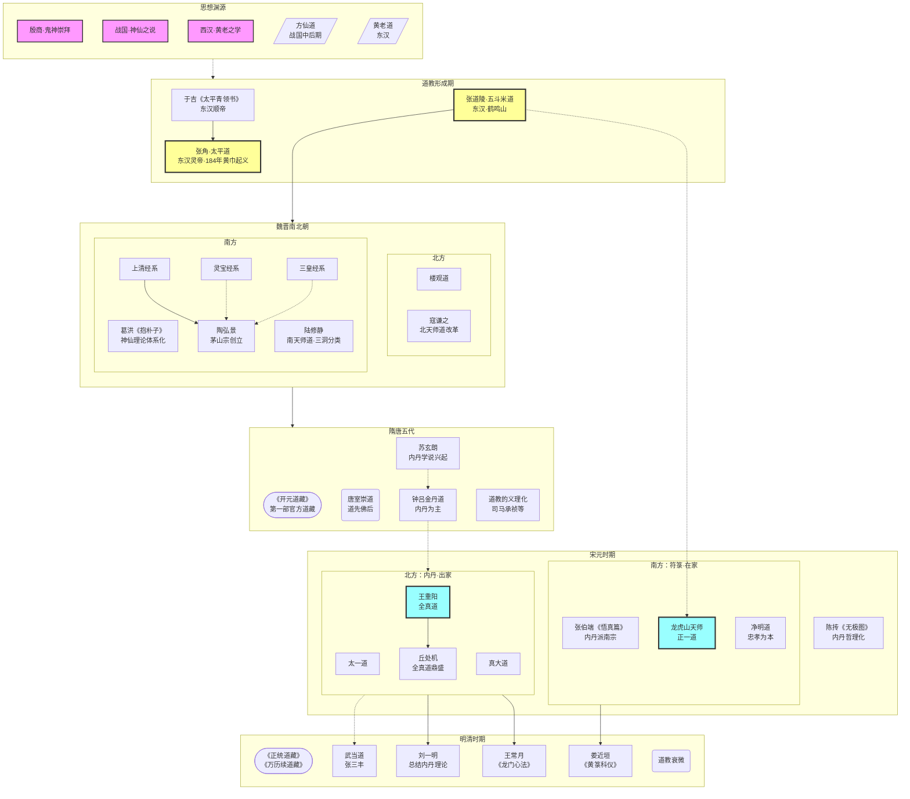

## 道教史提纲

- 起源与形成
    - 历史条件
        1. 社会矛盾的激化，东汉中后期政治腐败，大量流民出现
        2. 宗教化的儒学，谶纬盛行
        3. 佛教刺激，有组织的宗教活动
    - 思想渊源
        1. 鬼神崇拜，斋醮、上表、诵经等仪式可视为古代祭祀和巫祝传统的延续与演变
        2. 战国时期的神仙之说与方士方术，方士邹衍阴阳五行学说、“方仙道”
        3. 两汉之黄老道，武帝后形成具有宗教色彩的“黄老道”，成帝时甘忠可的《包元太平经》
        4. 其他，谶纬神学，《太平经》对墨家的吸收
    - 组织准备
        1. 东汉顺帝时，于吉《太平青领书》，太平道，标志道教形成
        2. 东汉顺帝时，张道陵在蜀郡鹤鸣山创立五斗米道，建立成熟的宗教组织体系
- 早期道教
    - 张角与太平道，东汉灵帝时，庞大宗教团体，黄巾起义，失败后信徒多融入五斗米道
    - 张鲁与五斗米道，张道陵之孙，在汉中发展壮大，政教合一政权
    - 魏伯阳与金丹道，顺帝、桓帝时，“丹经之王”《周易参同契》，丹鼎派的理论基础
    - 早期道教所信仰的神、仙、鬼，多神崇拜，继承神仙家传统，相信人死后魂魄分离为鬼，并存在幽冥世界
    - 理论基础，核心是“天人感应”和“心神合一”（人体是小宇宙，体内诸神与天地神灵相通）
- 魏晋南北朝时期
    - 曹魏制约道教，五斗米道因信徒北迁流传，同时出现一批信奉天师道的世家大族
    - 东晋末年，孙恩长生人暴动，民间的五斗米道
    - 葛洪《抱朴子·内篇》，神仙存在并可求，系统化的宗教哲学，神仙理论体系确立
    - 上清、灵宝、三皇经法之出现
        1. 东晋时期，江南分化出以造作和传授经法为核心的经箓（符箓）派
        2. 上清经系，杨羲、许谧，重“存神服气”和诵经
        3. 灵宝经系，葛巢甫，重斋醮科仪，元始天尊为核心的鬼神天地体系
        4. 三皇经系，鲍靓，重“劾召鬼神”的符图术
    - 楼观道与佛道斗争，佛道矛盾的激化
    - 北魏寇谦清整道教，融入儒家礼法、佛教轮回思想，规范斋醮仪式，新（北）天师道形成
    - 陆修静，最早编纂道藏目录，道教经书总括为三洞体系，规范斋醮科仪，南天师道出现
    - 陶弘景开创茅山宗，核心上清经并兼容各派，《真诰》（上清派历史）和《真灵位业图》（神仙谱系），经箓派成熟
- 隋唐五代时期
    * 道教与皇权结合，唐代统治者多给予道教崇高地位
    * 道教的义理化，融合佛教儒家，王玄览、吴筠、司马承祯
    * 内丹的兴起，苏玄朗、钟离权、吕洞宾，金丹道，人体内在的精、气、神修炼，从外丹转向内丹
    * 唐玄宗开元年间，第一步官方道藏，《开元道藏》
- 宋元新道派的兴起
    * 宋初陈抟作《无极图》，内丹学说哲理化；张伯端著《悟真篇》，“先命后性”的内丹修炼次第，南宗内丹派
    * 北方金代的新道派
        * 太一道，萧抱珍，重符箓斋醮
        * 真大道，刘德仁，静默祈祷
        * 全真道，王喆（王重阳），强调三教合一，专主内丹，出家并守戒律
    * 由龙虎宗到正一道
        * 唐末五代，张陵后裔定居江西龙虎山，建立“龙虎宗”
        * 宋代，“三山符箓”：龙虎宗、茅山宗、阁皂宗
        * 元代，统合江南各符箓派，形成“正一道”
    * 净明道与“忠孝神仙”，宋元年间，刘玉清，深受儒家理学影响
    * 明代以来，全真道、正一道对峙的局面
    * 张君房编《云笈七签》，宋、金、元重修《道藏》
- 明清时期
    * 明代武当道，张三丰，融合内丹与武术
    * 清代全真道士刘一明，总结全真道的内丹理论
    * 清初全真道士王常月，《龙门心法》，戒律修持为本
    * 清初正一道士娄近垣，《黄箓科仪》，斋醮科仪系统化
    * 明英宗《正统道藏》，明神宗《万历续道藏》
    * 清代道教衰落

