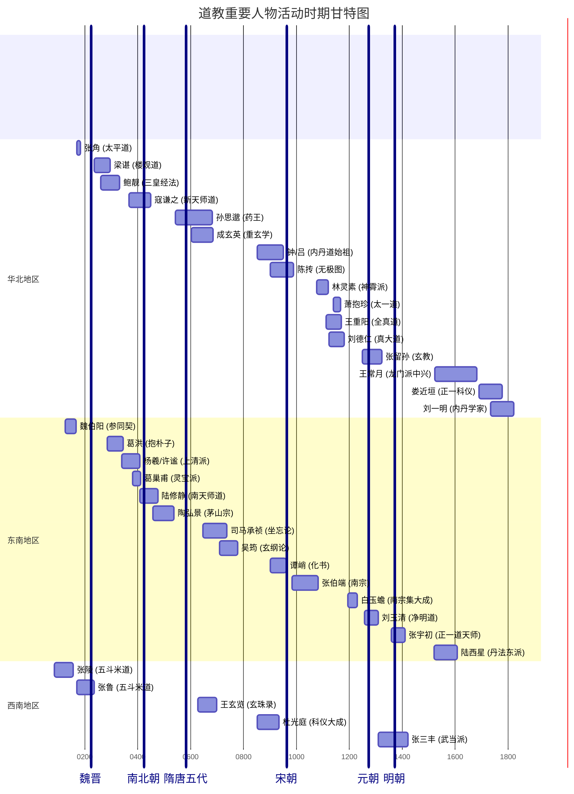
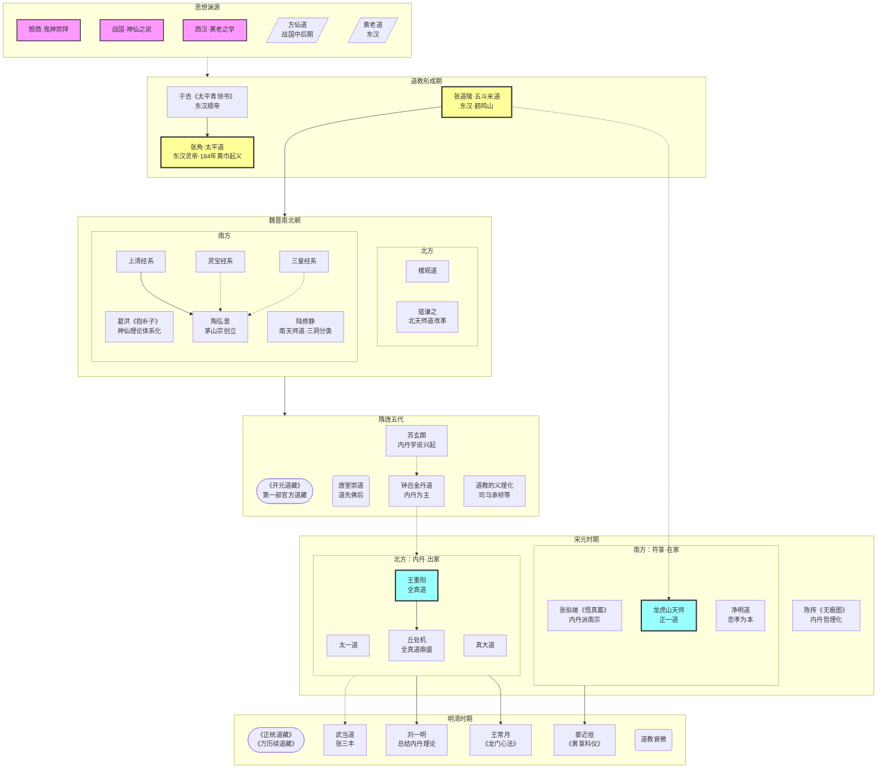

## 道教历史概要

### 道教的起源

#### 道教产生的历史条件

*  社会矛盾的激化：东汉中后期，外戚与宦官交替专政，政治腐败黑暗。豪强地主疯狂兼并土地，大量农民沦为流民，加之天灾频发，社会苦难深重。这种背景为渴望拯救与精神慰藉的宗教提供了滋生的土壤。
*  统治思想的宗教化：汉代经董仲舒改造后的儒学，引入“天人感应”神学体系，将“天”人格化。至东汉，儒学与谶纬神学结合，进一步神化儒家经典与圣人，使社会整体思想氛围趋向宗教化，为道教的产生创造了有利条件。
*  佛教的刺激作用：佛教于两汉之际传入中国，其斋戒、礼拜等有组织的宗教活动形式，为当时寻求建立本土宗教的方士提供了直接的启示和借鉴模式，起到了催生的作用。

#### 道教产生的思想渊源

本章探讨了道教形成之前的思想与信仰基础，将其追溯至三种并存的中国古代原始宗教意识。

- 鬼神崇拜：道教的源头之一可追溯至殷商时期的鬼神信仰。这一时期的宗教意识已具备以上帝为中心的天神系统、与宗法结合的祖先崇拜以及通过占卜和巫祝沟通神意的实践。周代进一步将鬼神崇拜系统化为天神、人鬼、地祇三个体系，这为后来道教庞杂的多神信仰系统奠定了基础。道教的斋醮、上表、诵经等仪式，均可视为古代祭祀和巫祝传统的延续与演变。

- 战国时期的神仙之说与方士方术：道教的另一核心源头是战国时期兴起的神仙信仰及追求长生的方术。以《庄子》、《列子》为代表的先秦典籍描绘了超凡脱俗的“神人”、“至人”，以及如“蓬莱”、“瀛洲”等海外仙境，激发了人们对长生不死的向往。伴随此思潮，出现了掌握各类方术的“方士”，他们最初仅有方术而缺乏理论体系。战国末期，方士邹衍融合阴阳五行学说，为神仙信仰提供了理论框架，形成了“方仙道”。秦始皇与汉武帝对不死仙药的痴迷，极大地推动了方仙道的发展，使其在社会上产生了广泛影响。

- 两汉之黄老道：方仙道因其方术屡屡不验而声名受损，部分神仙家转而依附于当时社会上颇具影响力的黄老之学。西汉初期的“黄老之术”主要是“清静无为”的治国方略，尚未与神仙信仰结合。至汉武帝后，神仙家为建立新的理论体系，效仿儒家尊崇圣贤的模式，开始将黄帝和老子宗教化、神化，逐步形成了具有宗教色彩的“黄老道”。至东汉桓帝时期，老子已被完全神化为“道”的化身和至高神灵，并享受国家祭祀；《老子》一书也被重新诠释为指导修炼成仙的经典，如《河上公章句》的出现即是标志。这标志着黄老道的正式形成。它不仅讲求方术，也开始宣扬系统的修道养寿理论，成为道教正式出现前的直接母体。

- 其他思想：吸收了谶纬神学中关于宇宙生成、神化圣贤的模式。道教对老子的神化，以及存思身内外诸神的方术，均受到谶纬神学的启发；另外，《太平经》明显吸收了墨家“天志”、“明鬼”和“兼爱”、“尚同”的思想，主张财物公有、互助互利、自食其力。

### 道教的形成

本章论述了从方仙道、黄老道这两个阶段的前身信仰，到太平道和五斗米道这两个有组织、有教义的宗教实体正式出现的过程，标志着道教的最终形成。

- 方仙道：形成于战国中后期，是一个以追求长生不死为核心的信仰集团。它吸收了阴阳五行学说作为理论基础，尊奉黄帝为始祖，并发展出“形解销化”（类似尸解）的信仰和多种修炼方术。但方仙道仅是一个松散的信仰团体，尚未形成严密的宗教组织和仪式，是道教的雏形。

- 黄老道，甘忠可与《包元太平经》：西汉成帝时期，方士甘忠可融合黄老道与儒家谶纬学说，造作了《天官历》和《包元太平经》。该经书宣称汉朝国运将终，需“更受命于天”，并假托神仙“赤精子”下凡传授救世之道。这标志着神仙信仰开始与社会政治变革理论相结合，为太平道的思想奠定了初步基础。

- 于吉与《太平青领书》之出现：东汉顺帝时，于吉在《包元太平经》的基础上，汇集民间流传的各种相关文本，编纂成一百七十卷的《太平青领书》（即后世所称的《太平经》）。该书系统阐述了以“奉天地、顺五行”为核心，杂糅巫觋之术的宗教思想，其内容深刻反映了东汉末期的社会矛盾与民众疾苦。作者认为，《太平经》的问世，实际上就标志着道教的形成。

- 张道陵与五斗米道：与太平道几乎同时，张道陵在蜀郡鹤鸣山创立了五斗米道。此教派融合了黄老道与巴蜀地区的巫觋传统，因此更注重符箓、章表和斋醮仪式。五斗米道建立了成熟的宗教组织体系，以“二十四治”为教区中心，设“祭酒”等职官进行管理。入教者需缴纳五斗米，故而得名。教义核心包括诵习《老子五千文》、首过、符水治病等。由于其孙张鲁在汉中建立了长达三十年的政教合一统治，使得五斗米道组织稳固、影响深远，后世因此尊张道陵为道教的创教者。

### 早期道教

本章界定从汉桓帝到汉献帝时期为“早期道教”，并分析了当时道教分化的三个主要流派及其基本信仰。

- 张角与太平道：张角继承并发展了于吉的太平青领道，自称“大贤良师”（约在东汉灵帝年间，168-172年）。其教义、称号（如“天公将军”）、口号（如“岁在甲子，天下大吉”）及法术（如九节杖、符水疗病）均与《太平经》密切相关。太平道迅速发展为拥有数十万徒众的庞大宗教团体，并最终演变为旨在推翻东汉统治的黄巾起义（中平元年，184年）。起义失败后，太平道随之消亡，其信徒多融入五斗米道。

- 张鲁与五斗米道：由张陵于东汉顺帝年间（126-144年）在蜀郡鹤鸣山创立五斗米道，其孙张鲁继承祖父教法，并在汉中地区进一步发展壮大。他完善了教区的“义舍”制度，规定了“春夏禁杀”、“禁酒”等教规，创立了“三官手书”等祭祷仪式。其教义与《太平经》思想相通，但其教团组织更为稳固，并在汉中建立了持续近三十年的政教合一政权。张鲁归降曹操后，五斗米道随民众北迁而传播至中原地区，并逐渐演变为后世的“天师道”与“正一道”的主脉。

- 早期道教所信仰的神、仙、鬼：早期道教尚未形成统一的“三清”神系，其最高神称谓不一，如“后圣九玄帝君”（即神化老子）、“天君”等，呈现多神崇拜的特点。其神仙体系将自然万物人格化，并认为人体内亦有“五脏神”。对“仙”的信仰继承了神仙家传统，认为通过学道积德可以成为长生不死的仙人，但更强调仙人有管理四时风雨等职能。同时，也相信人死后魂魄分离为“鬼”，并存在一个由地府神灵掌管的幽冥世界。

- 早期道教的神学理论基础：早期道教的理论核心是“天人感应”和“心神合一”。前者认为“天”是有人格意志的宇宙主宰，能通过灾异或祥瑞来警示或嘉奖人间的善恶行为，这与汉代儒家董仲舒的学说一脉相承。后者则认为人体是小宇宙，体内诸神与天地神灵相通，通过“存思”等内心修炼，即可与神灵沟通，实现长生。

- 魏伯阳与金丹道：在太平道与五斗米道走向民间的同时，另一支黄老道方士则转向理论探索，其代表为魏伯阳。他撰写的《周易参同契》被誉为“丹经之王”，该书首次将《周易》的阴阳变化哲理、黄老思想与炉火炼丹术（外丹）相结合，将炼丹方术提升至义理化的高度，为后世道教的丹鼎派（包括内丹和外丹）奠定了坚实的理论基础。

### 魏晋南北朝道教的盛行与发展

这一时期是道教经历重大变革与发展的关键阶段，神仙理论得以系统化，新的经法体系和重要宗派相继形成。

- 曹魏之制约道教与道教之传播：曹魏政权鉴于黄巾起义的教训，对道教采取了招揽、利用但又严格控制的政策。部分方士被门阀贵族吸纳，使其在上层社会传播，出现了王、谢、杜、沈等一批信奉天师道的世家大族；同时，五斗米道在北方民间也因信徒北迁而继续流传，并为之后在江南的盛行埋下伏笔。

- 葛洪与神仙理论体系的确立：东晋道教学者葛洪，在其著作《抱朴子·内篇》中，系统地总结和论证了神仙的存在与可求性。他吸取玄学思想，以“玄”为宇宙本原，确立了以“还丹金液”（外丹）为核心的修仙理论，并强调“我命在我不在天”以及“形神双修”的重要性。葛洪的理论体系标志着道教神仙信仰从零散的方术传说发展为系统化的宗教哲学。

- 孙恩“长生人”之暴动：东晋末年，以孙恩、卢循为首的五斗米道信众发动了大规模起义。起义者自称“长生人”，其宗教行为表现出对长生、成仙的狂热信仰。这次起义反映了当时阶级矛盾的激化，也显示了民间五斗米道与服务于贵族的“大道”之间的分化。

- 上清、灵宝、三皇经法之出现：东晋时期，江南天师道分化出以造作和传授经法为核心的经箓（符箓）派。主要分为三个系统
    - 上清经系，由杨羲、许谧等在东晋兴宁二年（364年）以扶乩方式造作，重“存思”之术，修炼方式更为雅致，迎合了上层士族的精神需求；造作了以《大洞真经》为代表的上清经系。其修行方术重“存神服气”和诵经，不重符箓斋醮，反对房中术，尊奉元始天王等新神灵。其发展可见本节所述陆修静、陶弘景的茅山宗。
    - 灵宝经系，由葛巢甫（葛洪的从孙）等在古《灵宝经》基础上增修而成，重斋醮科仪，并初步确立了以元始天尊为核心的鬼神天地体系。灵宝派在南朝后一度沉寂，至北宋时期，在江西阁皂山形成了传授灵宝经箓的“阁皂宗”，为符箓三宗之一。
    - 三皇经系，由鲍靓等人造作，重“劾召鬼神”的符图之术。
这三大经系的出现，标志着天师道向义理化和仪式化的重大演变。

- 楼观道与佛道斗争：在西北地区，以终南山楼观为中心的楼观道派兴起。该派以《道德经》为主要经典，宣扬老子西去印度化身为佛的“化胡”之说，撰造了《西升经》和《老子化胡经》，成为佛道长期论争的重要源头，标志着佛道矛盾的激化。楼观派在北朝及隋唐时期因受统治者支持而兴盛，安史之乱后逐渐衰落，至元代并入全真道。

- 寇谦之“清整”道教及新天师道之形成：北魏道士寇谦之对五斗米道进行了重大改革。他假托太上老君亲授《新科之诫》，废除了租米钱税和男女合气等旧法，引入儒家礼法和佛教轮回思想，并规范了斋醮仪式。改革后的道教与北魏皇权紧密结合，一度成为国教，史称“新天师道”或“北天师道”。

- 陆修静提倡斋仪、总括三洞及南天师道之出现：南朝刘宋时期的道士陆修静，对道教进行了系统的整理。他首次将道教经书分为“三洞”（洞真、洞玄、洞神），编纂了最早的《道藏》目录《三洞经书目录》。同时，他大力提倡和规范斋醮科仪，撰写了百余卷仪范，强调“斋直为求道之本”。他改革后的道教被称为“南天师道”。

- 陶弘景开创茅山宗：陆修静之后，南朝道教学者陶弘景在茅山创立了茅山宗。他以《上清经》为主体，兼容各派道法及儒、释思想，主张三教调和。他编纂的《真诰》和《真灵位业图》，系统整理了上清派的历史和神仙谱系，使茅山成为上清派的中心。陶弘景的学说标志着道教经箓派的成熟，对后世影响深远，其在隋唐时期极为兴盛，俨然成为道教正宗。

### 隋唐五代的道教

这一时期，道教因与唐代皇室的特殊关系而进入全盛阶段，教义理论也进一步深化和发展。

- 隋代之道教：隋朝国祚短促，统治者崇佛抑道，道教发展受限。但这一时期最重要的发展是“内丹”学说的兴起。道士苏玄朗等人，鉴于外丹烧炼的弊害，开始倡导以人体为炉鼎、以精气神为药物的内丹修炼术，标志着道教修炼方术的重大转向。

- 道教与皇权之结合：唐代统治者为抬高门第，认道家始祖老子（李耳）为同姓先祖，从而将道教奉为“皇族宗教”。从唐高祖起，历代皇帝多给予道教崇高地位，下诏“道先佛后”，尊老子为“太上玄元皇帝”，并将《道德经》列为科举考试内容。唐玄宗更是亲受法箓，成为“道士皇帝”。皇权的扶持使道教在唐代获得了空前的社会地位和发展空间。

- 傅奕与赵归真之誉道毁佛：在唐代，佛道之争异常激烈。初唐太史令傅奕多次上疏，从民族文化、国家经济和伦理道德等方面猛烈抨击佛教，引发了大规模的论辩。至唐武宗时期，道士赵归真等人乘皇帝崇道之机，进言排佛，最终促成了“会昌法难”，大规模废毁佛寺、勒令僧尼还俗。这些斗争的实质是皇权与僧侣集团在政治和经济利益上的深刻矛盾。

- 道教在义理化方面的发展：在唐代浓厚的学术氛围及佛道之争的刺激下，道教理论进一步发展。以王玄览、吴筠、司马承祯为代表的道教学者，大量吸取佛教（尤其是法相宗、禅宗）和儒家的思想，来阐释老庄哲理与道教修持方法。司马承祯的《坐忘论》系统论述了“主静”的修真次第，而杜光庭则在教义上力图融合儒道，并集道教斋醮科仪之大成。

- 钟吕金丹道的崛起：唐末五代，以内丹修炼为核心的钟吕金丹道兴起。以钟离权、吕洞宾为代表的内丹家，系统地建立了内丹道的理论与方法，将人体内在的精、气、神修炼视为成仙的根本途径。这一派别的崛起，标志着道教修炼方术的重心从外丹转向内丹，对宋元以后道教的发展产生了决定性影响。

- 道书及《开元道藏》：隋唐五代是道教经书大量涌现的时期。唐玄宗开元年间，朝廷组织编纂了中国第一部官方《道藏》，名为《开元道藏》（或称《三洞琼纲》），收录道书数千卷。这部《道藏》的编成与颁行，标志着道教经籍的系统化和规范化达到了新的高度。

### 宋元新道派的兴起

宋元时期，社会动荡与思想融合共同推动了道教的深刻演变，多个新道派涌现，南北宗派分立，最终形成了全真与正一两大派别并存的格局。

- 宋真宗、徽宗之崇道：北宋真宗为巩固统治，大搞“天书下降”的神道设教，并伪造赵氏始祖“赵玄朗”为道教尊神。徽宗更是自封“教主道君皇帝”，将道教抬至国教地位，广建宫观，大规模整理《道藏》，使道教在官方层面达到前所未有的鼎盛。但这种狂热崇道也导致了政治腐败和民生凋敝。

- 陈抟与张伯端之发展修丹理论：与官方的狂热并存，道教内丹理论在宋代取得重大突破。宋初道士陈抟创作《无极图》，将宇宙生成论与内丹“逆以成丹”的修炼过程相结合，使内丹学说哲理化。其后，张伯端著《悟真篇》，系统阐述了“先命后性”的内丹修炼次第，并明确提出三教合一思想，该书与《参同契》并称为“丹经之王”。

- 河北新道派之出现：金代统治下的北方地区，因社会苦难和民族矛盾，兴起了三个新道派
    - 太一道，由萧抱珍于金初（1138-1140年）创立。重符箓斋醮，与正一道相近，但要求道士出家。元代后期，该派逐渐并入正一道。
    - 真大道，由刘德仁于金皇统年间（1142年）创立。教义以《老子》为本，融合儒家伦理与佛教戒律，强调自食其力、不重炼丹飞升，而以静默祈祷为修行方式。元代时，该教一度分裂为两派，后天宝宫一系成为正统并得到元室大力扶持，教派兴盛。元末之后，可能并入了全真道。
    - 全真道，由王喆（王重阳）于金大定年间（1167年）创立，是北方新道派中影响最大的一派。其特点是：1. 强调三教合一，以《道德经》、《般若心经》、《孝经》为必修经典，理论上深受禅宗影响；2. 修行上专主内丹，不尚符箓；3. 严格要求道士出家并遵守清规戒律。后经其弟子丘处机远赴西域见成吉思汗，获元室支持，掌管天下道教，全真道进入鼎盛期。
    - 全真道与南方的内丹派（以张伯端为代表）形成了教理和地域上的差异，被称为“北宗”，而张伯端的丹法流派则被称为“南宗”。

- 龙虎宗的形成：东晋南朝时期，经过改革后的天师道日趋成熟，但之后又进入一段较长的沉寂期。至唐末五代，张陵后裔定居于江西龙虎山，建立了“龙虎宗”，延续其教法。在宋代皇室的扶持下，龙虎宗与茅山宗、阁皂宗并称为“三山符箓”。

- 两宋时期南方道教中的符箓派：神霄、清微、东华、天心诸派，这些派别均在北宋末至南宋间形成，皆属符箓道教，但各有侧重。神霄派以行雷法著称；清微派自称融合上清、灵宝等四派道法；东华派由灵宝派分化而来；天心派则被视为龙虎宗的一个支派。它们共同的特点是将雷法与内丹术相结合，或对斋醮科仪进行整理更新。

- 由龙虎宗到正一道，主领三山符箓：元代，统治者为安定江南，对龙虎山天师道给予极高礼遇。三十八代天师张与材被封为“正一教主，主领三山符箓”，正式将龙虎山、茅山、阁皂山以及神霄、清微等江南各符箓派统一在天师的管辖之下，形成了“正一道”，事在成宗大德八年（1304年）。正一道以龙虎山天师为首，道士可婚娶、居家修行。
    - 元世祖至元年间（1276-1278年），天师弟子张留孙在京师创立玄教，作为正一道在北方的分支，权势显赫。明朝后，玄教解体，重新归入正一道。

- 净明道与“忠孝神仙”：宋元年间，在江西西山形成了以“忠孝”为核心教义的净明道。该派尊东晋许逊为祖师，由刘玉清正式创立，深受儒家理学影响，强调“正心诚意”和“忠孝为本”，是一种将封建伦理道德与符箓方术相结合的新道派。

- 全真道与正一道对峙局面的形成：辽宋金元时期，北方兴起三个大的教派：太一道、真大道和全真道；南方则有两个：正一道和净明道。太一道、真大道和净明道早已失传，明代以来，道教形成了以全真道（北宗，内丹）和正一道（南宗符箓派的集合）为主的两大宗派。

- 张君房编《云笈七签》与宋、金、元之重修《道藏》：宋代多次重修《道藏》，其中张君房在编纂《大宋天宫宝藏》时，撮其精要编成《云笈七签》，成为后世研究宋以前道教的重要类书。金代和元代也分别编纂了《玄都宝藏》。元代两次大规模的“焚经事件”，使道教经籍遭受了巨大损失。

### 明清时期的道教

明清时期，道教在官方地位和理论创新上均呈衰落趋势，教派活动主要在已有基础上延续。

- 明代之检束道教与世宗之迷道：明朝对道教采取利用与严格控制相结合的政策。明太祖取消了“天师”称号，并从制度上限制道观数量和出家人数。除明世宗一度痴迷道教方术，重用道士外，明代大部分皇帝对道教持审慎态度。

- 武当道与丹法东派、西派之出现及刘一明之丹道：明代，因皇室对真武大帝的崇奉，湖北武当山成为新的道教中心，形成了以张三丰为代表，融合内丹与武术的“武当道派”。同时，内丹学在明清时期分化出主张阴阳双修的“东派”（陆西星）和“西派”（李涵虚）。清代全真道士刘一明则是清修派丹法的集大成者，其著作系统总结了全真道的内丹理论。

- 王常月的《龙门心法》及娄近垣之《黄箓科仪》：清初，全真道龙门派律师王常月致力于重振教风，开坛说戒，其讲稿被整理为《龙门心法》，强调以戒律修持为本，使全真道风从偏重丹法转向注重戒行。同时期，正一道士娄近垣则对斋醮科仪进行了系统整理，编订了《黄箓科仪》，成为清代正一道科仪的重要范本。

- 《正统道藏》及重要道书的编纂刊行：明英宗正统年间，在官方主持下，完成了现存版本《道藏》的主体部分——《正统道藏》。明神宗万历年间，又增补了《万历续道藏》。这两部道藏成为后世研究道教最根本的文献依据。清代彭定求等人又在此基础上编选了《道藏辑要》。

- 道教之衰微：进入清代，道教总体呈衰落趋势。原因包括：清政府对道教的严峻态度，逐步削弱了正一天师的政治地位；新文化思想和西方科技的传入，冲击了传统的宗教意识；基督教等外来宗教的竞争；以及道教自身理论停滞，缺乏创新。道教的社会影响力日渐减弱，步入衰微期。

---

## 道教人物小传

### 两汉时期

1.  张陵
    - 大致活动年份与地点：34–156年（此为道教传统说法，学界对其生平有不同研究），沛国丰（今江苏丰县）人，主要活动于蜀郡鹤鸣山（今四川大邑）。
    - 事迹与贡献：道教的实际创始人，被尊为第一代天师。他在东汉顺帝年间创立了五斗米道，建立了道教史上第一个有组织的教团。他以符水为人治病，教人首过（忏悔罪过），并设立了“二十四治”作为教区和行政管理单位，奠定了早期道教的组织基础和社会功能。他的创教活动标志着道教从零散的方术信仰正式转变为一个有系统、有组织的宗教。

2.  张角
    - 大致活动年份与地点：?–184年，巨鹿（今河北宁晋）人。
    - 事迹与贡献：东汉末年太平道的创始人和黄巾起义的最高领袖。他自称“大贤良师”，以《太平经》为核心教典，通过符水咒说为人治病，迅速发展了数十万信众。他将信徒编入名为“方”的准军事组织，并以“苍天已死，黄天当立”为口号，于184年发动了震撼全国的黄巾起义。虽然起义最终失败，但其行动深刻地影响了东汉的政治格局，并展示了早期道教强大的社会动员能力。

3.  张鲁
    - 大致活动年份与地点：?–216年，沛国丰（今江苏丰县）人，张陵之孙。主要活动于汉中（今陕西南郑）。
    - 事迹与贡献：五斗米道的重要建设者，被尊为“系师”。他继承并发展了祖父的教业，在汉中建立了长达近三十年的政教合一的割据政权。他自号“师君”，完善了祭酒制度，设立“义舍”以救济行旅，并著有《老子想尔注》，为五斗米道提供了重要的教理阐释。他的治理使五öt米道组织稳固、影响深远，为后世正一道的形成奠定了基础。

### 魏晋南北朝时期

1.  魏伯阳
    - 大致活动年份与地点：约东汉末年，活跃于汉顺帝、桓帝时期（约125-167年）。主要活动于会稽上虞（今浙江上虞）。
    - 核心事迹与贡献：撰写了被誉为“万古丹经王”的《周易参同契》。他首次将《周易》的阴阳变化哲理、黄老思想与炉火烧炼（外丹）相结合，将原本零散的方术提升到了系统的理论高度，为后世道教的丹鼎派（无论是外丹还是内丹）奠定了坚实的理论基础。
2.  梁谌
    - 大致活动年份与地点：魏元帝咸熙初年（约264-265年）。主要活动于终南山楼观（今陕西周至）。
    - 核心事迹与贡献：他是史料中记载的最早与楼观道相关的道士。他托言神仙尹轨降授经法，开始在楼观建立道教传统。他可能是《西升经》的早期作者之一，该经书阐发老子之道，标志着道教开始向义理化方向探索。
3.  鲍靓
    - 大致活动年份与地点：西晋时期，活跃于晋武帝、惠帝年间（约290-301年）。主要活动于嵩山（今河南登封）。
    - 核心事迹与贡献：他是三皇经法的关键人物。据传他在嵩山石室中获得了《三皇文》，其核心内容是“劾召鬼神”的符图和法术。这一经系的出现，代表了道教中继承古老巫术传统、注重法术力量的一支重要流派。
4.  葛洪
    - 大致活动年份与地点：283 - 343年。丹阳句容（今江苏句容），晚年隐居于罗浮山（今广东博罗）。
    - 核心事迹与贡献：撰写了不朽的道教理论巨著《抱朴子·内篇》。他全面系统地整理和论证了神仙方术，特别是外丹烧炼。他将儒家的忠孝伦理与修仙相结合，提出了“我命在我不在天”的著名论断，为道教构建了第一个完整的神仙理论体系，极大地提升了道教在士族阶层中的地位。
5.  杨羲、许谧
    - 大致活动年份与地点：活跃于东晋哀帝兴宁年间（约364年）。主要活动于建业（今江苏南京）、句容茅山。
    - 核心事迹与贡献：创立了上清派。他们通过扶乩降神的方式，造作了以《大洞真经》为代表的一系列上清经书。上清派的修炼方式以精神性的存思为主，其经典文辞华丽，理论玄妙，完全迎合了南朝士族的审美和精神追求，标志着道教的“贵族化”。
6.  葛巢甫
    - 大致活动年份与地点：活跃于东晋末年（约4世纪末）。活动于江南地区
    - 核心事迹与贡献：创立了灵宝派。他在古《灵宝经》的基础上，造作了以《度人经》为核心的新经书。灵宝派极大地发展了道教的斋醮科仪，使其仪式化、规范化，并确立了以元始天尊为最高神和三清并尊的神学体系，对后世道教影响极为深远。
7.  寇谦之
    - 大致活动年份与地点：365 - 448年。主要活动于嵩山（今河南登封），后至北魏都城平城（今山西大同）。
    - 核心事迹与贡献：对北方的天师道进行了彻底的改革。他废除了租米钱税、男女合气等早期教规，强调以儒家礼法为核心，制定了严格的戒律和斋仪。他的改革使道教与北魏政权紧密结合，成为服务于“佐国扶命”的国家宗教，史称“新天师道”或“北天师道”。
8.  陆修静
    - 大致活动年份与地点：406 - 477年。主要活动于庐山（今江西九江）、建康（今江苏南京）。
    - 核心事迹与贡献：作为灵宝派的集大成者，他对整个道教进行了系统化的整理。他编纂了第一部《道藏》目录——《三洞经书目录》，确立了道教经书的分类体系。同时，他大力规范和推广斋醮科仪，撰写了百余卷仪范，使道教的宗教仪式基本完备。他所整顿的道教被称为“南天师道”。
9.  陶弘景
    - 大致活动年份与地点：456 - 536年。主要活动于茅山（今江苏句容）。
    - 核心事迹与贡献：他是茅山宗的实际开创者。他以茅山为中心，总括了上清、灵宝两派的教义，并深入研究外丹、医药等方术。他编纂的《真诰》和《真灵位业图》，前者系统记述了上清派的历史，后者则首次为道教建立了系统化的神仙谱系，模仿人间官僚体系对天上神仙进行了位阶排列。陶弘景的工作标志着道教神学体系的最终成熟。

### 隋唐五代时期

1.  孙思邈
    - 大致活动年份与地点：541年或581年 – 682年，京兆华原（今陕西耀县）人。
    - 事迹与贡献：唐代杰出的道士、医学家和药学家，被后世尊为“药王”。他精通老庄，并深研医术与炼丹术。其不朽巨著《备急千金要方》和《千金翼方》系统总结了唐代以前的医学成就，对后世中医学发展影响巨大。他将道教的养生思想与医学实践紧密结合，强调“大医精诚”，体现了道教“济世度人”的入世精神。

2.  成玄英
    - 大致活动年份与地点：约活动于唐太宗、高宗时期（约631–655年），陕州（今河南陕县）人。
    - 事迹与贡献：唐初著名的道教学者，以注疏《老子》和《庄子》而闻名。他最大的理论贡献是运用“重玄”之学来解读道家经典。“重玄”意为在“玄”（道）之上再探求更深的玄理，即破除一切执着，达到无所滞碍的境界。他的注疏深受佛学影响，使道教哲理更为深化和思辨，是道教义理发展史上的重要人物。

3.  王玄览
    - 大致活动年份与地点：626–697年，广汉绵竹（今属四川）人。
    - 事迹与贡献：唐初重要的道教学者，其思想辑录为《玄珠录》。他深受佛教唯识宗影响，将道教的“道”与佛教的“识”相结合，提出了“心生则法生，心灭则法灭”的唯心主义本体论。他认为宇宙万物皆由“一识”所变现，将道教的宇宙生成论推向了更为抽象和思辨的哲学层面，是唐代道教理论深度融合佛学的典型代表。

4.  司马承祯
    - 大致活动年份与地点：647–735年，河内温（今河南温县）人，后隐居于天台山（今浙江天台）。
    - 事迹与贡献：唐代茅山宗第十二代宗师，杰出的道教学者。他深受唐玄宗器重，系统阐发了道教的修养理论。其著作《坐忘论》和《天隐子》，融合儒、释思想，详细论述了道教静坐修炼的次第和方法，提出通过“斋戒、安处、存想、坐忘、神解”五个阶段达到与道合一的境界。他的理论使道教的修炼方法系统化、哲学化，对后世内丹学影响深远。

5.  吴筠
    - 大致活动年份与地点：？–778年，华州华阴（今属陕西）人，茅山宗道士。
    - 事迹与贡献：唐代著名道教学者，曾待诏翰林。其著作《玄纲论》、《神仙可学论》等，致力于论证神仙信仰的合理性，并系统地将老庄思想与道教长生术相结合。他明确提出“道德为本，仁义为末”的思想，将儒家伦理纳入道教理论体系，并强调修道必须“守静去躁”，去除情欲。他的工作进一步完善了道教的神学理论。

6.  杜光庭
    - 大致活动年份与地点：850–933年，处州缙云（今属浙江）人，唐末随僖宗入蜀，晚年居于青城山。
    - 事迹与贡献：唐末五代最博学的道教学者，被誉为道教的集大成者。他在理论上，以《道德真经广圣义》等著述，系统地将儒家纲常名教融入道教；在实践上，他全面搜集、整理和规范了道教的斋醮科仪，编纂了《道门科范大全集》，成为后世道教科仪的范本。他还撰写了大量神仙传记和宫观记，为后世保存了珍贵的道教历史资料。

7.  谭峭
    - 大致活动年份与地点：约活动于五代时期，泉州（今属福建）人。
    - 事迹与贡献：五代道教学者，其著作《化书》是一部充满辩证思想的奇特作品。他以“虚”为宇宙本源，提出“虚化神，神化气，气化形”的宇宙生成论，并认为万物处于不断的转化之中，主张齐同生死、泯灭差别。书中既有深刻的哲学思辨，也包含了对社会不公的批判，思想独特，在道教史上独树一帜。

8.  钟离权/吕洞宾
    - 大致活动年份与地点：约活动于唐末五代，其生平多为传说，难以确考。钟离权多与终南山联系，吕洞宾籍贯有京兆、河中府等说。
    - 事迹与贡献：他们是内丹道（钟吕金丹道）的关键奠基人物，被后世全真道尊为祖师。相传钟离权将内丹秘诀传授给吕洞宾，其问答之辞被记录为《钟吕传道集》。他们系统地阐述了以内炼人体精、气、神来代替外丹烧炼的修炼理论和方法，标志着道教修炼术的重大转折。虽然其历史真实性存疑，但他们的思想深刻地影响了宋元以后整个道教的发展方向。

### 宋、金、元时期

1.  陈抟
    - 大致活动年份与地点：?–989年，亳州真源（今河南鹿邑）人，长期隐居于华山。
    - 事迹与贡献：宋初著名的道教学者和象数学家，被宋太宗赐号“希夷先生”。他精通《易》学，创作了《无极图》、《先天图》等图式，以直观的方式阐述宇宙生成论和内丹修炼的“逆以成丹”之法。他的思想上承钟吕，下启周敦颐，不仅为道教内丹学说注入了深厚的哲学意蕴，也成为宋明理学的直接思想源头之一，是三教融合史上的关键人物。

2.  张伯端
    - 大致活动年份与地点：984–1082年，天台（今属浙江）人，晚年在蜀地得道。
    - 事迹与贡献：北宋著名的内丹理论家，被尊为道教南宗始祖。他撰写的《悟真篇》与《参同契》并称，是内丹学的核心经典。该书系统阐述了“先命后性”的修炼次第，即先通过修炼精、气以固形体，再参照禅宗心性学说修炼心神以求彻悟。他明确倡导三教合一，其理论完成了内丹学说的系统化，影响了此后近千年的道教修炼实践。

3.  林灵素
    - 大致活动年份与地点：1075–1119年，温州（今属浙江）人，主要活动于北宋京城汴梁（今河南开封）。
    - 事迹与贡献：北宋末年权势极大的道士。他深得宋徽宗宠信，创立了神霄派道法，并编造神话，称徽宗为“长生大帝君”下凡。他推动徽宗自号“教主道君皇帝”，并一度下令改佛为道，将佛教寺院改为道观，僧人改为德士。他的活动使道教在北宋末年获得了畸形的政治高位，是道教与皇权结合达到顶峰的代表人物。

4.  萧抱珍
    - 大致活动年份与地点： 约活动于金天眷至大定年间（1138-1166年），卫州（今河南汲县）人。
    - 事迹与贡献： 金代太一道的创始人。他于金天眷年间立教，主张以老子之学修身，以符箓斋醮等巫祝之术济世。其教法得到金代皇室的承认与支持，他本人被金熙宗召见，其道观被赐名“太一万寿观”。他开创的太一道与全真道、真大道并列为金代北方三大新道派之一。

5.  刘德仁
    - 大致活动年份与地点： 1122–1180年，沧州乐陵（今属山东）人。
    - 事迹与贡献： 金代真大道教的创始人。他于金皇统年间立教，其教义以“苦节危行”为核心，强调自食其力、不事烧炼、不重符箓。他制定了融合儒释道思想的“九条戒规”，要求信徒恪守忠孝诚信等伦理，并通过静默祈祷为人治病。其朴实无华的教风在当时独树一帜，是北方三大新道派之一。

6.  王重阳
    - 大致活动年份与地点：1112–1170年，陕西咸阳人，后至山东传教。
    - 事迹与贡献：金代全真道的创始人，被尊为北宗始祖。他改变了传统道教的修炼方式，提倡儒、释、道三教合一，以《道德经》、《孝经》、《般若心经》为主要经典。他建立了严格的出家制度和清规戒律，要求道士清心寡欲、识心见性。他创立的全真道以其严谨的教规和深刻的内丹理论，成为元代以后与正一道并立的两大道派之一，对后世道教影响至深。

7.  白玉蟾
    - 大致活动年份与地点：1194–约1229年，原籍福建闽清，生于琼州（今海南）。
    - 事迹与贡献：道教南宗的实际奠基人，被尊为南五祖之一。他师事陈楠，继承并发展了张伯端的内丹学说，并精通神霄雷法。他著作宏富，系统地阐述了南宗的丹法理论，并整理了南宗的传承谱系。他将内丹修炼与符箓道法相结合，并大量融入禅宗和理学思想，使南宗理论体系完备化，成为南宋道教最具影响力的代表人物之一。

8.  张留孙
    - 大致活动年份与地点：1248–1321年，信州贵溪（今属江西）人，长期活动于元大都（今北京）。
    - 事迹与贡献：元代龙虎宗的重要人物，玄教的创始人。他原为龙虎山天师的弟子，后随师入朝，因深得元世祖忽必烈及历代皇帝的宠信，被封为“玄教大宗师”，在大都建立了崇真宫，形成了实力强大的龙虎宗支派——玄教。他的活动极大地提升了龙虎宗在全国的政治地位和影响力，为元代最终形成统一的正一道奠定了组织基础。

9.  刘玉清
    - 大致活动年份与地点：1257–1308年，江西南康建昌人，活动于西山（今江西南昌）。
    - 事迹与贡献：元代净明道的创始人。他在东晋许逊信仰的基础上，融合宋明理学思想，正式创立了净明忠孝道。他以“忠孝为本，敬天崇道”为宗旨，强调修道必须从“正心诚意”等儒家伦理实践入手，而非单纯修炼精气。他的教派是道教与儒家理学深度融合的典型产物，在元明时期影响广泛。

### 明清时期

1.  张宇初
    - 大致活动年份与地点：1359–1409年，江西贵溪龙虎山人。
    - 事迹与贡献：明代第四十三代天师，正一道的重要整理者。他学识渊博，深受明成祖朱棣的器重，奉敕主持编修《正统道藏》。其著作《道门十规》对当时道教的流弊进行了深刻的剖析和批判，并提出了整顿的规章，是研究明代道教的重要文献。他的工作在一定程度上规范了明初的正一道教。

2.  张三丰
    - 大致活动年份与地点：生卒年不详，约活动于元末明初。籍贯有辽东懿州、陕西宝鸡等多种说法，主要与湖北武当山联系紧密。
    - 事迹与贡献：一位充满传奇色彩的道教人物，被尊为武当派始祖，并与内家拳（特别是太极拳）的创立紧密相连。他强调三教合一，以内丹修炼为核心，主张性命双修、返本归元。因其盛名，明代多位皇帝曾遣使寻访，从而极大地推动了武当山宫观群的营建，使武当山成为明代最重要的道教中心之一。

3.  陆西星
    - 大致活动年份与地点：1520–约1606年，扬州兴化（今属江苏）人。
    - 事迹与贡献：明代内丹学东派的开创者。他原为儒生，后弃儒从道，自称遇吕洞宾亲传丹法。他主张阴阳双修的丹法，与全真道的清修派形成对比。他著述颇丰，汇集为《方壶外史》。此外，近代学者考证，著名神魔小说《封神演义》也出自其手，对中国民间信仰和文学影响巨大。

4.  王常月
    - 大致活动年份与地点：1522–1680年（此为道教传统说法），山西长治人，主要活动于北京白云观。
    - 事迹与贡献：清初全真道龙门派的“中兴之祖”。在明末清初道教衰微之际，他入主北京白云观，开坛说戒，广收门徒，使濒于断绝的龙门派法脉得以延续和壮大。他强调戒律在修道中的根本作用，其讲经内容被弟子记录为《龙门心法》，使龙门派的教风从偏重丹法转向注重戒行，成为清代以来全真道影响最大的一支。

5.  刘一明
    - 大致活动年份与地点：1734–1821年，山西曲沃人，长期在甘肃榆中栖云山传道。
    - 事迹与贡献：清代全真龙门派著名的内丹学家。他是清代丹经注释的集大成者，其著作汇编为《道书十二种》，对《周易参同契》、《悟真篇》等核心丹经作了系统而详尽的阐发。他继承了全真道清修派和三教合一的思想，其理论体系严谨，对后世内丹学的研究和实践产生了重要影响。

6.  娄近垣
    - 大致活动年份与地点：1689–1776年，江南松江（今属上海）人，后主要活动于北京。
    - 事迹与贡献：清代正一道的著名高道。他因法术精湛而深得雍正皇帝的宠信，被封为“妙正真人”。他最重要的贡献是整理和刊刻了《黄箓科仪》，系统地收录了清初正一道常用的斋醮仪式、文检、符诀等，为清代正一道的科仪实践提供了重要范本，是清代正一道的代表人物。

## 道教史提纲

- 起源与形成
    - 历史条件
        1. 社会矛盾的激化，东汉中后期政治腐败，大量流民出现
        2. 宗教化的儒学，谶纬盛行
        3. 佛教刺激，有组织的宗教活动
    - 思想渊源
        1. 鬼神崇拜，斋醮、上表、诵经等仪式可视为古代祭祀和巫祝传统的延续与演变
        2. 战国时期的神仙之说与方士方术，方士邹衍阴阳五行学说、“方仙道”
        3. 两汉之黄老道，武帝后形成具有宗教色彩的“黄老道”，成帝时甘忠可的《包元太平经》
        4. 其他，谶纬神学，《太平经》对墨家的吸收
    - 组织准备
        1. 东汉顺帝时，于吉《太平青领书》，太平道，标志道教形成
        2. 东汉顺帝时，张道陵在蜀郡鹤鸣山创立五斗米道，建立成熟的宗教组织体系
- 早期道教
    - 张角与太平道，东汉灵帝时，庞大宗教团体，黄巾起义，失败后信徒多融入五斗米道
    - 张鲁与五斗米道，张道陵之孙，在汉中发展壮大，政教合一政权
    - 魏伯阳与金丹道，顺帝、桓帝时，“丹经之王”《周易参同契》，丹鼎派的理论基础
    - 早期道教所信仰的神、仙、鬼，多神崇拜，继承神仙家传统，相信人死后魂魄分离为鬼，并存在幽冥世界
    - 理论基础，核心是“天人感应”和“心神合一”（人体是小宇宙，体内诸神与天地神灵相通）
- 魏晋南北朝时期
    - 曹魏制约道教，五斗米道因信徒北迁流传，同时出现一批信奉天师道的世家大族
    - 东晋末年，孙恩长生人暴动，民间的五斗米道
    - 葛洪《抱朴子·内篇》，神仙存在并可求，系统化的宗教哲学，神仙理论体系确立
    - 上清、灵宝、三皇经法之出现
        1. 东晋时期，江南分化出以造作和传授经法为核心的经箓（符箓）派
        2. 上清经系，杨羲、许谧，重“存神服气”和诵经
        3. 灵宝经系，葛巢甫，重斋醮科仪，元始天尊为核心的鬼神天地体系
        4. 三皇经系，鲍靓，重“劾召鬼神”的符图术
    - 楼观道与佛道斗争，佛道矛盾的激化
    - 北魏寇谦清整道教，融入儒家礼法、佛教轮回思想，规范斋醮仪式，新（北）天师道形成
    - 陆修静，最早编纂道藏目录，道教经书总括为三洞体系，规范斋醮科仪，南天师道出现
    - 陶弘景开创茅山宗，核心上清经并兼容各派，《真诰》（上清派历史）和《真灵位业图》（神仙谱系），经箓派成熟
- 隋唐五代时期
    * 道教与皇权结合，唐代统治者多给予道教崇高地位
    * 道教的义理化，融合佛教儒家，王玄览、吴筠、司马承祯
    * 内丹的兴起，苏玄朗、钟离权、吕洞宾，金丹道，人体内在的精、气、神修炼，从外丹转向内丹
    * 唐玄宗开元年间，第一步官方道藏，《开元道藏》
- 宋元新道派的兴起
    * 宋初陈抟作《无极图》，内丹学说哲理化；张伯端著《悟真篇》，“先命后性”的内丹修炼次第，南宗内丹派
    * 北方金代的新道派
        * 太一道，萧抱珍，重符箓斋醮
        * 真大道，刘德仁，静默祈祷
        * 全真道，王喆（王重阳），强调三教合一，专主内丹，出家并守戒律
    * 由龙虎宗到正一道
        * 唐末五代，张陵后裔定居江西龙虎山，建立“龙虎宗”
        * 宋代，“三山符箓”：龙虎宗、茅山宗、阁皂宗
        * 元代，统合江南各符箓派，形成“正一道”
    * 净明道与“忠孝神仙”，宋元年间，刘玉清，深受儒家理学影响
    * 明代以来，全真道、正一道对峙的局面
    * 张君房编《云笈七签》，宋、金、元重修《道藏》
- 明清时期
    * 明代武当道，张三丰，融合内丹与武术
    * 清代全真道士刘一明，总结全真道的内丹理论
    * 清初全真道士王常月，《龙门心法》，戒律修持为本
    * 清初正一道士娄近垣，《黄箓科仪》，斋醮科仪系统化
    * 明英宗《正统道藏》，明神宗《万历续道藏》
    * 清代道教衰落

## 道教历史演变提纲

引言：早期道教的社会形态——“军将吏兵之法”及其向成熟宗教的转变。

第一阶段：起源与形成 (东汉及以前)
- A. 内部演变：从原始崇拜到早期教团
    1.  思想渊源：鬼神崇拜、神仙方术与黄老之学的融合。
    2.  组织雏形：方仙道与黄老道的出现。
    3.  正式形成：太平道与五斗米道的建立，及其准军事化和准行政化的组织特征。
- B. 外部互动：乱世中的崛起
    1.  与皇权：从被秦汉帝王利用的方士到东汉末年权力真空中的挑战者。
    2.  与儒学：在谶纬化的儒学背景下诞生，并吸收其伦理观念。
    3.  与佛教：初传的佛教提供了组织形态的借鉴，并开始与之相互借用语汇。

第二阶段：变革与分化 (魏晋南北朝)
- A. 内部演变：理论深化与宗派初立
    1.  理论体系确立：葛洪以《抱朴子》系统化神仙方术，尤重外丹。
    2.  新经箓派出现：上清派（重存思）、灵宝派（重斋醮科仪）在江南士族中兴起，道教义理趋向精致化。
    3.  天师道的改造：寇谦之在北方改革五斗米道，使其成为服务皇权的“新天师道”；陆修静在南方整理经教、规范斋仪，形成“南天师道”。
    4.  茅山宗的开创：陶弘景总括上清、灵宝教义，以茅山为中心开创茅山宗，并编纂《真灵位业图》，初步整理了道教神仙谱系。
- B. 外部互动：对抗、吸纳与结盟
    1.  与皇权：道教开始与政权深度结合，寇谦之的北天师道成为北魏国教；南朝士族则大力扶持上清、灵宝等新道派。
    2.  与儒学：为获得官方和士族认可，道教大量融入忠孝等儒家伦理，以“佐国扶命”。
    3.  与佛教：佛道之争激化，以“夷夏之辨”和“化胡经”为焦点的论辩频发。同时，道教大量借用佛教的轮回、地狱等观念及斋戒仪轨来丰富自身教义。

第三阶段：鼎盛与深化 (隋唐五代)
- A. 内部演变：义理化的高峰与内丹道的崛起
    1.  主流宗派：茅山宗成为道教的上层主流，理论影响深远。
    2.  义理深化：以司马承祯、吴筠为代表的道教学者，融合佛、儒思想，对“道”的本体和修炼次第（如“坐忘”）进行了系统阐发。
    3.  科仪大成：杜光庭对道教斋醮科仪进行了全面整理和完善。
    4.  内丹道的兴起：鉴于外丹的弊害，以苏元朗、钟离权、吕洞宾为代表的道士开始倡导以人体为炉鼎的内丹修炼，标志着道教核心修炼方术的重大转折。
- B. 外部互动：皇族宗教的辉煌与三教论衡
    1.  与皇权：唐代皇室认老子为先祖，道教成为“皇族宗教”，地位空前崇高。国家下令“道先佛后”，并由官方组织编修了第一部《道藏》。
    2.  与儒学：道教理论家将儒家“仁义礼智信”纳入道教“道德”体系，论证“道为本，儒为末”。
    3.  与佛教：佛道竞争达到顶峰，官方主持多次“三教论衡”，辩论激烈。武宗时期因政治经济原因，发生了大规模的“会昌法难”排佛事件。

第四阶段：融合与宗派林立 (宋金元)
- A. 内部演变：全真与正一两大派格局的形成
    1.  新道派涌现：北方出现了全真道、真大道、太一道；南方则有净明道、神霄、清微等派兴起。
    2.  内丹道成熟：南宗张伯端著《悟真篇》，北宗王重阳创立全真道，均以内丹为核心，并力倡“三教合一”。全真道建立了严格的出家丛林制度。
    3.  正一道形成：元代，龙虎山天师被封为“正一教主”，统领江南所有符箓派（茅山、阁皂等），正式形成与全真道并立的正一道。
- B. 外部互动：官方扶持下的三教归一
    1.  与皇权：宋真宗、徽宗为巩固统治，狂热崇道，制造“天书下降”等神话。金、元统治者则出于政治需要，同时扶持多个道派（如丘处机之于元太祖），并以官方身份确立了正一道的领导地位。
    2.  与儒学：道教新派别，特别是净明道，大量吸收宋明理学思想，强调“忠孝神仙”。同时，理学本身也吸收了道教的宇宙生成论（如陈抟的《无极图》）。
    3.  与佛教：从激烈对抗转向深度融合。“三教归一”成为时代思潮。全真道在组织制度上全面模仿佛教，而元代官方主持的佛道辩论最终导致了《道藏》被焚的事件。

第五阶段：继承与衰微 (明清)
- A. 内部演变：守成与分化
    1.  两派延续：正一、全真两大派的格局被继承下来，理论上少有创新。
    2.  派内复兴与分化：全真道龙门派经王常月“中兴”，强调戒律。武当道派因张三丰的传说而兴盛。内丹学说分化出主张阴阳双修的东、西派。
    3.  理论总结：王常月的《龙门心法》和刘一明的《道书十二种》是对全真道教义的系统总结；娄近垣的《黄箓科仪》则是对正一道仪轨的整理。
- B. 外部互动：控制下的共存与式微
    1.  与皇权：明代对道教采取利用与严加控制的政策，设立道录司进行管理。除明世宗外，官方支持力度大减。清代统治者崇尚藏传佛教，对道教更为抑制，其社会地位显著下降。
    2.  与儒、释：三教合一的趋势进一步深化，在民间信仰层面尤为明显，界限日益模糊。道教的独特性减弱，逐渐失去了对上层社会的影响力。
    3.  新思想冲击：随着新文化思想和西方科技的传入，道教传统的神仙理论体系受到巨大冲击，整体走向衰微。

---

## 道教历史演变详解

#### 第一阶段：起源与形成 (东汉及以前)

- A. 内部演变：从原始崇拜到早期教团
    道教的诞生植根于中国古老的文化土壤。其思想渊源主要来自三个方面：一是殷商以来对天地、祖先、鬼神的鬼神崇拜及与之相关的巫祝祭祀；二是战国时期兴起的、以追求长生不死为目标的神仙方术，包括行气、导引、服食等修炼方法；三是汉代与神仙信仰结合，并被神化了的黄老之学。
    在组织形态上，道教经历了由松散到严密的演变。战国时期的方仙道只是一个追求长生的信仰团体，尚未形成宗教组织。至西汉末，依附于黄老之学的黄老道出现，将老子神化，并出现了《太平经》等早期经典，但仍缺乏实体组织。
    道教的正式形成，以东汉末年太平道和五斗米道的出现为标志。这两个教派都建立了严密的社会组织。张角的太平道以“方”为军事单位，设“天公将军”等职，带有浓厚的军事色彩。张陵、张鲁的五斗米道则设立“二十四治”作为行政与教区合一的单位，置“祭酒”等职官，并具备户籍管理（三会日）、公共福利（义舍）、简易司法（三原而后刑）等社会功能。这种高度组织化的形态，是早期道教最显著的特征。

- B. 外部互动：乱世中的崛起
    早期道教的外部环境极为特殊。与皇权的关系经历了从依附到对抗的转变。战国秦汉的方士多依附于帝王，为其求仙炼丹。而东汉末年，中央政权衰落，社会动荡，为太平道和五斗米道提供了填补权力真空、凝聚流民的机会，使其成为拥有武装、挑战官方统治的社会力量。
    与儒学的关系上，汉代经董仲舒和谶纬神学改造后的儒学，本身已带有浓厚的神学色彩，为道教的产生提供了思想温床。《太平经》等早期经典吸收了大量儒家忠孝伦理观念，以增加其学说的正当性。
    与佛教的关系，此时佛教初传中国，影响力尚弱，但其有组织的僧团形态，为道教的组织建设提供了可资借鉴的模式。

#### 第二阶段：变革与分化 (魏晋南北朝)

这一时期，道教在经历了初期的激烈社会运动后，开始向一个更加成熟、理论化的宗教转变，并出现了重要的内部分化。

- A. 内部演变：理论深化与宗派初立
    在理论体系上，东晋的葛洪是关键人物。他的《抱朴子内篇》系统地论证了神仙可学、长生可求，并详细整理了以外丹烧炼为核心的各种方术，为道教奠定了完整的神仙理论基础。
    与此同时，江南士族中诞生了两个新的重要宗派。上清派由杨羲、许谧等人创立，其经典强调存思（精神观想），修炼方式更为雅致，迎合了上层士族的精神需求。灵宝派则由葛巢甫创立，其经典侧重普度众生，并大力发展了斋醮科仪，使道教的宗教仪式变得复杂而规范，并最终确立了“三清”为最高神的信仰体系。
    原有的天师道也在此期间经历了重大改造。北魏的寇谦之，托言老君新授科戒，废除了“租米钱税”等原始教规，融入儒家礼法，使道教与北方政权紧密结合，形成“新天师道”。南朝的陆修静则整理了道教经典，编纂了第一部《道藏》目录，并对斋醮科仪进行了系统化的整理，形成了“南天师道”。
    最后，南朝的陶弘景集上清、灵宝教义之大成，以茅山为中心，开创了影响深远的茅山宗，并编纂《真灵位业图》，首次对道教庞杂的神仙系统进行了谱系化整理。

- B. 外部互动：对抗、吸纳与结盟
    与皇权的关系进入了新的阶段。道教领袖如寇谦之，主动与北魏统治者结盟，使道教成为服务于“佐国扶命”的官方宗教。在南朝，道教则通过与王、谢等门阀士族的结合，获得了稳固的上层社会基础。
    与儒学的融合进一步加深。为了提升社会地位和理论的合法性，各派道教，特别是寇谦之和葛洪，均大力倡导忠孝等儒家核心伦理，将其作为修仙得道的前提。
    与佛教的关系则进入了激烈的对抗与吸纳并存期。双方围绕“夷夏之辨”、“化胡经”等问题展开了激烈的论辩。同时，道教为了完善自身理论，大量借用、改造了佛教的轮回、地狱、因果报应等观念以及斋戒仪式，而佛教为了在中国传播，也继续使用道家术语来解释教义。

#### 第三阶段：鼎盛与深化 (隋唐五代)

唐代是道教发展的黄金时代，其社会地位、理论深度和组织形态都达到了顶峰。

- A. 内部演变：义理化的高峰与内丹道的崛起
    在宗派方面，茅山宗因其精致的教理和与上层社会的密切关系，成为唐代道教的主流。
    在理论上，道教进入了前所未有的义理化阶段。以司马承祯、吴筠为代表的茅山宗大师，不再满足于简单的神仙方术，而是深入阐发《老》《庄》，并吸纳佛、儒思想，构建了系统的修道理论，如司马承祯的《坐忘论》就详细论述了道教禅修的次第。
    在修炼方式上，发生了根本性转变。由于外丹服食的弊害日益显现，一种新的修炼路径——内丹道开始崛起。以钟离权、吕洞宾为代表的内丹家，倡导将人体视为炉鼎，通过修炼自身的精、气、神来凝结“金丹”，取代了依赖外部矿物烧炼的外丹术。
    在科仪方面，五代的杜光庭对唐以前的斋醮仪式进行了全面总结和规范，编纂了《道门科范大全集》，成为后世道教科仪的范本。

- B. 外部互动：皇族宗教的辉煌与三教论衡
    与皇权的关系在唐代达到了顶峰。唐朝李氏皇室为抬高门第，认老子李耳为先祖，使道教成为事实上的“国教”。朝廷下令“道先佛后”，将《道德经》列为科举科目，并由官方出资编修了第一部《道藏》。道士也获得了极高的社会地位和政治待遇。
    与儒学的关系更加紧密，道教学者普遍主张“道为本，儒为末”，将儒家的修身治国思想纳入道教的理论框架。
    与佛教的竞争也因此白热化。朝廷多次主持“三教论衡”，佛道双方辩论激烈。唐武宗时期，出于复杂的政治经济原因，爆发了大规模的“会昌法难”排佛运动，道士赵归真等在其中起到了推波助澜的作用。

#### 第四阶段：融合与宗派林立 (宋金元)

这一时期，社会的分裂与思想的交融催生了道教内部的巨大变革，新道派大量涌现，最终形成了南北两大宗派并立的格局。

- A. 内部演变：全真与正一两大派格局的形成
    这是一个宗派林立的时代。北方金国统治区，在乱世中诞生了太一道、真大道和全真道。其中王重阳创立的全真道影响最大，它综合三教思想，强调内丹修炼，并建立了严格的出家和丛林戒律制度。在南方，传统的符箓派分化出神霄、清微等多个支派；同时，以张伯端《悟真篇》为理论核心的内丹南宗形成；受宋明理学影响，强调“忠孝神仙”的净明道也应运而生。
    最终，这些纷繁的派别逐渐整合。元代，龙虎山天师因受皇室册封，成为“正一教主”，统一了南方所有符箓派，正式形成了正一道。它与北方兴起并传入南方的全真道并立，构成了后世道教的两大基本宗派。

- B. 外部互动：官方扶持下的三教归一
    与皇权的互动极为密切。北宋的真宗、徽宗为神化皇权而狂热崇道。金、元统治者则出于统治需要，对南北各道派均有扶持，特别是元朝对丘处机（全真道）和龙虎山天师（正一道）的册封，直接塑造了道教后期的格局。
    与儒、释的融合进入了新阶段。“三教合一”成为主流思潮。全真道在教义和组织上深度融合佛教禅宗和儒家伦理。净明道则几乎是道教化的理学。反过来，宋明理学的宇宙论也深受道教思想（如陈抟的图式）的影响。尽管思想上趋于融合，但教团间的利益冲突依然存在，元代发生了两次官方下令的焚毁《道藏》事件，是佛道竞争的极端表现。

#### 第五阶段：继承与衰微 (明清)

明清时期，道教在理论上缺乏重大创新，主要以继承和总结前代成果为主，整体步入衰微期。

- A. 内部演变：守成与分化
    道教正一、全真两派并立的格局得以巩固。在全真道内部，王常月致力于中兴龙门派，其《龙门心法》强调戒律在修行中的首要地位，使全真道的风气从重丹法转向重戒行。在正一道，娄近垣则对斋醮科仪进行了系统整理。内丹学说仍在发展，出现了主张阴阳双修的东派、西派等支流，以及集清修派大成的刘一明等理论家。此外，与武术结合的武当道派也因张三丰的传说而广为人知。

- B. 外部互动：控制下的共存与式微
    与皇权的关系转变为严格的控制与有限的利用。明代设立道录司等机构管理道教事务，严格限制出家和新建宫观，仅明世宗时期有过短暂的崇道高潮。清代统治者则尊崇藏传佛教，对道教更为抑制，其政治地位和社会影响力急剧下降。
    与儒、释的关系，三教融合的趋势在民间信仰层面更加深化，许多民间宗教兼采三教教义，使得道教的独特性进一步模糊。
    最终，随着封建社会的没落，以及近代新思想和西方科技文化的传入，道教传统的神仙理论和世界观受到巨大冲击，不可避免地走向了全面衰微。

//TODO: 其他内容